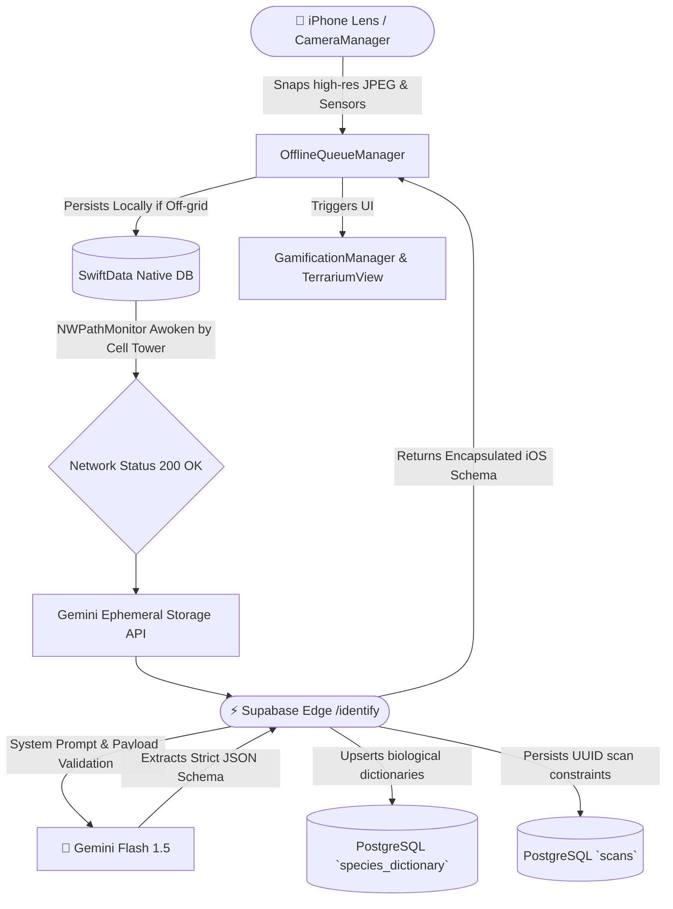

# Merian System Architecture

Merian is a powerful biological classification and gamification platform engineered natively for iOS and watchOS. The architecture relies on robust decoupled physical modules connecting the onboard Apple hardware completely to a Supabase PostgreSQL backend bridging heavy LLM inferences safely via Cloudflare R2 bounds and Gemini models.

## Architectural Data Flow (Overview)

## Core Architectural Pillars

### 1. Hardened Hardware Interfacing (`HardwareOrchestrator`, `CameraManager`)

- Direct bindings into `AVCaptureSession`, dynamically negotiating `isHighResolutionPhotoEnabled` buffers using native ISP (Image Signal Processor) and Deep Fusion.
- Active Thermal monitoring manipulating OS frames (`targetFPS`), dynamically rendering the Glassmorphism `.ultraThinMaterial` on-the-fly to prevent critical heat loads in extreme outdoor wilderness environments.

### 2. Ephemeral Offline-First Sync (`OfflineQueueManager`, `SwiftData`)

- Employs a zero-data loss queue structure tracking users globally without cellular data using `SwiftData` logic natively inside `MerianApp`.
- Intelligent `NWPathMonitor` monitors 3G/Off-grid edge boundaries, immediately debouncing signals when the hiker steps into cell-service, gracefully firing a `UIBackgroundTaskIdentifier` to complete the payload syncing completely inside the user's pocket passively.

### 3. Serverless Edge Verification (`Supabase Edge Functions`, `Gemini Flash 1.5`)

- A strict Cloud-native workflow entirely decoupling Apple users from raw API logic.
- The `identify` Deno Edge node securely accepts pre-signed iOS uploads natively, validates the taxonomy heavily relying explicitly on context variables directly mapped from native Apple `CLLocation` bounding boxes and pushes taxonomies physically straight back into the database synchronously via secure server-side execution.

### 4. Continuous Gamification Ecosystem (`GamificationManager`, `RiveRuntime`)

- Tracks device-native state (`UserDefaults`) tying species identifications instantly into `.riv` visual triggers cleanly inside interactive glassmorphic view modifiers (`TerrariumView`).
- Binds global haptics seamlessly mapping success triggers and interactions synchronously.

### 5. Private Analytics (`AppTelemetry`, `PostHog`)

- Heavily abstracted, completely PII-free tracking mapping OS limits passively via `TelemetryClient`.
- Identifies anonymous Day-7 usage funnels globally across UI interactions with `PostHog` dynamically mapping the UUID without any stringing risk natively.
