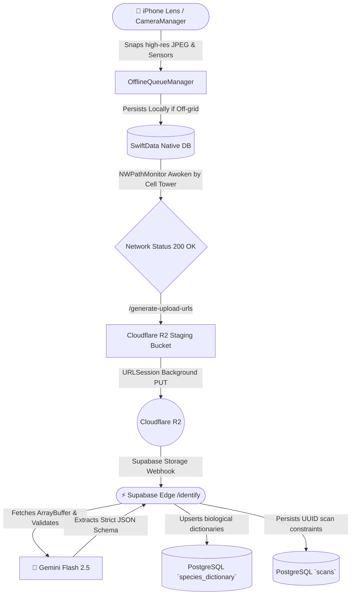

# Merian System Architecture

Merian is a powerful biological classification and gamification platform engineered natively for iOS and watchOS. The architecture relies on robust decoupled physical modules connecting the onboard Apple hardware completely to a Supabase PostgreSQL backend bridging heavy LLM inferences safely via Cloudflare R2 bounds and Gemini models.

## Architectural Data Flow (Overview)

```mermaid
flowchart TD
    A([📱 iPhone Lens / CameraManager]) -->|Snaps high-res JPEG & Sensors| B[OfflineQueueManager]
    B -->|Persists Locally if Off-grid| C[(SwiftData Native DB)]
    C -->|NWPathMonitor Awoken by Cell Tower| D{Network Status 200 OK}

    D -->|/generate-upload-urls| E[Cloudflare R2 Staging Bucket]
    E -->|URLSession Background PUT| F((Cloudflare R2))
    F -->|Supabase Storage Webhook| G([⚡️ Supabase Edge /identify])

    G -->|Fetches ArrayBuffer & Validates| H[🤖 Gemini Flash 2.5]
    H -->|Extracts Strict JSON Schema| G

    G -->|Upserts biological dictionaries| I[(PostgreSQL `species_dictionary`)]
    G -->|Persists UUID scan constraints| J[(PostgreSQL `scans`)]
```

## Core Architectural Pillars

### 1. Dependency Injection (`AppDIContainer`)

- To prevent Massive Environment Object pollution and ensure strict separation of concerns, Merian employs a centralized `AppDIContainer`. This singleton physically holds and exposes all core orchestration services natively to view modifiers (like `CameraManager`, `InferenceEngine`, `EnvironmentContextManager`) avoiding scattered initializations across the app. In `MerianApp.swift`, it is mapped securely as an immutable `let diContainer = AppDIContainer.shared` property to resolve dynamic boot-loop frame evaluation constraints natively.

### 2. Hardened Hardware Interfacing (`HardwareOrchestrator`, `CameraManager`, `EnvironmentContextManager`)

- Direct bindings into `AVCaptureSession`, dynamically negotiating `isHighResolutionPhotoEnabled` buffers using native ISP (Image Signal Processor) and Deep Fusion. The `DiscoverySession` strictly prioritizes extracting the native `.builtInLiDARDepthCamera` locking down the optical hardware mapping completely to guarantee accurate physical telemetry. All zoom functionalities are strictly barred.
- Active Thermal monitoring manipulating OS frames (`targetFPS`), dynamically rendering the Glassmorphism `.ultraThinMaterial` on-the-fly to prevent critical heat loads in extreme outdoor wilderness environments.
- **Native Camera Roll Integration (`PhotoLibraryManager`):** Safely persists unmodified `12MP` high-quality output bounds securely into the user's local iOS `PHPhotoLibrary` instantaneously avoiding iCloud sync delays entirely natively on capture.
- **Pre-warmed Tactile Shutter (`HapticManager`):** The app explicitly unifies and `.prepare()`s Taptic bounds (e.g. `UIImpactFeedbackGenerator(style: .medium)`) upon app boot inside a global `HapticManager`. Centralizing haptics entirely removes the rogue ~20ms instantiation frame drop (shutter lag) associated with firing "cold" core haptics on physical button triggers dynamically.
- **Deferred Context Fetch (`EnvironmentContextManager`):** Efficiently manages `CoreLocation` and `WeatherKit` by fetching exact coordinates, altitude (`gpsElevation`), and live condition/temperature (`weatherTemperatureF`) exclusively locked at the exact millisecond of the shutter press, preventing continuous battery drain while providing rich pipeline context. It implements a native 2.0-second background timeout race during `requestLocation()` to completely prevent the "Acquiring coordinates..." UI from locking infinitely on dead hardware satellites deep in the forest.

### 2. Ephemeral Offline-First Sync (`OfflineQueueManager`, `SwiftData`)

- Employs a zero-data loss queue structure tracking users globally without cellular data using `SwiftData` logic natively inside `MerianApp`. It actively intercepts `URLError` network timeouts generated by the live `InferenceEngine` securely saving images to the documents directory instantaneously.
- Intelligent `NWPathMonitor` monitors 3G/Off-grid edge boundaries, immediately debouncing signals for 1.0 second when the hiker steps into cell-service, gracefully wrapping a `UIBackgroundTaskIdentifier` as a strict 30-second timeout handler before handing payloads safely to an iOS `.background` `URLSession` daemon. Intercepts `AppDelegate` hook completions natively satisfying iOS background watchdog limits safely.

### 3. Serverless Edge Verification (`Supabase Edge Functions`, `Gemini Flash 2.5`)

- A strict Cloud-native workflow entirely decoupling Apple users from raw API logic.
- The `identify` Deno Edge node securely accepts pre-signed iOS uploads natively, validates the taxonomy heavily relying explicitly on context variables directly mapped from native Apple `CLLocation` bounding boxes and pushes taxonomies physically straight back into the database synchronously via secure server-side execution.
- Extensively optimized cellular payload architectures physically inject strict `Task.checkCancellation()` boundaries internally inside the `InferenceEngine` explicitly before transferring `URLSession` data payloads to Cloudflare R2 bounds dynamically. If the iOS Watchdog or the user explicitly cancels a processing scan, it instantaneously aborts execution to prevent cellular bandwidth leakage.

### 4. Continuous Gamification Ecosystem (`GamificationManager`, `RiveRuntime`)

- Tracks device-native state (`UserDefaults`) tying species identifications instantly into `.riv` visual triggers cleanly inside interactive glassmorphic view modifiers (`TerrariumView`).
- Binds global haptics seamlessly mapping success triggers and interactions synchronously.

### 5. Private Analytics (`AppTelemetry`, `PostHog`)

- Heavily abstracted, completely PII-free tracking mapping OS limits passively via `TelemetryClient`.
- Identifies anonymous Day-7 usage funnels globally across UI interactions with `PostHog` dynamically mapping the UUID without any stringing risk natively.

### 6. UI Initialization & Memory Operations

- **Instant Cold Boot:** SDK injections (`AppTelemetry`, `PostHog`) and heavy `CameraManager` hardware initializations (`AVCaptureSession.beginConfiguration`) are rigidly deferred onto a `Task.detached(priority: .background)` executor cleanly preventing the Main Actor from locking, ensuring a strict sub-1-second boot for the Camera pipeline.
- **RAM Image Cache (`ImageCache`):** A strictly typed `@unchecked Sendable` thread-safe `NSCache` bounds downsampled Life List thumbnails in RAM instantly avoiding massive disk I/O thrashing during 120Hz `LazyVGrid` and `TabView` scrolling. This prevents OOM (Out-of-Memory) crashes and micro-stutters by limiting to ~100 thumbnail chunks natively controlled by iOS memory pressure limits.
- **Asynchronous Grid Downsampling:** Displays mapping heavy physical Local File caches (`LifeListSearchView`, `InsightSheetView`, and `InsightCarouselView`) offload physical image decoding strictly onto a CPU pool prioritizing `ImageIO`'s `CGImageSourceCreateThumbnailAtIndex` logic dynamically bounds-checking 12-Megapixel file memory dynamically. Streaming explicit byte headers recursively without allocating generic structural `.Data()` blocks strictly locks iOS OOM (Out-of-Memory) bounds dynamically ensuring scrolling remains seamlessly locked to 60fps on edge devices.
