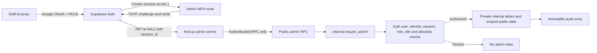

# Naturebook Internal Admin

This document is the architecture and product contract for the private
operations application in `apps/admin`. Day-two setup, deployment, recovery,
and incident procedures live in
[`11-internal-admin-operations.md`](./11-internal-admin-operations.md).

The application is served from `admin.naturebook.earth` as a separate Next.js
+ Mantine deployment. It is not a route in `apps/web`, is not a public support
tool, and must never share the public site's deployment credentials or analytics
configuration.

## Security invariants

The following rules are release blockers:

- The admin deployment receives only `NEXT_PUBLIC_SUPABASE_URL`,
  `NEXT_PUBLIC_SUPABASE_ANON_KEY`, and `NEXT_PUBLIC_ADMIN_ORIGIN`. It must not
  contain a Supabase service-role/secret key.
- Google OAuth establishes a cookie-based Supabase SSR session. Admin data is
  unavailable until a verified TOTP factor upgrades that session to `aal2`.
- Every database call independently verifies the immutable Auth UUID, active
  membership, Google identity, non-anonymous account, `aal2`, JWT
  `session_id`, matching `auth.sessions` row, internal session age, and role.
- The browser has no direct grants on private admin tables or the AI ledger.
  The only browser-facing database surface is the explicitly granted RPC list.
- `internal` is not an exposed Data API schema. `PUBLIC`, `anon`, and
  `authenticated` have no schema, table, sequence, or internal-function access.
- Every privileged RPC is `SECURITY DEFINER`, uses `SET search_path = ''`,
  schema-qualifies all objects, is revoked from `PUBLIC` and `anon`, and is
  granted only to the minimum required runtime role.
- Raw queues and details are uncached. Aggregate results are cached in the
  private database schema for at most five minutes and only after authorization.
- Searches, sensitive reads, session/access changes, review transitions,
  feedback transitions, notes, and hide/restore actions are audited.
- Email, report text, prompts, responses, private coordinates, and chat content
  must not appear in application logs, URL parameters, analytics, or error
  telemetry.
- Production syntax may read only the three documented public environment
  variables. Computed or whole-object `process.env` access and executable
  service-role/secret-key references are release blockers.
- The committed dependency graph pins the reviewed Next.js/PostCSS releases and
  overrides Next.js's Sharp dependency to a patched release. Frozen install,
  blocking high-severity audit, unit tests, type-check, and production build
  must pass as one ordered gate.
- GitHub must require `Naturebook Admin Quality / test`, and Vercel must add the
  same Action as a required Deployment Check before production domain
  promotion. Force Promote is emergency authority, not a normal bypass.

Supabase's SSR package stores the Auth session in cookies and uses the PKCE
callback flow. Supabase currently labels `@supabase/ssr` as beta, so dependency
upgrades require an auth smoke test. See the official
[SSR session guide](https://supabase.com/docs/guides/auth/server-side) and
[TOTP/AAL guide](https://supabase.com/docs/guides/auth/auth-mfa/totp).

## Request and authorization flow

The application flow is:

1. `/login` starts Google OAuth with `openid email profile` and an exact
   same-origin callback.
2. `/auth/callback` exchanges the PKCE code for a cookie-backed session and
   accepts only a local path beginning with a single `/` as `next`.
3. `/mfa` checks the authenticator assurance level. A verified factor is
   challenged; otherwise a factor named `Naturebook Admin` is enrolled and its
   QR code/secret is shown once.
4. The server routing helper first calls Supabase Auth `getUser()`. If no valid
   cookie-backed user exists, it returns an unauthenticated routing state without
   invoking a restricted RPC. For an authenticated user,
   `admin_get_access_state` may run before AAL2 so routing can distinguish an
   inactive/nonmember account from a member that still needs MFA. It returns no
   raw product data; this preflight is not an authorization substitute.
5. At AAL2, `admin_begin_session` creates or refreshes the internal session
   keyed by the JWT's Supabase `session_id` and writes an audit event.
6. Every later RPC calls `internal.require_admin`. Successful calls advance
   `last_seen_at`; failed calls never return partial data.

An internal session expires after 30 minutes without a successful authorized
RPC or eight hours from its creation, whichever comes first. An expired,
revoked, or disabled session cannot be revived with the same Supabase session;
the user must start a new Google session. Owner revocation also deletes the
matching `auth.sessions` row.

## Roles and capabilities

Roles are stored only in `internal.admin_memberships`; user-editable metadata is
never used for authorization.

| Capability | Analyst | Moderator | Owner |
|---|---:|---:|---:|
| Overview aggregates and date ranges | Yes | Yes | Yes |
| AI usage aggregates and filters | Yes | Yes | Yes |
| Raw review queue and case details | No | Yes | Yes |
| Exact coordinates for identification review | No | Yes, audited | Yes, audited |
| Raw feedback and linked context | No | Yes | Yes |
| User search and account details | No | Yes | Yes |
| Assign cases, set priority/status, append notes | No | Yes | Yes |
| Hide/restore posts and comments | No | Yes | Yes |
| Membership and role management | No | No | Yes |
| Active-session listing/revocation | No | No | Yes |
| Audit-history search | No | No | Yes |

Owners add or update only an existing, email-confirmed, non-anonymous Google
user by exact email. Disabling a member revokes their internal admin sessions.
Database locking and validation prevent demoting or disabling the final active
owner.

## Database boundary

Migration `20260719161112_add_internal_admin_foundation.sql` is the source of
truth. Private tables are deliberately separated from intake and durable usage
tables that existing service-role Edge Functions must write.

### Private `internal` tables

| Table | Purpose | Mutation model |
|---|---|---|
| `admin_memberships` | Auth UUID to owner/moderator/analyst role | Owner RPC only after bootstrap |
| `admin_sessions` | Idle/absolute session window and revocation | Auth/session RPCs and owner revocation |
| `admin_audit_log` | Actor, action, target, request ID, before/after state, reason | Insert-only; update/delete trigger rejects changes |
| `review_cases` | One current case per subject | Moderator transition RPC and intake grouping triggers |
| `review_case_sources` | Immutable links to intake rows/reporters | Intake grouping triggers |
| `feedback_state` | Status, assignment, and tags over original feedback | Moderator RPC |
| `admin_notes` | Internal notes for reviews and feedback | Append-only; update/delete trigger rejects changes |
| `ai_model_pricing` | Effective-dated model/modality pricing | Migration/controlled SQL only |
| `admin_aggregate_cache` | Authorized overview/AI cache payloads | Aggregate RPCs; five-minute validity |

All internal tables have RLS enabled as defense in depth even though runtime
roles have no direct schema/table grants.

### Public service-owned state

- `user_reports` stores one row per reporter/target pair. Browser roles have no
  table grants; `/report-user` writes with the service role after authentication
  and visibility validation.
- `ai_usage_events` is the append-only usage ledger. Browser roles have no table
  grants. `record_ai_usage_event` is executable only by `service_role`.
- `explore_posts.moderated_at` and `moderated_by_user_id` provide reversible
  post moderation. Existing comment moderation columns are reused.
- `scans.llm_usage_metadata` and
  `insight_chat_messages.llm_usage_metadata` retain the normalized Gemini
  usage payload used by transactional ledger triggers.

Supabase changed new projects so public tables are not necessarily exposed to
the Data API automatically. This feature does not depend on automatic exposure:
all required table and function grants are explicit, and direct client access
to `user_reports`, `ai_usage_events`, and `internal` remains denied.

## RPC surface

| RPC | Minimum role | Cache | Purpose |
|---|---|---|---|
| `admin_get_access_state` | Authenticated routing check | None | Membership, role, AAL, and internal-session state |
| `admin_begin_session` | Active member at AAL2 | None | Start/refresh the eight-hour internal session |
| `admin_get_overview` | Analyst | Five minutes | Account, plan, scan, review, feedback, token, and estimated-cost aggregates |
| `admin_complimentary_entitlement_summary` | Analyst | None | Derived balances, hold age, settlement, Flash fallback, exhaustion, and conversion aggregates |
| `admin_list_review_cases` | Moderator | None | Filtered cursor-paginated review queue |
| `admin_get_review_case` | Moderator | None | Reports, subject, notes, and scoped identification context |
| `admin_update_review_case` | Moderator | None | Status, priority, assignment, resolution code, and optional note |
| `admin_set_content_visibility` | Moderator | None | Reversible post/comment hide or restore with reason |
| `admin_list_feedback` | Moderator | None | Unified cursor-paginated feedback queue |
| `admin_update_feedback` | Moderator | None | Workflow state, assignee, tags, and optional note |
| `admin_list_users` | Moderator | None | Email/UUID/handle search with cursor pagination |
| `admin_get_user_detail` | Moderator | None | Auth, plan, activity, reports, abuse, and feedback context |
| `admin_ai_usage_summary` | Analyst | Five minutes | Token, cache, modality, percentile, and estimated-cost aggregates |
| `admin_list_members` | Owner | None | Membership inventory |
| `admin_upsert_member` | Owner | None | Exact-email membership/role/state update |
| `admin_list_sessions` | Owner | None | Supabase and internal admin session inventory |
| `admin_revoke_session` | Owner | None | Immediate internal and Auth session revocation |
| `admin_list_audit` | Owner | None | Cursor-paginated immutable audit history |

List RPCs clamp page size to 1–100 and use stable tuple cursors. Clients must
pass back the entire returned cursor and must not invent an offset. Queue and
detail calls are live on every request; the review page additionally refreshes
every 30 seconds.

## Metrics definitions

Overview defaults to a rolling 30-day range and supports 7, 30, 90, custom
rolling-day, and all-time options. The browser's IANA timezone is used for daily
overview buckets; AI Usage currently groups daily rows in database time.

- **Registered**: `auth.users.is_anonymous = false`.
- **Ghost**: `auth.users.is_anonymous = true`.
- **Pro paid**: user-aware effective plan `pro_paid`; stored Pro must have no
  expiry or a future expiry.
- **Pro complimentary**: user-aware effective plan `pro_complimentary`, derived
  from an available lifetime credit or active hold. It is functional, not paid.
- **Historical Pro trial**: retained only in historical AI usage filters and
  rows after cutover; current account projections must not synthesize it.
- **Free**: user-aware effective plan `free`.
- **Exhausted**: derived `scans_remaining = 0` regardless of current paid state.
- **Converted after exhaustion**: exhausted and `is_paid = true`; do not use
  functional Pro state for this paid conversion count.
- **Completed scans**: successful `scan_identification` ledger events linked to
  a scan, not every retained `scans` row.
- **Open reviews**: cases in `open` or `in_review`.
- **Unread feedback**: original feedback rows with no overlay or overlay state
  `new`.
- **Tokens per scan**: primary successful identification usage unless the AI
  page explicitly selects all scan-related events.
- **Estimated spend**: usage tokens multiplied by the price row effective at
  event time. It is an estimate, not an invoice.

For finite ranges, the overview RPC also returns previous-period scan, token,
and estimated-cost aggregates. All-time has no previous-period result.

### Complimentary scan operations view

`/complimentary-entitlements` calls the uncached, analyst-authorized
`admin_complimentary_entitlement_summary()` RPC. It returns aggregate account
count, active complimentary access, exhausted accounts, paid exhausted
accounts, in-flight holds, holds older than 15 minutes and one hour, oldest hold
time, ledger state totals, settlement-reason totals, available-balance
histogram, and Flash-fallback reservation count. The authorized read writes the
`complimentary_entitlement_summary_viewed` audit action.

The view is diagnostic only. It intentionally exposes no ledger row, account
identifier, scan UUID, prompt, response, or mutation control. An aged hold is a
recovery signal, not permission to issue a refund or edit a balance. The
normative state and incident rules are in
[`18-complimentary-pro-scans.md`](./18-complimentary-pro-scans.md).

## Review-case lifecycle

Case types are `identification`, `post`, `comment`, and `user`; statuses are
`open`, `in_review`, `resolved`, and `dismissed`; priorities are `low`,
`normal`, `high`, and `urgent`.

New intake rows are attached by trigger:

| Intake table | Source type | Case subject |
|---|---|---|
| `flagged_reviews` | `flagged_review` | Scan ID |
| `explore_post_reports` | `explore_post_report` | Post ID |
| `explore_comment_reports` | `explore_comment_report` | Comment ID |
| `user_reports` | `user_report` | Reported user ID |

Grouping uses a transaction advisory lock per case. The first report from an
independent reporter increments `report_count`; a new independent reporter
reopens a resolved/dismissed case and clears terminal resolution state. Another
source from a reporter already attached to that case updates the evidence
timeline without incrementing the independent-reporter count or reopening a
terminal case. Migrated identification rows are excluded from backfill.

Identification state is advisory only in V1: changing a case does not change
the identification. `scans.is_flagged` is recomputed from whether any matching
identification case remains `open` or `in_review`.

Hide/restore and case resolution are deliberately independent:

- Hiding sets the reversible moderation fields and removes the post/comment
  from its public surfaces.
- Restoring clears those fields.
- Neither action changes case status or resolution code.
- Every public Explore feed, map, profile, detail, community/notification
  helper, and public-web projection must apply the same hidden-post boundary.
- Exact scan coordinates are returned only for an identification case detail;
  opening that detail is audited.

## Feedback lifecycle

The unified feedback queue reads four immutable source families:

| Admin source | Original data |
|---|---|
| `community` | Community/general feedback |
| `survey` | Product survey responses |
| `chat_message` | Feedback on a Field assistant message |
| `chat_feature` | Feedback about the Field feature |

The original submission is never edited by admin workflow. The
`internal.feedback_state` overlay adds `new`, `reviewed`, `planned`, or `closed`
state, assignment, and tags. Notes are appended to `internal.admin_notes` and
cannot be edited or deleted. Although note storage supports 4,000 characters,
the current review/feedback mutation RPCs also copy the note into the bounded
audit reason and therefore accept at most 1,000 characters end to end.

## AI usage ledger

`public.ai_usage_events` contains no prompts or responses. Each row records:

- event time, operation, model, effective plan, input modality, and outcome;
- prompt, cached, candidate, thinking, tool, and total tokens;
- modality-level prompt/cache/candidate/tool details when Gemini supplies them;
- optional scan, conversation, message, and idempotent source linkage;
- backfill/coverage labels, effective-dated estimated cost, pricing version, and
  non-content metadata.

The normalized fields follow Gemini `usageMetadata`, including
`promptTokenCount`, `cachedContentTokenCount`, `candidatesTokenCount`,
`thoughtsTokenCount`, `toolUsePromptTokenCount`, total tokens, and modality
details. See Google's
[GenerateContent usage metadata](https://ai.google.dev/api/generate-content).

Writer classes are:

- Scan and assistant-message database triggers for durable rows, keeping the
  application insert and primary ledger event in one database transaction.
- Bounded best-effort service-role writes for overview/lookalike/group-tag
  enrichment, Field prompt suggestions/summaries, and Explore audio moderation.
  Failures log only structured operation/error metadata and never user content.
- Idempotent historical backfill from durable scan and assistant-message token
  columns. Historical enrichment/moderation coverage is labeled `partial` or
  `primary_only` because those calls were not previously stored.

The uniqueness key `(source_type, source_id, operation)` prevents duplicate
backfill or retry events. The append-only trigger rejects updates/deletes except
the tightly scoped account-anonymization update performed by the deletion
trigger. Deleting an account clears user, scan, conversation, message, source,
and identifying metadata linkage while retaining anonymous cost and usage
aggregates.

Pricing rows are effective-dated by exact model and modality. The initial
Gemini 2.5 Flash/Pro values mirror Google's Standard paid-tier table as checked
on 2026-07-19. Estimates charge non-cached input at prompt price, cached input at
cache price, and candidate/thinking/tool tokens at output price. Long-context,
grounding, cache-storage, batch, flex, priority, taxes, credits, and negotiated
discounts are not modeled. Price maintenance is documented in the operations
runbook and must use the official
[Gemini pricing table](https://ai.google.dev/gemini-api/docs/pricing).

## Audit, privacy, and application hardening

`admin_audit_log` stores the immutable actor UUID/role, action, target type/ID,
request UUID, before/after JSON, reason, and timestamp. It is not an application
log substitute. The Next.js application must not log raw RPC payloads or
responses.

Every route receives:

- a per-request nonce CSP with `default-src 'self'`, no objects, no framing,
  same-origin forms, and Supabase-only connect/image allowances;
- `Cache-Control: private, no-store, max-age=0, must-revalidate`;
- `X-Robots-Tag: noindex, nofollow, noarchive, nosnippet`;
- `X-Frame-Options: DENY`, `Referrer-Policy: no-referrer`, MIME sniffing
  protection, and a restrictive Permissions Policy.

Server mutations require an `Origin` header whose host exactly matches the
effective request host. The app contains no third-party analytics or export
surface. Sensitive identifiers belong in POST bodies or opaque route segments,
not query strings; user search is a server action and therefore does not put
email in the URL.

The npm supply-chain boundary is the committed `package-lock.json`, installed
with `npm ci` following the
[Supabase npm security guidance](https://supabase.com/docs/guides/security/npm-security).
The current reviewed graph uses Next.js 16.2.12, PostCSS 8.5.18, and Sharp
0.35.3. `lib/dependency-security.test.ts` rejects resolved versions below the
reviewed floors and protects the CI command order;
`lib/admin-foundation.test.ts` parses the production TypeScript graph and
enumerates executable environment reads against the public allowlist. The live
registry audit remains mandatory because static floors cover known reviewed
packages, not every present or future advisory.

The quality workflow reports on every pull request so its required status is
always available. On affected `main` pushes it revalidates the exact production
candidate. Vercel may build that candidate concurrently, but its required
Deployment Check must prevent assignment to `admin.naturebook.earth` until the
matching GitHub check passes.

## V1 exclusions

V1 does not provide CSV/bulk export, bulk moderation, permanent bans, account
deletion, subscription editing, alert integration, or automated case
resolution. Account deletion remains in the existing user-owned deletion
pipeline, and subscription state remains owned by RevenueCat/backend billing
flows.

The private `internal.revenuecat_webhook_events`,
`internal.revenuecat_webhook_event_subjects`, and
`internal.revenuecat_customer_state` tables are not admin-application data
sources and receive no browser/admin RPC. Production investigation uses the
owner-only, read-only queries in the Supabase deployment runbook; operators must
preserve the ledger and must not repair access by editing `public.users`
directly.

## Implementation map

- Admin application: `apps/admin`
- Complimentary operations page:
  `apps/admin/app/(admin)/complimentary-entitlements/page.tsx`
- Auth/server boundary: `apps/admin/lib/admin.ts`,
  `apps/admin/lib/supabase-server.ts`, and `apps/admin/proxy.ts`
- Server mutations: `apps/admin/app/actions.ts`
- Database migration: `services/supabase/migrations/20260719161112_add_internal_admin_foundation.sql`
- Complimentary extension migration:
  `services/supabase/migrations/20260802235833_three_complimentary_pro_scans.sql`
- User-report endpoint: `services/supabase/functions/report-user`
- AI writer helper: `services/supabase/functions/_shared/aiUsage.ts`
- Database security tests: `services/supabase/tests/admin_foundation_security.sql`
- Review/AI behavior tests: `services/supabase/tests/admin_review_ai.sql`
- Static migration contract: `services/supabase/functions/_tests/adminFoundationMigration.test.ts`
- Admin application security tests: `apps/admin/lib/admin-foundation.test.ts`
  and `apps/admin/lib/dependency-security.test.ts`
- Admin production gate: `.github/workflows/admin-quality.yml`
