# Scan Ingestion Reliability and Recovery Contract

**Last reviewed:** 2026-08-09\
**Scope:** Capture, foreground analysis, offline queue replay, durable scan
persistence, Field Chat readiness, Explore publication, and owned-media repair\
**Repository status:** Core runtime remediation committed as
`a21155a3299598e81be0ec322ce339adbff62ff1`; the joined presentation-identity,
offline-handoff, response-validation, and bounded-backlog follow-up is committed
on `main` as `cc664a20d6212299966b4579f733e612ed836514`. The exact-identity
fixture and fail-closed result-gate follow-up is committed on `main` as
`21df28d6be1d20b27a1a31bd5812689b5a3c8fa5` without relaxing those runtime
fences. The exact Swift Testing display-name validator follow-up is committed on
`main` as `bdf84b52e146c3777240c83937025adf2aaf1150`. The joined runtime,
deterministic queued-audio UI gate, upload-claim durability, and Field Chat
row-binding remediation is committed through
`0aa170fa07a22c8f75afaf3a63080bc448cc96c9`. Hosted iOS Runs 97 and 153 exposed
one project-level type-inference error in that commit before tests or archive
validation could execute. The explicit `Set<String>` compiler repair, equivalent
offline task-snapshot typing, and remaining automatic-inference Low Data Mode
entry-race fix are committed and pushed on `main` as
`f292dc4849e29c54587b6ee77f27b74a3971e878`. The later microphone-permission
refactor and formatted evidence update are committed on `main` through
`631e123e8e7777a7cda914275eb0e123b80adfef`. The stale test-contract correction
is committed on `main` as `8642a8c6dabf7f61b17d4f0801a093ec6a62473d`. The
timer-free Debug fixture handshake is committed on `main` as
`399482b649363c820b59fee1967bf94e35a5c0e7`. Hosted Build/Test Run 101 passed the
complete 1,241-test unit target, every protected critical scan-flow case, and
the exact-SHA Release archive on that commit. Its queued-audio UI smoke proved
the queued presentation and decoded playback through the explicit badge tap,
then failed only because the late completed-record transaction used a different
`ModelContext` from the already-open sheet and depended on an asynchronous event
merge. The context-bound handoff is committed on `main` as
`838533e98589f4fca89643e966864a7d59adca05`. Hosted Build/Test Run 102 did not
execute the queued UI smoke because one independent Explore replay-cancellation
unit test failed before its mock transport observed a first request. The bounded
monotonic rendezvous replacement is committed on `main` as
`4f68e68913fca6276458cd093ad167c9bc7d5d9e`. Hosted Build/Test Run 103 on that
exact SHA passed all 1,241 unit tests, every critical scan-flow regression, and
the current-SHA Release archive, then reproduced the queued UI failure at
completed-record takeover. Local result-bundle diagnostics proved direct
promotion can complete the Northern Cardinal handoff while retaining decoded
audio, but exposed that same-ID task identity left Field Chat and Share hidden.
The child-before-parent promotion, persisted-completion precedence, monotonic
toolbar/Field Notes identity, and first badge-bounds correction are committed on
`main` as `2ca985f6079c41c45c6a6e78d382c8283eb0db3b`. Hosted Build/Test Run 104
compiled both test bundles, passed all 1,243 unit tests and all 73 protected
cases, and passed its exact-SHA Release archive, then proved visual clipping had
not constrained the badge's transformed accessibility geometry. The
geometry-free Canvas/opacity revision is committed on `main` as
`6ed0f557b3222890aca55e4c383b2c110ffc8269`. Hosted Build/Test Run 105 passed all
1,243 unit tests, every protected critical case, and its exact-SHA Release
archive, then proved that re-composing the native scanning control with
`.accessibilityElement(children: .ignore)` prevented the caller's identifier
from resolving through `app.buttons`. Commit
`c7eac9c8f3124437712ee72eeff49d09e6ea55b1` retains the geometry-free
implementation and explicit label but preserves the native Button accessibility
node. Production queue timing, retry fences, cancellation behavior, and Supabase
runtime behavior are unchanged\
**Production status:** Requires the ordered deployment and retained evidence in
the
[Supabase deployment runbook](./06-supabase-deployment-runbook.md#scan-owner-row-durability-and-recovery-rollout)

The iOS presentation-specific failure and closure evidence are retained in the
[queued Insight same-ID handoff incident](../incidents/2026-07-queued-insight-same-id-handoff-regression.md).

The later foreground-connectivity presentation addendum is open in source. Its
ownership race, inline transport retry, placeholder classification, and exact
closure gates are tracked separately in the
[live scan connectivity handoff incident](../incidents/2026-08-live-scan-connectivity-handoff-gap.md).

This is the normative joined contract for the app's most important user journey:

> A user submits one observation, receives one durable analysis for its stable
> scan UUID, can reopen that analysis, can use Field Chat, and can deliberately
> publish the same owned observation to Explore without losing local or cloud
> media during retries.

The detailed wire shapes remain in [API Contracts](./05-api-contracts.md), the
client scheduler remains in
[Offline Sync Pipeline](./01-offline-sync-pipeline.md), and the July 28 failure
analysis remains in the
[incident report](../incidents/2026-07-inline-scan-staging-manifest-regression.md).
This document binds those parts together and defines which outcomes callers may
treat as success.

## Non-Negotiable Success Boundary

Every producer HTTP `200` guarantees the shared boundary below:

1. The caller has a validated Supabase Auth user JWT. An anonymous sign-in is a
   real Auth user and therefore uses the `authenticated` database role; it is
   not the same thing as a request carrying only the public project key.
2. The exact Auth owner has a valid `public.users` profile. All four producers
   call service-only `ensure_scan_user_profile(owner_id)`, which derives every
   mandatory public-identity field and refuses retired, deleting, or
   cleanup-claimed identities.
3. Provider quota has been reserved under the stable scan UUID and selected
   operation. The route commits immediately before provider dispatch.
4. `scan_ingestion_jobs` and its sanitized `scan_ingestion_intents` row were
   established atomically before provider work.
5. Gemini returned a response that passes the executable provider schema, and
   the final server-enriched success envelope passes the executable Identify
   wire schema.
6. Moderation accepted the observation.
7. Every required staged image, standalone audio item, and playback video was
   promoted or explicitly disposed of under its exact owner-bound manifest.
8. The primary species state needed by the scan row was resolved.
9. The owned `public.scans` row was inserted idempotently and reread with both
   `scan_id` and authenticated `user_id`.
10. The returned envelope contains that same stable scan UUID.

A fresh, provider-owning `/identify-multimodal` invocation has the stricter
initial-delivery boundary:

11. Canonical `captured_media` and ready `scan_media_assets` rows prove every
    required promoted image, audio, and video representation.
12. `complete_scan_ingestion_finalization` wrote `media_finalization_complete`
    last under the database completion fence.
13. The validated success envelope was durably stored or reconstructed from the
    exact canonical owner row.

Compatibility producers (`identify`, `identify-describe`, and `audio-spec`)
invoke and await the same finalizer synchronously. When it succeeds, they reach
the same completed state. Their only narrower fallback is a finalizer or
bookkeeping failure after the exact owner scan row has already been inserted and
reread. In that post-insert case, a compatibility route may return the already
validated response because the owner row and compatibility media arrays are the
durable replay surface. The ledger remains `failed_retryable` for same-UUID
canonical reconciliation without another provider call.

A compatibility producer never returns `200` without the exact owner row, after
a required promotion failure, or from a background continuation. A fresh
multimodal invocation has no post-row HTTP-success fallback: finalization
failure returns retryable `503` to that invocation.

A later same-UUID marked idempotent replay is different. Once exact owner-row
evidence exists, `/identify-multimodal` may reconstruct the validated canonical
response while the ledger is still `processing`, `finalizing`, `retrying`, or
`failed_retryable`. It returns `X-Merian-Idempotent-Replay: reconstructed`,
performs no second provider call, and leaves canonical repair eligible to
complete through the same finalizer. This recovery surface does not weaken the
shared owner-row boundary; an unreadable or absent owner row cannot produce
replay success.

Analytics, group tags, candidate enrichment, field-trip awards, and client-side
celebration are not part of this boundary. They may run only after the owner
scan is durable.

No route may return a provider response as success while scan insertion or a
required finalization attempt continues in `EdgeRuntime.waitUntil`. A background
promise is bounded by the Edge isolate lifetime and is not durable storage.

## Joined Flow

```mermaid
flowchart LR
    A["Analyze tapped"] --> B["Durable local queue row"]
    B --> C{"Transport"}
    C -->|"Foreground inline"| D["Inline bytes; no staged source keys"]
    C -->|"Offline / large media"| E["Owner-authoritative signing"]
    E --> F["Exact-key background PUTs"]
    F --> G["Complete manifest durably staged"]
    D --> H["Atomic ingestion job + intent"]
    G --> H
    H --> I["Quota commit and one provider dispatch"]
    I --> J["Moderation and promotion"]
    J --> K["Exact owner scan insert + read-back"]
    K --> L["Synchronous canonical finalization attempt"]
    L -->|"Completed"| M["200; completed ledger and stored response"]
    L -->|"Compatibility-only post-row failure"| O["200 from durable owner row; ledger retryable"]
    L -->|"Fresh multimodal failure"| P["503 to original invocation"]
    P --> Q["Later marked reconstructed replay from exact owner row"]
    M --> N["Insight / Field Chat / Explore"]
    O --> N
    Q --> N
```



The local queue is created before optional WeatherKit, geocoding, Auth
hydration, or other enrichment. Those tasks receive a bounded grace period and
may patch the same owner row later; they cannot decide whether the capture
exists.

Background PUT completion is also not inference readiness by itself. The exact
duplicate-free all-member manifest must first be confirmed by set equality;
missing, extra, or duplicate expected members cannot advance. Sanitized
filename/object-key collisions are rejected locally before signing or upload.
Then `markScanAsStaged` must atomically save the keys, normally reset upload
retry accounting, and return `.staged`, or return `.alreadyAdvanced` for the
same durable staged manifest or an owner already in inference. An exact
scheduled server-failure retry instead preserves its reclaim marker/count
through that commit. A retryable fetch/state/manifest/save outcome returns
before inference dispatch; after the callback token is released, replay uses
only the authoritative durable row. Timestamp-fenced orphan reconciliation
resets a row that is still `.uploading` and restarts signing, while an
already-staged row replays its persisted keys. A missing, failed, or
external-import row is discarded without resurrection. Main-actor retry
persistence returns an attempt number only after its queue/job write commits;
save rollback is logged as persistence failure while a bounded process-local
wake remains available.

A background download's HTTP `200` is not itself a durable client success. iOS
first requires a nonempty body that decodes as the generated Identify envelope,
does not explicitly report failure, contains a bounded nonempty scan ID, and
contains a finite confidence score from zero through one. It then requires the
exact queue generation and echoed scan UUID, followed by committed local result
persistence and main-context queue deletion. An empty, truncated, malformed,
wrong-scan, or locally uncommitted response stays recoverable under the same
UUID and enters status reconciliation before any fenced retry. Only after both
local commits succeed may the offline job become complete. A schema-valid
confidence-zero response for the exact UUID is the one intentional no-record
terminal outcome. Even then, the background actor does not delete source media
before main-context queue deletion commits; the committed queue-deletion path is
the sole local file-cleanup authority.

Inference-driven deletion does not first classify successful work as cancelled.
Under the same foreground/background generation guard, one main-context save
marks the job complete, clears transient job errors, inserts the completed
event, and deletes the queue row. Explicit deletion remains the only path that
records cancellation. Foreground success and background/server recovery
therefore have the same crash-consistent terminal job state. Replaying that
proven generation after the queue row is already absent treats a complete job as
idempotent success and does not append another completed event.

Pending cloud erasure uses the same positive-proof rule. The local
`PendingCloudDeletionTask` is removed only after `/delete-scan` returns a 2xx
body with explicit `success: true`; the server uses that envelope for both a
newly completed deletion and an already-absent idempotent replay.
`invalidResponse`, including auth/session ambiguity or a malformed 2xx body,
retains the task and its offline job for retry. No local error category is
treated as proof that owner data has been erased. Unlike ordinary queued work,
privacy erasure never exhausts an automatic retry budget: delay is bounded, not
completion attempts. A still-present task repairs legacy paused or contradictory
terminal job status on the next drain. A process-local single-flight latch
serializes competing foreground drains, while persisted `.running` work remains
runnable after termination.

For ordinary scan work, automatic exhaustion pauses rather than loops. An
explicit user retry resets the bounded automatic count under the same scan UUID
before the atomic claim path, including for description-only staged scans that
have no upload-success reset boundary. Known cloud-complete owner-result
recovery preserves its exact marker instead and cannot dispatch the provider.

## Foreground Connectivity Presentation Boundary

Durable acceptance precedes every foreground provider request, so loss of
connectivity does not turn a queue-backed observation into a terminal result.
The joined client contract is:

1. Recheck network eligibility after the bounded environment-context grace and
   before provider dispatch.
2. If the path is unavailable before dispatch, retire the unused foreground
   generation and present the existing durable row as queued.
3. If the first queue-backed transport attempt fails after dispatch, release
   the upload hold, retire provider ownership idempotently, and publish the
   exact queued presentation ID without waiting for a second inline transport
   attempt.
4. Bind only the queue row whose ID matches the still-current local
   presentation. Do not select another pending row or retain a SwiftData model
   across the sheet boundary.
5. Show **Queued for later** with saved/automatic-resume copy. Do not synthesize
   `SpeciesData`, fire an error haptic, or record a device-network circuit
   failure for the handoff.
6. Allow a same-ID background or status-recovered completion to replace queued
   content in place. A newer scan or completed presentation must fence every
   delayed failure callback.

Local presentation ownership and durable foreground ownership are deliberately
different. Path monitoring may retire the provider generation immediately so
the queue can resume, while the exact open sheet remains current long enough to
acknowledge queue takeover. Local authority never permits a retired task to
persist a provider result, delete the queue row, emit failure telemetry, or
overwrite another presentation.

Direct queue-less transport may still present **Network timeout / Please try
again**. Exhausted handler/provider failure for a saved scan uses **Analysis
delayed / Scan saved** and must be classified as an inference error placeholder,
not a non-biological observation. Exact policy/admission codes retain their own
documented states.

**Acceptance status:** the pre-dispatch recheck and exact-ID presentation
plumbing exist in the reviewed working tree, but the joined post-dispatch
contract is not accepted. The engine currently couples queued publication to a
durable generation that connectivity monitoring may already have retired, the
network client can replay transient transport once, and **Analysis delayed** is
missing from the placeholder whitelist. See the
[live scan connectivity handoff incident](../incidents/2026-08-live-scan-connectivity-handoff-gap.md)
before making any release claim.

## Stable Identity and Idempotency

The client generates one UUID and preserves it as all of the following:

- local queued scan ID;
- `client_scan_id`;
- request `Idempotency-Key` for analysis;
- durable server ingestion-generation key;
- final `public.scans.id`; and
- status/recovery lookup key.

A transport retry never creates a replacement UUID for the same user action. The
database scopes ingestion ownership by both UUID and Auth owner. A cross-owner
UUID collision is never treated as a duplicate success and is not revealed to
the caller.

When the same byte-equivalent request arrives after an ambiguous response, all
four producers first look for exact replay evidence: a stored completion or a
reconstructible exact owner row. They return the saved or reconstructed success
envelope with `X-Merian-Idempotent-Replay: stored|reconstructed` and do not
dispatch Gemini a second time. Concurrent requests may coalesce with the winning
generation only for the bounded interval documented in the runbook.

## Media Transport and Manifest Rules

### Foreground inline media

Inline image bytes are authoritative. A current foreground still sends
`imageBase64s` and `r2ObjectKeys: []`.

Older clients may send an inline image together with a synthetic destination
filename. The server validates that hint for traversal but excludes it from:

- staged ownership checks;
- public object naming;
- job and intent media manifests;
- upload-session lookup;
- capture-asset failure marking;
- promotion dispositions; and
- strict finalization.

There was no staging PUT for the hint, so treating it as a source creates an
impossible manifest. The same rule applies to legacy inline audio accompanied by
a destination hint: the bytes actually analyzed are retained, while the unused
hint is never fetched, ledgered, deleted, or finalized.

### Staged media

`generate-upload-urls` derives the object owner from the authenticated request,
not a body `user_id` and not the client's predicted device identity. Every
current background task persists the exact server-issued object key.

Before any PUT starts, iOS validates the complete signing response:

- one response for every requested file and no extras;
- safe HTTPS signed URLs;
- safe `staging/{authenticated-owner}/{flat-file}` object keys;
- one canonical owner across the response;
- exact media kind, role, content type, and byte-budget compatibility; and
- `mediaAssetId` / `mediaSessionId` for every structured scan file.

A malformed or partial signing response starts no upload. Legacy OS-owned tasks
recover the same key from the original signed URL path rather than rebuilding it
from whichever Auth identity is hydrated later.

### Signing registration

Registration is idempotent on authenticated owner, client scan UUID, and
deterministic object key:

- a lost signing response reuses the committed staged asset and upload session;
- a retryable failed asset may reactivate only for a compatible nonterminal
  generation, except for the exact completed-scan restore case below;
- promoted, deleted, failed-terminal, or media-incompatible state fails closed;
- completed ingestion fails closed unless every requested file declares
  `scan_share_restore`, has the deterministic scan/category filename and
  canonical role, and a fresh unrestricted database read either proves the live
  scan belongs to the authenticated owner or proves the row absent for guarded
  reconstruction; tombstoned or foreign rows fail closed;
- camelCase and snake_case compatibility aliases may coexist only when their
  values are identical; contradictory aliases fail before lifecycle
  registration;
- duplicate requested filenames are rejected before signing;
- requested subsets compose with unrequested rows for the same scan;
- new order indexes are assigned within each scan represented by a signing call,
  so unrelated scans in a mixed batch cannot perturb them; and
- the combined active staged/processing capture-key set cannot exceed six;
  promoted historical capture rows do not consume a later restore budget.

The partial unique index `idx_scan_media_assets_active_staging_key_unique`
serializes identical active keys. The `enforce_staged_scan_media_budget` trigger
additionally takes an owner-scoped transaction advisory lock and enforces the
six-row cap across concurrent disjoint-key requests. Historical duplicates
remain as failed `superseded_staging_registration` audit rows and are the only
extras the narrow historical finalization repair may ignore.

### Upload completion

Task disappearance from `URLSession.allTasks` is not success evidence. Callbacks
record each HTTP-successful canonical server key in a generation-scoped
accumulator before their first suspension. A scan advances to staged only when
the accumulator equals the duplicate-free exact complete expected key set.
Missing members wait for their callback or restart through orphan recovery;
extra or duplicate expected members fail closed. Local budget validation rejects
sanitized filename and object-key collisions before any signing request.

One failed required PUT fences the generation and cancels every sibling before a
sibling callback can advance an incomplete manifest. Process-relaunch callback
loss is recovered by resetting a proven upload orphan to pending and immediately
starting a fresh complete signing generation.

Durable upload retry accounting normally resets only in the same save that
promotes that exact complete manifest to staged. The exact
`server_retryable_failure` reclaim latch is the deliberate exception. Its code
and count are mirrored on the queued scan and durable job and persist through
required re-stage promotion until Identify is allowed to reclaim the server
attempt. Fresh reads consult both copies; serialized claim/retry/staging
transitions repair drift from either high-authority marker and the nonnegative
monotonic maximum before mutation. A completed-cloud-result marker has higher
authority than retry state in either copy. An individual HTTP-successful member
contributes evidence but cannot clear the scan generation’s attempt count or
prior error before every required sibling has also succeeded. An absent
queue/job read, mismatched already-staged manifest, or persistence failure
cannot advance the callback to inference. This prevents a stable partial-upload
failure or migrated scalar snapshot from looping forever as attempt one and
preserves the configured backoff and user-attention limit.

Replay/orphan reconciliation is process-local single-flight across Library,
scheduler, reconnect, and URLSession completion wakes. Concurrent wakes request
at most one trailing pass instead of starting overlapping queue enumerations,
status probes, or orphan transitions. The trailing pass prevents a durable state
change from being dropped; the single active driver prevents duplicate retry
accounting and log storms.

Likewise, server status `found` starts local result recovery but does not zero
the attempt count, backoff, or prior error first. If exact-owner hydration or
local promotion fails, the queue stays server-owned and `.inferencing`, retains
the latest server evidence, and advances a dedicated bounded local-recovery
retry. Every dispatch and orphan-reconciliation caller receives `waitForServer`,
so the row cannot retreat to `.staged` and issue a second provider request. The
owner-row observation is marked durably before hydration; the queue stores this
fence as `server_result_local_recovery_pending`. After relaunch, a failed,
unavailable, or temporarily inconsistent status probe therefore continues
completed-result recovery rather than erasing ownership evidence. Exhaustion
pauses for explicit user retry. That retry retains the same durable fence and
attempts only owner-result recovery; successful recovery deletes the queue row.

## Owner Profile Prerequisite

`public.users.public_author_name`, `public_identity_source`, and
`public_username` are mandatory. A partial users-table upsert is not valid
profile repair.

`ensure_scan_user_profile(uuid)`:

- is callable only by `service_role` and repeats
  `internal.require_service_role()` in its body;
- requires the exact backing `auth.users` row;
- locks the same identity boundary as ghost merge and cleanup;
- refuses active account deletion, a merged source identity, or a claimed
  cleanup;
- derives name, identity source, username, and avatar through canonical database
  helpers;
- preserves an existing profile without rewriting it; and
- retries only a proven public-username uniqueness race.

It does not trust `raw_user_meta_data` for authorization. Auth identity selects
the owner; metadata is used only to derive bounded public presentation fields.

The function is in the exposed `public` schema for PostgREST discovery, but that
does not make it public API. `PUBLIC`, `anon`, and `authenticated` execution is
revoked, `service_role` execution is explicit, and the exact signature is
registered in `internal.privileged_routine_grants`. RLS and SQL grants are
separate controls; no migration may rely on Supabase project-era automatic
exposure defaults.

## Persistence Outcome Classification

Remote database responses can be lost after a transaction commits. Cleanup is
therefore authorized by positive topology evidence, not by a thrown client
error.

| Write evidence      | Exact-owner reread                           | Resolution | Quota/media action                                                         |
| ------------------- | -------------------------------------------- | ---------- | -------------------------------------------------------------------------- |
| Returned success    | Expected owner row exists                    | Committed  | Keep quota and media                                                       |
| Lost/error response | Expected owner row exists                    | Committed  | Keep quota and media                                                       |
| Returned rejection  | Owner row is definitely absent               | Rejected   | Roll back only the proven pre-insert resources                             |
| Any response        | Owner read unavailable or contradictory      | Unknown    | Preserve quota, lifecycle rows, and promoted objects; return retryable 503 |
| Reported success    | Owner row remains absent after bounded polls | Unknown    | Preserve resources; do not convert the anomaly into deletion authority     |

`_shared/scanPersistence.ts` is the common scan-row settler. All four producers
use it. Explore restored-media updates and owned scan-image repair apply the
same rule to their own exact owner topology.

For a proven pre-insert retryable failure, the server marks the committed
provider reservation failed so the stable UUID can make one fenced metered
retry. Because promotion may have consumed staging objects, iOS clears old
staged keys, returns the durable row to pending, and uploads retained local
media again. Moderation rejection remains committed and terminal. Unknown or
post-insert outcomes preserve committed usage and recover from the same UUID.

## Complimentary Credit Settlement

Forward migration `20260802235833_three_complimentary_pro_scans.sql` adds a
user-facing credit lifecycle alongside this ingestion lifecycle. The original
`client_scan_id` is both the ingestion generation and the lifetime-ledger key;
retry, replay, enrichment, and provider subcalls do not create another credit.

Provider quota and complimentary credits are deliberately independent. An
attempted provider call retains its daily/rate/cost counters. Its held
complimentary credit remains held through retryable or ambiguous persistence
and media outcomes, is released only by a proven terminal outcome, and is
consumed only after this document's owner-scan and canonical required-media
success boundary is durable. A valid non-biological result consumes. A purchase
before final settlement releases the still-active hold, while prior consumption
is not refunded.

`complete_scan_ingestion_with_entitlement(...)` is the service-only completion
orchestrator. It locks `public.users` before the established advisory/job/scan
and media locks, enters a transaction-local completion fence, invokes the
canonical finalizer, settles the hold, derives a versioned entitlement snapshot,
and immutably enriches the stored response. `fail_scan_ingestion_terminal(...)`
provides the corresponding user-first terminal transition and hold release.
Trigger fences reject lower-level completion or terminal writes after cutover.
Settlement failures propagate; callers cannot swallow them and then bypass the
orchestrator.

An old hold is recovery evidence, not time-based refund authority. Replay
exhaustion, reconciliation abandonment, compatibility setup failure, and scan
deletion must prove and settle their exact generation through the terminal
orchestrator. The full balance, fallback, protocol, iOS, merge, and rollout
contract is
[`18-complimentary-pro-scans.md`](./18-complimentary-pro-scans.md).

## Ingestion and Queue States

The durable server ledger is authoritative after provider dispatch.

| Server state                                    | Client meaning                              | Automatic action                                            |
| ----------------------------------------------- | ------------------------------------------- | ----------------------------------------------------------- |
| `processing` / `finalizing`                     | Server still owns the generation            | Poll; do not resubmit                                       |
| `retrying` / `failed_retryable`                 | Retry is eligible under server timing       | Persist one retry latch; honor `retry_after`                |
| `complete`                                      | Owner scan and canonical media are durable  | Hydrate exact result and remove adopted queue media         |
| `failed_terminal` + policy reason               | Observation cannot become a scan            | Show terminal rejection; never recover                      |
| `failed_terminal` + `replay_exhausted`          | Automatic server replay ended               | Needs attention; bounded owner-row recovery may be eligible |
| `failed_terminal` + proven media abandonment    | Valid result outlived failed row/media work | Bounded owner-row/media restoration may be eligible         |
| `failed_terminal` + unproven media abandonment  | No durable post-result provenance           | Fail closed; never trust the terminal label alone           |
| `failed_retryable / identity_merge_interrupted` | Source identity retired during work         | Target-only recovery; source never retries                  |
| unreadable or contradictory state               | Commit status unknown                       | Preserve everything and retry status later                  |

The iOS status projection may expose terminal state as `job_status: "failed"`
for compatibility. It also accepts the legacy `failed_terminal` spelling.
Neither spelling authorizes a direct scan insert.

The first `failed_retryable` observation atomically increments durable retry
accounting and writes the exact `server_retryable_failure` marker to both the
queued scan and durable job. If media must be staged again, upload completion
preserves that marker and count. A transient signer or PUT failure during
re-stage also retains the machine marker, records its precise failure in the
append-only event stream, and increments from the maximum committed count rather
than a cached main-context value. Fresh reads consult both rows, and every
serialized claim/retry/staging mutation repairs a drifted mirror from the
surviving marker and monotonic maximum. Once the persisted delay has elapsed,
only that exact marker allows the next generation-fenced status preflight to
dispatch Identify. A cloud-complete marker supersedes retry state. Retry-budget
exhaustion cancels polling and retains needs-attention state. Expected duplicate
retreat callbacks already coalesced by another owner are silent. This prevents
build 1.0.2 (235)'s status/upload loop, including the migrated-store variant in
which the queue-row copy disappeared while the job-row copy survived.

## Recovery Order

Recovery must preserve richer work and deletion intent:

1. A scan-deletion tombstone wins permanently.
2. An existing exact owner scan wins.
3. Active leases and processing/finalizing/retrying/retryable ingestion win.
4. Known moderation, provider-safety, unproven media-abandonment, unknown, or
   arbitrary terminal reasons fail closed.
5. Exact completed-but-missing or structured `replay_exhausted` state may use
   bounded non-media owner recovery. Exact `media_reconciliation_abandoned`
   additionally requires composite service proof: the matching post-result dead
   letter no earlier than the latest charged normal/replay quota attempt, no
   exact reserved attempt or invalid timestamp lineage, and no
   moderation-rejected or moderation-pipeline-failed capture row. Modern proof
   binds exact quota identity plus validated provider and completed safety
   evidence. Legacy unstructured proof must belong to the immutable exact
   dead-letter-ID snapshot taken by the migration, predate the private rollout
   cutoff, match narrow historical quota lineage, and come from the audited
   multimodal post-safety error path rather than the pre-safety user
   prerequisite or moderation failure. Snapshot membership prevents a
   DDL-blocked insert from gaining legacy authority through an earlier
   transaction-start timestamp. Every exact failed/committed normal and replay
   reservation remains exempt from the ordinary 30-day quota prune as
   chronological authority while this terminal ledger is unresolved.
6. Historical post-insert inline-manifest failure may use the service-only
   finalization repair when every job, intent, redaction count, asset, canonical
   filename, upload session, and owner URL agrees.
7. Identity-merge interruption may recover only to the exact target proven by
   the completed handoff and matching endpoint/quota operation.

### Missing owner scan

A single `check-scan-status` request or `share-scan-to-explore` may include
`recovery_scan`. It contains bounded non-media state only. The server:

- derives owner from Auth;
- requires matching scan and owner UUIDs;
- resolves species identity server-side;
- validates ranges, enums, text, and geoprivacy;
- shares the ingestion generation lock;
- inserts only when absent; and
- writes the owner row plus completed recovery ledger atomically.

Bulk status never accepts `recovery_scan` and never inserts or updates
`public.scans`. For a missing scan, both single and bulk probes may still invoke
the narrow service-only stranded-attempt reconciliation that adjusts only
already-existing job/quota/staging state. Direct media URLs are rejected.

Explore sharing and Ask the Community additionally build a read-only local
restore plan before submitting `recovery_scan`. Every surviving observation path
must exist and the complete mixed-media count and byte budget must pass. The
plan resolves and byte-validates surviving local observation media before
reconstructing the cloud row. If no eligible local media survives, iOS refuses
owner-row reconstruction. This prevents a damaged beta record with both a 404
durable URL and a deleted local file from creating an empty
`client_recovery_complete` cloud scan before the client discovers that
publication is impossible. Share Edge independently requires at least one
validated restored staging key whenever its `recovery_scan` would reconstruct a
missing row and returns `409 scan_restore_media_required` before invoking owner
recovery otherwise. For a nonempty repair, Share Edge proves every current key's
exact scan/kind/role upload-ledger binding before invoking owner recovery; a
merely nonempty but unrelated staging key cannot create relational state. This
protects older clients and malformed direct requests. Field Chat intentionally
retains metadata-only recovery because it publishes no media.

### Historical inline finalization

`recover_inline_scan_ingestion_completion(scan_id, user_id)` is service-only and
applies only after the exact owner scan exists. It returns `completed`,
`already_complete`, `deleted`, `job_not_found`, or `not_applicable`. It never
dispatches a provider, changes committed quota, weakens finalization, or guesses
about real staged media.

The public wrapper retains the service-role assertion, owner and ledger row
locks, deletion fence, advisory transaction lock, ledger rewrite, and canonical
complete-last finalizer. Three bounded `internal` `SECURITY INVOKER` helpers
validate ledger shape, durable scan media, and staged assets. They have an empty
search path and no execution grant to `PUBLIC`, `anon`, `authenticated`, or
`service_role`; they are implementation details, not alternate recovery RPCs.
Expected media counts are computed before endpoint predicates rather than in a
single nested `CASE` expression.

### Identity merge interruption

Before generic anonymous-to-account ownership reparenting,
`prepare_scan_ingestions_for_identity_merge` fences unfinished source
generations, preserves committed provider usage, and retires ambiguous source
staging. `recover_stranded_scan_ingestion_attempt` is service-only and may
resolve exact target state as `scan_durable`, `media_restage_required`,
`quota_retry_ready`, `already_complete`, `deleted`, or `not_applicable`.

Do not manually reparent these rows, clear the handoff, reopen committed quota,
or accept old source-prefixed staging keys.

### Stranded provider attempt

The same service-only stranded-attempt routine also handles an ordinary scanless
provider attempt that was not interrupted by identity merge. It may move only
the exact owner generation to `quota_retry_ready` when endpoint, quota
operation, committed reservation, job, lease, tombstone, and media topology
prove that bounded retry is coherent. It never refunds dispatched usage, guesses
a scan row, or treats an unreadable topology as recovery authority.

## Field Chat Readiness

Private Insight Field Chat requires an owned completed biological scan row.
Before presenting `/insight-chat`, iOS calls
`ensureCloudScanAvailableForFieldChat`:

1. check exact owner status;
2. leave active/retryable ingestion authoritative;
3. submit bounded `recovery_scan` only for eligible historical drift; and
4. reload status before opening chat.

Field Chat does not publish or restore public media. Its server prompt uses
stored text context and never receives raw media bytes, object keys, cloud URLs,
or exact coordinates.

A transient missing/still-syncing response leaves the toolbar action available
for retry and shows:

`This observation is still syncing. Please try Field chat again in a moment.`

It must not cache the scan as permanently unavailable. A current Identify `200`
followed by `scan_not_ready` is a severity incident, not expected steady state.
The client therefore sets `unavailableScanId` only for terminal ownership
failure (`403`), `unsupported_scan`, or an unavailable Explore-post source. An
Explore source is unavailable only on the handler code `post_not_available`, not
every HTTP 404. An owned-scan `scan_not_ready`, action-level
`message_not_found`, `conversation_not_found`, or plain status `not_found`
updates the retryable error message without hiding the toolbar action. The
former blanket HTTP-404 classification violated this contract and could make
Field Chat disappear after one transient readiness race.

The completed engine scan ID is also the client presentation authority. Cached
local-record and toolbar-snapshot IDs must match it before Field Chat or Explore
can combine their data. A lookup miss for a different newly presented scan
invalidates stale scan-bound actions and display state; a transient same-scan
miss preserves the existing immutable snapshot. Field Chat passes the captured
scan ID into its owner preflight, revalidates that ID around every asynchronous
step, and presents the sheet using the captured ID. An engine scan change
dismisses the sheet. Explore recovery activation prefers stable handler
`code: "not_found"` and uses message text only when an older response has no
stable code.

The chat view model then binds its private state to a second subject generation.
Opening another scan/post invalidates the prior load and prompt tokens and
clears transcript, pending-message, draft, feedback, and summary state before
loading. Load, send, delete, feedback, summary, and prompt completions recheck
the exact subject generation after every await. A different-subject preflight
replaces the obsolete preparation task, while duplicate preparation for the same
subject remains single-flight. The already strict `subject_id` network
validation is repeated at application time, so a late scan-A completion cannot
replace scan B's thread or private draft.

Explore-post Field Chat is a separate private per-viewer contract. It uses only
the privacy-filtered public post and Species Dictionary projection and does not
require ownership of the backing scan.

Every successful Insight or Explore thread/action response echoes the exact
requested scan or post as `subject_id`. iOS requires that echo before applying
even an empty thread, feedback, a note summary, or generated prompts; populated
threads must additionally bind every message to the same subject and one
conversation. A send UUID is required and becomes the durable request identity
for both its user and assistant messages. The backend canonicalizes UUID case,
rejects reuse with different normalized text, reserves both rows under the
30-row cap, and gives every assistant a deterministic UUIDv8 row identity. The
service-only `reserve_field_chat_send(...)` routine performs subject validation,
cross-table daily accounting, capacity admission, and the user-row insert in one
short transaction. It always takes the per-user advisory lock before the
per-conversation lock. This serializes simultaneous Insight and Explore sends
from different devices, closes the count-then-insert race at 19 daily sends or
28 conversation rows, and permits only one unanswered request within that
conversation at a time. Exact same-key/text replay returns the original row
without consuming either cap; a different unanswered UUID returns retryable
`field_chat_send_in_progress`.

After atomic admission, the backend coalesces duplicate and quota-layer retries
into that exact pair, reconciles an ambiguous insert by reading the pair back,
waits boundedly when the original is still in flight, and lets a failed provider
or persistence attempt resume without inserting a second question.
Duplicate-insert and waited-replay boundaries revalidate UUID/text binding,
closing the race where contradictory same-UUID requests arrive before either
initial read sees the saved row. iOS requires exactly that pair, the exact
acknowledged user text, bounded nonempty message text, and a body no larger than
1 MiB before clearing its pending send; automatic and manual retry preserve the
same UUID. Note-summary privacy scrubbing covers canonical UUIDv7 and older
UUIDs and returns a bounded non-sensitive fallback if scrubbing removes the
entire model draft. Prompt filtering targets unsafe user action intent rather
than isolated words at generation and send time, so direct harvesting/handling
requests remain blocked without rejecting or automatically refusing educational
questions about poison ivy, tea plants, animal foraging, or bee stings.

If a process/provider interruption leaves a UUID-bound user row without an
answer, the next iOS load does not present the latest unanswered row as
delivered, even if a filtered orphan assistant follows it. It restores that row
as the failed pending bubble under the same canonical UUID and retains Retry and
Edit recovery across relaunch. UUID-bound orphan or duplicate assistant rows are
hidden. Composer capacity uses the unfiltered persisted row count. A new send
requires two available slots locally and on the server; an incomplete retry
requires one remaining assistant slot.

A process termination after AI-quota commit but before assistant persistence
must not strand that UUID forever. During a ten-minute safety window, retries
remain in progress. Afterward, service-only
`recover_stale_field_chat_quota(...)` may fail only the exact committed
reservation after proving the subject-bound user row exists and its bound
assistant does not. The route re-reads the pair, then reserves a newly metered
provider retry. A live or completed pair cannot be reopened.

Migration `20260730180000_bind_field_chat_rows_to_subjects.sql` closes the
retained-data side of the same invariant. It deletes only impossible cross-owner
Insight conversations and cross-bound private message/rating rows, clears an
unprovable optional feature-feedback conversation reference, and then validates
a deferred composite foreign key binding every retained Insight conversation to
its exact scan owner plus exact conversation/scan-or-post/user and
copied-message identity for all children. Conversation-optional feature feedback
is independently bound to its exact scan owner. Deferred validation keeps the
anonymous-account merge atomic while preventing one malformed row from making
the strict client reject every future load. Direct browser-role feedback access
is revoked; exact RLS joins remain defense in depth.

This response-identity change is an expand-first rollout. Apply
`20260729163616_reserve_field_chat_sends_atomically.sql` before deploying
`insight-chat` and `explore-post-chat`, and include
`20260730180000_bind_field_chat_rows_to_subjects.sql` before release acceptance.
Smoke an empty thread and every supported action for the exact subject echo,
then force same-UUID ambiguous replay, different-key concurrency, both cap
boundaries, cross-bound-row rejection, feedback ACL denial, anonymous-account
merge, and stale-reservation recovery before releasing the hardened iOS client.
Older clients ignore the additive fields; the corrected client intentionally
rejects an older function response without its subject or current send-pair
proof.

## Explore Publication

Explore publication requires the exact owned scan and at least one eligible
public media snapshot. The Insight composer first attempts the ordinary
owner-scoped share. If an eligible older row is absent, it may combine:

- bounded non-media `recovery_scan`; and
- newly uploaded owner-staged image, playback-video, or standalone-audio keys.

Every restored key must be a flat traversal-safe key directly under
`staging/{authenticated-owner}/`. Image and audio accept their documented
bounded counts; video accepts one playback item. Before owner reconstruction or
promotion, every current key must match its capture-upload ledger row's exact
owner, client scan ID, kind, and canonical role. A conflicting row cannot fall
back to filename inference. Ledger-less compatibility is limited to the exact
deterministic scan/category key emitted by older released restore clients and
its legacy extension-derived kind. The server then promotes media, updates the
exact owner scan, refreshes canonical assets, reruns selection and moderation,
and only then writes the public `explore_post_media` snapshot.

Current repair signing sets the explicit `scan_share_restore` upload purpose.
The signer accepts it only for a canonical-role item whose deterministic
filename contains the exact client scan UUID and restore category. This purpose
resolves a regression introduced when upload-ledger registration began rejecting
all completed ingestion jobs: sharing recovery necessarily runs after analysis
has completed. The narrow exception requires a fresh active, non-tombstoned
JWT-owner scan read when the row exists. A genuinely absent row may only stage
for the subsequent guarded owner reconstruction; tombstoned and foreign rows
fail closed. A `failed_terminal` job is eligible only for exact
`replay_exhausted`, or exact `media_reconciliation_abandoned` plus its matching
composite dead-letter/quota/media-lifecycle proof. Pre-result/unproven
abandonment, later policy authority, ordinary post-completion uploads,
cross-scan filenames, and moderation-rejected/pipeline-failed rows remain
closed. The media reconciler never overwrites an already-terminal job, and its
database update independently excludes both `complete` and `failed_terminal`.
All exact failed/committed normal and replay quota reservations are retained as
chronological authority until recovery or explicit operator resolution changes
the terminal ledger; ordinary 30-day pruning then resumes. Only active
staged/processing rows consume the six-item repair budget; historical promoted
capture rows remain identity/audit evidence without blocking a later repair. A
lost signing response reuses the exact committed restore row and upload session.

The final relational publication is one
`publish_scan_to_explore_atomically(...)` transaction. Its service-role-only
invoker boundary locks and revalidates the exact owned biological scan, rejects
media URLs outside that scan and non-contiguous selection order, rechecks the
locked community request, and commits post metadata, the complete media
snapshot, hashtags, and resolved-community publication state together. An
omitted `location_sharing` value is resolved from the locked scan, not a stale
pre-transaction geoprivacy read. A transaction-time `needs_id` request fails
with conflict and leaves the prior publication unchanged. The community request
is locked before its scan, matching the community helper’s established order and
preventing a publication/consensus deadlock cycle. Any late insert, constraint,
or community failure restores the prior post metadata, timestamp, media, and
hashtags. Read-time feed filtering is defense in depth, not a substitute for
atomic publication.

Because both final publication RPCs retain `SECURITY INVOKER`, their exact
`EXECUTE` grants are necessary but not sufficient. Forward migration
`20260729044500_grant_atomic_explore_service_privileges.sql` supplies only the
table operation classes exercised by scan/request locks, snapshot replacement,
taxon validation, request creation, and withdrawn-request cleanup. It grants
only `service_role`; anon and authenticated receive no new writes, and the
routines are not converted to definer authority.

A restored-media update whose response is lost is reconciled against exact
durable owner URLs. Newly promoted objects are removed only after a returned
database rejection and a readable owner row prove the expected URLs absent.
Unknown state returns retryable `503 scan_media_restore_unavailable` and
preserves the objects. A retry recognizes already-durable filenames and never
consumes the staging source twice.

Ask the Community uses the same eligible canonical image, playback-video, and
standalone-audio projection. Its compatibility repair first recovers the owner
row through `/check-scan-status`, then stages every surviving eligible local
media kind and forwards the three separate restored-key arrays. It does not
require an image when the biological observation has only video or audio. All
keys pass the same flat traversal-safe authenticated-owner validator used by
explicit Explore publication. One shared parser applies the canonical maxima of
five images, one playback video, two standalone audio clips, and six aggregate
keys and rejects a key claimed under multiple media kinds before promotion,
moderation, and the atomic Community transaction. The iOS repair planner applies
the same complete-set limits before its first signing call, preventing an
over-budget legacy snapshot from staging only an initial subset. The common
fetch path additionally verifies each current key against its capture-upload
ledger row for the exact scan, kind, and role before any promotion, with only
the narrowly specified released-client filename compatibility path when no
ledger row exists.

The Community client treats HTTP `200` as candidate evidence only. Before
changing Community or Explore UI state it requires true success, the exact
requested scan UUID, valid request/post/requester/taxonomy UUIDs, a parseable
request timestamp, `needs_id`, and a nonnegative consensus count. A decodable
but unconfirmed response remains failure, so it cannot clear normal share state
or present “Asked community.” The Edge/database response identity check
canonicalizes UUID casing before exact comparison because PostgreSQL emits
lowercase text while Apple clients commonly submit uppercase UUID strings.

An Explore post is feed-visible only with saved eligible `explore_post_media`. A
partial or media-less publication row is not a successful share.

Publication completion is also the composer dismissal boundary. The client
requires a true success flag, the exact echoed scan ID, a valid post UUID, an
authoritative known location-sharing value that equals any explicitly requested
privacy mode, and a `published` publication status before accepting an
HTTP-successful response. Missing/unknown location, mismatched privacy, or
missing status is not rolling-compatibility success because the corrected
backend must be released before this client. The async create callback returns
`true` only after that validation and the returned post ID is cached. On
`false`, the composer remains mounted with the user’s notes, hashtags, location
choice, and ordered media selection intact and shows a retry alert. Merely
transitioning `isSharingToExplore` back to `false` is not publication evidence.

Authoritative share-state reconciliation is also identity-bound. iOS applies the
read response only when it echoes the exact open scan and has coherent
post/time, Community ID/status, known location, and explicit feed-visibility
topology. Visibility is not inferred when the server omits it. A stale,
cross-scan, malformed-ID, invalid-time, unknown-location, or
visible-without-post `200` preserves the local optimistic cache and cannot
create a phantom Explore or Community destination. The database share-state
routine now applies the same moderation, aggregate media-health, and
non-missing-item predicates as canonical public Explore projections. It
preserves owner-only publication identity while quarantine or moderation returns
explicit false visibility; iOS accepts that legitimate hidden-post topology
without caching it as an Explore destination. A degraded post becomes visible
again as soon as one eligible media item recovers. Forward migration
`20260729120000_align_explore_share_state_media_health.sql` closes the mismatch
without changing author publication intent. The invoker RPC is executable only
by `service_role` behind the JWT-authenticated Edge wrapper, so API roles cannot
substitute another `self_id`. Private location sharing hides location, not the
post. Same-scan post and Community writes also retain the exact post/request
UUID across their await; a response for a replaced publication cannot mutate
current state. The post-detail projection is advisory, so an unavailable detail
read preserves the last confirmed or optimistic Field Notes visibility rather
than treating transport failure as evidence that published notes became private.

## Owned Scan-Image Repair

`repair-scan-image` is a recovery endpoint, not a media replacement API. It:

1. authenticates a live user and derives owner from the JWT;
2. proves the exact active owned scan still references the source URL;
3. directly checks source and restored R2 objects;
4. promotes only a safe image under the owner's current free/Pro prefix; and
5. atomically replaces the exact URL across the owner scan, recursive captured
   media, normalized assets, and matching owner Explore snapshots.

If the metadata response is lost, source-absent plus replacement-present proves
commit. A promoted replacement is deleted only after a returned rejection plus
source-present/replacement-absent owner evidence. Every unreadable or ambiguous
topology preserves the object and returns retryable
`scan_image_repair_persistence_unknown`.

See the route-local
[`repair-scan-image` README](../../services/supabase/functions/repair-scan-image/README.md)
for exact request and response shapes.

## Error Semantics

| Status/code                                     | Meaning                                                                                                                                                            | Required client behavior                                                                  |
| ----------------------------------------------- | ------------------------------------------------------------------------------------------------------------------------------------------------------------------ | ----------------------------------------------------------------------------------------- |
| producer `200`                                  | Exact owned scan is durable; fresh unmarked multimodal delivery is also fully finalized, while a marked reconstructed replay may retain retryable canonical repair | Render and persist the exact result                                                       |
| `400 observation_rejected`                      | Terminal media/policy rejection                                                                                                                                    | Remove only the rejected queue generation under its exact fence                           |
| `401`                                           | User JWT missing, expired, or not yet recoverable                                                                                                                  | Refresh/restore Auth; retain local media                                                  |
| `403 ai_consent_required`                       | Active account lacks authoritative adult/Terms/Gemini-head proof; this occurs before entitlement/quota reservation                                               | Preserve row and media, stop automatic inference, durably route that account to Ready, and retry the same UUID only after fresh head-anchored evidence and cloud proof |
| `409 account_deletion_in_progress`              | Destructive lifecycle owns identity                                                                                                                                | Stop submission; do not recreate profile                                                  |
| `408/409/425/429` transient handler state       | Generation or capacity is temporarily unavailable                                                                                                                  | Retain and back off using bounded `Retry-After`                                           |
| `503 scan_persistence_failed`                   | Operational durability, strict finalization, or unknown-commit failure                                                                                             | Retain local row; poll same UUID; fresh-upload only when exact status says scanless retry |
| `503 scan_media_restore_unavailable`            | Explore restore may have committed                                                                                                                                 | Preserve local and promoted media; retry same owner scan                                  |
| `503 scan_image_repair_persistence_unknown`     | Image repair may have committed                                                                                                                                    | Preserve replacement and retry inspection                                                 |
| platform `404 NOT_FOUND` without handler marker | Edge route did not execute                                                                                                                                         | Retain state and use bounded route-propagation retry                                      |
| handler-owned `404 scan_not_ready`              | Exact owner scan is not currently usable                                                                                                                           | Run guarded status recovery or show still-syncing state                                   |

For a foreground handler-owned `401 auth_session_missing` or
`401 invalid_session_token`, iOS first refreshes the existing Supabase session
and retries once with rebuilt headers. It does not replace an anonymous account
before that refresh attempt, because the stable scan UUID, consent evidence,
funding reservation, and any existing server ownership all belong to that
account. Background `401` remains a durable retry with local media retained; a
later foreground or lifecycle pass performs the same Auth recovery before
dispatch.

### Foreground presentation error taxonomy

| Local condition | Required presentation | Durable behavior |
| --- | --- | --- |
| Queue-backed connectivity loss | **Queued for later** | Retain exact row; queue owns retry |
| Queue-less direct connectivity loss | **Network timeout / Please try again** | Caller owns retry |
| Queue-backed exhausted service failure | **Analysis delayed / Scan saved** placeholder | Retain exact row; queue owns retry |
| Recoverable exact-ID server conflict | **Restoring scan / Safely saved** placeholder | Poll/hydrate the same UUID |
| Consent, funding, quota, or policy decision | Stable decision-specific copy | Follow that decision's durable state machine |

No row in this table may be inferred only from generic localized error text.
Transport, handler code, durable queue ownership, and exact presentation
identity are separate inputs.

Malformed or structurally invalid provider JSON returns retryable HTTP `503`
from every scan producer. The server ledger records `failed_retryable` with a
bounded `retry_after`, retains the linked hold, and permits same-UUID recovery;
a `4xx` or terminal ledger would incorrectly strand the offline job. Gemini
`SAFETY` and `PROHIBITED_CONTENT` instead return the exact stable
`400 observation_rejected` envelope and a terminal policy ledger, so foreground
delivery presents recapture guidance without opening the network circuit and
background delivery removes only the rejected queue generation.

The consent row above is intentionally not grouped with transient `4xx` or
quota exhaustion. The `reserve_ai_quota` function name is an implementation
boundary, not a customer classification; this rejection creates no provider
reservation or scan-credit consumption. See the
[first-scan consent-policy incident](../incidents/2026-08-first-scan-consent-policy-retry-loop.md).

## Security Invariants

- Owner authority comes from a validated Auth JWT, never request `user_id`.
- No service-role or secret project key is shipped in iOS.
- Every scan, job, intent, media, and recovery lookup uses both owner and scan
  identity.
- Staging keys are traversal-safe, flat, owner-prefixed, count-bounded, and
  media-budget validated.
- Raw inline media is never copied into jobs, replay intents, logs, or retained
  diagnostics.
- Public profile metadata does not participate in authorization.
- Every public-schema privileged definer has an empty search path, internal
  caller check, explicit role grant, explicit revocations, and a matching
  `internal.privileged_routine_grants` entry.
- Exposed tables retain effective RLS and reviewed direct grants. RLS does not
  substitute for table privilege and table privilege does not substitute for
  owner policies.
- Deletion tombstones always win over replay and recovery.
- Committed provider usage is never refunded after dispatch.
- Destructive media cleanup requires positive exact-owner absence evidence.
- Field Chat receives text-only context; Explore receives only the explicitly
  selected and privacy-projected public snapshot.

## Deployment Unit

Do not selectively deploy this repair.

Apply the complete current migration set through the repository's normal
pipeline. If either media-abandonment migration is pending, first predeploy the
exact-SHA fail-closed `generate-upload-urls`, `check-scan-status`, and
`share-scan-to-explore` consumers. They consult the hardened proof RPC only for
legacy repair and return retryable `503` without signing, owner reconstruction,
or publication while that boundary is unavailable. Do not predeploy the
schema-dependent Identify producer. `request-community-identification` remains
in the final cumulative exact-SHA plan: its transitive Explore helper import
does not make it a recovery consumer because the route neither accepts
`recovery_scan` nor invokes owner-row recovery.

Before the incident subunit, confirm that privileged-key compatibility
migrations `20260727010340_fix_service_role_authorization_guard.sql` and
`20260727013416_future_proof_server_key_boundaries.sql`, scan finalization
migration `20260728035237_harden_dwca_downloads_and_scan_finalization.sql`, and
idempotent-response migration
`20260728220000_persist_idempotent_scan_responses.sql` are present.

Then confirm these seven incident migrations applied in order:

1. `20260728230000_recover_inline_scan_ingestion_completions.sql`
2. `20260728231000_make_staged_scan_media_registration_idempotent.sql`
3. `20260728232000_ensure_scan_user_profile.sql`
4. `20260728233000_recover_identity_merge_interrupted_scans.sql`
5. `20260729012153_fix_video_scan_canonical_finalization.sql`
6. `20260729024157_atomic_explore_scan_publication.sql`
7. `20260729033000_atomic_community_identification_requests.sql`

After those incident migrations, the same release must also contain forward
service privileges `20260729044500_grant_atomic_explore_service_privileges.sql`,
canonical share-state parity
`20260729120000_align_explore_share_state_media_health.sql`, and atomic Field
Chat admission `20260729163616_reserve_field_chat_sends_atomically.sql`, then
proven media-abandonment owner repair
`20260729173000_recover_media_abandoned_owned_scans.sql`, followed by composite
proof hardening `20260729200000_harden_media_abandoned_scan_recovery_proof.sql`,
confidence-gated Field Trip progress
`20260730023042_gate_field_trip_progress_by_confidence.sql`, and Field Chat row
binding `20260730180000_bind_field_chat_rows_to_subjects.sql`. The Field Chat
migration must precede either chat-function deployment. Both recovery migrations
must precede the Identify producer and the final exact-SHA signer/status/share
bundle deployment. The second migration records the cutoff before any hardened
producer is deployed; an old producer running in that gap remains operational
but cannot create new unstructured automatic recovery authority. The row-binding
follow-up is compatible with either live chat function generation and needs no
extra pre-migration consumer deployment, but it must pass the disposable
PostgreSQL catalog before production mutation.

The pair are separate migration-file transactions: the pinned Supabase CLI loops
pending files and executes each file with its own implicitly transactional
batch. A single uninterrupted `db push` therefore still exposes the committed
definition from `20260729173000` before `20260729200000` commits. The
three-function predeploy is the required runtime fence for that interval; once
the proof RPC is visible and its ACL/catalog checks pass, the normal cumulative
function plan redeploys the final exact-SHA bundles. Never use “one command” as
evidence of atomicity across migration files.

The first migration must install four bounded routine definitions: three
no-grant private validators and the service-only public wrapper. Workflow run
1549 for commit `fab31d92a5985c7c02669c33cadfcc2b1091e3a8` failed before any
production mutation when the former 43 KiB single routine did not parse during
disposable catalog startup. Matching file/blob hashes ruled out truncation. Do
not treat source-contract success as replay evidence; require the pinned CLI to
rebuild a fresh PostgreSQL catalog before `db push`.

Workflow run 1550 for commit `16397c0cdf79b622dd0072b2fd2432a53ea20b5f` advanced
past that bounded replacement, then failed before any production mutation while
applying the fourth migration. Its owner-extraction CTE combined the
schema-qualified `pg_catalog.SUBSTRING` name with the unqualified
`SUBSTRING(value FROM pattern)` expression form. Both key and public-URL
extractors now use ordinary `pg_catalog.SUBSTRING(value, pattern)` invocation,
and the migration-fleet contract rejects qualified `FROM`, `FOR`, or `SIMILAR`
forms. This static correction is not fresh-catalog replay evidence; require a
new exact-SHA workflow run.

Workflow run 1551 for commit `f841a436a87bfafa296f4c0fb89e1d8264192f91`
successfully replayed every migration on the disposable PostgreSQL catalog. The
discovered catalog suite then completed 22 of 24 catalog files; the remaining
two aborted during setup because stale fixtures used overlong usernames and
plain `public.users` inserts after the Auth signup trigger had already created
those profiles. Both fixtures now use policy-valid identities and trigger-aware
profile upserts, and their source contracts pin that setup. The run stopped
before production connection preparation and made no production mutation.
Require the exact corrected SHA to repeat all 26 then-current fixtures,
including atomic Explore and Community rollback, and continue through deployment
and smoke testing.

Workflow run 1552 for commit `7e54a1ade9806f40654c937fe9eaf6f7d93439e9` repeated
the full migration replay and again completed 22 of 24 catalog files. The inline
fixture advanced from setup to 15 passing assertions; its next statement,
mixed-video recovery, raised inside finalization. The strict block required
every compatibility image URL as a ready display image even though video
inference frames are intentionally not standalone canonical media. The fifth
migration now projects the same structured or legacy image/playback/audio set as
the canonical refresher, requires owner-matched ready rows for that set, and
preserves every other finalization fence. The identity fixture remained opaque
at `planned 1, ran 0`; it now emits bounded phase/SQLSTATE/message diagnostics
and one TAP result. Run 1552 stopped at the disposable catalog gate and made no
production mutation. Require every fixture to pass on the exact remediated SHA.

The next exact-SHA catalog run at `50d905f85ac536052abefa63d36c9b45e5e4ec74`
passed the complete 30-assertion inline/video fixture. The remaining identity
fixture emitted SQLSTATE `42702` at `ingestion-intent setup`: its synthetic
`scan_id` PL/pgSQL variable was ambiguous beside `jobs.scan_id`, so neither
production identity-merge routine had run. The fixture identity is now named
`fixture_scan_id`, and its source contract rejects the ambiguous declaration.
That run completed 23 of 24 catalog files and stopped before production
preparation, making no production mutation. That revision discovered 26 files
after adding the atomic Explore and Community rollback fixtures. The present
tree discovers 27 after adding atomic Field Chat admission and stale-recovery
coverage. Require one further exact-SHA replay to execute and pass the
production merge and recovery path plus every current catalog file.

The backend workflow for `1a75179dd88f20163cb5c01bffd60478b9545009` then stopped
during isolated Edge graph validation, before disposable database startup or any
production mutation. That commit intentionally removed the legacy
`upsertExplorePost` helper when Explore publication moved to one transaction,
but `request-community-identification/db.ts` still imported it. The current
repair does not restore that partial-write helper: Community creation now
performs one final `request_community_identification_atomically(...)` call after
taxonomy and moderation preparation. All 89 isolated entrypoints type-check
locally with their deploy-time configs, but the complete backend workflow must
repeat on the final committed exact SHA.

The latest hosted fresh-catalog run discovered all 26 files present on that SHA
and completed 24. Identity merge/recovery and inline/video recovery both passed.
The two new atomic fixtures then reached their first real `service_role` calls
and both stopped with SQLSTATE `42501`,
`permission denied for table
explore_community_requests`. The routines
deliberately remain `SECURITY
INVOKER`; an `EXECUTE` grant alone does not supply
the row-lock and mutation privileges used by their bodies under hardened
public-schema defaults. Forward migration
`20260729044500_grant_atomic_explore_service_privileges.sql` now grants only the
required operation classes on the nine participating tables to `service_role`.
It grants no browser-role write access and does not convert either RPC to
definer authority. The fixtures now plan 22 and 25 assertions, including live
ACL checks. The reported bad plans—21 planned/4 run and 24 planned/5 run—were
consequences of those two statement-level privilege errors, not 36 independent
assertion failures. The workflow stopped at the disposable catalog gate before
production preparation and made no production mutation. Require a fresh replay
of all 27 files on the final exact SHA.

Workflow run 1569 for commit `58b5c3e2684d334be7db02812738e52d8973a4fa` stopped
even earlier: the deployment-configured
`deno fmt --check supabase/functions supabase/scripts` rejected paragraph
wrapping in `functions/field-trips/README.md`. Descendant
`c30ad1a46a0c286e49cc37a1faad9006c6e96344` applied the canonical formatter
output, and the current joined source passes that exact check across 689 files
locally. Run 1569 never started its disposable database, prepared a production
connection, or made a production mutation. Local formatter acceptance resolves
that specific source defect but is not hosted exact-SHA catalog, deployment, or
smoke evidence.

Then deploy these Edge Functions from one exact reviewed SHA, in order:

1. `generate-upload-urls`
2. `identify-multimodal`
3. `identify`
4. `identify-describe`
5. `audio-spec`
6. `check-scan-status`
7. `reconcile-scan-media-assets`
8. `repair-scan-image`
9. `share-scan-to-explore`
10. `request-community-identification`

The production deployment helper extracts any selected members of this
compatibility unit from the graph-derived plan and deploys them sequentially in
the listed order before unrelated parallel batches. It rejects duplicate plan
entries and stops immediately when an ordered member exhausts its bounded
retries. A failed run is never allowed to continue into a knowingly incompatible
later scan function.

The planner compares the current exact SHA with the most recent successful
production workflow SHA, not only with the immediately preceding commit. It
accepts that baseline only when it is a full hexadecimal revision and an
ancestor of the current SHA; otherwise it selects the full function fleet. This
ensures the fixture-only follow-up to failed catalog runs still includes every
undeployed scan and Explore runtime change. The job grants its token read-only
Actions and contents access so a private-repository workflow history can be
listed without write authority. The tooling contract pins that permission, the
cumulative comparison, safe-ancestor check, plan-before-migration order, and
both full-fleet fallbacks.

Production smoke must prove database readiness as well as Edge route liveness.
With server authority, the workflow sends no-write sentinel inputs to
`ensure_scan_user_profile`, `publish_scan_to_explore_atomically`,
`request_community_identification_atomically(...)`,
`recover_missing_owned_scan(...)`, `reserve_field_chat_send(...)`, and
`recover_stale_field_chat_quota(...)` and requires each routine's exact SQLSTATE
`22023` message. Those inputs are rejected before any lock or data mutation,
while `404`, throttling, and platform failures receive bounded
schema-propagation retries. The same call through every real anon/publishable
credential must remain `401`, `403`, or hidden-routine `404`; a public `400`
would prove the service-only body was reached and fails closed. Responses and
request identifiers remain withheld. Every production-smoke response is capped
at 1 MiB as well as bounded by connect and whole-request timeouts; an oversized
response is a failed probe and its body is not emitted.

Release the matching iOS build after the backend. If the final remediation SHA
contains only backend, fixture, or documentation changes and the ordinary iOS
scope job skips macOS work, manually dispatch `iOS Build and Test` on that final
SHA. Require both the complete unit-test target and current-SHA Release archive
to pass, and require the deterministic queued-scan completion UI smoke to report
its one exact passed case; a scope-only success is not release evidence, and
neither is UI-bundle compilation without execution. Old clients are compatible
with the new backend; the new client must not be used to compensate for an old
false-success function.

Before production promotion, execute the full staging smoke matrix and rollback
criteria in
[Scan Owner-Row Durability and Recovery Rollout](./06-supabase-deployment-runbook.md#scan-owner-row-durability-and-recovery-rollout).
Race a direct Explore share against request creation and require the losing
share to fail at the post write; the observation must remain hidden from normal
Explore projections. Also force late request/projection failure, reopen
withdrawn state, and duplicate same-scan creation so atomic rollback, generation
reset, and relational-only retry are retained release evidence.
Repository-corrected, staging-verified, deployed, and production-verified are
separate statuses.

## Monitoring and Triage

Treat any current Identify `200` immediately followed by owner status
`not_found` as a severity incident. Also alert on:

- `multimodal/scan_persistence_failed`;
- provider dispatch followed by profile prerequisite failure;
- new phantom/nonexistent keys in inline manifests;
- `canonical_scan_media_incomplete`, especially on video generations;
- aged `failed_retryable`, `identity_merge_interrupted`, or finalizing jobs;
- Field Chat `scan_not_ready` after a current successful analysis;
- Explore `Scan not found` or restored-media persistence uncertainty;
- staged upload generations that never reach an exact complete key set;
- active capture-upload duplicates or a staged union above six; and
- cleanup rollback failures.

Use restricted owner/scan identifiers only for incident correlation. Retained
release evidence and aggregate dashboards must omit Auth tokens, IP addresses,
user/scan UUIDs, source-target handoffs, object keys, media URLs, filenames,
coordinates, request bodies, provider payloads, and raw SQL/client errors.

The practical triage sequence is:

1. Prove the request reached the Edge handler with `X-Merian-Handler: 1`.
2. Correlate one server request ID in access-controlled logs.
3. Determine whether provider dispatch happened.
4. Inspect owner profile prerequisite outcome.
5. Inspect job status/stage and terminal reason.
6. Verify exact owner scan existence.
7. Verify claimed keys, upload sessions, and canonical ready media.
8. Classify the write as committed, rejected, or unknown before cleanup.
9. Prefer same-UUID replay, status recovery, or reconciliation over manual row
   mutation.

Never make a queue row terminal, delete a promoted object, decrement committed
quota, grant direct client writes, or weaken the finalizer merely to clear an
alert.

## Verification Gates

Run from the repository root:

```bash
deno task --config services/supabase/functions/deno.json test
deno lint --config services/supabase/functions/deno.json \
  services/supabase/functions \
  services/supabase/scripts
make validate-supabase-migrations
make test-supabase-tooling
bash services/supabase/scripts/require_supabase_cli_version.sh
make validate-ios-project
make validate-ios-migration-guardrails
git diff --check
```

With a disposable local or staging PostgreSQL catalog, additionally run:

```bash
supabase --workdir services db push --local
supabase --workdir services test db --local \
  services/supabase/tests/atomic_community_identification_request_security.sql \
  services/supabase/tests/atomic_explore_scan_publication_security.sql \
  services/supabase/tests/field_chat_reservation_security.sql \
  services/supabase/tests/inline_scan_manifest_recovery_security.sql \
  services/supabase/tests/scan_user_profile_security.sql \
  services/supabase/tests/identity_merge_scan_recovery_security.sql
```

Never run transactional pgTAP fixtures with `--linked`.

The focused regression inventory includes:

- `_shared/scanPersistence_test.ts`;
- `_shared/scanMediaAssets_test.ts`;
- `_shared/fieldChatReservation_test.ts`;
- `generate-upload-urls/assetRegistration_test.ts`;
- `_tests/atomicExplorePublicationMigrationContract.test.ts`;
- `_tests/atomicCommunityIdentificationRequestMigrationContract.test.ts`;
- `_tests/fieldChatReservationMigrationContract.test.ts`;
- `_tests/ownedScanMediaAbandonmentRecoveryMigrationContract.test.ts`;
- `_tests/aiQuotaCoverage.test.ts`;
- `request-community-identification/db_test.ts`;
- `share-scan-to-explore/db_test.ts`;
- `share-scan-to-explore/restoredMediaValidation_test.ts`;
- the four producer route tests;
- the scan-reliability migration source-contract tests;
- `repair-scan-image/db_test.ts` and worker tests;
- `reconcile-scan-media-assets/worker_test.ts`;
- `OfflineQueueManagerTests`;
- `OfflineSyncTests`;
- `BackgroundDatabaseActorTests`;
- `InferenceEngineTests`, including visual and nonvisual transport/retirement
  races;
- `MerianNetworkClientTests`, including queue-backed no-inline-replay request
  count and bounded timing;
- `InsightSheetViewModelTests`, including exact-ID queued binding and
  **Analysis delayed** placeholder routing;
- `InsightChatTests`; and
- the deterministic queued-scan completion UI smoke, followed by the exact-SHA
  Release archive.

## Verification Evidence at Review

This snapshot binds the joined runtime remediation to exact committed source
`cc664a20d6212299966b4579f733e612ed836514`. Its parent
`a21155a3299598e81be0ec322ce339adbff62ff1` contains the hardened composite-proof
recovery boundary. Commit `a21155a32`'s parent,
`b2c7a241acfe12bcc9f77e853715aa94c9855f17`, contains the broad
scan/queue/recovery/atomic-share remediation and the production corrections for
the three unique failures in the prior 879-test hosted iOS run: repeated
deletion after an exact committed offline completion, malformed Explore-share
decoding, and malformed Explore-share-state decoding. It also adds direct
negative generation proof, normalizes malformed Ask-the-Community success
responses, binds every Insight/Explore Field Chat response to its requested
subject, coalesces retries under one durable UUID, makes assistant persistence
deterministic, restores incomplete sends after relaunch, and moves cross-device
Field Chat admission and stale-quota rescue into exact database transactions. It
prevents UUIDv7 identifier leakage from note summaries and aligns the
species-stats HTTP UUID boundary with the versions 1...8 security contract.
Adversarial follow-up found that the parent commit's media-abandonment branch
treated the post-result dead letter as sufficient proof even though the
historical worker could have overwritten a later permanent policy decision.
Commit `a21155a32` adds latest-charged-attempt chronology across every
normal/replay quota key, a private legacy-evidence rollout cutoff plus immutable
exact dead-letter-ID snapshot, exact modern quota/provider/safety identity,
invalid-timestamp and active-attempt vetoes, audited historical post-safety
control-flow classification, plus moderation-rejection and moderation-pipeline
lifecycle vetoes. The ID snapshot closes the PostgreSQL transaction-timestamp
race for an older producer insert blocked behind migration DDL. The repair also
models the affected historical producer's first committed normal reservation
rather than incorrectly treating every committed row as permanent rejection
authority.

At the retained parser evidence review, `HEAD` and `origin/main` both resolved
to `bdf84b52`. The current published descendant is `c30ad1a46`; the joined
runtime source remains immutable SHA `cc664a20d`, `21df28d6b` is its
fixture/result-gate descendant, and `bdf84b52` adds the exact display-name
evidence parser. The present descendant additionally executes the exact
queued-scan completion UI smoke after the complete unit target. Its seed writes
a valid Documents PCM WAV and requires the decoded playback control before and
after completion, preventing filename-only media evidence. The completed state
must additionally expose identifier-scoped Field Chat and Share toolbar
controls, proving queue promotion reconnects both downstream features. These
descendants passed the portable gate set described below, but the focused UI
runtime still requires one fresh immutable-SHA hosted result. A call-site audit
had found that a failed SwiftData lookup for a newly presented scan could retain
the previous scan's record snapshot. Commit `cc664a20d` adds exact
engine/record/snapshot identity gating, stale scan-bound-state invalidation, a
captured Field Chat presentation ID with pre/post-await fences,
stable-code-first missing-scan classification, and a monotonic
record-presentation generation with captured IDs for persisted-record mutation
and deletion. Reset also advances the Explore request and revision clocks
instead of zeroing them, preventing token reuse after A → B → A. Issue reporting
rejects a supplied scan that no longer matches the engine before remote or local
flag mutation, and rejects a stale completion unless its captured engine
presentation generation still owns the same scan. Delayed candidate review,
Explore/Community/Field Notes editors, nested Share sheets, preferred-name
picker, New Collection, and Explore onboarding now retain the original scan plus
presentation generation across delays and network hydration. Nested Share
compares the parent generation directly before SwiftUI cleanup, and New
Collection revalidates before insertion. Toolbar actions, media and audio
callbacks, local-gallery and Wikipedia/Safari presentations, common-name and
nested candidate modals, copied Explore-composer submissions, Field Chat parent
close/toast callbacks, and toast actions also retain immutable scan/generation
targets. Their presentation bindings clear only a matching captured target, so a
delayed dismissal cannot hide a newer editor, carousel, Safari page, candidate
review, or chat. A queued-to-completed transition advances that generation even
when the UUID is unchanged, preventing queued controls from acting on the result
presentation. Identification hydration requires the same scan, scientific name,
and latest review action. Enrichment, Wikipedia, GBIF, and their durable
metadata writes additionally retain the original engine presentation generation.
Local/cloud review writes and review-triggered species-metadata writes execute
through one serial tail so a request already in flight cannot become the final
writer after a newer choice. Queued-scan poll/retry refreshes and result
promotion reject a changed queued subject; a direct parent `queuedScan` A → B
replacement invalidates A before binding B, accepted refresh updates its media
snapshot, and Retry indicator release is scoped to its captured scan.
Completion-handoff single-flight can replace an obsolete scan rather than
dropping the new handoff. Delayed same-scan share detail refreshes are
additionally revision-fenced against newer user edits. That follow-up is part of
immutable SHA `cc664a20d`. Neither this source follow-up nor the documentation
converts local checks into hosted PostgreSQL, Xcode, deployment, or TestFlight
evidence.

The current descendant also treats satisfied-path constrained/expensive changes
as recovery transitions. Low Data Mode disarms automatic durable wakes and
constrained background-session access; returning to an eligible path wakes
queued work even without an offline transition. Video candidates are filtered
again after Auth/filesystem preparation and immediately before the actor claim,
preventing a stale WiFi policy snapshot from dispatching after a cellular
handoff. Dispatch repeats that check immediately before task resume, all final
PUT requests reject constrained transport, and all PUT requests for a non-forced
playback-video scan also reject expensive transport. This source behavior still
requires the physical transition smoke listed below. The final online/path
policy is now checked before and immediately after the serialized upload claim.
If actor suspension spans an invalidating handoff, the exact scan and durable
ingestion job return to runnable state atomically without spending retry budget.
Signed media for one scan is validated and resumed as one complete main-actor
manifest or not started; any zero-task claim is released through the same task-
and timestamp-fenced recovery. This prevents a partial local dispatch from
waiting forever for a callback whose sibling PUT was never created.

Exact-source portable repetition passes parser acceptance for all 20 touched
Swift/source-test files; strict no-cache SwiftLint with zero violations across
the 19 focused files (the large network test file retains the same 32 whole-file
baseline violations as `a21155a32`); `git diff --check`; JSON validation; 1,430
broad Edge tests; Deno format and lint; all 89 function config, isolated-graph,
and function-specific frozen entrypoint checks across 292 runtime files; 193
migration contracts; 110 deployment-tooling and 12 documentation contracts; iOS
project resources, versioning, migration guardrails, DTO contracts, CI workflow
contracts, and the critical-result validator with 73 protected exact cases
total, including all 27 added by the joined follow-up, five menu/Field Notes
regressions exposed by the prior failed hosted run, the two bounded/redacted
queue-diagnostic cases, and the actual network-boundary media-incident
compatibility case. Ten additional protected cases prevent visible
needs-attention rows from driving periodic Scan Library polling or automatic
worker kicks, fence those rows from serialized upload/inference claims,
actor-owned global status selection, and orphan reconciliation, and keep Library
polling dormant while offline, constrained, or blocked by the current
large-upload policy. The same source case proves staged lightweight recovery and
an explicit pending-video override remain eligible. The remaining cases prove
delayed, deferred-live-upload, network-blocked video, and media-less legacy rows
cannot starve newer runnable work or consume its capacity while retaining the
user-forced video override, prove empty pending quarantine is state/media bound
and cannot touch advanced work, prove bounded upload packing scans beyond
empty/non-fitting head rows for later work that fits and enforce request-level
constrained/expensive transport policy, prove the observable unsynced count
includes only automatically runnable, non-attention rows, reject manual retry of
a legacy non-runnable import, reject zero-byte queued staged media before upload
signing, and reject an empty foreground playback video before signing. The
critical-result parser now rejects failed-suite/passed-child contradictions,
duplicate matching suites, and duplicate protected cases; its workflow harness
requires each allowlist name to resolve to one unique `@Test` declaration and
binds each explicit display alias to that declaration. The deterministic UI seed
remains available to the hosted Debug smoke, but Release compiles only a
false-returning no-op coordinator and excludes fixture arguments, deterministic
media, and local data-replacement logic. The archive gate scans the main binary
and rejects any retained achievement/queued-audio seed argument or queued-audio
fixture filename. The missing-owner reconciliation case was already protected. A
separately focused frozen Field Chat run passed 32 tests with 0 failures across
nine shared, Insight, Explore, and migration-contract files. It covers
subject-bound responses, exact reservation/replay projection, eligibility,
prompt safety, prompt suggestions, atomic reservation source contracts,
structural child-row binding, and feedback Data API closure. It is portable
evidence only; the exact-source PostgreSQL security catalog and joined
physical-device Field Chat smoke remain mandatory. Historical Run 91 retains
green exact-SHA Xcode compilation, complete tests, and Release archive evidence
for `21df28d6b`, but it predates the joined runtime UI, upload-claim, Field Chat
binding, and current source changes. Build/Test Run 97 and Startup Safety Run
153 both compiled exact SHA `0aa170fa` and failed before test execution on the
same two ambiguous `Set(compactMap:)` expressions in
`OfflineQueueManager+Sync.swift`; the archive failed compiling that identical
source. Exact descendant `f292dc48` supplies explicit `Set<String>` element and
closure return types at all equivalent offline-sync snapshots. A direct Xcode
26.6 `swiftc -typecheck` of its 406-source app module against the iOS Simulator
26.5 SDK and cached locked dependency modules completed with zero diagnostics,
including SwiftData macro expansion and cross-file actor/generic checking. The
same source then emitted a fresh testing-enabled `Merian` module; all 84
unit-test sources type-checked against that module with Swift Testing macro
expansion and zero errors, and both UI-test sources type-checked with zero
diagnostics. The unit sources retained five pre-existing
constant-`#expect(true)` notes only. Finally, an optimized whole-module
Release/device type-check of all 406 app sources against the iPhoneOS 26.5 SDK
also completed with zero diagnostics.

The local Xcode product build now reaches further than frontend type checking.
After exact locked-package resolution, clean `f292dc48` passed the complete
67-target generic iOS Simulator `build-for-testing` graph for the app, unit-test
bundle, and UI-test bundle. Asset catalogs and `LaunchScreen.storyboard` were
excluded only through command-line build settings because this desktop sandbox
cannot connect to CoreSimulator and both `actool` and `ibtool` otherwise report
that no simulator runtime is installed. The build therefore proves app/test
source emission and linking, but not resource compilation, simulator execution,
or the distributable product.

Hosted Build/Test Run 99 then exercised exact committed descendant
`631e123e8e7777a7cda914275eb0e123b80adfef`. It compiled the resource-bearing
test product and executed the complete unit target. The structured result
reported 1,238 passed, three failed, and zero skipped; its Swift Testing subrun
reported 931 tests across 67 suites. The three unique failures were
`testTryClaimForInferenceSucceedsOnStagedScan`,
`testMarkScanAsStagedPreservesScheduledServerFailureRetry`, and
`uploadBatchSelectionSkipsBlockedHeadRowsAndPacksLaterWork`. The first two
fixtures persisted a future durable retry deadline and then contradicted the
production contract by expecting an immediate claim. The third matched nested
Swift indentation rather than the existing path/poll cancellation fences. The
production actor correctly rejected the paused rows, and its future-deadline
rejection remains separately protected by
`pausedScansCannotBeClaimedOrReconciled`.

The test-only correction advances both queue/job mirrors to the scheduled wake
where appropriate and normalizes repository-source whitespace before pinning the
guarded token sequence and occurrence count. It is committed in
`8642a8c6dabf7f61b17d4f0801a093ec6a62473d`. Hosted Build/Test Run 100 on that
exact SHA passed all 1,241 unit tests with zero failures or skips, and the
critical scan-flow result validator passed. Its current-SHA Release archive
independently passed at 239,083,520 bytes for version/build `1.0.2 (235)`,
fingerprint `73f49a7e73d0432ec57ec1624e5bb53a39cd329efd58e78e28187e8086e04c83`,
verified the main dSYM UUIDs, and contained no Debug-only UI seed markers.

Run 100's one-case queued-audio UI smoke failed before any acceptance assertion
could pass because `ScanningStatusBadge` was absent. The fixture had started a
fixed four-second completion countdown as soon as the queued tile was tapped; on
the hosted simulator the accessibility query did not reach the badge until
roughly 74 seconds later, after the seeded completed record had already replaced
the queued presentation. That is a deterministic-fixture race, not evidence of a
production queue failure. The timer-free explicit handshake was committed as
`399482b649363c820b59fee1967bf94e35a5c0e7`.

Hosted Build/Test Run 101 on that exact SHA passed all 1,241 unit tests with
zero failures or skips, and the protected critical scan-flow result validator
passed. Its current-SHA Release archive independently passed at 239,079,424
bytes for version/build `1.0.2 (235)`, fingerprint
`989544a7bbb531c91673c1949ed676497c6cd08a2028375fc5fc3a73ca7b100c`, verified the
main dSYM UUIDs, and contained no Debug-only UI seed markers. The queued-audio
smoke observed native Back navigation, `ScanningStatusBadge`, **Did you know?**,
the audio page, its decoded playback control, and the explicit badge tap. It
failed only because the seeded **Northern Cardinal** record did not take over
the already-open queued sheet.

The remaining failure was a late-write SwiftData visibility boundary inside the
Debug fixture. The coordinator saved the completed record through the
container's main context after the queued Insight had bound its environment
`ModelContext`, then relied on `.scanLibraryChanged` and a later fetch to merge
that insert into the open context. The context-bound follow-up passes the exact
environment context into the fixture transaction and, after the atomic save,
immediately invokes the existing production
`promoteQueuedScanIfLocalRecordExists` handoff with that same context. The
typed library invalidation remains for parent-library refresh; it is no longer the
test-control mechanism. Later diagnostics showed that the direct promotion must
finish before that synchronous event is emitted, and that a persisted same-ID
completion must outrank a retained queued navigation snapshot on every rebind.
Release still compiles only the false/no-op coordinator, and ordinary Debug or
production sessions cannot activate the path. The context-bound portion is
committed as `838533e98589f4fca89643e966864a7d59adca05`; event ordering and
completed-record precedence are committed as
`2ca985f6079c41c45c6a6e78d382c8283eb0db3b`.

Hosted Build/Test Run 102 on that exact SHA stopped before the queued UI smoke
because the complete unit target reported 1,240 passed, one failed, and zero
skipped. The sole failure was
`testCancelledExploreShareUsesCanonicalCancellationAndDoesNotReplay`:
`probe.count` was zero when the test expected the first request. The production
request had not replayed; it had not yet reached `MockURLProtocol`. A fixed loop
of 100 `Task.yield()` calls is not a time-bounded synchronization contract with
URLSession scheduling on a loaded hosted simulator, even though the unchanged
test passed Runs 100 and 101.

The test-only correction committed as `4f68e68913fca6276458cd093ad167c9bc7d5d9e`
waits against `ContinuousClock` for up to five seconds, sleeping ten
milliseconds between observations, until the first mock request is visible. It
then retains both strict assertions: the request count must be exactly one
before cancellation and exactly one after the canceled retry delay exits with
canonical `CancellationError`. The portable workflow contract rejects a return
to the fixed yield-count loop. Production transport, replay classification,
idempotency keys, and cancellation normalization are unchanged.

Run 102's current-SHA Release archive independently passed at 239,083,520 bytes
for version/build `1.0.2 (235)`, fingerprint
`2f79712ff4b08ac6fea2e972e9819c5b9d54a0a46bf4d051a3facaddc1963a30`, verified the
main dSYM UUIDs, and contained no Debug-only UI seed markers.

Hosted Build/Test Run 103 on exact SHA `4f68e68913` passed the complete 1,241
unit target with zero failures or skips and passed every protected critical
scan-flow case. Its current-SHA Release archive independently passed at
239,083,520 bytes for version/build `1.0.2 (235)`, fingerprint
`99c82c4e68eceb39c0d29db26bfe57236105de25c499dcd1a9acbe3c82e25c0e`, verified the
main dSYM UUIDs, and contained no Debug-only UI seed markers. The queued-audio
smoke still failed after the explicit badge tap because the seeded completed
record did not take over the queued sheet.

A local exact-case diagnostic run against the pre-`2ca985f607` worktree then
proved the transaction, direct promotion, and retained-media path: **Northern
Cardinal** replaced queued content in place, the decoded audio control remained
available, and native Back navigation remained intact. The next assertion
exposed a separate same-ID lifecycle defect: no bottom toolbar appeared, so
neither `FieldChatToolbarButton` nor `InsightShareButton` was reachable. The
reveal task had captured the queued presentation generation, was canceled by
promotion, and was keyed to `persistentScanId`; because the completed record
intentionally reuses that UUID, SwiftUI did not restart it. Field Notes
synchronization had the same task-identity risk.

Commit `2ca985f6079c41c45c6a6e78d382c8283eb0db3b` fixes the joined boundary in
three layers:

1. the Debug transaction promotes the open child through its environment
   `ModelContext` before synchronously notifying the parent Library;
2. every queued bind prefers a persisted same-ID `LocalScanRecord`, preventing a
   retained navigation snapshot from resurrecting queued UI. Rebinding an
   already-presented exact completion is an idempotent no-op, so it cannot
   advance presentation generation, hide result actions, or reset scan-bound
   state; and
3. delayed result-toolbar reveal and Field Notes synchronization key off
   `scanBoundActionGeneration`. The reveal mutation independently requires the
   exact local record, toolbar snapshot, scan ID, and generation before exposing
   actions.

The next verbose exact-case rerun stopped at takeover before exercising those
three layers. XCTest reported the 402-point app window correctly, but the
animated `ScanningStatusBadge` Button exposed an invalid accessibility frame
beginning at x=-384.7 with width 703. It consequently synthesized the tap at the
fallback visible point x=5 instead of on the usable capsule. The queued screen
and decoded audio remained present, which is consistent with the deterministic
handoff request never being reached. The retained hierarchy also captured width
1,406 at the glare's opposite translation phase while the visible capsule
remained roughly 234 points wide, identifying the decorative shimmer as the
expanding renderer.

Commit `2ca985f6079c41c45c6a6e78d382c8283eb0db3b` added intrinsic sizing,
visually clipped both translated renderers, hid the glare from interaction
semantics, and made the smoke reject an off-window frame before tapping. Hosted
Build/Test Run 104 proved that correction was insufficient: both test bundles
compiled, all 1,243 unit tests and all 73 protected cases passed, and the
current-SHA Release archive passed at 239,112,192 bytes with fingerprint
`145b2bb7571b18c556bc6e8ff6944b60fdb14e9c85c73896936f978c0886faeb`, verified
dSYMs, and no Debug seed markers. The exact UI smoke then failed the containment
assertion before invoking the badge because SwiftUI clipping constrained pixels
but did not remove the descendants' transformed semantic geometry.

Commit `6ed0f557b3222890aca55e4c383b2c110ffc8269` removes that geometry rather
than clipping it. `ConfidenceBadge` paints completed-state glare inside a fixed
Canvas and replaces the translated text-reveal mask with an opacity-only content
transition. Analyzing state does not instantiate the glare Canvas or run its
shimmer task. `ScanningExperienceView` retains intrinsic sizing, the smoke still
requires containment before tapping, and its failure message includes both the
application and badge rectangles.

Hosted Build/Test Run 105 on that exact SHA passed all 1,243 unit tests with
zero failures or skips, passed every protected critical scan-flow case, and
passed its current-SHA Release archive at 239,095,808 bytes for version/build
`1.0.2 (235)`, fingerprint
`6141847844d37a450109e7d2ef2e7bd42512c1fc68991f5b7ef497a9625b2e7c`, verified
main dSYM UUIDs, and no Debug-only UI seed markers. The UI smoke opened the
queued Insight and found native Back, then failed before the content and frame
assertions because `ScanningStatusBadge` was absent from `app.buttons`. The
geometry revision had also applied `.accessibilityElement(children: .ignore)` to
the reusable native Button, which changed where its caller-applied identifier
was exposed.

Commit `c7eac9c8f3124437712ee72eeff49d09e6ea55b1` removes only that synthetic
recomposition. The explicit label remains on the native Button, as do Canvas
drawing, opacity-only text, intrinsic sizing, and the strict frame assertion.
The portable workflow contract rejects a return to `GeometryReader`,
horizontal-offset animation, or `.accessibilityElement(children: .ignore)` in
this component. It requires exactly one `ScanningStatusBadge` identifier
occurrence in the smoke and binds it to
`let scanningStatusBadge = app.buttons["ScanningStatusBadge"]`, preventing a
dead native lookup plus a weaker element-class fallback.

Two new exact protected unit regressions cover completed-record precedence and
the no-completion queued fallback. The completed-record case also proves
promotion advances generation, leaves processing state, preserves biological
subject identity, and passes the result-toolbar identity fence. The complete
`InsightSheetViewModelTests` suite passed 89/89 on Xcode 26.6 with the
strengthened toolbar assertions. That runtime result predates the first
animation-bounds correction. Run 105 supplies current cross-file compilation,
complete-unit runtime, and Release evidence through `6ed0f557b3`, but its UI
acceptance remains red because the native Button lookup failed. The committed
accessibility-node correction at `c7eac9c8f3` passes portable workflow contracts
and diff validation. A local exact-SHA Xcode 26.6 generic-Simulator
`build-for-testing` compiled and linked the app, complete unit bundle, and UI
bundle for arm64 and x86_64. Asset-catalog/storyboard compilation was excluded
only because the sandbox denies CoreSimulator user-cache/device access, so this
is source/link evidence rather than local XCUI runtime acceptance. The complete
Edge test task on the same SHA passed 1,430/1,430 with zero failures. A hosted
run on `c7eac9c8f3` or a committed descendant must pass all 1,243 unit tests,
exactly one queued-scan UI smoke, and the current-SHA archive together.
PostgreSQL catalogs, deployment, TestFlight, and joined staging proof remain
hosted gates.

Physical beta testing already supplies two narrow behavioral observations: one
new scan published successfully to Explore, and one scan submitted with WiFi and
cellular data disabled remained queued and completed after connectivity was
restored. Scans before and after two known partially damaged beta records work;
those two records remain test-data exceptions rather than evidence for current
source. These observations prove the basic image offline-recovery and new-scan
Explore paths on that beta build only. They do not replace current-SHA image,
audio, video, Describe, Field Chat, transition-policy, damaged-record recovery,
or publication concurrency coverage.

For exact fixture/gate SHA `21df28d6b`, the Swift frontend parses both changed
test files, strict no-cache SwiftLint reports zero violations in the focused
Insight test file, all four portable iOS CI-tooling contracts pass, all 58
protected case names resolve to maintained tests, all 11 documentation contracts
pass, and the configured Edge suite reports 1,421 passed with zero failed.
Whole-tree Supabase format and lint, all 89 isolated dependency graphs across
292 runtime files, and all 89 deploy-time entrypoint checks also pass. The large
network test file retains its documented whole-file baseline lint debt. These
checks validate source and evidence tooling, not the simulator or PostgreSQL
execution still required below.

The 2026-07-30 verification rerun against runtime baseline
`c7eac9c8f3124437712ee72eeff49d09e6ea55b1` passed the complete Supabase
tooling gate, all 193 migration-source assertions across 30 discovered contract
files, whole-tree formatting across 689 files, lint across 533 files, all 89
function-specific configs, all 89 isolated dependency graphs across 292 runtime
files, all 89 deploy-time entrypoint checks, and the configured 1,430-test Edge
suite with zero failures. The exact reviewed CLI `2.109.1` is locally available
and reports SHA-256
`b7be23f4e211b75c00a3df5fcd1f96f3905983c74ff3189bfc69ad5b0f7132c4`, but the
desktop sandbox is denied access to Docker's Unix socket. These results
therefore do not substitute for the fresh disposable PostgreSQL catalog replay.

| Layer                                      | Retained result                                                                                                                                                                                                                                                                                                                                                                                                                                                                                                                                                                                                                                                                                                                                                                                                                                                                                                                                                                                                                                                                                                                                                                                                                                                                                                                                                                           | Status and meaning                                                                                                                                                                                                                                                                                                                                                                                                                                                                                                                                                                                                                                                                                                                                                                                                                                                                                                                                                                                                                                                                                                                                                                                                                                                                                                                                                                                                                                                                                           |
| ------------------------------------------ | ----------------------------------------------------------------------------------------------------------------------------------------------------------------------------------------------------------------------------------------------------------------------------------------------------------------------------------------------------------------------------------------------------------------------------------------------------------------------------------------------------------------------------------------------------------------------------------------------------------------------------------------------------------------------------------------------------------------------------------------------------------------------------------------------------------------------------------------------------------------------------------------------------------------------------------------------------------------------------------------------------------------------------------------------------------------------------------------------------------------------------------------------------------------------------------------------------------------------------------------------------------------------------------------------------------------------------------------------------------------------------------------- | ------------------------------------------------------------------------------------------------------------------------------------------------------------------------------------------------------------------------------------------------------------------------------------------------------------------------------------------------------------------------------------------------------------------------------------------------------------------------------------------------------------------------------------------------------------------------------------------------------------------------------------------------------------------------------------------------------------------------------------------------------------------------------------------------------------------------------------------------------------------------------------------------------------------------------------------------------------------------------------------------------------------------------------------------------------------------------------------------------------------------------------------------------------------------------------------------------------------------------------------------------------------------------------------------------------------------------------------------------------------------------------------------------------------------------------------------------------------------------------------------------------ |
| Edge and shared scan logic                 | Current deterministic non-PostgreSQL Deno discovery run: 1,338 passed, 0 failed in 17 seconds across 182 selected files. It explicitly excluded all 22 test files that import the PostgreSQL driver, honoring the known blocked localhost runtime instead of counting connection skips as acceptance. The current configured broad task reported 1,430 passed, and the latest focused recovery/runtime/documentation suite reported 148 passed; the broad task's database cases returned early after this sandbox denied the default localhost connection, so its larger number is retained only as discovery/type-check evidence. A prior unrestricted run connected to a stale local Docker schema missing `explore_post_media.health_status`: 1,386 passed and the two affected author-profile integration cases failed.                                                                                                                                                                                                                                                                                                                                                                                                                                                                                                                                                               | Complete source and mocked assertions passed, including transaction-time community readiness, atomic Community-request structure, restored-media ledger binding, media-less owner-recovery rejection before mutation, invoker privilege allowlisting, canonical UUID response identity, exact publication-response validation, subject-bound Field Chat threads/actions, case-normalized same-UUID completion coalescing, atomic cross-device admission projection, stable reservation-error mapping, stale-quota rescue contracts, stale-recovery fallthrough rejection, conflicting-payload race rejection, retry-slot capacity fencing, deterministic assistant-row idempotency, action-intent prompt/send safety with educational near misses, nonempty summary privacy, UUIDv7 request compatibility, fail-closed taxonomy synchronization, concurrent retry, authoritative privacy output, proven legacy media-abandonment repair, proof-before-recovery runtime fencing, explicit retryable status/share failure, returned-error proof-write diagnostics, terminal-policy preservation, rollout-cutoff rejection, immutable snapshot rejection for backdated lock-blocked evidence, pre-safety legacy rejection, malformed recovery-proof rejection, and pre-migration three-consumer deployment ordering. Localhost early returns and stale-listener failures are retained as environment evidence, not counted as current-schema PostgreSQL acceptance; a fresh exact-SHA replay remains mandatory. |
| Edge static quality                        | The deployment-configured `functions` and `scripts` scope passed `deno fmt --check` across 689 files and `deno lint` across 533 files                                                                                                                                                                                                                                                                                                                                                                                                                                                                                                                                                                                                                                                                                                                                                                                                                                                                                                                                                                                                                                                                                                                                                                                                                                                     | Verified locally; a repo-root Deno check is not a configured gate and separately exposes unrelated existing web/admin/asset debt                                                                                                                                                                                                                                                                                                                                                                                                                                                                                                                                                                                                                                                                                                                                                                                                                                                                                                                                                                                                                                                                                                                                                                                                                                                                                                                                                                             |
| Migration source contracts                 | 193 assertions passed across 30 migration contract files                                                                                                                                                                                                                                                                                                                                                                                                                                                                                                                                                                                                                                                                                                                                                                                                                                                                                                                                                                                                                                                                                                                                                                                                                                                                                                                                  | Verified locally, including video canonical projection, identity fixture diagnostics, atomic Explore and Community publication, atomic Field Chat admission/stale recovery plus structural row binding and feedback ACL closure, complete Community recovery-media handoff, request-before-scan lock ordering, canonical media-health share visibility, the service-only invoker privilege allowlist, UUIDv8 Edge/SQL replay-key parity, composite media-abandonment proof with later-policy and moderation vetoes, proof-before-recovery runtime fencing, returned-error proof-write diagnostics, and confidence-gated Field Trip progress; this proves repository structure and fail-closed ACL contracts, not PostgreSQL acceptance                                                                                                                                                                                                                                                                                                                                                                                                                                                                                                                                                                                                                                                                                                                                                                       |
| Atomic Explore PostgreSQL fixture          | The hosted 21-assertion revision completed its first four preflight assertions, then its first service-role publication call stopped at a missing request-table privilege. The revised fixture plans 22 assertions and adds the live least-privilege check; the local exact-version guard rejected stale CLI 2.101.0 before replay and this sandbox denied the Supabase child process Docker access.                                                                                                                                                                                                                                                                                                                                                                                                                                                                                                                                                                                                                                                                                                                                                                                                                                                                                                                                                                                      | Current source contracts verify ACL, owner/media rejection, complete-snapshot rollback, transaction-time `needs_id` rejection, locked-geoprivacy structure, and exact service grants; exact current-source PostgreSQL acceptance remains part of the all-27-catalog hosted replay                                                                                                                                                                                                                                                                                                                                                                                                                                                                                                                                                                                                                                                                                                                                                                                                                                                                                                                                                                                                                                                                                                                                                                                                                            |
| Atomic Community PostgreSQL fixture        | The hosted 24-assertion revision completed its first five preflight assertions, then its first service-role creation call stopped at the same missing request-table privilege. The revised rollback-only fixture plans 25 assertions and adds the live least-privilege check; the same exact-version and nested-Docker boundaries prevented a local fresh replay.                                                                                                                                                                                                                                                                                                                                                                                                                                                                                                                                                                                                                                                                                                                                                                                                                                                                                                                                                                                                                         | Source and exact grants are present and automatically discovered, but the corrected fixture is not counted as passed locally; exact-current-source disposable PostgreSQL execution plus staging concurrency tests remain mandatory                                                                                                                                                                                                                                                                                                                                                                                                                                                                                                                                                                                                                                                                                                                                                                                                                                                                                                                                                                                                                                                                                                                                                                                                                                                                           |
| Supabase release tooling and documentation | 110 tooling assertions and 12 documentation contracts passed; the catalog/Make/workflow pin contract rejects any CLI other than reviewed 2.109.1 before a database or deployment call                                                                                                                                                                                                                                                                                                                                                                                                                                                                                                                                                                                                                                                                                                                                                                                                                                                                                                                                                                                                                                                                                                                                                                                                     | Verified locally                                                                                                                                                                                                                                                                                                                                                                                                                                                                                                                                                                                                                                                                                                                                                                                                                                                                                                                                                                                                                                                                                                                                                                                                                                                                                                                                                                                                                                                                                             |
| Production function selection and order    | The reviewed committed union from `daa18da00` through `bdf84b52` contains 136 changed paths. `.github/workflows/deploy.yml` is an explicit deployment control path, so the fail-closed planner resolves all 89 configured functions rather than using only the route-runtime graph subset. An unsafe or missing baseline falls back to all 89 functions. On exact parser/gate SHA `bdf84b52`, all four portable iOS tooling contracts and all 109 Supabase tooling assertions pass, the iOS scope detector selects the complete macOS gate, and the cumulative planner selects all 89 functions. Exact parent `21df28d6b` additionally passed all 89 isolated function graphs across 292 runtime files and all 89 function-specific frozen entrypoint checks. Full-fallback, shuffled-plan, compatibility-order, and fail-stop fixtures passed.                                                                                                                                                                                                                                                                                                                                                                                                                                                                                                                                           | Verified locally for immutable runtime, fixture, and parser source, not production deployment authority. The production run must derive its own plan from the most recent successful production SHA and include the proof migration plus signer/status/share consumers. Selected critical members deploy sequentially in compatibility order and unrelated functions batch only afterward.                                                                                                                                                                                                                                                                                                                                                                                                                                                                                                                                                                                                                                                                                                                                                                                                                                                                                                                                                                                                                                                                                                                   |
| iOS portable release tooling               | Scope, workflow, structured failure extraction, complete-unit critical-result, and focused-UI contracts passed. The unit validator rejects absent, skipped, duplicate-suite, duplicate-case, and failed-suite/passed-child exact evidence across analysis, replay, deletion, Explore, Community, and Field Chat; the workflow harness also requires every one of the 73 allowlist names—including persisted-completion precedence over stale queued navigation, queued fallback without a completion, needs-attention library recovery quieting, serialized attention claim/status/reconciliation fencing, pending retry/local-policy starvation prevention, atomic empty-pending quarantine, bounded upload-packer head-of-line prevention, runnable-only unsynced counting, zero-byte queued and foreground-video staging rejection, and legacy-import retry rejection—to resolve to a unique `@Test` declaration and binds both explicit display-name aliases to their corresponding declarations. The focused validator independently rejects empty, malformed, failed, skipped, wrong-suite, wrong-case, duplicate-suite, duplicate-case, and contradictory-suite evidence for `testQueuedAudioScanRetainsAudioAcrossCompletionHandoff`; Release compiles only the seed coordinator's false-returning no-ops, and the archive gate rejects retained seed strings in the main binary. | Verified locally without invoking a simulator; this validates the fail-closed evidence parsers, Debug/Release seed boundary, archive binary-audit wiring, and workflow wiring, not execution of either protected test run on Xcode.                                                                                                                                                                                                                                                                                                                                                                                                                                                                                                                                                                                                                                                                                                                                                                                                                                                                                                                                                                                                                                                                                                                                                                                                                                                                          |
| iOS project/source integrity               | Generated-project fixture and current-project membership passed: app 406, watch 3, widget 3, messages 4, tests 84, UI tests 2                                                                                                                                                                                                                                                                                                                                                                                                                                                                                                                                                                                                                                                                                                                                                                                                                                                                                                                                                                                                                                                                                                                                                                                                                                                             | Verified locally                                                                                                                                                                                                                                                                                                                                                                                                                                                                                                                                                                                                                                                                                                                                                                                                                                                                                                                                                                                                                                                                                                                                                                                                                                                                                                                                                                                                                                                                                             |
| Changed Swift source quality               | Run 105 compiled the app plus both test bundles on exact SHA `6ed0f557b3`, passed all 1,243 units and every protected case, and produced a valid Release archive. Its UI case found the queued Insight and native Back but not `ScanningStatusBadge` through `app.buttons`, isolating the failure to synthetic accessibility recomposition. Commit `c7eac9c8f3` removes only `.accessibilityElement(children: .ignore)` while retaining Canvas drawing, opacity-only text, intrinsic size, explicit labeling, and strict frame diagnostics. A local exact-SHA generic-Simulator build compiled and linked the app plus both complete test bundles for arm64 and x86_64.                                                                                                                                                                                                                                                                                                                                                                                                                                                                                                                                                                                                                                                                                                                   | Hosted compile/unit/archive evidence is green through `6ed0f557b3`; focused UI acceptance remains red there. Current cross-file source/link quality and portable source contracts are verified for the committed native-Button correction at `c7eac9c8f3`. Local resource compilation and XCUI execution remain unavailable, so a hosted run is required for exact UI runtime and archive acceptance.                                                                                                                                                                                                                                                                                                                                                                                                                                                                                                                                                                                                                                                                                                                                                                                                                                                                                                                                                                                                                                                                                                        |
| Public web projection                      | Web unit suite: 56 passed, 0 failed, 0 skipped                                                                                                                                                                                                                                                                                                                                                                                                                                                                                                                                                                                                                                                                                                                                                                                                                                                                                                                                                                                                                                                                                                                                                                                                                                                                                                                                            | Verified locally; no web source changed in this remediation                                                                                                                                                                                                                                                                                                                                                                                                                                                                                                                                                                                                                                                                                                                                                                                                                                                                                                                                                                                                                                                                                                                                                                                                                                                                                                                                                                                                                                                  |
| Hosted iOS compile, test, and archive gate | Run 105 on exact SHA `6ed0f557b3222890aca55e4c383b2c110ffc8269` passed all 1,243 unit tests with zero failures or skips and every protected critical case. Its exact-SHA Release archive succeeded at 239,095,808 bytes for `1.0.2 (235)`, fingerprint `6141847844d37a450109e7d2ef2e7bd42512c1fc68991f5b7ef497a9625b2e7c`, with verified main dSYM UUIDs and Debug-only UI-test seed markers absent. The queued-audio smoke reached the queued Insight and native Back, then failed because the synthetically re-composed `ScanningStatusBadge` did not resolve as a Button.                                                                                                                                                                                                                                                                                                                                                                                                                                                                                                                                                                                                                                                                                                                                                                                                              | Compile, unit, critical-result, and archive evidence are green through exact SHA `6ed0f557b3`; focused UI acceptance remains red. Commit `c7eac9c8f3` preserves the native Button node while retaining all functional handoff/generation and geometry protections. A hosted run on that SHA or a committed descendant must pass all 1,243 units, exactly one queued-scan UI case, and its archive together before iOS production readiness is green.                                                                                                                                                                                                                                                                                                                                                                                                                                                                                                                                                                                                                                                                                                                                                                                                                                                                                                                                                                                                                                                         |
| Fresh PostgreSQL catalog replay and pgTAP  | The latest hosted run discovered 26 files and completed 24. Identity merge/recovery and all 30 inline/video assertions passed. Only the two atomic files aborted at their first service-role body call with SQLSTATE `42501` on `explore_community_requests`; their later bad plans were secondary. The present source adds a 27th Field Chat catalog that has not executed against PostgreSQL.                                                                                                                                                                                                                                                                                                                                                                                                                                                                                                                                                                                                                                                                                                                                                                                                                                                                                                                                                                                           | Pending one exact-SHA replay after the forward service-privilege and Field Chat migrations; both revised 22- and 25-assertion atomic files, the 19-assertion Field Chat admission/binding file, and all 27 files must pass                                                                                                                                                                                                                                                                                                                                                                                                                                                                                                                                                                                                                                                                                                                                                                                                                                                                                                                                                                                                                                                                                                                                                                                                                                                                                   |
| Staging joined-flow smoke matrix           | Physical beta testing confirmed one fully offline queued scan completed after connectivity returned and one new completed scan published to Explore. Two isolated, partially damaged beta records still fail while observations before and after them work.                                                                                                                                                                                                                                                                                                                                                                                                                                                                                                                                                                                                                                                                                                                                                                                                                                                                                                                                                                                                                                                                                                                               | Narrow historical beta-build evidence only. Current-SHA image, queued image, audio, video, Low Data Mode → normal and cellular → WiFi queued-video recovery without an offline edge, Describe, Field Chat same-UUID/case/conflict/different-key concurrency/cross-table daily cap/conversation cap/stale recovery/ambiguous-insert/relaunch replay, atomic Explore rollback, atomic Community rollback/reopen/share-race, malformed publication-response, ambiguous-response, and partial-upload tests remain pending                                                                                                                                                                                                                                                                                                                                                                                                                                                                                                                                                                                                                                                                                                                                                                                                                                                                                                                                                                                        |
| Production deployment and observation      | Runs 1549–1552, 1569, `1a75179dd`, and the latest 26-file catalog run all stopped before production mutation; no production evidence has yet been supplied for joined committed source `c7eac9c8f3` or a committed descendant                                                                                                                                                                                                                                                                                                                                                                                                                                                                                                                                                                                                                                                                                                                                                                                                                                                                                                                                                                                                                                                                                                                                                             | Pending exact-SHA catalog acceptance, ordered migration/function deployment, matching iOS release, and a clean observation window                                                                                                                                                                                                                                                                                                                                                                                                                                                                                                                                                                                                                                                                                                                                                                                                                                                                                                                                                                                                                                                                                                                                                                                                                                                                                                                                                                            |

The first local product attempts stopped while parsing dependency manifests
because SwiftPM's nested `sandbox-exec` could not apply inside the workspace
sandbox (`sandbox_apply: Operation not permitted`). The scoped Xcode argument
`-IDEPackageSupportDisableManifestSandbox=1` and compiler flag
`-disable-sandbox` allowed exact locked-package resolution and the local product
build described above. An unsigned no-resource Release archive also reached
`** ARCHIVE SUCCEEDED **`, embedded matching Mach-O/dSYM UUID
`4F676CCD-EC8C-3581-9CEA-EF6572C0A0C5`, and bundled both iOS extensions plus the
Watch app. Concurrent tracked edits appeared after its preflight, however, and
the provenance script correctly embedded `MERIAN_SOURCE_STATE=dirty` with a
fingerprint different from the prepared `f292dc48` marker. That archive was
therefore rejected as exact-SHA and distributable evidence. The hosted exact-SHA
workflow remains authoritative for simulator execution, resource compilation,
and archive behavior.

## Source Map

| Concern                                  | Canonical source                                                               |
| ---------------------------------------- | ------------------------------------------------------------------------------ |
| Inline-versus-staged image manifest      | `functions/_shared/identify/media.ts`                                          |
| Exact owner profile prerequisite         | `migrations/20260728232000_ensure_scan_user_profile.sql`                       |
| Shared scan persistence settler          | `functions/_shared/scanPersistence.ts`                                         |
| Idempotent staging registration          | `functions/_shared/scanMediaAssets.ts`                                         |
| Signing registration shape               | `functions/generate-upload-urls/assetRegistration.ts`                          |
| Historical inline completion repair      | `migrations/20260728230000_recover_inline_scan_ingestion_completions.sql`      |
| Database staging uniqueness/cap          | `migrations/20260728231000_make_staged_scan_media_registration_idempotent.sql` |
| Identity-merge fence/recovery            | `migrations/20260728233000_recover_identity_merge_interrupted_scans.sql`       |
| Video canonical finalization             | `migrations/20260729012153_fix_video_scan_canonical_finalization.sql`          |
| Atomic Explore publication               | `migrations/20260729024157_atomic_explore_scan_publication.sql`                |
| Atomic Ask the Community request         | `migrations/20260729033000_atomic_community_identification_requests.sql`       |
| Atomic invoker table privileges          | `migrations/20260729044500_grant_atomic_explore_service_privileges.sql`        |
| Media-health share-state alignment       | `migrations/20260729120000_align_explore_share_state_media_health.sql`         |
| Atomic Field Chat admission/recovery     | `migrations/20260729163616_reserve_field_chat_sends_atomically.sql`            |
| Field Chat row binding and feedback ACLs | `migrations/20260730180000_bind_field_chat_rows_to_subjects.sql`               |
| Media-abandoned owner recovery candidate | `migrations/20260729173000_recover_media_abandoned_owned_scans.sql`            |
| Composite recovery proof authority       | `migrations/20260729200000_harden_media_abandoned_scan_recovery_proof.sql`     |
| Exact Supabase CLI preflight             | `scripts/require_supabase_cli_version.sh`                                      |
| Offline upload callback accumulator      | `apps/ios/Merian/Core/Data/OfflineSync/OfflineQueueManager+URLSession.swift`   |
| Status and guarded owner recovery        | `functions/check-scan-status/index.ts`                                         |
| Explore restored-media reconciliation    | `functions/share-scan-to-explore/db.ts`                                        |
| Owned image repair reconciliation        | `functions/repair-scan-image/db.ts`                                            |

Function and migration paths in the source map are relative to
`services/supabase/`. Paths beginning with `apps/` are relative to the
repository root.
