# Scan Ingestion Reliability and Recovery Contract

**Last reviewed:** 2026-07-29\
**Scope:** Capture, foreground analysis, offline queue replay, durable scan
persistence, Field Chat readiness, Explore publication, and owned-media repair\
**Repository status:** Implemented\
**Production status:** Requires the ordered deployment and retained evidence in
the
[Supabase deployment runbook](./06-supabase-deployment-runbook.md#scan-owner-row-durability-and-recovery-rollout)

This is the normative joined contract for the app's most important user journey:

> A user submits one observation, receives one durable analysis for its stable
> scan UUID, can reopen that analysis, can use Field Chat, and can deliberately
> publish the same owned observation to Explore without losing local or cloud
> media during retries.

The detailed wire shapes remain in [API Contracts](./05-api-contracts.md), the
client scheduler remains in
[Offline Sync Pipeline](./01-offline-sync-pipeline.md), and the July 28 failure
analysis remains in the
[incident report](../incidents/2026-07-inline-scan-staging-manifest-regression.md).
This document binds those parts together and defines which outcomes callers may
treat as success.

## Non-Negotiable Success Boundary

Every producer HTTP `200` guarantees the shared boundary below:

1. The caller has a validated Supabase Auth user JWT. An anonymous sign-in is a
   real Auth user and therefore uses the `authenticated` database role; it is
   not the same thing as a request carrying only the public project key.
2. The exact Auth owner has a valid `public.users` profile. All four producers
   call service-only `ensure_scan_user_profile(owner_id)`, which derives every
   mandatory public-identity field and refuses retired, deleting, or
   cleanup-claimed identities.
3. Provider quota has been reserved under the stable scan UUID and selected
   operation. The route commits immediately before provider dispatch.
4. `scan_ingestion_jobs` and its sanitized `scan_ingestion_intents` row were
   established atomically before provider work.
5. Gemini returned a response that passes the executable provider schema, and
   the final server-enriched success envelope passes the executable Identify
   wire schema.
6. Moderation accepted the observation.
7. Every required staged image, standalone audio item, and playback video was
   promoted or explicitly disposed of under its exact owner-bound manifest.
8. The primary species state needed by the scan row was resolved.
9. The owned `public.scans` row was inserted idempotently and reread with both
   `scan_id` and authenticated `user_id`.
10. The returned envelope contains that same stable scan UUID.

A fresh, provider-owning `/identify-multimodal` invocation has the stricter
initial-delivery boundary:

11. Canonical `captured_media` and ready `scan_media_assets` rows prove every
    required promoted image, audio, and video representation.
12. `complete_scan_ingestion_finalization` wrote `media_finalization_complete`
    last under the database completion fence.
13. The validated success envelope was durably stored or reconstructed from the
    exact canonical owner row.

Compatibility producers (`identify`, `identify-describe`, and `audio-spec`)
invoke and await the same finalizer synchronously. When it succeeds, they reach
the same completed state. Their only narrower fallback is a finalizer or
bookkeeping failure after the exact owner scan row has already been inserted and
reread. In that post-insert case, a compatibility route may return the already
validated response because the owner row and compatibility media arrays are the
durable replay surface. The ledger remains `failed_retryable` for same-UUID
canonical reconciliation without another provider call.

A compatibility producer never returns `200` without the exact owner row, after
a required promotion failure, or from a background continuation. A fresh
multimodal invocation has no post-row HTTP-success fallback: finalization
failure returns retryable `503` to that invocation.

A later same-UUID marked idempotent replay is different. Once exact owner-row
evidence exists, `/identify-multimodal` may reconstruct the validated canonical
response while the ledger is still `processing`, `finalizing`, `retrying`, or
`failed_retryable`. It returns `X-Merian-Idempotent-Replay: reconstructed`,
performs no second provider call, and leaves canonical repair eligible to
complete through the same finalizer. This recovery surface does not weaken the
shared owner-row boundary; an unreadable or absent owner row cannot produce
replay success.

Analytics, group tags, candidate enrichment, field-trip awards, and client-side
celebration are not part of this boundary. They may run only after the owner
scan is durable.

No route may return a provider response as success while scan insertion or a
required finalization attempt continues in `EdgeRuntime.waitUntil`. A background
promise is bounded by the Edge isolate lifetime and is not durable storage.

## Joined Flow

```mermaid
flowchart LR
    A["Analyze tapped"] --> B["Durable local queue row"]
    B --> C{"Transport"}
    C -->|"Foreground inline"| D["Inline bytes; no staged source keys"]
    C -->|"Offline / large media"| E["Owner-authoritative signing"]
    E --> F["Exact-key background PUTs"]
    F --> G["Complete manifest durably staged"]
    D --> H["Atomic ingestion job + intent"]
    G --> H
    H --> I["Quota commit and one provider dispatch"]
    I --> J["Moderation and promotion"]
    J --> K["Exact owner scan insert + read-back"]
    K --> L["Synchronous canonical finalization attempt"]
    L -->|"Completed"| M["200; completed ledger and stored response"]
    L -->|"Compatibility-only post-row failure"| O["200 from durable owner row; ledger retryable"]
    L -->|"Fresh multimodal failure"| P["503 to original invocation"]
    P --> Q["Later marked reconstructed replay from exact owner row"]
    M --> N["Insight / Field Chat / Explore"]
    O --> N
    Q --> N
```



The local queue is created before optional WeatherKit, geocoding, Auth
hydration, or other enrichment. Those tasks receive a bounded grace period and
may patch the same owner row later; they cannot decide whether the capture
exists.

Background PUT completion is also not inference readiness by itself. The exact
duplicate-free all-member manifest must first be confirmed by set equality;
missing, extra, or duplicate expected members cannot advance. Sanitized
filename/object-key collisions are rejected locally before signing or upload.
Then `markScanAsStaged` must
atomically save the keys, reset upload retry accounting, and return `.staged`,
or return `.alreadyAdvanced` for the same durable staged manifest or an owner
already in inference. A retryable fetch/state/manifest/save outcome returns
before inference dispatch; after the callback token is released, replay uses
only the authoritative durable row.
Timestamp-fenced orphan reconciliation resets a row that is still `.uploading`
and restarts signing, while an already-staged row replays its persisted keys. A
missing, failed, or external-import row is discarded without resurrection.
Main-actor retry persistence returns an attempt number only after its queue/job
write commits; save rollback is logged as persistence failure while a bounded
process-local wake remains available.

## Stable Identity and Idempotency

The client generates one UUID and preserves it as all of the following:

- local queued scan ID;
- `client_scan_id`;
- request `Idempotency-Key` for analysis;
- durable server ingestion-generation key;
- final `public.scans.id`; and
- status/recovery lookup key.

A transport retry never creates a replacement UUID for the same user action. The
database scopes ingestion ownership by both UUID and Auth owner. A cross-owner
UUID collision is never treated as a duplicate success and is not revealed to
the caller.

When the same byte-equivalent request arrives after an ambiguous response, all
four producers first look for exact replay evidence: a stored completion or a
reconstructible exact owner row. They return the saved or reconstructed success
envelope with `X-Merian-Idempotent-Replay: stored|reconstructed` and do not
dispatch Gemini a second time. Concurrent requests may coalesce with the winning
generation only for the bounded interval documented in the runbook.

## Media Transport and Manifest Rules

### Foreground inline media

Inline image bytes are authoritative. A current foreground still sends
`imageBase64s` and `r2ObjectKeys: []`.

Older clients may send an inline image together with a synthetic destination
filename. The server validates that hint for traversal but excludes it from:

- staged ownership checks;
- public object naming;
- job and intent media manifests;
- upload-session lookup;
- capture-asset failure marking;
- promotion dispositions; and
- strict finalization.

There was no staging PUT for the hint, so treating it as a source creates an
impossible manifest. The same rule applies to legacy inline audio accompanied by
a destination hint: the bytes actually analyzed are retained, while the unused
hint is never fetched, ledgered, deleted, or finalized.

### Staged media

`generate-upload-urls` derives the object owner from the authenticated request,
not a body `user_id` and not the client's predicted device identity. Every
current background task persists the exact server-issued object key.

Before any PUT starts, iOS validates the complete signing response:

- one response for every requested file and no extras;
- safe HTTPS signed URLs;
- safe `staging/{authenticated-owner}/{flat-file}` object keys;
- one canonical owner across the response;
- exact media kind, role, content type, and byte-budget compatibility; and
- `mediaAssetId` / `mediaSessionId` for every structured scan file.

A malformed or partial signing response starts no upload. Legacy OS-owned tasks
recover the same key from the original signed URL path rather than rebuilding it
from whichever Auth identity is hydrated later.

### Signing registration

Registration is idempotent on authenticated owner, client scan UUID, and
deterministic object key:

- a lost signing response reuses the committed staged asset and upload session;
- a retryable failed asset may reactivate only for a compatible nonterminal
  generation;
- promoted, deleted, terminal, completed, or media-incompatible state fails
  closed;
- duplicate requested filenames are rejected before signing;
- requested subsets compose with unrequested rows for the same scan;
- new order indexes are assigned within each scan represented by a signing call,
  so unrelated scans in a mixed batch cannot perturb them; and
- the combined non-superseded capture-key union cannot exceed six.

The partial unique index `idx_scan_media_assets_active_staging_key_unique`
serializes identical active keys. The `enforce_staged_scan_media_budget` trigger
additionally takes an owner-scoped transaction advisory lock and enforces the
six-row cap across concurrent disjoint-key requests. Historical duplicates
remain as failed `superseded_staging_registration` audit rows and are the only
extras the narrow historical finalization repair may ignore.

### Upload completion

Task disappearance from `URLSession.allTasks` is not success evidence. Callbacks
record each HTTP-successful canonical server key in a generation-scoped
accumulator before their first suspension. A scan advances to staged only when
the accumulator equals the duplicate-free exact complete expected key set.
Missing members wait for their callback or restart through orphan recovery;
extra or duplicate expected members fail closed. Local budget validation rejects
sanitized filename and object-key collisions before any signing request.

One failed required PUT fences the generation and cancels every sibling before a
sibling callback can advance an incomplete manifest. Process-relaunch callback
loss is recovered by resetting a proven upload orphan to pending and immediately
starting a fresh complete signing generation.

Durable retry accounting resets only in the same save that promotes that exact
complete manifest to staged. An individual HTTP-successful member contributes
evidence but cannot clear the scan generation’s attempt count or prior error
before every required sibling has also succeeded. An absent queue/job read,
mismatched already-staged manifest, or persistence failure cannot advance the
callback to inference. This prevents a stable partial-upload failure from
looping forever as attempt one and preserves the configured backoff and
user-attention limit.

Likewise, server status `found` starts local result recovery but does not zero
the attempt count, backoff, or prior error first. If exact-owner hydration or
local promotion fails, the queue stays server-owned and `.inferencing`, retains
the latest server evidence, and advances a dedicated bounded local-recovery
retry. Every dispatch and orphan-reconciliation caller receives `waitForServer`,
so the row cannot retreat to `.staged` and issue a second provider request. The
owner-row observation is marked durably before hydration; the queue stores this
fence as `server_result_local_recovery_pending`. After relaunch, a failed,
unavailable, or temporarily inconsistent status probe therefore continues
completed-result recovery rather than erasing ownership evidence. Exhaustion
pauses for explicit user retry. That retry retains the same durable fence and
attempts only owner-result recovery; successful recovery deletes the queue row.

## Owner Profile Prerequisite

`public.users.public_author_name`, `public_identity_source`, and
`public_username` are mandatory. A partial users-table upsert is not valid
profile repair.

`ensure_scan_user_profile(uuid)`:

- is callable only by `service_role` and repeats
  `internal.require_service_role()` in its body;
- requires the exact backing `auth.users` row;
- locks the same identity boundary as ghost merge and cleanup;
- refuses active account deletion, a merged source identity, or a claimed
  cleanup;
- derives name, identity source, username, and avatar through canonical database
  helpers;
- preserves an existing profile without rewriting it; and
- retries only a proven public-username uniqueness race.

It does not trust `raw_user_meta_data` for authorization. Auth identity selects
the owner; metadata is used only to derive bounded public presentation fields.

The function is in the exposed `public` schema for PostgREST discovery, but that
does not make it public API. `PUBLIC`, `anon`, and `authenticated` execution is
revoked, `service_role` execution is explicit, and the exact signature is
registered in `internal.privileged_routine_grants`. RLS and SQL grants are
separate controls; no migration may rely on Supabase project-era automatic
exposure defaults.

## Persistence Outcome Classification

Remote database responses can be lost after a transaction commits. Cleanup is
therefore authorized by positive topology evidence, not by a thrown client
error.

| Write evidence      | Exact-owner reread                           | Resolution | Quota/media action                                                         |
| ------------------- | -------------------------------------------- | ---------- | -------------------------------------------------------------------------- |
| Returned success    | Expected owner row exists                    | Committed  | Keep quota and media                                                       |
| Lost/error response | Expected owner row exists                    | Committed  | Keep quota and media                                                       |
| Returned rejection  | Owner row is definitely absent               | Rejected   | Roll back only the proven pre-insert resources                             |
| Any response        | Owner read unavailable or contradictory      | Unknown    | Preserve quota, lifecycle rows, and promoted objects; return retryable 503 |
| Reported success    | Owner row remains absent after bounded polls | Unknown    | Preserve resources; do not convert the anomaly into deletion authority     |

`_shared/scanPersistence.ts` is the common scan-row settler. All four producers
use it. Explore restored-media updates and owned scan-image repair apply the
same rule to their own exact owner topology.

For a proven pre-insert retryable failure, the server marks the committed
provider reservation failed so the stable UUID can make one fenced metered
retry. Because promotion may have consumed staging objects, iOS clears old
staged keys, returns the durable row to pending, and uploads retained local
media again. Moderation rejection remains committed and terminal. Unknown or
post-insert outcomes preserve committed usage and recover from the same UUID.

## Ingestion and Queue States

The durable server ledger is authoritative after provider dispatch.

| Server state                                    | Client meaning                             | Automatic action                                            |
| ----------------------------------------------- | ------------------------------------------ | ----------------------------------------------------------- |
| `processing` / `finalizing`                     | Server still owns the generation           | Poll; do not resubmit                                       |
| `retrying` / `failed_retryable`                 | Retry is eligible under server timing      | Retain local row and honor `retry_after`                    |
| `complete`                                      | Owner scan and canonical media are durable | Hydrate exact result and remove adopted queue media         |
| `failed_terminal` + policy reason               | Observation cannot become a scan           | Show terminal rejection; never recover                      |
| `failed_terminal` + `replay_exhausted`          | Automatic server replay ended              | Needs attention; bounded owner-row recovery may be eligible |
| `failed_retryable / identity_merge_interrupted` | Source identity retired during work        | Target-only recovery; source never retries                  |
| unreadable or contradictory state               | Commit status unknown                      | Preserve everything and retry status later                  |

The iOS status projection may expose terminal state as `job_status: "failed"`
for compatibility. It also accepts the legacy `failed_terminal` spelling.
Neither spelling authorizes a direct scan insert.

## Recovery Order

Recovery must preserve richer work and deletion intent:

1. A scan-deletion tombstone wins permanently.
2. An existing exact owner scan wins.
3. Active leases and processing/finalizing/retrying/retryable ingestion win.
4. Known moderation, provider-safety, media-abandonment, unknown, or arbitrary
   terminal reasons fail closed.
5. Exact completed-but-missing or structured `replay_exhausted` state may use
   bounded non-media owner recovery.
6. Historical post-insert inline-manifest failure may use the service-only
   finalization repair when every job, intent, redaction count, asset, canonical
   filename, upload session, and owner URL agrees.
7. Identity-merge interruption may recover only to the exact target proven by
   the completed handoff and matching endpoint/quota operation.

### Missing owner scan

A single `check-scan-status` request or `share-scan-to-explore` may include
`recovery_scan`. It contains bounded non-media state only. The server:

- derives owner from Auth;
- requires matching scan and owner UUIDs;
- resolves species identity server-side;
- validates ranges, enums, text, and geoprivacy;
- shares the ingestion generation lock;
- inserts only when absent; and
- writes the owner row plus completed recovery ledger atomically.

Bulk status never accepts `recovery_scan` and never inserts or updates
`public.scans`. For a missing scan, both single and bulk probes may still invoke
the narrow service-only stranded-attempt reconciliation that adjusts only
already-existing job/quota/staging state. Direct media URLs are rejected.

### Historical inline finalization

`recover_inline_scan_ingestion_completion(scan_id, user_id)` is service-only and
applies only after the exact owner scan exists. It returns `completed`,
`already_complete`, `deleted`, `job_not_found`, or `not_applicable`. It never
dispatches a provider, changes committed quota, weakens finalization, or guesses
about real staged media.

The public wrapper retains the service-role assertion, owner and ledger row
locks, deletion fence, advisory transaction lock, ledger rewrite, and canonical
complete-last finalizer. Three bounded `internal` `SECURITY INVOKER` helpers
validate ledger shape, durable scan media, and staged assets. They have an empty
search path and no execution grant to `PUBLIC`, `anon`, `authenticated`, or
`service_role`; they are implementation details, not alternate recovery RPCs.
Expected media counts are computed before endpoint predicates rather than in a
single nested `CASE` expression.

### Identity merge interruption

Before generic anonymous-to-account ownership reparenting,
`prepare_scan_ingestions_for_identity_merge` fences unfinished source
generations, preserves committed provider usage, and retires ambiguous source
staging. `recover_stranded_scan_ingestion_attempt` is service-only and may
resolve exact target state as `scan_durable`, `media_restage_required`,
`quota_retry_ready`, `already_complete`, `deleted`, or `not_applicable`.

Do not manually reparent these rows, clear the handoff, reopen committed quota,
or accept old source-prefixed staging keys.

### Stranded provider attempt

The same service-only stranded-attempt routine also handles an ordinary scanless
provider attempt that was not interrupted by identity merge. It may move only
the exact owner generation to `quota_retry_ready` when endpoint, quota
operation, committed reservation, job, lease, tombstone, and media topology
prove that bounded retry is coherent. It never refunds dispatched usage, guesses
a scan row, or treats an unreadable topology as recovery authority.

## Field Chat Readiness

Private Insight Field Chat requires an owned completed biological scan row.
Before presenting `/insight-chat`, iOS calls
`ensureCloudScanAvailableForFieldChat`:

1. check exact owner status;
2. leave active/retryable ingestion authoritative;
3. submit bounded `recovery_scan` only for eligible historical drift; and
4. reload status before opening chat.

Field Chat does not publish or restore public media. Its server prompt uses
stored text context and never receives raw media bytes, object keys, cloud URLs,
or exact coordinates.

A transient missing/still-syncing response leaves the toolbar action available
for retry and shows:

`This observation is still syncing. Please try Field chat again in a moment.`

It must not cache the scan as permanently unavailable. A current Identify `200`
followed by `scan_not_ready` is a severity incident, not expected steady state.
The client therefore sets `unavailableScanId` only for terminal ownership
failure (`403`), `unsupported_scan`, or an unavailable Explore-post source. An
Explore source is unavailable only on the handler code `post_not_available`,
not every HTTP 404. An owned-scan `scan_not_ready`, action-level
`message_not_found`, `conversation_not_found`, or
plain status `not_found` updates the retryable error message without hiding the
toolbar action. The former blanket HTTP-404 classification violated this
contract and could make Field Chat disappear after one transient readiness race.

Explore-post Field Chat is a separate private per-viewer contract. It uses only
the privacy-filtered public post and Species Dictionary projection and does not
require ownership of the backing scan.

## Explore Publication

Explore publication requires the exact owned scan and at least one eligible
public media snapshot. The Insight composer first attempts the ordinary
owner-scoped share. If an eligible older row is absent, it may combine:

- bounded non-media `recovery_scan`; and
- newly uploaded owner-staged image, playback-video, or standalone-audio keys.

Every restored key must be a flat traversal-safe key directly under
`staging/{authenticated-owner}/`. Image and audio accept their documented
bounded counts; video accepts one playback item. The server promotes media,
updates the exact owner scan, refreshes canonical assets, reruns selection and
moderation, and only then writes the public `explore_post_media` snapshot.

The final relational publication is one
`publish_scan_to_explore_atomically(...)` transaction. Its service-role-only
invoker boundary locks and revalidates the exact owned biological scan, rejects
media URLs outside that scan and non-contiguous selection order, rechecks the
locked community request, and commits post metadata, the complete media
snapshot, hashtags, and resolved-community publication state together. An
omitted `location_sharing` value is resolved from the locked scan, not a stale
pre-transaction geoprivacy read. A
transaction-time `needs_id` request fails with conflict and leaves the prior
publication unchanged. The community request is locked before its scan, matching
the community helper’s established order and preventing a publication/consensus
deadlock cycle. Any late insert, constraint, or community failure restores the
prior post metadata, timestamp, media, and hashtags. Read-time feed filtering is
defense in depth, not a substitute for atomic publication.

Because both final publication RPCs retain `SECURITY INVOKER`, their exact
`EXECUTE` grants are necessary but not sufficient. Forward migration
`20260729044500_grant_atomic_explore_service_privileges.sql` supplies only the
table operation classes exercised by scan/request locks, snapshot replacement,
taxon validation, request creation, and withdrawn-request cleanup. It grants
only `service_role`; anon and authenticated receive no new writes, and the
routines are not converted to definer authority.

A restored-media update whose response is lost is reconciled against exact
durable owner URLs. Newly promoted objects are removed only after a returned
database rejection and a readable owner row prove the expected URLs absent.
Unknown state returns retryable `503 scan_media_restore_unavailable` and
preserves the objects. A retry recognizes already-durable filenames and never
consumes the staging source twice.

An Explore post is feed-visible only with saved eligible `explore_post_media`. A
partial or media-less publication row is not a successful share.

Publication completion is also the composer dismissal boundary. The client
requires a true success flag, the exact echoed scan ID, a valid post UUID, an
authoritative location-sharing value, and a `published` publication status
before accepting an HTTP-successful response. Missing location or status is not
rolling-compatibility success because the corrected backend must be released
before this client. The async create callback returns
`true` only after that validation and the returned post ID is cached. On
`false`, the composer remains mounted with the user’s notes, hashtags, location
choice, and ordered media selection intact and shows a retry alert. Merely
transitioning `isSharingToExplore` back to `false` is not publication evidence.

## Owned Scan-Image Repair

`repair-scan-image` is a recovery endpoint, not a media replacement API. It:

1. authenticates a live user and derives owner from the JWT;
2. proves the exact active owned scan still references the source URL;
3. directly checks source and restored R2 objects;
4. promotes only a safe image under the owner's current free/Pro prefix; and
5. atomically replaces the exact URL across the owner scan, recursive captured
   media, normalized assets, and matching owner Explore snapshots.

If the metadata response is lost, source-absent plus replacement-present proves
commit. A promoted replacement is deleted only after a returned rejection plus
source-present/replacement-absent owner evidence. Every unreadable or ambiguous
topology preserves the object and returns retryable
`scan_image_repair_persistence_unknown`.

See the route-local
[`repair-scan-image` README](../../services/supabase/functions/repair-scan-image/README.md)
for exact request and response shapes.

## Error Semantics

| Status/code                                     | Meaning                                                                                                                                                            | Required client behavior                                                                  |
| ----------------------------------------------- | ------------------------------------------------------------------------------------------------------------------------------------------------------------------ | ----------------------------------------------------------------------------------------- |
| producer `200`                                  | Exact owned scan is durable; fresh unmarked multimodal delivery is also fully finalized, while a marked reconstructed replay may retain retryable canonical repair | Render and persist the exact result                                                       |
| `400 observation_rejected`                      | Terminal media/policy rejection                                                                                                                                    | Remove only the rejected queue generation under its exact fence                           |
| `401`                                           | User JWT missing, expired, or not yet recoverable                                                                                                                  | Refresh/restore Auth; retain local media                                                  |
| `409 account_deletion_in_progress`              | Destructive lifecycle owns identity                                                                                                                                | Stop submission; do not recreate profile                                                  |
| `408/409/425/429` transient handler state       | Generation or capacity is temporarily unavailable                                                                                                                  | Retain and back off using bounded `Retry-After`                                           |
| `503 scan_persistence_failed`                   | Operational durability, strict finalization, or unknown-commit failure                                                                                             | Retain local row; poll same UUID; fresh-upload only when exact status says scanless retry |
| `503 scan_media_restore_unavailable`            | Explore restore may have committed                                                                                                                                 | Preserve local and promoted media; retry same owner scan                                  |
| `503 scan_image_repair_persistence_unknown`     | Image repair may have committed                                                                                                                                    | Preserve replacement and retry inspection                                                 |
| platform `404 NOT_FOUND` without handler marker | Edge route did not execute                                                                                                                                         | Retain state and use bounded route-propagation retry                                      |
| handler-owned `404 scan_not_ready`              | Exact owner scan is not currently usable                                                                                                                           | Run guarded status recovery or show still-syncing state                                   |

Malformed or structurally invalid provider JSON returns retryable HTTP `503`
from every scan producer. The server ledger remains retryable, so a `4xx` would
incorrectly strand the offline job in needs-attention.

## Security Invariants

- Owner authority comes from a validated Auth JWT, never request `user_id`.
- No service-role or secret project key is shipped in iOS.
- Every scan, job, intent, media, and recovery lookup uses both owner and scan
  identity.
- Staging keys are traversal-safe, flat, owner-prefixed, count-bounded, and
  media-budget validated.
- Raw inline media is never copied into jobs, replay intents, logs, or retained
  diagnostics.
- Public profile metadata does not participate in authorization.
- Every public-schema privileged definer has an empty search path, internal
  caller check, explicit role grant, explicit revocations, and a matching
  `internal.privileged_routine_grants` entry.
- Exposed tables retain effective RLS and reviewed direct grants. RLS does not
  substitute for table privilege and table privilege does not substitute for
  owner policies.
- Deletion tombstones always win over replay and recovery.
- Committed provider usage is never refunded after dispatch.
- Destructive media cleanup requires positive exact-owner absence evidence.
- Field Chat receives text-only context; Explore receives only the explicitly
  selected and privacy-projected public snapshot.

## Deployment Unit

Do not selectively deploy this repair.

Apply the complete current migration set through the repository's normal
pipeline. Before the incident subunit, confirm that privileged-key compatibility
migrations `20260727010340_fix_service_role_authorization_guard.sql` and
`20260727013416_future_proof_server_key_boundaries.sql`, scan finalization
migration `20260728035237_harden_dwca_downloads_and_scan_finalization.sql`, and
idempotent-response migration
`20260728220000_persist_idempotent_scan_responses.sql` are present.

Then confirm these seven incident migrations applied in order:

1. `20260728230000_recover_inline_scan_ingestion_completions.sql`
2. `20260728231000_make_staged_scan_media_registration_idempotent.sql`
3. `20260728232000_ensure_scan_user_profile.sql`
4. `20260728233000_recover_identity_merge_interrupted_scans.sql`
5. `20260729012153_fix_video_scan_canonical_finalization.sql`
6. `20260729024157_atomic_explore_scan_publication.sql`
7. `20260729033000_atomic_community_identification_requests.sql`

The first migration must install four bounded routine definitions: three
no-grant private validators and the service-only public wrapper. Workflow run
1549 for commit `fab31d92a5985c7c02669c33cadfcc2b1091e3a8` failed before any
production mutation when the former 43 KiB single routine did not parse during
disposable catalog startup. Matching file/blob hashes ruled out truncation. Do
not treat source-contract success as replay evidence; require the pinned CLI to
rebuild a fresh PostgreSQL catalog before `db push`.

Workflow run 1550 for commit `16397c0cdf79b622dd0072b2fd2432a53ea20b5f` advanced
past that bounded replacement, then failed before any production mutation while
applying the fourth migration. Its owner-extraction CTE combined the
schema-qualified `pg_catalog.SUBSTRING` name with the unqualified
`SUBSTRING(value FROM pattern)` expression form. Both key and public-URL
extractors now use ordinary `pg_catalog.SUBSTRING(value, pattern)` invocation,
and the migration-fleet contract rejects qualified `FROM`, `FOR`, or `SIMILAR`
forms. This static correction is not fresh-catalog replay evidence; require a
new exact-SHA workflow run.

Workflow run 1551 for commit `f841a436a87bfafa296f4c0fb89e1d8264192f91`
successfully replayed every migration on the disposable PostgreSQL catalog. The
discovered catalog suite then completed 22 of 24 catalog files; the remaining
two aborted during setup because stale fixtures used overlong usernames and
plain `public.users` inserts after the Auth signup trigger had already created
those profiles. Both fixtures now use policy-valid identities and trigger-aware
profile upserts, and their source contracts pin that setup. The run stopped
before production connection preparation and made no production mutation.
Require the exact corrected SHA to repeat all 26 current fixtures, including
atomic Explore and Community rollback, and continue through deployment and
smoke testing.

Workflow run 1552 for commit `7e54a1ade9806f40654c937fe9eaf6f7d93439e9` repeated
the full migration replay and again completed 22 of 24 catalog files. The inline
fixture advanced from setup to 15 passing assertions; its next statement,
mixed-video recovery, raised inside finalization. The strict block required
every compatibility image URL as a ready display image even though video
inference frames are intentionally not standalone canonical media. The fifth
migration now projects the same structured or legacy image/playback/audio set as
the canonical refresher, requires owner-matched ready rows for that set, and
preserves every other finalization fence. The identity fixture remained opaque
at `planned 1, ran 0`; it now emits bounded phase/SQLSTATE/message diagnostics
and one TAP result. Run 1552 stopped at the disposable catalog gate and made no
production mutation. Require every fixture to pass on the exact remediated SHA.

The next exact-SHA catalog run at `50d905f85ac536052abefa63d36c9b45e5e4ec74`
passed the complete 30-assertion inline/video fixture. The remaining identity
fixture emitted SQLSTATE `42702` at `ingestion-intent setup`: its synthetic
`scan_id` PL/pgSQL variable was ambiguous beside `jobs.scan_id`, so neither
production identity-merge routine had run. The fixture identity is now named
`fixture_scan_id`, and its source contract rejects the ambiguous declaration.
That run completed 23 of 24 catalog files and stopped before production
preparation, making no production mutation. The current suite discovers 26 files
after adding the atomic Explore and Community rollback fixtures. Require one
further exact-SHA replay to execute and pass the production merge and recovery
path plus every other current catalog file.

The backend workflow for
`1a75179dd88f20163cb5c01bffd60478b9545009` then stopped during isolated Edge
graph validation, before disposable database startup or any production
mutation. That commit intentionally removed the legacy `upsertExplorePost`
helper when Explore publication moved to one transaction, but
`request-community-identification/db.ts` still imported it. The current repair
does not restore that partial-write helper: Community creation now performs one
final `request_community_identification_atomically(...)` call after taxonomy and
moderation preparation. All 89 isolated entrypoints type-check locally with
their deploy-time configs, but the complete backend workflow must repeat on the
final committed exact SHA.

The latest hosted fresh-catalog run discovered all 26 current files and
completed 24. Identity merge/recovery and inline/video recovery both passed.
The two new atomic fixtures then reached their first real `service_role` calls
and both stopped with SQLSTATE `42501`, `permission denied for table
explore_community_requests`. The routines deliberately remain `SECURITY
INVOKER`; an `EXECUTE` grant alone does not supply the row-lock and mutation
privileges used by their bodies under hardened public-schema defaults. Forward
migration `20260729044500_grant_atomic_explore_service_privileges.sql` now
grants only the required operation classes on the nine participating tables
to `service_role`. It grants no browser-role write access and does not convert
either RPC to definer authority. The fixtures now plan 22 and 25 assertions,
including live ACL checks. The reported bad plans—21 planned/4 run and 24
planned/5 run—were consequences of those two statement-level privilege errors,
not 36 independent assertion failures. The workflow stopped at the disposable
catalog gate before production preparation and made no production mutation.
Require a fresh replay of all 26 files on the final exact SHA.

Then deploy these Edge Functions from one exact reviewed SHA, in order:

1. `generate-upload-urls`
2. `identify-multimodal`
3. `identify`
4. `identify-describe`
5. `audio-spec`
6. `check-scan-status`
7. `reconcile-scan-media-assets`
8. `repair-scan-image`
9. `share-scan-to-explore`
10. `request-community-identification`

The production deployment helper extracts any selected members of this
compatibility unit from the graph-derived plan and deploys them sequentially in
the listed order before unrelated parallel batches. It rejects duplicate plan
entries and stops immediately when an ordered member exhausts its bounded
retries. A failed run is never allowed to continue into a knowingly incompatible
later scan function.

The planner compares the current exact SHA with the most recent successful
production workflow SHA, not only with the immediately preceding commit. It
accepts that baseline only when it is a full hexadecimal revision and an
ancestor of the current SHA; otherwise it selects the full function fleet. This
ensures the fixture-only follow-up to failed catalog runs still includes every
undeployed scan and Explore runtime change. The job grants its token read-only
Actions and contents access so a private-repository workflow history can be
listed without write authority. The tooling contract pins that permission, the
cumulative comparison, safe-ancestor check, plan-before-migration order, and
both full-fleet fallbacks.

Production smoke must prove database readiness as well as Edge route liveness.
With server authority, the workflow sends no-write sentinel inputs to
`ensure_scan_user_profile`, `publish_scan_to_explore_atomically`, and
`request_community_identification_atomically(...)` and requires each routine's exact
SQLSTATE `22023` message. Those inputs are rejected before any lock or data
mutation, while `404`, throttling, and platform failures receive bounded
schema-propagation retries. The same call through every real anon/publishable
credential must remain `401`, `403`, or hidden-routine `404`; a public `400`
would prove the service-only body was reached and fails closed. Responses and
request identifiers remain withheld.

Release the matching iOS build after the backend. If the final remediation SHA
contains only backend, fixture, or documentation changes and the ordinary iOS
scope job skips macOS work, manually dispatch `iOS Build and Test` on that final
SHA. Require both the complete unit-test target and current-SHA Release archive
to pass; a scope-only success is not release evidence. Old clients are
compatible with the new backend; the new client must not be used to compensate
for an old false-success function.

Before production promotion, execute the full staging smoke matrix and rollback
criteria in
[Scan Owner-Row Durability and Recovery Rollout](./06-supabase-deployment-runbook.md#scan-owner-row-durability-and-recovery-rollout).
Race a direct Explore share against request creation and require the losing
share to fail at the post write; the observation must remain hidden from normal
Explore projections. Also force late request/projection failure, reopen
withdrawn state, and duplicate same-scan creation so atomic rollback, generation
reset, and relational-only retry are retained release evidence.
Repository-corrected, staging-verified, deployed, and production-verified are
separate statuses.

## Monitoring and Triage

Treat any current Identify `200` immediately followed by owner status
`not_found` as a severity incident. Also alert on:

- `multimodal/scan_persistence_failed`;
- provider dispatch followed by profile prerequisite failure;
- new phantom/nonexistent keys in inline manifests;
- `canonical_scan_media_incomplete`, especially on video generations;
- aged `failed_retryable`, `identity_merge_interrupted`, or finalizing jobs;
- Field Chat `scan_not_ready` after a current successful analysis;
- Explore `Scan not found` or restored-media persistence uncertainty;
- staged upload generations that never reach an exact complete key set;
- active capture-upload duplicates or a staged union above six; and
- cleanup rollback failures.

Use restricted owner/scan identifiers only for incident correlation. Retained
release evidence and aggregate dashboards must omit Auth tokens, IP addresses,
user/scan UUIDs, source-target handoffs, object keys, media URLs, filenames,
coordinates, request bodies, provider payloads, and raw SQL/client errors.

The practical triage sequence is:

1. Prove the request reached the Edge handler with `X-Merian-Handler: 1`.
2. Correlate one server request ID in access-controlled logs.
3. Determine whether provider dispatch happened.
4. Inspect owner profile prerequisite outcome.
5. Inspect job status/stage and terminal reason.
6. Verify exact owner scan existence.
7. Verify claimed keys, upload sessions, and canonical ready media.
8. Classify the write as committed, rejected, or unknown before cleanup.
9. Prefer same-UUID replay, status recovery, or reconciliation over manual row
   mutation.

Never make a queue row terminal, delete a promoted object, decrement committed
quota, grant direct client writes, or weaken the finalizer merely to clear an
alert.

## Verification Gates

Run from the repository root:

```bash
deno task --config services/supabase/functions/deno.json test
deno lint --config services/supabase/functions/deno.json \
  services/supabase/functions \
  services/supabase/scripts
make validate-supabase-migrations
make test-supabase-tooling
bash services/supabase/scripts/require_supabase_cli_version.sh
make validate-ios-project
make validate-ios-migration-guardrails
git diff --check
```

With a disposable local or staging PostgreSQL catalog, additionally run:

```bash
supabase --workdir services db push --local
supabase --workdir services test db --local \
  services/supabase/tests/atomic_community_identification_request_security.sql \
  services/supabase/tests/atomic_explore_scan_publication_security.sql \
  services/supabase/tests/inline_scan_manifest_recovery_security.sql \
  services/supabase/tests/scan_user_profile_security.sql \
  services/supabase/tests/identity_merge_scan_recovery_security.sql
```

Never run transactional pgTAP fixtures with `--linked`.

The focused regression inventory includes:

- `_shared/scanPersistence_test.ts`;
- `_shared/scanMediaAssets_test.ts`;
- `generate-upload-urls/assetRegistration_test.ts`;
- `_tests/atomicExplorePublicationMigrationContract.test.ts`;
- `_tests/atomicCommunityIdentificationRequestMigrationContract.test.ts`;
- `request-community-identification/db_test.ts`;
- `share-scan-to-explore/db_test.ts`;
- `share-scan-to-explore/restoredMediaValidation_test.ts`;
- the four producer route tests;
- the six new migration source-contract tests;
- `repair-scan-image/db_test.ts` and worker tests;
- `reconcile-scan-media-assets/worker_test.ts`;
- `OfflineQueueManagerTests`;
- `OfflineSyncTests`; and
- `BackgroundDatabaseActorTests`.

## Verification Evidence at Review

This snapshot records the strongest evidence available for the local working
tree rooted at `492094c0ad8914a15e4b4759af394e08d9993077`, which commits
the client, queue, owner-result recovery, source-aware Field Chat, atomic
Explore and Ask the Community backends, identity-fixture correction,
service-role invoker privileges, completed-upload durability, and release
contracts. The current working-tree follow-up adds duplicate-free exact upload
manifest equality, pre-signing collision rejection, parseable publication
timestamps, exact-code Community conflict mapping, an exact Supabase CLI
preflight, and the Xcode 26.6 predicate-macro compile correction on 2026-07-29.
Local working-tree evidence is not immutable release evidence. Repeat every
applicable gate on one committed SHA before deployment or release.

| Layer                                      | Retained result                                                                                                                                                                                                                                                    | Status and meaning                                                                                                                                                                                                                                 |
| ------------------------------------------ | ------------------------------------------------------------------------------------------------------------------------------------------------------------------------------------------------------------------------------------------------------------------ | -------------------------------------------------------------------------------------------------------------------------------------------------------------------------------------------------------------------------------------------------- |
| Edge and shared scan logic                 | Final Deno discovery run: 1,368 passed, 0 failed; optional PostgreSQL integration bodies self-skipped because this sandbox denied localhost TCP                                                                                                                      | Complete source and mocked assertions passed, including transaction-time community readiness, atomic Community-request structure, invoker privilege allowlisting, exact publication-response validation, fail-closed taxonomy synchronization, concurrent retry, and authoritative privacy output; this is not a PostgreSQL integration gate and cannot replace a fresh exact-SHA replay |
| Edge static quality                        | `deno fmt --check` passed across 679 files and `deno lint` passed across 523 files                                                                                                                                                                                  | Verified locally                                                                                                                                                                                                                                   |
| Migration source contracts                 | 178 assertions passed across 28 migration contract files                                                                                                                                                                                                           | Verified locally, including video canonical projection, identity fixture diagnostics, atomic Explore and Community publication, request-before-scan lock ordering, and the service-only invoker privilege allowlist; this proves repository structure and fail-closed ACL contracts, not PostgreSQL acceptance |
| Atomic Explore PostgreSQL fixture          | The hosted 21-assertion revision completed its first four preflight assertions, then its first service-role publication call stopped at a missing request-table privilege. The revised fixture plans 22 assertions and adds the live least-privilege check; the local exact-version guard rejected stale CLI 2.101.0 before replay and this sandbox denied the Supabase child process Docker access. | Current source contracts verify ACL, owner/media rejection, complete-snapshot rollback, transaction-time `needs_id` rejection, locked-geoprivacy structure, and exact service grants; exact current-source PostgreSQL acceptance remains part of the all-26-catalog hosted replay |
| Atomic Community PostgreSQL fixture        | The hosted 24-assertion revision completed its first five preflight assertions, then its first service-role creation call stopped at the same missing request-table privilege. The revised rollback-only fixture plans 25 assertions and adds the live least-privilege check; the same exact-version and nested-Docker boundaries prevented a local fresh replay. | Source and exact grants are present and automatically discovered, but the corrected fixture is not counted as passed locally; exact-current-source disposable PostgreSQL execution plus staging concurrency tests remain mandatory |
| Supabase release tooling and documentation | 106 tooling assertions and 9 documentation contracts passed; the catalog/Make/workflow pin contract rejects any CLI other than reviewed 2.109.1 before a database or deployment call                                                                                                                                                         | Verified locally                                                                                                                                                                                                                                   |
| Production function selection and order    | Graph simulation across all 29 dirty paths resolved the full 89-function fleet because the production workflow control path changed, including all ten required scan functions; shuffled-plan and fail-stop fixtures passed                                                                                                           | Verified locally; selected critical members deploy sequentially in compatibility order and unrelated functions batch only afterward                                                                                                                |
| iOS portable release tooling               | Scope, workflow, structured failure extraction, and critical-result contracts passed                                                                                                                                                                               | Verified locally without invoking a simulator                                                                                                                                                                                                      |
| iOS project/source integrity               | Generated-project fixture and current-project membership passed: app 406, watch 3, widget 3, messages 4, tests 84, UI tests 2                                                                                                                                      | Verified locally                                                                                                                                                                                                                                   |
| Changed Swift source quality               | Strict no-cache SwiftLint reported 0 violations across the four changed application files; Xcode 26.6 compiler frontend parsing passed for those files and four changed test files, and the corrected plain-identifier predicate shape macro-typechecked under the same Swift 6.3.3 compiler with nested sandboxing disabled                         | Verified locally                                                                                                                                                                                                                                   |
| Public web projection                      | Web unit suite: 56 passed, 0 failed                                                                                                                                                                                                                                | Verified locally                                                                                                                                                                                                                                   |
| Hosted iOS compile, unit, and archive gate | Workflow run 73 at `fab31d92a5985c7c02669c33cadfcc2b1091e3a8` archived successfully but reported 1 failed test after 1,167 passes. The newest supplied Xcode 26.6 log compiled the app but failed test-module emission because one new SwiftData predicate captured `scan.id`; the working tree now snapshots the plain identifier and no sibling predicate misuse remains. | The correction parses under Xcode 26.6, but only a full exact-remediated-SHA hosted build, unit target, and archive can close this gate |
| Fresh PostgreSQL catalog replay and pgTAP  | The latest hosted run discovered 26 files and completed 24. Identity merge/recovery and all 30 inline/video assertions passed. Only the two atomic files aborted at their first service-role body call with SQLSTATE `42501` on `explore_community_requests`; their later bad plans were secondary.                         | Pending one exact-SHA replay after the forward service-privilege migration; both revised 22- and 25-assertion atomic files and all 26 files must pass |
| Staging joined-flow smoke matrix           | No retained post-remediation smoke evidence                                                                                                                                                                                                                        | Pending image, queued image, audio, video, Describe, Field Chat, atomic Explore rollback, atomic Community rollback/reopen/share-race, malformed publication-response, ambiguous-response, and partial-upload tests                                  |
| Production deployment and observation      | Runs 1549–1552, the identity follow-up, `1a75179dd`, and the latest 26-file catalog run all stopped before production mutation                                                                                                                                        | Pending exact-SHA catalog acceptance, ordered migration/function deployment, matching iOS release, and a clean observation window                                                                                                                  |

A local Release archive and a compile-only test build were also attempted with
package, derived-data, module, and Foundation cache paths redirected to writable
temporary storage. Xcode stopped while parsing dependency manifests because its
nested `sandbox-exec` could not apply inside the workspace sandbox
(`sandbox_apply: Operation not permitted`). It did not compile app source and is
therefore neither a product failure nor release evidence. The hosted exact-SHA
workflow remains authoritative for simulator and archive behavior.

## Source Map

| Concern                               | Canonical source                                                               |
| ------------------------------------- | ------------------------------------------------------------------------------ |
| Inline-versus-staged image manifest   | `functions/_shared/identify/media.ts`                                          |
| Exact owner profile prerequisite      | `migrations/20260728232000_ensure_scan_user_profile.sql`                       |
| Shared scan persistence settler       | `functions/_shared/scanPersistence.ts`                                         |
| Idempotent staging registration       | `functions/_shared/scanMediaAssets.ts`                                         |
| Signing registration shape            | `functions/generate-upload-urls/assetRegistration.ts`                          |
| Historical inline completion repair   | `migrations/20260728230000_recover_inline_scan_ingestion_completions.sql`      |
| Database staging uniqueness/cap       | `migrations/20260728231000_make_staged_scan_media_registration_idempotent.sql` |
| Identity-merge fence/recovery         | `migrations/20260728233000_recover_identity_merge_interrupted_scans.sql`       |
| Video canonical finalization          | `migrations/20260729012153_fix_video_scan_canonical_finalization.sql`          |
| Atomic Explore publication            | `migrations/20260729024157_atomic_explore_scan_publication.sql`                |
| Atomic Ask the Community request      | `migrations/20260729033000_atomic_community_identification_requests.sql`       |
| Atomic invoker table privileges       | `migrations/20260729044500_grant_atomic_explore_service_privileges.sql`        |
| Exact Supabase CLI preflight          | `scripts/require_supabase_cli_version.sh`                                      |
| Offline upload callback accumulator   | `apps/ios/Merian/Core/Data/OfflineSync/OfflineQueueManager+URLSession.swift`   |
| Status and guarded owner recovery     | `functions/check-scan-status/index.ts`                                         |
| Explore restored-media reconciliation | `functions/share-scan-to-explore/db.ts`                                        |
| Owned image repair reconciliation     | `functions/repair-scan-image/db.ts`                                            |

Function and migration paths in the source map are relative to
`services/supabase/`. Paths beginning with `apps/` are relative to the
repository root.
