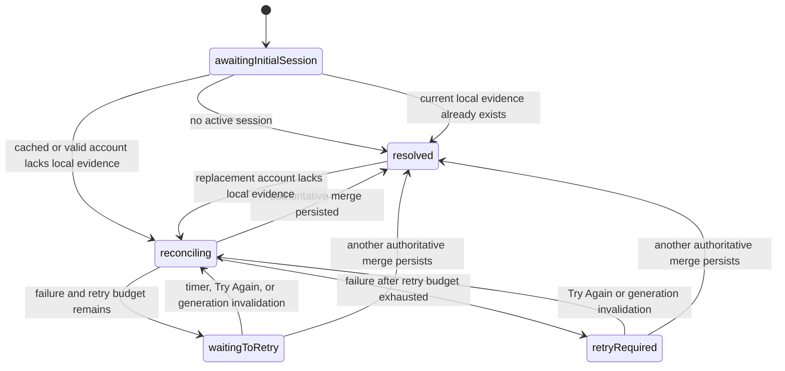

# Onboarding Flow

Naturebook gates the main workspace, hardware initialization, ordinary
background/provider sync, and inference behind both completed onboarding and
current legal consent. Consent reconciliation itself remains available while
the required gate is closed. This
document explains the four-step permission flow, versioned consent receipts,
and the three-part required completion gate.

> [!WARNING]
> **Release status:** the internal-testing screen and evidence model are
> implemented. `CONSENT-001` through `CONSENT-011` are closed in source,
> including the local-ledger handoff, PostHog withdrawal, account restoration,
> final synchronization merge fence, Realtime, and OAuth lifecycle findings.
> Same-SHA hosted iOS and validation-only Supabase evidence, counsel approval,
> and operator evidence still block production. Treat the
> guarantees below as required invariants until every item in the
> [canonical consent readiness record](../legal/production-consent-readiness-2026-08-03.md)
> is closed. Internal test builds may continue; do not submit the candidate for
> production or enable strict enforcement yet.

---

## Architecture

| File | Role |
|---|---|
| `App/MerianApp.swift` | Applies the three-state root presentation policy: onboarding, required-consent restoration, or workspace |
| `Steps/Models/OnboardingStep.swift` | Defines the four steps in order |
| `Shell/ViewModels/OnboardingViewModel.swift` | `@Observable @MainActor` — owns `currentStep` and the injected `AppSettings.hasCompletedOnboarding` flag |
| `Core/Security/ConsentManager.swift` | Owns the local append-only consent ledger, current policy versions, account synchronization, launch-restoration state, and inference gate |
| `Core/Security/ConsentLedgerStore.swift` | Throwing, fault-injectable storage boundary: atomic verified ledger file, legacy migration, and independent Keychain withdrawal journal |
| `Shell/Views/OnboardingView.swift` | Root view, switches content based on `currentStep` |
| `Steps/Welcome`, `Steps/CameraPermission`, `Steps/LocationPermission`, `Steps/Ready` | One self-contained SwiftUI view per onboarding step |
| `Steps/Shared/OnboardingStepWrapper.swift` | Shared step layout and action-button chrome |
| `Permissions/Location/LocationPermissionDelegate.swift` | `CLLocationManagerDelegate` for native location permission priming |

---

## The Steps

```swift
enum OnboardingStep: Int, CaseIterable {
    case welcome = 0
    case camera
    case location
    case ready
}
```

| Step | Component | What happens |
|---|---|---|
| `.welcome` | `WelcomeStepView` | Branding screen — no permission request |
| `.camera` | `CameraPermissionStepView` | Requests `AVCaptureDevice` camera permission |
| `.location` | `LocationPermissionStepView` | Requests `CLLocationManager` when-in-use authorization via `LocationPermissionDelegate` |
| `.ready` | `ReadyStepView` | Presents **One last step**, names Google Gemini as the recipient of observation data for AI-powered identification, and groups three initially-off, left-aligned switches by consequence. **Required to start scanning** contains the 18+ self-attestation and Terms/data-sharing permission with an inline Terms link; **Optional — change anytime in Settings** contains usage/diagnostics. **Start scanning** requires the two required switches only. |

The first three step views use `OnboardingStepWrapper` for consistent layout
and action chrome. The ready step uses a dedicated layout so the disclosure,
linked acceptance statement, switches, and disabled state remain one clear
surface.

---

## State Transitions

```swift
func advanceStep() {
    if let next = OnboardingStep(rawValue: currentStep.rawValue + 1) {
        currentStep = next
    }
}

func completeOnboarding(analyticsEnabled: Bool) throws {
    try consentManager.confirmAdultAndAcceptCurrentTermsAndGrantGemini(
        analyticsEnabled: analyticsEnabled
    ) // verified atomic local write first
    AppTelemetry.trackOnboardingCompleted()  // fires before flag write — activation funnel signal
    hasCompletedOnboarding = true            // writes through AppSettings/UserDefaults("hasCompletedOnboarding")
}
```

`completeOnboarding(analyticsEnabled:)` is called on the `.ready` step. It first
builds a candidate containing the current adult-confirmation receipt, Terms
receipt, Gemini grant, and optional analytics action. It installs that candidate
in memory only after the throwing store verifies an atomic file replacement,
then records the activation event when analytics is allowed and writes the
onboarding flag. A failure leaves the completion flag false, keeps scanning and
analytics disabled, and presents a retryable alert on the same screen. The local
legal action is therefore durable before the workspace can open. The
full lifecycle requires both `hasCompletedOnboarding` and
`ConsentManager.hasCurrentRequiredConsent`:

- `AppLifecycleManager.handleActivePhase()` requires both gates before it
  initializes active hardware work or drains queued submissions.
- `AppLifecycleManager.handleInactivePhase()` still uses completed onboarding
  to stop an existing camera session during system interruptions.
- `AppLifecycleManager.handleBackgroundPhase()` always records the background
  time used by session-timeout recovery; it does not submit provider work.

This means during onboarding or whenever current required consent evidence is
absent: no camera session starts, no inference request is built, and no offline
submission drain runs.

---

## Root Presentation Gate

`OnboardingViewModel` exposes `hasCompletedOnboarding` as a computed property backed by its injected `AppSettings` boundary:

```swift
var hasCompletedOnboarding: Bool {
    get { appSettings.hasCompletedOnboarding }
    set { appSettings.hasCompletedOnboarding = newValue }
}
```

`MerianApp.swift` reads this flag together with
`ConsentManager.hasCurrentRequiredConsent` and
`ConsentManager.isRestoringRequiredConsent`. Production construction uses the
shared managers; tests inject isolated settings and consent ledgers.

| Root inputs | Presentation |
|---|---|
| Onboarding is incomplete | `OnboardingView`, beginning at `.welcome` |
| Onboarding is complete and current required consent is present | `CaptureWorkspaceView` |
| Onboarding is complete, current evidence is missing locally, and restoration is pending or retryable | Launch-screen-matched `ConsentRestorationView` |
| Onboarding is complete, restoration has resolved, and current evidence is still missing | `OnboardingView`, beginning at `.ready` |

The restoration surface is deliberately neutral: it matches the black launch
screen and delays its progress indicator for 350 milliseconds. A quick account
restore therefore introduces no visible intermediate screen, while a slower
restore still provides accessible feedback. It does not mount approval controls
or initialize the Capture workspace. A recoverable synchronization failure
replaces the progress indicator with neutral explanatory copy and a **Try
Again** action during the automatic retry cycle and after its exhaustion.

`SupabaseManager` configures Auth to emit the locally cached session immediately.
That initial session may carry a known user while its access token is expired.
The listener classifies this as `.awaitingRefresh`, keeps authenticated request
state closed, and passes the known user to `ConsentManager`; it must not collapse
the event into a no-session result. The root therefore remains neutral until
Supabase emits `tokenRefreshed` with a valid session or `signedOut` after a
terminal refresh failure.

`ConsentManager.RequiredConsentRestorationState` distinguishes evidence that is
not known yet from evidence that is known to be absent:

- `.awaitingInitialSession` covers startup before the initial auth result.
- `.reconciling(userId:)` covers a known account—either valid or awaiting token
  refresh—whose local ledger does not yet prove current adult, Terms, and
  Gemini consent.
- `.waitingToRetry(userId:attempt:)` records a failed reconciliation and its
  next bounded automatic retry without changing the account's authority.
- `.retryRequired(userId:)` records an exhausted automatic budget and exposes
  explicit retry on the same neutral surface.
- `.resolved` means the initial result is unauthenticated, current local
  required evidence already bypasses restoration, or an identity-fenced,
  durably persisted authoritative merge can choose a real root. Remote absence
  is authoritative; network, decoding, pending-row push, and persistence
  failures are not.



Automatic retries wait 5, 10, and 20 seconds after the failed attempt. The
Supabase client may already have retried transient reads internally, so this
outer budget is intentionally bounded. Every timer, attempt, and manual retry
is fenced by the observed account, synchronous SDK account, and synchronization
generation. Invalidating synchronization cancels its timer and moves the same
unresolved account back to `.reconciling`; the replacement account/session then
owns the next decision and a fresh retry budget. Cancellation never establishes
absence.

A repeated auth notification for the same resolved account must not re-enter
restoration. `isRestoringRequiredConsent` also becomes false immediately when
current required evidence is already present, regardless of the stored enum
case.

An older install with completed onboarding but no current receipt therefore
enters directly at `.ready` only after initial session restoration determines
that the receipt is genuinely absent. An expired cached session remains part of
that restoration until refresh succeeds or Auth establishes sign-out, so the
app never flashes `.ready` while account evidence is still being fetched. A
material adult policy, Terms, or Gemini
disclosure change increments its policy version and routes every account
without that version back to the same step after reconciliation.

## Versioned Consent Evidence

`ConsentPolicy` currently pins adult policy and Terms versions `2026-08-03`,
Gemini disclosure version `2026-08-04.1`, PostHog disclosure version
`2026-08-04`, and providers `google_gemini` and `posthog`. The exact displayed
statement is stored with each action, along with a client-generated UUID,
device action time, platform, app version, and app build. Adult eligibility is
self-attested on every supported iOS version; Naturebook does not collect a
birth date or exact age.

`ConsentManager` writes the append-only JSON ledger through
`ConsentLedgerStore` immediately, including while the first anonymous Supabase
session is still being created. Production storage uses the file-protected
`Application Support/Naturebook/Consent/ledger-v1.json`, atomically replaces it,
and verifies the exact bytes before the candidate becomes live. The store
migrates and removes the former `UserDefaultsKeys.legalConsentLedger` copy only
after verifying the file. Tests can inject a deterministic store and independent
read/write/cleanup faults. The manager later binds unowned records to the active
account and synchronizes them to:

- `public.user_adult_eligibility_receipts`;
- `public.user_terms_acceptance_receipts`;
- `public.user_ai_consent_events`, whose `granted` and `revoked` rows form an
  immutable permission history; and
- `public.user_analytics_consent_events`, whose latest `granted` or `revoked`
  row is the account-wide PostHog choice. Absence of a grant means analytics is
  off.

All four tables use owner-only RLS and explicit authenticated `SELECT` grants.
Adult and Terms receipts retain narrow column-level `INSERT` grants. Gemini and
PostHog tables deny direct client insertion: authenticated callers mutate them
only through their provider-specific causal compare-and-append RPC. Each local
provider action stores the event ID it observed as `causal_parent_id`; the RPC
locks the account against ghost merge and serializes the provider stream in one
transaction. It accepts a grant only if that parent is still current; it always
accepts a revocation and rebases it to the locked current head so withdrawal is
deny-wins. The returned accepted parent is persisted locally, and the
server-only monotonic `consent_revision`—not `occurred_at`, upload receipt time,
or a device clock—determines cloud permission. Client-generated IDs keep an
accepted retry idempotent, while a stale grant returns the authoritative head
without inserting a row and is retained locally as superseded evidence.
After an ambiguous network failure, iOS accepts a fetched row only when its
immutable payload matches the attempted append; the accepted parent may differ
only for a revocation that the server rebased.
Clients have no `UPDATE` or `DELETE` path and cannot supply `recorded_at` or the
revision.
Database ghost-to-signed-in merge policies reparent every synchronized
immutable row without coalescing evidence. After server completion, iOS now
rebinds the complete local adult, Terms, Gemini, and analytics ledger to the
permanent UUID in one verified write. Ghost-synchronized records follow the
server mapping; every other ghost-owned record remains pending for the
permanent account. A durable handoff suppresses analytics across restart until
pending actions are pushed, authoritative state is refetched, and throwing
verified queue removal succeeds. Analytics INSERT events are in the owner-scoped
Realtime publication. The client tracks the channel owner and confirmed
subscriber separately from auth-session assignment, fences stale listeners by
generation, and retries failed subscriptions for the same account with bounded
backoff. Auth observation and foreground/session adoption both ensure the
owner-scoped channel, while foreground refetch remains the recovery path for a
missed event. When returning to an account, auth observation first moves
analytics into an explicit remote-authority wait state, before cached ledger
state is refreshed or applied to the SDK. Synchronization then activates that
account's local ledger and pushes its pending evidence before refetching remote
state. That order is safe because each AI/analytics append atomically locks and
resolves its observed causal parent: grants compare it with the current head,
while revocations rebase to that head. Merely fetching first would not close a
concurrent cross-device race. The refetch includes both the current disclosure state and
the all-version stream head, so new local actions attach to the actual provider
head. A delayed offline grant whose parent predates another device's revocation
is rejected and cannot gain authority from a newer server receipt time. Only an
all-version head that is itself an authoritative current-version grant and
survives an identity-fenced, verified ledger write resolves the account to
enabled. Remote absence, a head revocation under any disclosure version, network
failure, or persistence failure leaves analytics closed. A repeated same-account
auth notification after resolution does not
flap a healthy SDK session. Immediately before the merge mutates or persists
any evidence, it again requires an uncancelled task, the expected observed
account, the matching synchronous Supabase SDK session, and the same
synchronization generation. An old-account fetch that returns late therefore
cannot change the active ledger or reopen analytics.

Before any identification provider request is constructed or dispatched,
`MerianNetworkClient` calls `ensureCloudConsentForInference()`. That method
requires the current local adult, Terms, and Gemini versions, creates or
resolves the Supabase session, and verifies that all required evidence reached
the active account. The database repeats the check inside both service-only
`reserve_ai_quota` overloads immediately
before provider admission, so an outdated or modified client cannot bypass it.
Missing or revoked evidence fails with `403 ai_consent_required` and no Gemini
dispatch.

The first row in Settings → Resources is the optional Analytics & diagnostics
control. Settings intentionally provides no Gemini processing opt-out:
Naturebook has no non-AI identification mode, so a user who does not permit the
required processing cannot use the scanner. Historical or remote AI revocation
events remain supported and close the local workspace gate immediately. The
required analytics-withdrawal invariant is immediate facade shutdown, identity
clearing, SDK opt-out/closure, account-wide synchronization, no
withdrawal-triggered PostHog request, and no change to core functionality. The
exact revocation event is first appended to a versioned, read-back-verified
Keychain journal. If the main ledger write fails, that journal forces analytics
off after restart and replays every pending account's original ID, text, and
timestamp when storage recovers. A verified ledger write is required before the
journal is removed; cleanup failure remains conservatively off. The
configured-host transport gate closes before `reset()` and cancels PostHog
3.69.0's reset-time feature-flag reload locally while preserving
`reset → optOut → close`; see completed `CONSENT-001` in the readiness record.
Before OAuth installs a session that can replace the current account, the app
synchronously suppresses analytics and stops consent Realtime. It reconciles
the SDK's actual session on success or failure, and only the newest overlapping
transition may reopen analytics for a currently granted account.

---

## Permission Philosophy

Each permission step presents the rationale for the request before triggering the system dialog. This "permission priming" pattern maximizes grant rates by ensuring users understand the value before iOS shows the system alert.

- **Camera**: Required for visual capture. If denied, the camera shutter is
  unavailable; non-camera modes remain the alternative.
- **Location**: Optional. It improves identification context and scientific
  record quality; **Skip for now** continues without an OS grant.

> [!NOTE]
> **Progressive Disclosure**: Push Notification and Photo Library permissions
> are deliberately omitted from the initial onboarding flow to reduce drop-off.
> Notifications are conditionally requested via a half-sheet after the first
> successful scan resolve, or if the user actively flips the
> Discovery/Achievement toggles in Settings. Enabling **Save to camera roll**
> presents the add-only Photos explainer for automatic photo and video writes;
> gallery import separately requests read/write access. Explicitly Downloading
> media also uses add-only access but does not require the automatic setting to
> be enabled. Receiving a file explicitly shared from Photos is a document
> import and adds no Photo Library permission request. See
> [Camera Roll and Captured-Media Export](./27-camera-roll-media-export.md).

---

## Re-entering from a Deep Link

Most transient navigation events cannot present Capture sheets until onboarding
and current required consent are complete. Photos document imports are the deliberate exception: the file is
copied into `ExternalImageImportStore` before the event is published, so an
unfinished onboarding flow may ignore the transient event without losing the
photo. `CaptureWorkspaceView` checks the durable inbox after onboarding and
current required consent, then routes the item through the normal quota, crop,
confirmation, and submission flow.
