# Active Capture Goal Context

Status: Accepted and implemented\
Decision date: 2026-07-17\
Backend status: capture-context migration and `field-trips` action deployed;
confidence-gate release pending the normal Supabase deployment process<br>
Client status: implemented; release remains gated on the normal iOS release
process

## Decision

Capture surfaces consume a small, source-agnostic `CaptureGoalContextSnapshot`
containing progress-bearing `CaptureGoal` values and an optional
non-progress-bearing `CaptureGoalIntroduction`. Features that own goals remain
responsible for eligibility, ordering, completion, artwork mapping, and
destination construction. Capture owns only presentation, local selection,
account-scoped caching, refresh timing, the bounded submission preference, and
the typed hand-off to the destination feature.

The Field trips feature is the first source. It exposes a private, authenticated
`capture_context` action backed by
`public.get_field_trip_capture_context(self_id)`. The Edge Function supplies the
verified caller ID; the database RPC is not callable by direct client roles.

This is the long-term integration boundary. Future goal-producing features must
plug into the same generic provider and destination contracts instead of placing
their API models, ranking logic, or routes inside the camera feature.

## Context

The visual Scan page needs lightweight motivation and orientation without
becoming a second Field trips screen. A user may have several unfinished targets
across multiple outings, and progress values can change when the user swipes
between them. The indicator therefore needs enough source context to explain the
current target while remaining small, non-blocking, and safe to show over a live
camera.

The first implementation could have passed Field trip DTOs directly into
`CaptureWorkspaceView`. That would have made the camera responsible for outing
access rules, current-level filtering, target ordering, and Explore routes. It
would also have made later integrations, such as a curated event goal, require
another source-specific branch throughout Capture.

The chosen design establishes one stable capture-facing domain before a second
source exists, while keeping source aggregation deliberately small until it is
needed.

## Goals

- Keep camera startup and capture independent from goal-context networking.
- Explain the selected target and its owning experience in compact UI.
- Preserve a useful last-successful state through intermittent field
  connectivity.
- Keep account state isolated across sign-in, ghost-account, and sign-out
  transitions.
- Make routing compiler-checked and owned at the receiving feature boundary.
- Let future goal sources integrate without importing their DTOs into Capture.
- Return no private scan evidence merely to render a motivational indicator.

## Non-goals

- Selecting which experiences are eligible for scan progress. Progress remains
  server-authoritative and evaluates the account-enrolled Backyard Safari, every
  other explicitly started standard outing, and every explicitly joined live
  Event independently.
- Showing Seasonal Challenge targets in the first release.
- Treating Record, Describe, gallery import, refinement, active video, or mixed
  non-camera evidence as eligible for the preferred-goal hint. A camera-only
  still may retain the goal selected before it entered the staging tray.
- Realtime subscriptions, background fetch, push-driven refresh, or camera
  startup blocking.
- User-generated checklists, unlimited target catalogs, or a universal goal
  service shared by every product area.

## Architecture

```mermaid
flowchart LR
    A0["Signed-in or ghost profile insert"] -->|"database-only trigger"| A1["Backyard Safari Level 1 + active period"]
    A1 --> C
    A["Authenticated iOS account"] --> B["field-trips Edge Function"]
    B -->|"verified user.id"| C["Private capture-context RPC"]
    C --> D["Field trip capture DTOs"]
    D --> E["FieldTripCaptureGoalProvider"]
    E --> F["CaptureGoal list in presentation order"]
    F --> G["ActiveCaptureGoalStore"]
    G --> H["Compact Scan indicator"]
    H -->|"typed destination"| I["Explore routing boundary"]
    I --> J["Focused Tips card or Goals fallback"]
```



The dependency direction is intentional:

- the source feature may depend on the generic capture-goal contract;
- Capture may depend on the generic contract, but not on source DTOs;
- the app composition root injects one provider into one observable store; and
- Explore converts a generic typed destination into its internal route.

Primary implementation files:

- `apps/ios/Merian/Core/Models/CaptureGoalContext.swift`
- `apps/ios/Merian/Core/AppDIContainer.swift`
- `apps/ios/Merian/Features/Explore/FieldTrips/Services/FieldTripCaptureGoalProvider.swift`
- `apps/ios/Merian/Features/Capture/Shell/Views/CaptureWorkspaceView.swift`
- `apps/ios/Merian/Features/Capture/Shell/ViewModels/CaptureWorkspaceViewModel.swift`
- `apps/ios/Merian/Features/Capture/Shell/Modifiers/CameraSheetRouter.swift`
- `apps/ios/Merian/Features/Explore/Shell/ExploreView.swift`
- `apps/ios/Merian/Features/Explore/FieldTrips/Views/FieldTripsView.swift`
- `services/supabase/functions/field-trips/`
- `services/supabase/migrations/20260717195751_active_outing_capture_context.sql`
- `services/supabase/migrations/20260717213641_preserve_standard_outings_in_capture_context.sql`
- `services/supabase/migrations/20260722025411_persistent_field_trip_scan_contributions.sql`
- `services/supabase/migrations/20260722064704_harden_atomic_field_trip_progress.sql`
- `services/supabase/migrations/20260730023042_gate_field_trip_progress_by_confidence.sql`
- `services/supabase/migrations/20260802053044_simplify_backyard_and_pollinator_levels.sql`
- `services/supabase/migrations/20260803015025_auto_enroll_backyard_safari_level_one.sql`

## Capture-facing domain contract

`CaptureGoal` carries only what compact capture chrome needs:

- a stable namespaced goal ID;
- source kind, source ID, and source title;
- a short prompt;
- aggregate completed and target counts;
- a bundled image or neutral system-symbol reference; and
- a typed destination.

The contract intentionally excludes source response objects, entitlements,
unlock rules, scan IDs, media, coordinates, field notes, and completion
evidence.

`CaptureGoalContextProviding` returns a snapshot whose goals are a flat array in
final presentation order. `ActiveCaptureGoalStore` must not re-rank that array.
This makes ordering an explicit source/product policy rather than an accidental
client sort.

`CaptureGoalDestination` is an enum rather than an untyped dictionary or URL.
Adding a destination therefore creates compiler errors at every routing switch
that must decide how to handle it.

## Field trip source contract

The authenticated Edge request is:

```json
{
  "action": "capture_context"
}
```

The response is documented canonically in
[`05-api-contracts.md`](../backend-and-data/05-api-contracts.md). It includes
only accessible, incomplete, non-hidden standard outings and unfinished targets
from each current unlocked level.

Seasonal Challenge presentation and challenge-specific completion rows are not
part of this contract. Challenge joins reuse the linked standard
`user_field_trips` row, so the standard outing and its normal progress remain
eligible; joining an event must not make an existing Scan target disappear.

Every profile insert opens Backyard Safari Level 1 and its first activity period
before Capture reads this contract. The migration performs the same insert-only
enrollment for existing accounts. It never resumes an existing stopped, reset,
or completed row, and its enrollment timestamp—not historical account or scan
time—is the first eligible scan boundary. Enrollment does not weaken the
evidence boundary established by
`20260730023042_gate_field_trip_progress_by_confidence.sql`.

Ordering is stable and server-owned:

1. outings by the latest of start or item completion, descending;
2. `user_field_trip_id` as the outing tie breaker;
3. targets by curated `sort_order`; and
4. `item_id` as the target tie breaker.

The provider preserves that order while flattening outings into generic goals.
The source title is retained so a progress change such as `8/10` to `4/6` is
understandable when a swipe crosses outing boundaries.

Exact bundled artwork is used only when the source adapter has a semantic
mapping. Unknown targets use `binoculars.fill`; they must never borrow an image
from an unrelated target.

## Submission Preference Contract

The visible selection is an optional tie breaker inside its own standard outing,
not an eligibility override and not a cross-experience winner. A saved scan can
still advance one goal in every eligible standard outing and one goal in every
joined live Event. Within each experience the server credits at most one goal.

Automatic AI evidence is eligible only at the exact inference tier's
Possible-match boundary (75% Flash / 65% Pro). A weaker unreviewed match
receives no credit regardless of the visible selection. The complete preference
remains pending in the atomic receipt until explicit confirmation or a confirmed
correction/community resolution makes the identification eligible.

Capture may attach `preferred_goal: { user_field_trip_id, item_id }` only when:

- the **Field trip goals** setting and Field trips feature are enabled;
- visual Scan is active and the target was visibly selected before camera media
  was staged (the capsule may be hidden while a nonempty tray is submitted);
- the selected target is a standard-outing goal;
- Capture is not refining an existing scan; and
- the submitted evidence contains camera still images only, with no gallery
  image, video, audio, Describe item, or Record item.

Automatic single-shot submission, crop-confirmed camera submission, and manual
camera-still submission all use the same policy. Gallery, Describe, Record,
hidden-goal UI, missing selections, mixed camera/gallery trays, and any audio or
video discard the preference and use deterministic server ranking.

Once the identification satisfies the evidence policy, the Edge/database
boundary validates the preference against ownership, visibility, the scan
timestamp's active period, the current unlocked level, and identification
matching. Invalid, stale, unauthorized, completed, or nonmatching preferences
are ignored. Fallback order is exact species, scientific name, taxonomy from
genus through kingdom, semantic tag, ecology, habitat, then curated checklist
order and item ID. Events always use fallback ranking because their targets are
not exposed in the current Capture context.

## State, caching, and refresh

`ActiveCaptureGoalStore` is app-injected `@Observable` state. It owns:

- current goals and selection;
- previous/next wraparound;
- selection preservation across a refresh;
- advancement to the next surviving target after completion;
- a five-minute freshness window;
- sharing one in-flight provider fetch across overlapping freshness checks;
- coalescing explicit forced invalidations received during that fetch into one
  follow-up refresh;
- silent retention of the last successful snapshot on request failure; and
- the optional provider-validated post-Reset introduction when no active goal
  exists.

The cache is a versioned `Codable` envelope in `UserDefaults`, keyed by the
normalized Supabase account ID. It stores only generic goals, the selected goal
ID, an optional generic introduction, and the successful refresh date. It does
not cache source DTOs or evidence. Activating a different account clears
in-memory state before loading that account's key. Signing out clears the
in-memory state.

The current key prefix is `captureGoalContext.v1.`. Any incompatible Codable,
identity, ordering, or privacy change must increment the cache version instead
of trying to decode the old shape opportunistically.

Refresh policy:

- refresh through the five-minute freshness gate on Capture appearance, Supabase
  account restoration/change, foregrounding, or return to visual Scan;
- force after outing start/join and standard progress events;
- force after explicit scanner-routing or capture-goal invalidation events;
- when lifecycle callbacks overlap at startup, share the current fetch without
  scheduling a follow-up; only a forced invalidation during that fetch schedules
  one follow-up; and
- never await the request before starting the camera or accepting a capture.

New and migrated accounts normally receive active Backyard Safari Level 1 goals
from the server. An empty active-context response, such as after Reset, causes
the Field trip provider to fetch the existing authenticated `template_detail`
action by `backyard_safari` slug. Only an accessible, unstarted template with a
nonempty first level yields an introduction. Both reads form one complete
snapshot: a failure preserves the last successful content, while a successful
ineligible lookup clears old content.

## Presentation and interaction

The pill appears only when all of the following are true:

- Field trips are enabled;
- the device-local `showsCaptureGoalProgress` preference is enabled;
- visual Scan is selected;
- a real target or provider-validated introduction exists;
- no staged capture is present;
- refinement is inactive; and
- video is not recording.

With no complete cache, initial loading renders nothing. The indicator starts as
a 50-point circle containing 42-point artwork on the mode picker's vertical
centerline, to its right while the picker remains centered on screen. It uses
the 32-point trailing workspace margin when space permits and compresses that
margin only enough to preserve an 8-point gap on narrow phones. Expansion moves
the same surface to the row beneath the picker, restores a 56-point leading
control with 36-point artwork, and fills the available goal width. It uses
untinted interactive native Liquid Glass on iOS 26 and later, with a neutral
material fallback on earlier supported versions. Text and symbols use semantic
foreground styles rather than a fixed brand color so the system can maintain
contrast over the live camera scene.

The on-by-default **Field trip goals** setting controls presentation of the
capsule and whether Capture may forward that visible selection as a preferred
goal. Disabling it does not clear the account cache, alter stored selection,
stop normal refreshes, or disable server progress; saved scans use deterministic
fallback ranking instead. Re-enabling is immediate and does not create a
separate server preference setting.

Compact form shows artwork only. Tapping it moves the surface beneath the picker
and expands `Goal: {target}` and the outing title between symmetric 56-point
artwork and up-chevron slots. The curated prompt is preserved exactly instead of
adding grammar-aware articles. Tapping the artwork or trailing chevron collapses
the surface onto the picker row; tapping the centered expanded region opens the
owning outing.

Swipe left selects the next target and swipe right selects the previous target
from either size; both directions wrap. A drag commits only after 36 points and
when horizontal motion is at least 1.25 times vertical motion, avoiding conflict
with vertical camera gestures and capture-mode paging. Expansion survives goal
changes, root sheets, foregrounding, and temporary Capture suppression. Leaving
visual Scan, changing or signing out of an account, or disabling the setting
resets the next presentation to compact.

Opening provides a light sheet haptic, while expansion, collapse, and target
changes provide selection feedback through the shared app haptics policy. Reduce
Motion makes the size transition immediate and removes target-selection
animation. Compact VoiceOver announces the goal, outing, progress, Expand, and
adjustable previous/next actions. Expanded artwork and the trailing chevron
expose Collapse, while the centered region exposes Open and the adjustable
actions. Dynamic Type QA must confirm the expanded prompt and outing context
remain intelligible without covering camera controls.

The post-Reset Field trip introduction uses the same compact/expanded treatment.
Its exact Bird and Dog artwork continues three-second cross-fades in either
size, while Reduce Motion keeps the first image static. Expanded content renders
**Start an outing**, **Backyard Safari · 2 goals**, and the trailing collapse
chevron. The introduction is not a selectable goal and therefore has no goal
swipe or VoiceOver adjustable action. Artwork and the chevron collapse the
surface; the centered expanded region opens outing detail without starting it.
New and migrated accounts instead receive active Backyard Safari Level 1 goals
automatically; started, completed, inaccessible, missing, and empty templates
produce no introduction.

## Navigation

Tapping the pill sends `CaptureGoalDestination` through
`CaptureWorkspaceViewModel` and `CameraSheetRouter` to `ExploreView`. Capture
does not build a `FieldTripTemplateRoute`.

Explore owns the conversion. Active goals then:

1. presents the Field trips tab;
2. opens the owning standard outing;
3. selects Tips;
4. expands and scrolls to the matching target;
5. briefly highlights the focused card; and
6. falls back to the highlighted Goals tile when the target has no guide.

The focused checklist-item ID remains optional so all existing outing routes
retain their original behavior.

The introduction uses a separate `.fieldTripTemplate(slug:)` destination.
Explore selects Outings and opens the same detail view using its ID-or-slug
reference; the resolved template ID continues to own Start outing and subsequent
progress mutations.

## Privacy and authorization

The client request accepts no account identifier. The repository's authenticated
Edge boundary verifies the session with `withEdgeHandler`, and only the verified
`user.id` is passed to the database helper. `field-trips` retains the
repository's documented `verify_jwt = false` gateway compatibility policy; this
does not make the action anonymous because the handler still requires
authentication.

`public.get_field_trip_capture_context(uuid)` is `SECURITY INVOKER`, uses an
empty search path with qualified objects, and has execute permission revoked
from `PUBLIC`, `anon`, and `authenticated`. Only `service_role` can call it.
This prevents a client from supplying another account ID directly.

The response and cache must never include:

- scan IDs or client scan IDs;
- media or storage URLs;
- coordinates, place labels, or field notes;
- completed common or scientific names;
- evidence timestamps or evidence metadata; or
- account identifiers other than the local cache namespace.

The scan-submission preference is a separate write contract, not part of the
capture-context response or its `UserDefaults` cache. V50 persists its two IDs
beside an accepted queued scan in `OfflineQueuedScanGoalHint`. The backend
retains the complete hint in the private atomic receipt, then copies it into
`field_trip_scan_goal_preferences` only after the identification qualifies and
the goal passes owner/current-level/match validation. These rows are
owner-scoped control data; none contains media, coordinates, notes,
identification evidence, or a public route. Queue success preserves the local
companion as a durable progress outbox until successful or terminal
acknowledgement; explicit cancellation and terminal orphan cleanup remove it.
The V49→V50 migration does not synthesize a companion for an existing queue row:
V49 stored no selected-goal value, and neither this cache nor current outing
state is valid backfill authority.

The locally cached prompt, outing title, and aggregate progress are
account-related but deliberately low-sensitivity. If a future source needs
sensitive or regulated context, it must not reuse this `UserDefaults` posture
without a new storage and lock-screen exposure review.

Supabase implementation guidance remains aligned with the repository's shared
auth wrapper and least-privilege function grants. Any future migration to a
different Edge auth wrapper is a separate decision and must preserve verified
caller identity, the unauthenticated `401` contract, and the service-only RPC
boundary. See the official Supabase guidance for
[Edge Function authentication](https://supabase.com/docs/guides/functions/auth)
and
[database function privileges](https://supabase.com/docs/guides/database/functions).

## Telemetry and observability

The UI emits one `CaptureGoalIndicator` event with:

- `action`: `shown`, `opened`, `next`, `previous`, `zero_state_shown`, or
  `zero_state_opened`; and
- `source`: the coarse `CaptureGoalSourceKind` value.

The standard `event_source = ios_client` property is added by `AppTelemetry`.
Prompts, IDs, titles, progress values, destination fields, and account identity
are prohibited.

Operational monitoring should distinguish authentication failures, RPC failures,
empty success, and decode failures without logging returned target content. A
refresh error remains invisible over the camera; diagnostics belong in
privacy-safe logs and aggregate backend monitoring.

## Adding another goal source

Do not add another conditional branch directly to the Scan view. A new source
must complete this checklist:

1. Define a stable `CaptureGoalSourceKind` case.
2. Add a source-owned narrow authenticated read contract that performs access,
   completion, and ordering checks before returning data.
3. Add a `CaptureGoalContextProviding` adapter that maps source DTOs into
   `CaptureGoal` without leaking them to Capture.
4. Add a typed `CaptureGoalDestination` case and handle it at the receiving
   feature boundary.
5. Choose exact artwork mappings or the neutral fallback.
6. Publish source invalidation events after start/join/progress mutations.
7. Extend privacy-safe telemetry source values without adding content or IDs.
8. Add decode, mapping, order, caching, completion-advancement, routing,
   presentation, accessibility, and backend authorization tests.
9. Update this RFC, the source feature documentation, API contract, deployment
   runbook, codebase map, test strategy, and release notes.

When the second source is ready, introduce a
`CompositeCaptureGoalContextProvider` at the app composition root. It should
fetch source providers concurrently and apply an explicit, deterministic
product-owned cross-source priority policy before returning one flat list. The
store and Scan view should remain unaware of provider count.

The first composite implementation should preserve snapshot consistency: if a
required provider fails, throw and let the store retain the last complete
snapshot. If independent partial freshness later becomes a product requirement,
redesign the store around source-keyed snapshots and timestamps explicitly; do
not silently mix fresh results from one source with missing results from
another.

Do not create a global backend goal service merely because a second source
exists. Source backends should continue to own authorization and ranking. A
backend-for-frontend aggregator is justified only when measured request fan-out,
latency, or cross-source ranking requirements cannot be handled cleanly by the
client provider boundary.

## Capacity and evolution guardrails

The current response is intentionally unpaginated because the active curated
Field trip catalog is bounded and the indicator cycles through the full set. If
active field trips or target counts can grow materially, add a hard server-side
limit and payload-size telemetry before broad rollout. Do not allow an unbounded
user-generated checklist to feed the camera contract.

Realtime is not the default refresh mechanism. Event invalidation plus a
five-minute stale window is cheaper, more predictable in poor connectivity, and
sufficient for user-driven progress. Realtime should be considered only if
progress can be mutated concurrently on another device often enough that the
staleness is demonstrably harmful.

Seasonal Challenge labels and challenge-specific progress remain excluded until
their independent participation, timing, and completion semantics receive a
dedicated product decision. The linked standard field trip remains eligible.
Adding Seasonal presentation is not a data-filter toggle.

## Deployment and rollback

Release order is mandatory:

1. Apply the complete ordered Field Trip migration chain through
   `20260803015025_auto_enroll_backyard_safari_level_one.sql`; the canonical
   sequence lives in
   [`25-field-trips.md`](../features-and-hardware/25-field-trips.md#deployment-notes).
2. Deploy the scan-ingestion Edge Functions so ingestion intents and
   scan/evidence triggers use the atomic receipt contract.
3. Deploy the updated `field-trips` Edge Function.
4. Verify signed-in and ghost account enrollment, insert-only backfill,
   enrollment-trigger ACLs, authenticated success, unauthenticated `401`,
   filtering, order, absence of private evidence, confidence boundaries, pending
   weak-match behavior, confirmation replay, and evidence-downgrade reopening.
5. Release the indicator-enabled iOS client.

The normal production workflow runs
`audit_field_trip_capture_context_acl.ts --enforce` in a read-only transaction
immediately after migration push. It must pass before Function deployment; this
locks the service-only capture RPC, its private entitlement-helper edge, and all
six qualified `service_role` source reads that the `SECURITY INVOKER` projection
requires.

Existing clients remain compatible because the action and RPC are additive.

For rollback, disable the client surface through the Field trips availability
gate or ship a client rollback first. Leaving the additive endpoint and RPC in
place is safer than dropping database objects during an incident. If the backend
contract itself must be disabled, undeploy or reject only `capture_context`; do
not delete Field trip progress or publication data. If automatic starter
enrollment itself must stop, use a new forward migration to drop
`auto_enroll_backyard_safari_level_one_on_user_insert` from `public.users`, then
drop `internal.auto_enroll_backyard_safari_level_one()`. Preserve all rows and
periods already created by enrollment because they are normal user progress. The
confidence migration's repair is forward-only: do not recreate deleted weak
completion rows or derived artifacts. Retain a pre-deploy backup and use a
client/Edge rollback or a forward database fix while leaving the evidence gate
in place.

## Verification

Required automated coverage:

- migration contract tests for privileges, verified-user forwarding, filters,
  order, and evidence-free projection;
- enrollment contract tests for the active-template preflight, insert-only
  backfill, `public.users` trigger, empty search path, and denied execution by
  every API role;
- local database integration tests for access, level, completion, Seasonal
  Challenge exclusion, stable order, empty results, Flash/Pro confidence
  boundaries, pending-goal retention, weak-match confirmation, and downgrade
  removal/reopening;
- Swift decode and provider-mapping tests;
- store tests for order, wraparound, completion advancement, account isolation,
  versioned cache persistence, refresh coalescing, and stale retention;
- navigation tests for focused Tips and no-guide Goals fallback;
- presentation and gesture-policy tests;
- privacy-shape telemetry tests; and
- a simulator build.

Required manual coverage:

- visual Scan only, including no-cache loading and cached offline behavior;
- Dynamic Type, VoiceOver adjustable actions, Reduce Motion, and light/dark
  appearance;
- vertical camera gestures and horizontal capture-mode paging near the pill;
- staged image/video, refinement, and active-recording suppression;
- account switching and sign-out; and
- tap-through to the correct field trip and target; and
- a weak pending scan, explicit confirmation, and subsequent unreviewed
  downgrade without a duplicate progress celebration.

The exact commands and current test inventory live in
[`25-field-trips.md`](../features-and-hardware/25-field-trips.md) and
[`08-testing-strategy.md`](../development-guides/08-testing-strategy.md).

## Alternatives considered

### Put Field trip DTOs in Capture

Rejected because it couples camera UI to one feature's access rules, ranking,
network schema, and navigation.

### Rank field trips and targets on-device

Rejected because server and client could disagree about engagement, access,
current level, or curated order. It would also make old clients retain outdated
ranking rules.

### Use an untyped deep-link dictionary

Rejected because missing destination fields would become runtime failures and
future route changes would not be compiler-checked.

### Fetch on every appearance without a cache

Rejected because field connectivity is unreliable and the indicator is
motivational enrichment, not a reason to flash, block, or show errors over the
camera.

### Add Realtime immediately

Rejected because progress changes already originate from known app events and a
short stale window covers foreground drift. Realtime adds connection lifecycle,
battery, and authorization complexity without a demonstrated need.

### Build a universal goal backend now

Rejected because one source does not justify a new cross-domain service. The
generic client boundary preserves the option without moving source authorization
out of its owner prematurely.
