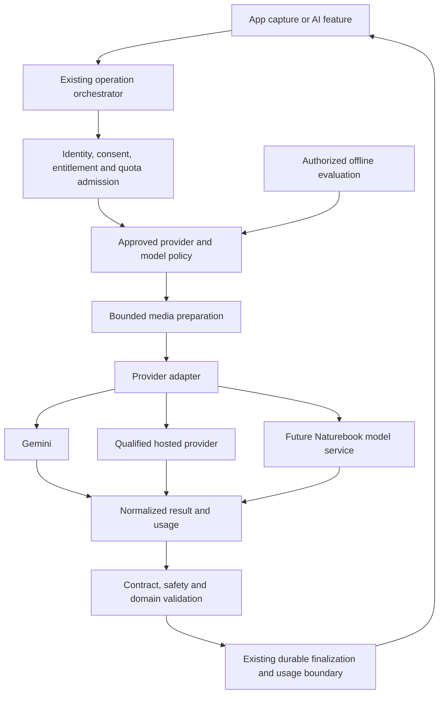
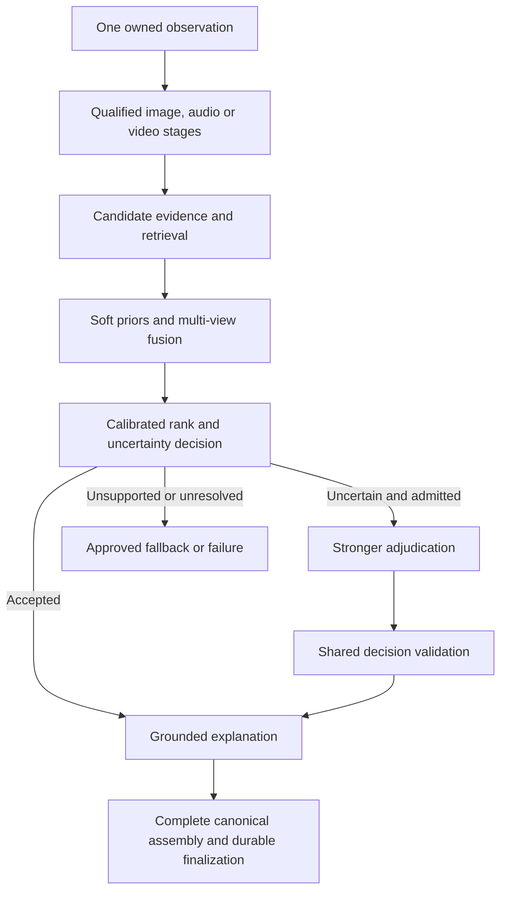

# Naturebook Family Plans and AI Platform Evolution — SRD

Document ID: NB-SRD-FAMILY-AI-001\
Version: 0.2\
Date: 2 September 2026\
Status: Deferred combined draft; identification requirements superseded\
Suggested owners: Backend, iOS, ML, and Product\
Product authority:
[Companion PRD](../product/02-family-plans-and-ai-platform-prd.md)

The active scope is Gemini-only infrastructure in the
[Provider Flexibility SRD](./identification-foundation-srd.md) and its
[PRD](../product/03-identification-foundation-prd.md). Family plans are
deferred, along with BioCLIP and model training. Integrating another live
provider is future work. The content below preserves prior combined planning;
the focused documents supersede its AI requirements and implementation sequence.

## 1. Scope and authority

This System Requirements Document defines a proposed implementation of the PRD's
family access, AI provider flexibility, and model-optimization workstreams.
Requirement IDs support traceability; proposed component and data names below
are logical designs, not declarations that those objects already exist.

This revision incorporates the conversation excerpt supplied on 2 September
2026, identified as S1 in the PRD. It adds specialist candidate generation,
pre-routing versus escalation, soft geographic/seasonal priors, multi-view
fusion, and an explicit BioCLIP proof-of-concept and cost/throughput plan. S1 is
advisory rather than a record of approved product or deployment choices. PRD
decisions D1–D7 remain open. The excerpt contains no family-plan design.

Repository evidence was reviewed at `3c6bbfa67741`; existing concurrent iOS
inference changes are outside scope. Production configuration, current traffic,
measured accuracy/throughput, and Naturebook training-data rights have not been
established by this document.

Current executable contracts and canonical runbooks retain authority until a
reviewed implementation deliberately updates them. This proposal contains no SQL
migration, API deployment, store configuration change, or training run.

## 2. Architecture and preserved boundaries



Family entitlement is an input to admission. It does not select a provider,
grant data access, or imply processing permission. Evaluation approves policy
versions; it must not write live scan outcomes or taxonomy as a side effect.

| ID         | Required invariant                                                                                                                                                                                  |
| ---------- | --------------------------------------------------------------------------------------------------------------------------------------------------------------------------------------------------- |
| SRD-INV-01 | Authentication principal, purchase principal, account grant, and any future household membership remain distinct. Identity comes from the validated session or reviewed purchase binding.           |
| SRD-INV-02 | The server authorizes each AI operation. Neither a client plan label nor a requested model/provider authorizes paid usage.                                                                          |
| SRD-INV-03 | Consent is checked for the actual account, processor, purpose, and applicable disclosure version before user data leaves the service boundary.                                                      |
| SRD-INV-04 | Supported capture modalities, bounded payloads, foreground-to-queue handoff, and the current logical scan identity remain compatible.                                                               |
| SRD-INV-05 | Successful scan responses retain the existing moderation, media durability, species resolution, scan insertion, and owner read-back boundary. A successful provider response alone is insufficient. |
| SRD-INV-06 | Domain response validation, non-biological handling, taxonomy resolution, uncertainty, and public projection remain shared business logic.                                                          |
| SRD-INV-07 | Existing quota reservation, commit, refund/failure, replay, and complimentary-credit rules remain authoritative. Provider substitution cannot reinterpret them.                                     |
| SRD-INV-08 | Telemetry contains bounded execution facts and counters, never prompts, response bodies, media URLs, object keys, account credentials, or raw coordinates.                                          |

Relevant authorities:
[AI engineering](../system-architecture/04-ai-engineering.md),
[Edge modularization](../system-architecture/06-edge-modularization.md),
[API contracts](../backend-and-data/05-api-contracts.md), and
[scan ingestion](../backend-and-data/16-scan-ingestion-reliability-and-recovery.md).

Pure adapter extraction preserves today's single-dispatch identification
contract. The later cascade requirements in section 5.4 explicitly require a
coordinated, versioned extension of quota, attempt, and finalization contracts;
they cannot be enabled by adding an SDK retry.

## 3. Family access design

### 3.1 Recommended Option A: Apple-managed sharing

**SRD-FAM-01 — Product and benefit mapping.** Register approved family products
in the existing server product/entitlement mapping. Preserve the current
`free`/`pro` capability tier unless a deliberate contract change requires more.
Record the benefit source separately from the effective capability: a family
recipient can have Pro capability without being the purchaser. Unknown ownership
must not be relabeled as purchased access.

No household table, roster, invitation system, or pooled allowance is needed for
Option A. Do not manufacture a family ID from a transaction identifier,
RevenueCat alias, shared device, or matching subscription product. The external
platform limitations and proposed separate-product strategy are documented in
the
[PRD option evaluation](../product/02-family-plans-and-ai-platform-prd.md#41-family-access).

**SRD-FAM-02 — Verified projection.** Extend the existing RevenueCat ingestion
and reconciliation boundary to interpret approved shared benefits from
authoritative provider state. Webhook ownership fields are event evidence, not
permission to rewrite access without the existing validation and ordering
controls. Project each recipient's access independently.

The effective entitlement calculation must:

1. Resolve the current account and supported purchase binding.
2. Reconcile valid StoreKit-backed benefits, including approved shared products.
3. Combine them with that account's own grants under the current precedence.
4. Return the effective capability, source, expiry/verification state, and
   existing version information through a deliberately evolved contract.
5. Increment or invalidate the authoritative entitlement version when access
   changes; fence stale iOS completions to the account/session generation.

A shared-benefit revocation must not remove an unrelated paid benefit or grant.
An account's existing complimentary balance remains account-owned and follows
the current quota rules. Family membership never replenishes it.

Keep verified entitlement independently recorded when AI permission is missing,
denied, or revoked. Existing age, Terms, and app-wide onboarding gates remain in
force; a new processor's permission must not additionally block non-AI Pro
features already available within those gates. Admit AI work only to a permitted
eligible route or return the applicable consent/unavailability response. Test
active shared access with each of those permission states explicitly.

**SRD-FAM-03 — Identity compatibility spike.** Before selecting Option A for
implementation, demonstrate the following in an explicitly configured test
environment with distinct Apple and Naturebook identities:

- Purchaser and recipient both retain legitimate access without being aliased
  into one Naturebook account or purchase binding.
- Restoring a recipient's shared transaction does not steal or transfer the
  purchaser's personal benefit, records, or grants.
- Concurrent login, sign-out, Ghost merge, purchase restore, and account
  deletion preserve the existing identity fences.
- RevenueCat's reviewed transfer behavior and both supported legacy/stable
  principal modes behave as intended. If one mode is unsupported, define the
  explicit compatibility requirement and migration before rollout.
- Receipt verification, sharing removal, refund, and provider reconciliation
  produce the expected access state without relying on client flags.

The existing [purchase-principal RFC](./purchase-principal-auth-separation.md)
is additive and its checked-in rollout defaults remain legacy/dual-read. The
family feature must not silently activate the stable-principal cutover.

### 3.2 Lifecycle and isolation

**SRD-FAM-04 — State transitions.** The table describes benefit state; the
effective account tier is recalculated from all remaining valid sources.

| Event/state                                   | Required behavior                                                                                                                         |
| --------------------------------------------- | ----------------------------------------------------------------------------------------------------------------------------------------- |
| Access unknown or provider update pending     | Show verification/pending state; do not create a new paid grant.                                                                          |
| Verified active shared benefit                | Permit the approved Pro operations for this account under ordinary per-user admission.                                                    |
| Cancellation with remaining coverage          | Retain access until the verified coverage ends.                                                                                           |
| Billing issue or grace                        | Honor only grace/coverage supported by authoritative state; do not invent a local grace period.                                           |
| Sharing removed, refund/revocation, or expiry | Invalidate the affected benefit and refresh effective entitlement; preserve records and unrelated access.                                 |
| Delayed or duplicate webhook                  | Follow the existing durable event ledger, ordering, and authoritative reconciliation rules.                                               |
| Offline device                                | Preserve the last-known display and ordinary capture queue behavior; new backend processing still requires server admission.              |
| Account deletion                              | Remove that account's data and bindings under existing deletion contracts. Do not infer store cancellation or deletion of another member. |

**SRD-FAM-05 — Privacy and quotas.** Existing owner-scoped RLS and API checks
remain unchanged in meaning. A common paid product confers no permission to read
another account's scans, coordinates, media, chat, grants, or consent. Per-user
and current abuse-control limits remain in force. Option A has no household
balance to lock or decrement.

The proposed access-convergence target is p95 ≤60 seconds from Naturebook's
receipt of an authoritative update to a successful online entitlement refresh.
Measure store propagation separately. Missing events use the existing scheduled
repair and backlog alerts; do not describe an eventually delivered store event
as instantaneous revocation.

### 3.3 Conditional Option B: Naturebook-managed households

The following requirements activate only if Product selects invitations, a
roster, or a family-owned allowance. They are not additional scope for Option A.

**SRD-FAM-06 — Logical entities.** Introduce a server-owned household,
membership, invitation, and subscription-benefit relation. Keep billing
sponsorship distinct from membership administration and from personal content
ownership.

| Logical entity            | Required fields/invariants                                                                                                                                |
| ------------------------- | --------------------------------------------------------------------------------------------------------------------------------------------------------- |
| Household                 | Stable ID, lifecycle state, capacity policy version, and exactly one active administrative owner. Owner transfer must be atomic.                          |
| Membership                | Household/account relation, role, joined/ended times, and generation; no duplicate active membership. Proposed default: one active household per account. |
| Invitation                | Household, intended recipient binding, token digest, expiry, acceptance/revocation state, and idempotency key. Store no raw bearer token.                 |
| Subscription benefit      | Verified payer/purchase source, valid coverage, capacity, and ordered provider evidence. Clients cannot attach an arbitrary receipt to a household.       |
| Optional pooled allowance | Separate balance/hold ledger with a policy version; add only after defining member versus household spending and refund behavior.                         |

**SRD-FAM-07 — Atomic membership.** Invitation acceptance checks recipient
identity, adult eligibility, active benefit, capacity, token expiry, and current
membership in one transaction. Concurrent acceptances cannot overfill capacity.
Leave, removal, benefit expiry, and owner transfer invalidate the applicable
entitlement generation. Use short transactions, indexed foreign keys, explicit
lock order, deny-by-default grants, RLS, and reviewed caller checks.

Define downgrade behavior before selling variable-capacity plans. Never delete
members' records to satisfy a lower seat count. Administrative ownership does
not transfer a store subscription; owner deletion needs a product rule for
transfer or household dissolution. Any pooled usage policy requires atomic
per-member and household reservations, consistent refund rules, and concurrent
admission tests before use.

**SRD-FAM-08 — Data boundary.** Household administration can expose only the
minimal approved membership and benefit information. It cannot expose scans,
exact locations, messages, or another member's consent. Invitation sending,
recipient discovery, and roster fields need an explicit privacy and abuse
design. Do not reuse account grants or RevenueCat customer attributes as the
membership database.

## 4. Provider-neutral AI contract

### 4.1 Complete operation inventory

**SRD-AI-01 — Migration coverage.** Wrap every current provider call. Preserve
existing operation spellings and distinguish quota-operation names from usage
ledger names where the current system does so.

| Capability                                 | Current owning surface                                               | Required adapter coverage                                                                                             |
| ------------------------------------------ | -------------------------------------------------------------------- | --------------------------------------------------------------------------------------------------------------------- |
| Canonical and compatibility identification | `identify-multimodal`, `identify`, `identify-describe`, `audio-spec` | Images, descriptions, audio, video/timeline evidence, and supported combinations; alternate audio response contracts. |
| Species enrichment and refresh             | `_shared/biology.ts`, `enrich-scan`, species content refresh workers | Overview, lookalikes, and group tags; scheduled and user-triggered paths.                                             |
| Field/Insight chat                         | `insight-chat` and shared helpers                                    | Replies, suggestions, summaries, and applicable media context.                                                        |
| Explore chat                               | `explore-post-chat`                                                  | Authorized post context, reply contract, and independent quota operation.                                             |
| Dictionary chat                            | `species-dictionary-chat`                                            | Species-grounded context and reply contract.                                                                          |
| Explore audio moderation                   | `_shared/audioModeration.ts`                                         | Speech/safety assessment, cache/attestation semantics, and fail-closed publication behavior.                          |

The shared audio-moderation helper is reached through `share-scan-to-explore`,
`request-community-identification`, and `update-explore-field-notes`. Include
each public entry point in the coverage matrix and preserve its request-ID
derivation, quota commit/refund, replay, and fail-closed publication behavior.

An embedding or owned-model endpoint is future scope; none was found in the
current provider inventory. Add provider-neutral adapter-boundary enforcement:
syntax-aware checks reject unapproved provider SDK imports and direct provider
network calls outside allowlisted adapters, while route/operation tests
intercept dispatch through the common execution boundary. Register each new SDK
or transport in those checks and maintain the public/background caller matrix.
The current Gemini-specific `.generateContent({` coverage check is insufficient
on its own for another provider.

A second-provider pilot may qualify only selected cells. Claim complete Gemini
replacement only after every enabled operation and modality, including scheduled
enrichment and publication moderation, has an approved alternative path and
passes its acceptance suite with Gemini dispatch disabled, including permission,
durability, and old-client compatibility. Gemini remains required for cells not
yet qualified during the pilot. Configuration must fail visibly for any
uncovered cell; silently omitting that work is not parity.

### 4.2 Modules and interfaces

**SRD-AI-02 — Ownership.** Introduce a shared `ai/` boundary, conceptually:

- `types` and `contracts`: provider-neutral operation, input, outcome, usage,
  and capability definitions.
- `registry` and `policy`: approved variants and adapter lookup; execute only
  the exact tuple admitted by authoritative server policy.
- `providers/gemini` and subsequent adapters: SDK imports, schema dialect
  conversion, media transfer, finish/refusal interpretation, and usage parsing.
- Shared execution support: existing outbound deadlines, quota/lease handling,
  media guards, structured errors, and content-free telemetry.

The current `index.ts` orchestrators retain HTTP admission and sequencing;
`db.ts` retains database access. Domain enrichment, taxonomy resolution, scan
ownership, and public projection do not move into provider adapters.

The logical adapter contract is:

| Boundary            | Required content                                                                                                                                                                    |
| ------------------- | ----------------------------------------------------------------------------------------------------------------------------------------------------------------------------------- |
| Capabilities        | Exact provider/model variant; supported operations and modality combinations; structured-output support; input/output/media limits; region and processing policy; usage dimensions. |
| Input               | Canonical operation; bounded system instructions and user content; owned media references and timeline metadata; canonical output contract/version; approved generation profile.    |
| Execution context   | Admitted variant and policy versions; reservation/attempt identity; absolute deadline and cancellation signal; permission proof reference; bounded cost/resource budget.            |
| Successful outcome  | Canonical candidate output for shared validation; exact returned model/version when available; normalized usage; sanitized finish state; calibration/provenance versions.           |
| Non-success outcome | Typed operational failure, unsupported capability, invalid output, safety/refusal, or unknown execution; retryability and billable-status uncertainty remain separate.              |

No Google SDK type, file URI, response object, safety enum, or token-accounting
assumption may leak through this boundary. Provider-specific generation options
remain in approved adapter profiles. Unsupported options are rejected or given a
documented semantic equivalent, never silently ignored.

### 4.3 Policy, permissions, and media

**SRD-AI-03 — Approved routing.** A reviewed registry identifies each exact
provider/model/operation variant and its supported capability set. The
database-backed admission policy emits an allowed variant, effective plan,
policy version, and existing lease. The Edge registry verifies the same version
before execution. A manifest-to-database contract must detect drift.

Eligibility includes the requested evidence, active permissions, processing
region, provider health, approved quality tier, and spending limits. A cheap
model is not automatically an eligible model. Pin the admitted route for the
attempt; model deprecation or missing configuration produces a controlled error.
New requests can use a newly approved policy version without rewriting history.

**SRD-AI-04 — Permission migration.** Current receipts use the `google_gemini`
purpose/processor boundary. Preserve their historical meaning and deny-wins
revocation behavior. Add an explicit processor-and-purpose policy mapping; do
not rename old receipts into a blanket authorization. Revalidate before provider
upload or invocation, including queued/replayed requests.

Legacy clients with only Gemini permission remain on an eligible Gemini route or
receive the existing compatible consent/unavailability response. New processing
recipients require the corresponding disclosure and permission experience.
Account switching and delayed consent synchronization must retain the existing
generation and causal fences. Family payment cannot provide consent for another
account.

Inference, operational diagnostics, offline evaluation, live shadow evaluation,
and training are distinct purposes. First-party model serving also needs a
reviewed processing-policy mapping. A live shadow call exposes real user data
and incurs real cost even when its answer is hidden.

**SRD-AI-05 — Media transport.** Use canonical owned media references; each
adapter resolves them into its supported transport after admission. A Gemini
file URI cannot be forwarded to another provider. Preserve the existing bounded
inline classes, staging ownership checks, content types, byte limits, timeline
order, and deadlines; do not expand inline budgets or read whole large files
into an Edge isolate.

Provider uploads require allowlisted HTTPS destinations, appropriately scoped
short-lived access, bounded transfer concurrency, and cleanup/expiry handling.
Durable cleanup must recover after timeout or worker loss. Heavy audio/video
preprocessing belongs in bounded external workers. A spectrogram, transcript,
frame sample, or compressed image is not automatically equivalent to the
original evidence; qualify each transformation before routing affected scans.

### 4.4 Execution, output, and recovery

**SRD-AI-06 — Attempt lifecycle.** Extend the existing lifecycle, rather than
implementing independent retries inside each SDK wrapper:

1. Resolve/replay existing logical work under the current owner and operation.
2. Validate input, permissions, and the applicable entitlement; obtain one
   authoritative quota reservation and route snapshot.
3. Prepare eligible media with bounded resources; fail safely if permission or
   capability is no longer valid before disclosure.
4. Durably record the attempt and apply the current provider-admission commit
   boundary before dispatch. Today quota commitment occurs before the provider
   call; adapter extraction must preserve that behavior.
5. Invoke once for this attempt, normalize outcome and usage, and run shared
   validation and finalization.
6. Settle user allowance and provider-attempt evidence using the existing
   operation-specific failure/refund rules. Record uncertainty explicitly.

Only one attempt may be active for a logical reservation lease. Disable hidden
SDK retries or prove they fit the documented budget and accounting contract. The
initial extraction adds no cross-provider retry or speculative parallel
identification. Pre-dispatch routing can select an eligible healthy variant;
after dispatch, a timeout may mean the provider executed and billed the request.
Do not call another provider merely because the response was lost.

Recovery from an unknown outcome uses the existing durable retry/replay rules
and an explicit decision about any subsequent attempt. If a canonical result
already exists, replay it without another model call. A persistence failure is
not repaired by asking the model again through a new adapter. Record possible
duplicate provider billing when it cannot be ruled out; do not claim
exactly-once execution across an external API.

**SRD-AI-07 — Validation and safety.** Convert provider output into the existing
canonical model contract, then apply its runtime validation and shared domain
rules. Provider JSON-schema support is an input constraint, not proof that its
output is valid. Preserve finite bounds, required fields, processed-material
demotion, candidate/primary taxonomy rules, and durable response guarantees.

Missing evidence must remain unknown or cause a controlled failure according to
the canonical schema. Do not fabricate a confidence score, species identifier,
or hazard classification to satisfy a provider's incomplete response. Retain
provider-native refusal/safety meaning in normalized outcomes. A safety refusal
must not trigger routing to a less restrictive provider. Audio moderation must
continue to block public sharing when safety cannot be established.

Model scores require versioned calibration for their task and cohort. The
current Gemini/tier thresholds cannot be applied to a new model as if its
numeric scores had the same meaning. A new provider also must not increase the
authority of current on-device scanning hints without a separate evaluated
change to that product contract.

### 4.5 Attempt accounting and compatibility

**SRD-AI-08 — Complete cost evidence.** Preserve `public.ai_usage_events` as the
current logical usage ledger, including its unique source/operation key and
transactional primary scan/message writers. Its historical and best-effort
coverage must remain explicitly labeled.

Add a private durable provider-attempt relation, conceptually
`internal.ai_provider_attempts`, for admitted external work. It records the
logical operation linkage, parent plan and stage IDs when applicable, attempt
sequence, provider and exact model, route and prompt/schema versions,
timestamps, sanitized outcome, normalized usage, usage-coverage status, and
applicable price version. Specialist, adjudication, and explanation work remain
distinguishable even when they serve one logical scan. An unknown attempt
remains visible to reconciliation. Account deletion must clear account linkage
under a reviewed retention rule.

Use stable attempt linkage to join logical usage and provider spend. Count each
attempt once: do not add a successful logical event's token estimate on top of
its linked attempt cost. Legacy events without attempt evidence remain a
separately marked partial estimate. An aggregate report must state its complete
coverage period and how unknown usage is represented.

Normalize input, cached input, output, reasoning/thinking, tool, and modality
dimensions where the provider supplies them. Include non-token billing units
such as audio/video duration, images, accelerator time, request charges, and
cache-storage duration when applicable. Missing counts or prices are `unknown`,
not zero. Preserve effective-dated prices and the exact service class rather
than treating every model's tokens as Gemini tokens.

Record terminal attempt evidence with primary durable finalization where
possible. Failed calls and independent background work need bounded recovery; an
incomplete usage record must surface as incomplete accounting rather than a
fabricated zero-cost success. Provider invoices and hosted-inference bills are
the settlement reference; ledger costs are labeled estimates until reconciled.

**SRD-AI-09 — Public and durable compatibility.** Retain current response shapes
through adapter extraction. Model/provider provenance may initially be private
metadata. If a public or persisted field changes, update the canonical
`_shared/identify/contract.ts`, regenerate the Identify Swift DTO block, inspect
the generated diff, and update all hand-owned mappings and consumers.

Test older app versions, queued requests, canonical replay responses, moderation
attestations, dictionary caches, admin analytics, and deletion routines. Old
quota/model allowlists, Gemini-specific consent tests, paid-key guards, and
pricing assumptions must evolve together. A widened TypeScript union alone is
not a completed provider migration.

Cache identity must include the relevant task, canonical species/taxonomy
version, content or prompt policy, compatible model family/version, locale, and
permission/owner scope. Reuse across models requires an explicit compatibility
policy. Public species facts may use a shared cache; private scan/chat results
must not cross users. Shadow or failed validation outputs never populate
canonical caches or species records.

## 5. Evaluation and optimization system

### 5.1 Ground truth and benchmark design

**SRD-EVAL-01 — Reproducible benchmark.** Create an authorized dataset manifest,
labeling guide, split manifest, taxonomy snapshot, evaluator version, and model
run manifest. Keep media and sensitive source linkage in a restricted data
store, outside source control and telemetry. Repository fixtures use synthetic
or explicitly cleared material.

The initial benchmark covers each proposed serving cohort, with separate results
for:

- Single and multiple images, audio, video, text descriptions, and mixed input.
- Major biological groups, common and rare taxa, and supported geographic and
  seasonal slices.
- Unknown/out-of-distribution subjects, manufactured materials, and difficult
  biological/non-biological boundaries.
- Poor lighting, blur, partial subjects, multiple subjects, and incomplete
  context.
- Confusable or hazardous taxa, uncertain rank, misleading observation text, and
  other task-specific safety cases.

Use independent labels at the narrowest defensible taxonomic rank. Preserve
annotator disagreement and adjudication. User confirmation, community
correction, and provider-generated species labels are candidate signals, not
automatic ground truth. Labelers should be blind to the candidate being scored.

Group the same observation's images, video frames, audio, edits, and near
duplicates in one split. Also control contributor/session and geographic/time
leakage where the claim requires generalization. Keep training, validation, and
final test data separate; freeze the test set before model/prompt selection. Do
not expose ground-truth labels through filenames, metadata, retrieval documents,
or test-time context. Audit the reference index for test leakage too.

### 5.2 Quality, cost, and promotion

**SRD-EVAL-02 — Metrics.** Report species accuracy where the evidence supports a
species label, hierarchical/rank accuracy otherwise, macro and micro summaries,
top-k retrieval recall where relevant, and open-set false acceptance. Measure
calibration with reliability curves and a defined metric such as Brier score or
expected calibration error. Publish sample counts and uncertainty per slice.

Compare selective accuracy at matched acceptance coverage, including abstention
and escalation rates. A model must not appear better merely because it declines
hard cases. Inspect harmful identification errors separately from aggregate
accuracy; the product never treats identification as permission to consume or
handle an organism.

For a claimed migration, use paired observations and a cluster-aware confidence
interval. Pre-register the primary endpoint and non-inferiority margin; the PRD
proposes a one-sided 95% lower bound of at least −1 percentage point. Calculate
the required sample size from the pilot's discordance and clustering. Critical
slices need their own minimum evidence and safety criteria before promotion;
insufficient coverage cannot be hidden in the aggregate score.

**SRD-EVAL-03 — Complete economics and latency.** Record upload, admission,
preprocessing, provider, validation, database/media finalization, and client
render timing separately. Compare equivalent input/network/device cohorts and
report p50/p95 plus error rates. Retain the current latency contract while
measuring the added adapter/accounting overhead.

Use the following model for the evaluation window:

```text
cost per successful eligible identification =
  (all identification attempt costs
   + related explanation, moderation and enrichment
   + preprocessing, storage and transfer
   + allocated embedding/index creation and maintenance
   + allocated inference-serving overhead)
  / successful eligible identifications

cascade cost =
  first-stage cost
  + escalation probability × mean incremental cost on escalated cases
  + separate explanation frequency × mean explanation cost
  + routing, transfer and serving overhead
```

Assign each cost to one component; do not count an included explanation, hosted
specialist attempt, or index query again as overhead. State any cost component
that cannot be linked or measured. Include failures, retries, shadow calls, warm
idle capacity, and minimum hosting commitments. Measure images/frames and audio
duration per observation instead of treating every observation as one image.
Report training, labeling, engineering, and operational maintenance separately
in the investment case; lower marginal inference cost alone does not establish
lower total ownership cost. Section 6.4 defines the S1 capacity and crossover
experiment; the PRD's dollar examples remain illustrative until measured.

**SRD-EVAL-04 — Controlled promotion.** A run manifest records dataset and split
versions, code revision, exact model, adapter, prompt/schema, calibration,
generation settings, permission basis, price schedule, and serving environment.
Changes to any material dimension require a new comparison.

Before qualification testing, attach the D4 qualification record for every
operation/modality cell. It fixes the baseline, primary endpoint, label and
taxonomic-rank policy where relevant, acceptance coverage, minimum slice sample
sizes, and numeric critical-slice thresholds. Pilot estimates inform sample-size
planning; freeze the confirmatory rules before viewing candidate test results.
Identification, retrieval, chat, summarization, and moderation use appropriate
separate endpoints. In particular, the proposed identification accuracy margin
cannot qualify chat factuality or the false-allow rate of audio moderation.

Progress from offline evaluation to an approved limited shadow cohort, then a
small serving cohort and broader rollout only when the corresponding gates pass.
Shadow work has independent spend/concurrency limits and purpose checks; it
cannot consume a user's complimentary credits, write public taxonomy, or alter
the visible result. It still counts toward actual provider costs.

Provide an immediate route-disable mechanism, a tested approved baseline, and
operating triggers for contract failures, rising error/cost/latency, or a safety
regression. Reversion changes future eligible admissions; it does not erase
attempt history or rerun already completed scans. Runtime and deployment actions
follow the existing authorization/runbook controls.

### 5.3 Ordered optimization experiments

**SRD-OPT-01 — Start from existing behavior.** Establish which latency, cache,
media-size, and duplicate-delivery optimizations already exist. Do not count
their current benefit as a new improvement. Experiment in this order unless
measured bottlenecks justify another order:

| Experiment                                              | Guardrail                                                                                           |
| ------------------------------------------------------- | --------------------------------------------------------------------------------------------------- |
| Improve missing usage/latency coverage                  | No user content in telemetry and no duplicate cost accounting.                                      |
| Reuse valid species enrichment and dictionary content   | Respect freshness, taxonomy, provenance, and owner/permission scope.                                |
| Reduce unnecessary prompt/output work                   | Preserve required explanations, uncertainty, hazards, and response contract.                        |
| Adjust bounded media preparation                        | Demonstrate that detail loss does not harm relevant taxa/modalities; preserve original owner media. |
| Select a cheaper qualified model for a defined workload | Pass the same held-out and safety criteria; preserve Pro capability promises.                       |
| Introduce retrieval or a lightweight first stage        | Calibrate unfamiliar-input detection and include escalation cost and latency.                       |
| Adapt or operate a specialized model                    | Pass the data, model, and serving requirements below.                                               |

The adapter extraction keeps the current single foreground identification
dispatch. A later cascade is a separate execution-policy change: it must define
multiple stage attempts under one logical scan, each provider budget and
permission, and one user-facing allowance settlement. Do not enable that second
stage by relaxing the extraction's retry invariant.

### 5.4 Pre-routing and durable escalation

**SRD-ROUTE-01 — Information available at the decision point.** Define a
versioned `PreDispatchRouteFeatures` projection containing only already
available facts: requested operation, modality/count/size, known media-quality
signals, comparison intent, applicable safety policy, and previously persisted
validated evidence where relevant. Caller intent is input to server policy, not
authority to bypass tier, budget, or permission checks.

A confidence score produced by the upcoming model cannot select that same
model's first call. If a separate classifier computes a routing signal, it is a
named inference stage whose time and cost count. After a valid first-stage
result, a separately versioned escalation policy may inspect calibrated
confidence, rank uncertainty, conflicting candidates, or unknown-input signals.
Raw LLM confidence alone is not a calibrated threshold. Safety refusal,
malformed output, and uncertain execution are separate outcomes, not
low-confidence IDs.

**SRD-ROUTE-02 — Explicit cascade plan.** Extend authoritative admission to
support a parent logical scan with an immutable `CascadePlan`: ordered stage
IDs, approved task/model/provider variants, escalation predicates, maximum
stages/attempts, aggregate deadline/spend ceiling, permitted processors, and
terminal behavior. The existing one-model quota lease cannot authorize this
graph without a reviewed database/API change.

Support two proposed experimental plans:

| Plan              | Stages                                                                                                                    | Required comparison                                                                                          |
| ----------------- | ------------------------------------------------------------------------------------------------------------------------- | ------------------------------------------------------------------------------------------------------------ |
| Routine-first LLM | Routine identification; optional stronger adjudication after a valid uncertain result.                                    | Routine-only and strong-only baselines, including the first call's cost on every escalation.                 |
| Specialist-first  | Candidate generation/fusion; optional stronger adjudication; grounded explanation or existing content assembly as needed. | Existing complete identification flow and simpler specialist/LLM alternatives at matched quality and output. |

Only one stage attempt may execute at a time for a parent. Each stage needs its
own durable attempt identity, admitted resource budget, and fresh processor
permission check before disclosure. The parent reserves the user allowance once;
it settles once using the approved outcome-specific allowance rules. Child calls
do not create fresh scans, replenish credits, or reuse an old lease to obtain
unmetered work. Provider spend remains attributable even if no user-visible
result is ultimately produced.

Strong adjudication may receive the same authorized observation plus bounded
candidate evidence from stage one. Treat that evidence as a hypothesis, not an
instruction or ground truth. Evaluate adjudication with and without the initial
hypothesis to detect anchoring. No hidden reasoning trace is required or stored.

**SRD-ROUTE-03 — Checkpoints and finalization.** Persist only the bounded
canonical stage evidence needed for recovery, in an explicitly private,
account-scoped checkpoint with a reviewed TTL and deletion behavior. It is
application data, not telemetry or automatically eligible training data. Do not
store raw provider response bodies or duplicate media in the checkpoint.

Bind the checkpoint to the logical observation and owner generation. Individual
observation deletion and account deletion must invalidate that generation,
terminalize the parent, and erase private checkpoint payloads under the existing
retention contract. For work not yet persisted as a scan, the deletion fence
must still prevent a late first insertion. Admission, resume, and atomic
finalization must reject a deleted or superseded parent; a pre-dispatch check
alone cannot protect against deletion while a provider is running.

Cancel in-flight work where possible. A response arriving after deletion cannot
restore the checkpoint, scan, media, or account linkage; discard its content and
complete the existing cleanup and allowance-settlement obligations. Retain only
the permitted content-free attempt/accounting evidence, with account linkage
cleared as required. Checkpoint TTL expiry must remove its private payload and
lead to a declared recovery or terminal action; it cannot silently repeat paid
stages. Test expiry and deletion races against worker restart and late
responses.

The parent transitions through stage execution, validated checkpoint, branch
selection, finalization, and one terminal outcome. A crash after stage one must
resume from its checkpoint rather than repeat it. A timeout or lost response
during stage two marks that attempt unknown; do not restart stage one, fan out
to another provider, refund known provider spend, or silently present the
uncertain stage-one species as a confident final answer.

Missing stage-two permission, spend/deadline exhaustion, refusal, and
unavailable adjudication each need a predeclared terminal action: a
contract-compatible uncertain/higher-rank result when sufficient evidence and
policy permit, or the existing recoverable/terminal failure semantics.
Finalization still requires the complete canonical response, moderation, media
promotion, and owner-row durability. A subsequent recovery/retry must obtain the
applicable stage lease and preserve parent-level allowance idempotency.

## 6. Path toward owned models

### 6.1 Data eligibility and lifecycle

**SRD-DATA-01 — Dataset admission.** For each source, record the permitted uses
(inference, evaluation, training, redistribution), media and annotation
licenses, attribution obligations, contractual restrictions, permission version,
retention period, source withdrawal/deletion state, and label provenance.
Observation facts, images, audio, community annotations, and provider output may
have different rights even when they describe the same scan.

Dataset exports are allowlisted by purpose and remove unneeded metadata,
personal content, and exact location. Public availability or mandatory
scientific retention is not sufficient admission evidence. Audio containing
people and images with incidental people need an appropriate review before
admission. Training on provider outputs, synthetic teacher labels, or a selected
open-weight model requires the applicable contractual and model-license check.
The PRD records the current Gemini restriction relevant to a competing-model
teacher pipeline.

**SRD-DATA-02 — Deletion and provenance.** The present
[retention contract](../backend-and-data/17-scientific-observation-retention.md)
removes media on account deletion, retains restricted ownerless scientific
facts, and separately permits explicit individual-scan deletion. A new dataset
must not create an ungoverned media copy that bypasses those controls.

Maintain lineage from eligible source to dataset snapshot to model artifact.
Source deletion or permission withdrawal must stop future admission and remove
derived dataset copies when required. Before training, define how affected
snapshots and deployed models are handled: quarantine, retraining, replacement,
or a justified permitted-retention outcome. Do not promise that deleting a file
automatically removes its influence from trained weights. Keep exact retained
coordinates out of general model-development exports by default.

### 6.2 Ownership milestones

**SRD-MODEL-01 — Distinguish levels of ownership.**

| Level                      | What Naturebook controls                                                        | Promotion evidence                                                                                                          |
| -------------------------- | ------------------------------------------------------------------------------- | --------------------------------------------------------------------------------------------------------------------------- |
| Evaluation and policy      | Dataset curation, labels, benchmark, routing, thresholds, and product contracts | Repeatable baseline and reviewed data eligibility.                                                                          |
| Retrieval/classification   | A reference index or specialized predictor for a bounded biological task        | Reference rights, taxonomy alignment, held-out retrieval/classification quality, calibrated coverage, and cost.             |
| Adapted pretrained model   | Fine-tuned weights and task behavior, subject to the base license               | License permits the intended adaptation/serving; independent test gain and total operating case.                            |
| Operated inference         | Deployment, scaling, versions, and serving policy                               | Capacity, reliability, security, deletion/retention, and incident ownership meet the service requirements.                  |
| Model trained from scratch | A new training process and resulting weights, subject to all source rights      | Separate approved investment case, sufficient eligible data and compute, and evidence that narrower options are inadequate. |

Self-hosting a third-party model does not by itself mean Naturebook owns its
base weights or training rights. A retrieval index is not a trained foundation
model. Describe the achieved level precisely in product and engineering claims.

Start with a task for which evidence and evaluation are tractable: for example,
candidate retrieval from licensed reference imagery or a classifier for a
well-covered taxonomic subset. Keep uncertain and unsupported cases on an
approved path. The S1 sequence becomes three proposed milestones:

1. **Now:** an offline BioCLIP 2 proof of concept with a frozen encoder,
   precomputed taxon/reference embeddings, soft priors, and the existing LLM
   baseline. Compare BioCLIP 2.5 separately and DINOv2 features with a linear
   head or nearest-neighbor baseline when feasible. No custom foundation
   training is needed to evaluate this stage.
2. **After launch:** a rights-cleared, independently reviewed observation
   pipeline; calibrated classifier/retrieval; and continuous benchmark updates.
   User confirmations alone do not enter a training set.
3. **When evidence and scale justify it:** train a small head, then consider
   partial fine-tuning and expanded specialist coverage. Train from scratch only
   under a separate investment case.

The S1 North American/common-taxa focus and 5–15K-taxon range are D7 planning
hypotheses. Start with an adequately labeled, bounded subset and retain approved
paths for rare, unfamiliar, out-of-range, and unsupported inputs.

#### 6.2.1 Candidate evidence and model identity

**SRD-MODEL-03 — Specialist contract.** Introduce a versioned
`CandidateEvidence` contract separate from the final Identify response. It
contains bounded canonical taxon IDs and taxonomy snapshot, candidate universe,
rank, raw score and score type, calibration version/cohort, calibrated values
only where established, unknown/abstention state, and evidence-source lineage.
Record classifier, retrieval, context re-ranking, and any adjudication as
distinct sources. Do not silently map their numbers into Gemini confidence
bands.

The BioCLIP 2 reference config uses 224-pixel input and 768-dimensional
embeddings. Pin checkpoint digest, preprocessing, normalization, numeric
precision, and encoder/index version together; other checkpoints may differ.
File size is not a GPU-memory or throughput benchmark.
[BioCLIP 2 config](https://huggingface.co/imageomics/bioclip-2/blob/main/open_clip_config.json),
[model files](https://huggingface.co/imageomics/bioclip-2/tree/main).

Build taxon-text or reference-image embeddings offline and measure their query
cost. A frozen encoder plus a small classifier head is a separate experiment
from zero-shot text similarity. Similarity/logit/softmax output is not
automatically calibrated probability. Recalibrate after material changes to
candidate sets, priors, fusion, or model version. Account for omitted candidates
and unknown mass; summing a truncated top-k list does not establish genus/family
confidence.

#### 6.2.2 Geography, seasonality, and taxonomic rank

**SRD-MODEL-04 — Soft contextual priors.** Construct versioned priors from
eligible occurrence/range sources such as an approved GBIF snapshot. Preserve
source and taxonomy versions, capture-time semantics, spatial uncertainty,
freshness, and coverage. Treat occurrence density as potentially affected by
sampling effort and reporting bias. It is not a calibrated distribution or proof
that an unrecorded species is absent.

Apply a bounded soft re-ranking weight to visual candidates, with a global or
out-of-range escape path and an explicit unknown option. A broad-category guess
must not irreversibly exclude the true category. Missing/imprecise location,
missing date, sparse coverage, cultivated/captive subjects, and unusual
sightings must fall back to weaker priors or visual-only evidence. Test those
paths and compare against a no-prior baseline.

Use only authorized context and the coarsest location needed. Do not transmit
raw coordinates to explanation providers or place them in telemetry or ordinary
model-development exports. A location permission denial must not disable
otherwise supported identification.

Return the narrowest taxonomic rank supported by calibrated evidence, including
genus or family when species resolution is inadequate. Higher-rank reporting
must map consistently through the existing canonical taxonomy and result
contract; it cannot rely on an LLM's invented certainty or an arbitrary score
threshold copied from S1's examples.

#### 6.2.3 Retrieval and evidence fusion

**SRD-MODEL-05 — Reference and multi-view policy.** Index only eligible,
provenance-tracked, appropriately labeled references. The reference index and
query model must share a compatible embedding version. Deduplicate sources and
exclude benchmark leakage, including suspected overlap with a pretrained model's
source corpus. Where pretraining overlap cannot be ruled out, disclose that
limitation and add independently collected evaluation material.

Classifier and retrieved-neighbor evidence may share the same encoder and data;
they are not presumed independent. Compare classifier-only, retrieval-only, and
fused performance, including incorrect close matches. Showing similar examples
to users is conditional on approved display rights and visibility; private
reference media or contributor data must not leak through explanations.

Fuse only media belonging to the same logical observation. Preserve per-item
role/timeline, quality, missingness, and contradictory evidence. Compare simple
pooling with more complex aggregation before selecting a method; duplicate or
correlated views must not mechanically increase certainty. Different organisms
in different photos require ambiguity/subject handling, not forced agreement.
All image/frame processing counts in cost and latency while user allowance is
settled at the observation level.

| Input                 | Proposed specialist behavior                                                        | Required qualification                                                                                     |
| --------------------- | ----------------------------------------------------------------------------------- | ---------------------------------------------------------------------------------------------------------- |
| Still/multiple images | Visual encoder plus versioned aggregation.                                          | Small subjects, detail loss, duplicate/conflicting views, and unknown taxa.                                |
| Audio only            | A separately selected bioacoustic model.                                            | Bird, frog, insect, noise, and unfamiliar-sound cases; no assumption that the image encoder handles audio. |
| Video                 | Bounded selected frames, with audio and temporal context when relevant.             | Frame-selection cost, correlated frames, lost motion/context, and audio preservation.                      |
| Mixed evidence        | Combine qualified modality evidence or use the existing supported multimodal route. | Missing/contradictory modalities and task-specific calibration.                                            |
| Describe only         | An eligible language-model route.                                                   | No fabricated visual evidence or forced image-classifier stage.                                            |

Bioacoustic classification never substitutes for the separate fail-closed
public-audio moderation path. OpenAI Luna/Terra currently list text/image input,
but no native audio/video support; choosing those candidates does not by itself
cover Naturebook's full modality matrix.
[Luna modalities](https://developers.openai.com/api/docs/models/gpt-5.6-luna),
[Terra modalities](https://developers.openai.com/api/docs/models/gpt-5.6-terra).

#### 6.2.4 LLM authority and result assembly

**SRD-MODEL-06 — Explanation versus adjudication.** For an accepted specialist
identification, the routine LLM receives compact taxon/rank evidence and
approved knowledge context to explain the result. It cannot silently change the
selected taxon, raise its confidence, or invent visible distinguishing traits.
Separate general species characteristics from traits actually established in the
submitted media; unsupported traits remain unknown.

An explicitly admitted stronger adjudication stage may propose a revised
candidate, but the shared decision/validation layer must accept and record that
change with its own provenance and applicable calibration. A refusal or
unresolved conflict remains unresolved. Explain-only output is not independent
evidence that the identification is correct.

The shared result assembler must still produce the entire canonical Identify
contract, using approved species data, enrichment, moderation, and other
required sources. A classifier's top taxon alone cannot be returned as a
successful substitute for today's structured result and durability guarantee.



### 6.3 Serving architecture

**SRD-MODEL-02 — External model service.** Keep Supabase Edge responsible for
authentication, permissions, quota, routing, and finalization. Host heavy
inference and training on an appropriate separately operated service. Supabase
documents a 256 MB Edge memory limit and bounded execution resources, which
inform this separation.
[Supabase Edge limits](https://supabase.com/docs/guides/functions/limits).

The model service implements the same adapter contract. It requires
authenticated service-to-service requests, approved network/region placement,
bounded queues, concurrency/backpressure, deadlines, cancellation, model
warm-up/capacity policy, health checks, and content-free operational metrics.
User quota and identity must not be inferred by the model service from untrusted
request fields.

Model artifacts need a version, digest, base/source license record, dataset and
training provenance, evaluation report, and a deployment owner. Benchmark
quantized or accelerated artifacts as deployed; do not promote them using the
uncompressed model's results. Define capacity and recovery behavior when serving
is unavailable. Training jobs are resumable, budgeted work outside the
interactive scan critical path.

### 6.4 Proof-of-concept measurements and decision report

**SRD-EVAL-05 — Test the S1 specialist business case.** Produce a bounded,
reproducible offline comparison before recommending a serving investment. The
experiment needs an approved data manifest, workload definition, compute/spend
cap, and named owner. This SRD specifies the experiment; it does not report that
models were downloaded, GPU jobs ran, or quality and cost targets passed.

Use the following experiment matrix, recording omissions and their effect on the
conclusion:

| Dimension            | Required comparison or measurement                                                                                                                                                                                                                                                                                |
| -------------------- | ----------------------------------------------------------------------------------------------------------------------------------------------------------------------------------------------------------------------------------------------------------------------------------------------------------------- |
| Models               | Pinned BioCLIP 2 zero-shot/reference-retrieval baseline; a small head only with eligible training labels; separately pinned BioCLIP 2.5 and DINOv2 challengers when feasible. Compare complete approved Gemini routes and eligible Luna/Terra routes for the modalities they support.                             |
| Evidence             | Visual only; visual plus soft priors; retrieval only; classifier plus retrieval; and multiple views. Isolate each change before the combined route. Include unknown taxa, out-of-range sightings, contradictory views, and images where 224-pixel preparation loses distinguishing detail.                        |
| Decisions and output | Calibrated acceptance/rank, abstention, escalation, explanation quality, and complete canonical output. Test specialist-first and routine-first cascades against routine-only and strong-only baselines at matched quality and acceptance coverage.                                                               |
| Data                 | Representative, independently labeled observations under D5/D7. Audit training/reference/test overlap and document uncertainty about pretrained exposure. Candidate public sources require asset-level eligibility; a model or benchmark license alone does not admit its source media.                           |
| Hardware             | T4/L4/A10/A100-class accelerators where available. Record exact hardware, region, runtime, checkpoint/precision, memory peak, batch size, concurrency, and warm/cold state. Unavailable hardware is an explicit gap, never an extrapolated measurement.                                                           |
| Interactive serving  | Decode/downsample, encode, retrieve, apply priors/fusion, queue, and return evidence. Measure the full route including any LLM, validation, and finalization separately from encoder-only throughput. Report p50/p95 latency, sustained throughput, errors, and saturation/backpressure under realistic arrivals. |
| Media/load shape     | Separate single image, multi-image, sampled-video-frame, and qualified audio workloads. Compare online concurrency with offline batches; maximum batch throughput does not establish interactive capacity. Test cold starts, warm idle, peak arrivals, and recovery capacity.                                     |
| Deployment artifact  | Measure the actual precision/quantization and preprocessing intended for serving. Recheck quality after any optimization instead of borrowing accuracy from the original checkpoint.                                                                                                                              |

The output includes **cost per one million images** and **cost per one million
observations** with explicit images/frames per observation, plus cost per
successful eligible identification. Audio uses its own duration-based units. The
S1 scenario of 4M observations in a 30-day month averages about 1.54
observations/second. It says nothing about images/second, peak traffic, burst
capacity, or the number of serving replicas required.

Collect dated quotes for the actual region and service configuration. Compare
usage-based/serverless and dedicated/warm serving only where available; include
minimum commitments, idle and recovery capacity, storage, transfer, indexing,
and other relevant charges. Separate measured runtime cost from estimates and
from staffing, labeling, training, and maintenance. A checkpoint file size is
not a capacity estimate, and no fixed GPU budget from S1 is an approved quote.

At minimum, report sensitivity at 10K, 100K, 1M, and 4M observations/month and
escalation fractions of 0%, 5%, 15%, and 60%. Also vary explanation frequency,
media count, workload mix, and peak-to-average traffic. Label these values as
scenarios, not forecasts or attainable quality/coverage points.

Within one feasible capacity tier, a simplified crossover model is:

```text
hybrid monthly cost = F_h + N × (v + r × s + q × e)
comparable baseline monthly cost = F_b + N × b

F = F_h - F_b
N* = F / (b - v - r × s - q × e)
```

Here `F_h` and `F_b` are the hybrid and baseline fixed serving costs, and `F` is
their difference; `N` is observations/month; `v` is specialist-route variable
cost including ancillary work but excluding the separately listed strong and
explanation calls; `r` is the escalation fraction; `s` is mean incremental cost
on escalated cases; `q` is the fraction needing a separate explanation; `e` is
that explanation's mean cost; and `b` is comparable baseline variable cost per
observation. Include each cost once and compare the same workload, output,
success, and acceptance coverage. If the denominator is non-positive and `F` is
non-negative, this model has no positive-volume savings crossover. If `F` is
negative, compare the inequalities directly rather than interpreting `N*` as a
minimum volume.

The formula is valid only while the quoted prices and capacity tier hold. Use a
piecewise calculation for additional replicas, changed utilization, volume
pricing, or other nonlinear costs; include residual baseline fixed costs in the
underlying totals. An algebraic crossover outside the measured latency/capacity
envelope is not a deployment recommendation.

Deliver the versioned run manifests, eligibility and coverage gaps, calibration
and slice results, measured throughput, cost sensitivities, and an explicit
recommendation: bounded production work now, after-launch data/scale work, or do
not proceed. State the evidence needed to revisit the decision. Production
authority changes still require the relevant qualification and rollout gates.

## 7. Cross-surface changes and verification

### 7.1 Expected implementation surfaces

| Surface                 | Required work when that milestone is implemented                                                                                                                                                                                                                         |
| ----------------------- | ------------------------------------------------------------------------------------------------------------------------------------------------------------------------------------------------------------------------------------------------------------------------ |
| Supabase database       | Evolve verified benefit projection, approved policy/model constraints, attempt evidence, and permission mapping. Cascades require parent/stage admission and private checkpoints. Add households only for Option B; use forward migrations and actual-caller-role tests. |
| Edge Functions          | Extract all provider calls; preserve durable admission/finalization; add adapter/capability contracts, normalized errors/usage, and completeness checks. Add specialist evidence assembly and admitted cascade recovery only at their approved milestones.               |
| iOS                     | Update Plan/restore/shared-benefit presentation, disclosure/permission flows, entitlement generation handling, and any changed DTO mappings. Keep capture and queue ownership intact.                                                                                    |
| Public web              | Update product, Terms, Privacy, and processor disclosures when behavior is approved; do not expose account or internal model metadata through public species/share pages.                                                                                                |
| Internal admin          | Evolve provider/model/cost coverage and family-product cohort reporting through existing private authorization; account for partial history and absent household linkage.                                                                                                |
| Data/ML                 | Add eligible source/split manifests, independent labeling/evaluation, pinned checkpoints, taxonomy/priors/reference-index versions, calibrated evidence/fusion, reproducible throughput/cost experiments, and a serving service when justified.                          |
| Canonical documentation | Synchronize product, AI, API, revenue/identity, consent, retention, and operations documents for the actual implemented scope.                                                                                                                                           |

Existing scan fields default to scientific retention unless explicitly cleared
by the tombstone routine. Classify every newly persisted field; do not add
provider request metadata or personal context to scans without updating the
retention/deletion contract. New private tables need the same explicit review,
including cascade checkpoint payloads, expiry, parent deletion fences, and late
worker/provider responses.

### 7.2 Requirement-to-test traceability

All tests in this table are **future acceptance requirements**. This document's
creation did not execute application, database, store, or model tests.

| Test group               | PRD coverage           | SRD coverage                               | Required evidence                                                                                                                                                                                                                                                                                                                                                                   |
| ------------------------ | ---------------------- | ------------------------------------------ | ----------------------------------------------------------------------------------------------------------------------------------------------------------------------------------------------------------------------------------------------------------------------------------------------------------------------------------------------------------------------------------- |
| T-FAMILY-IDENTITY        | FAM-01, 04, 05         | INV-01; FAM-01–03, 05                      | Distinct payer/recipient accounts; restore/transfer; session switch; Ghost merge; concurrent purchase/scan; cross-account denial; no grant duplication.                                                                                                                                                                                                                             |
| T-FAMILY-LIFECYCLE       | FAM-02, 03, 06, 07     | FAM-01, 02, 04                             | Product/upgrade UI; pending activation; grace/cancel/refund/revoke; out-of-order delivery; repair; deletion; revenue versus recipient-usage accounting.                                                                                                                                                                                                                             |
| T-HOUSEHOLD, conditional | FAM-01, 04, 05         | FAM-06–08                                  | Token binding/expiry/replay; invite abuse; concurrent last-seat acceptance; transfer/downgrade/deletion; RLS/ACL denial; pool atomicity if selected.                                                                                                                                                                                                                                |
| T-ADAPTER                | AI-01, 02, 04          | INV-02, 04, 06; AI-01–03, 05, 07, 09       | All operation/modality cells; Gemini parity; second real provider; malformed/oversized output; unsupported capability; refusal normalization; legacy DTO and replay compatibility; provider-neutral SDK/transport enforcement.                                                                                                                                                      |
| T-PERMISSION             | FAM-01; AI-03          | INV-03; AI-04, 05; DATA-01                 | Old Gemini-only consent, new processor consent, revocation, stale account, queued request, provider upload, shadow purpose, and region denial.                                                                                                                                                                                                                                      |
| T-EXECUTION              | AI-05, 06              | INV-04, 05, 07; AI-03, 06, 08              | Duplicate delivery; expired lease; unknown provider outcome; cancellation; moderation failure; finalization failure; cleanup recovery; no hidden retry/double settlement.                                                                                                                                                                                                           |
| T-USAGE                  | FAM-07; AI-06; OPT-02  | INV-08; AI-08; EVAL-03                     | Partial/unknown usage; effective prices; modality billing; linked stage/attempt deduplication; failed/shadow/explanation calls; content-free telemetry; cost coverage and invoice reconciliation.                                                                                                                                                                                   |
| T-QUALITY                | OPT-01–05; OWN-02      | INV-06; AI-07; EVAL-01–04; OPT-01          | Frozen benchmark, leakage/label audit, paired confidence bounds, slice coverage, calibration, safety, end-to-end latency, complete cost, and deployed-artifact evaluation.                                                                                                                                                                                                          |
| T-DATA-MODEL             | OWN-01–04              | DATA-01, 02; MODEL-01–06                   | Source/license admission; deletion lineage; snapshot/model handling; artifact/index provenance; load/backpressure/cancellation; model-service security; investment review.                                                                                                                                                                                                          |
| T-CASCADE                | AI-05–07; OPT-02       | INV-02, 03, 05, 07; AI-06, 08; ROUTE-01–03 | Pre-dispatch feature availability; valid-result branch predicates; refusal/malformed/unknown states; per-stage permission/spend/deadline; crash/checkpoint recovery; TTL expiry; account/observation deletion before or during a stage; late-response/finalization fences; ambiguous second-stage timeout; one logical scan and allowance settlement; no unmetered or hidden calls. |
| T-SPECIALIST             | OPT-04, 05; OWN-02, 04 | EVAL-01, 02; MODEL-03–06                   | Classifier/retrieval/priors/fusion ablations; unknown and out-of-range cases; correlated/conflicting media; calibrated rank and omitted mass; label/display rights; explanation cannot alter accepted identity or invent observed traits; modality fallback and audio moderation.                                                                                                   |
| T-POC                    | OPT-01–03; OWN-03, 04  | EVAL-03–05; MODEL-01–03                    | Pinned baselines and deployed artifacts; measured cold/warm interactive capacity; images versus observations; dated quotes and utilization; explanation/escalation sensitivity; piecewise crossover; explicit now/after-launch/do-not-proceed decision and unmeasured gaps.                                                                                                         |

Requirement abbreviations retain their column's prefix: `FAM-01` means
`PRD-FAM-01` in the PRD column and `SRD-FAM-01` in the SRD column. Ranges refer
to the inclusive numbered requirements within that group.

### 7.3 Repository gates

Use focused existing tests while implementing, then the complete gate for each
affected surface. Required foundations include quota/usage/moderation tests,
Identify route and DTO contracts, RevenueCat reconciliation and principal tests,
consent/security catalogs, and iOS entitlement/consent tests.

- Edge work: recursive frozen type checks for every changed entry point, format,
  lint, complete Deno tests, `make test-supabase-tooling`, dependency/config
  validation, and `make validate-edge-dto-contract`.
- Database work: `make validate-supabase-migrations`,
  `make test-supabase-privileged-routines`, fresh disposable database replay,
  and the complete catalog/concurrency suite through Supabase Candidate
  Validation.
- DTO changes: run `make generate-edge-dto-contract`, review the generated diff,
  and validate every client mapping. Never edit the generated Identify block by
  hand.
- iOS changes: project/privacy/transport/migration source gates and the complete
  compiled iOS CI gate, plus family purchase tests in the appropriate configured
  test environment. Load SwiftData migration guidance if persisted models
  change.
- Web/admin changes: each affected package's pinned dependency install, tests,
  type check, and build; preserve the admin authorization and deployment checks.
- Documentation: format all changed Markdown with `deno fmt` and run
  `make validate-markdown-format`. If Edge Functions or scripts change, also run
  `deno fmt --check services/supabase/functions services/supabase/scripts`.

Exact commands and release evidence requirements remain owned by the
[testing strategy](../development-guides/08-testing-strategy.md) and applicable
project skills. Green local tests do not establish production state.

## 8. Implementation order and rollout controls

1. Resolve the PRD choices, complete the family identity spike, and establish
   dataset eligibility and baseline measurement. Run the section 6.4 offline
   BioCLIP proof of concept once its data and experiment budget are ready; it
   does not depend on a family pilot or a production provider migration. Adult
   family work can also proceed independently once its own dependencies pass.
2. Extract Gemini behind the new boundary while keeping Gemini as the only
   eligible provider. Preserve prompts, route limits, quota semantics, response
   schemas, and permission meaning during this step.
3. Introduce additive policy/attempt accounting and required permission/client
   support. Validate deployment ordering and old-client behavior before any new
   provider receives data.
4. Qualify an alternative provider for specified workloads. Use the controlled
   evaluation/pilot gates; leave unsupported workloads on approved routes.
5. Introduce an admitted cascade only through the coordinated parent/stage
   quota, attempt, checkpoint, and finalization changes in section 5.4. It is a
   separate milestone after Gemini adapter parity, with its own recovery and
   economics evidence. A second hosted provider is not required if the first
   qualified cascade uses approved Gemini variants.
6. Promote measured optimization and bounded specialist workloads only after
   their data, quality, and economics gates pass. Build the after-launch
   reviewed observation pipeline, then a small head or partial fine-tuning when
   the benchmark and operating case justify them. Broader foundation training
   remains a separate investment decision.

Avoid coupling a family launch to a simultaneous purchase-principal cutover and
provider migration. Each needs independently reviewable evidence. Feature flags
must have explicit defaults, owners, compatible fallback behavior, and a tested
disable path.

Store products and Family Sharing enablement, RevenueCat changes, production
database changes, Edge deployment, app distribution, and production rollback
remain separately authorized operations for named targets. Preparing this SRD
does not perform or authorize them. Preserve the canonical exact-SHA and
evidence controls in the
[Supabase deployment runbook](../backend-and-data/06-supabase-deployment-runbook.md),
[purchase-principal RFC](./purchase-principal-auth-separation.md), and
[iOS release guide](../development-guides/14-ios-release-versioning.md).

Public pilot acceptance explicitly includes clearing the applicable
[18+/consent production-readiness hold](../legal/production-consent-readiness-2026-08-03.md)
for the candidate: matched hosted iOS/backend evidence, App Store age and
non-minor-marketing evidence, paid Gemini billing/DPA where Gemini is used,
counsel/privacy artifacts, and strict server enforcement. Neither family receipt
verification nor general CI success replaces that gate. Before any new processor
or live shadow route receives user data, record its approved recipient and
purpose, disclosure/permission, contractual data handling, retention, and region
evidence. Documentation of those controls must reflect the actual target and
candidate; this proposal does not assert that the current hold is cleared.

## 9. Implementation evidence map

These sources describe the starting system. They are not evidence that the
proposed components above exist.

| Area                                    | Source and important boundary                                                                                                                                                                                                                                               |
| --------------------------------------- | --------------------------------------------------------------------------------------------------------------------------------------------------------------------------------------------------------------------------------------------------------------------------- |
| Product eligibility and capabilities    | [Master product document](../product/01-master-product-document.md), especially monetization and onboarding.                                                                                                                                                                |
| Purchase/account separation             | [Purchase-principal RFC](./purchase-principal-auth-separation.md), [revenue/identity](../features-and-hardware/02-revenue-and-identity.md), and [principal migration](../../services/supabase/migrations/20260812144948_introduce_stable_purchase_principals.sql).          |
| iOS entitlement/session fencing         | [RevenueCatManager](../../apps/ios/Merian/Core/Security/RevenueCatManager.swift), [EntitlementManager](../../apps/ios/Merian/Core/Security/EntitlementManager.swift), and [PurchasePrincipalResolver](../../apps/ios/Merian/Core/Security/PurchasePrincipalResolver.swift). |
| Provider coupling                       | [Shared Gemini client](../../services/supabase/functions/_shared/gemini.ts): paid client, `createFlashModel`, Google request and response types.                                                                                                                            |
| Server model/admission policy           | [AI quota](../../services/supabase/functions/_shared/aiQuota.ts): `AIQuotaOperation`, `SUPPORTED_MODELS`, reservation and lease lifecycle.                                                                                                                                  |
| Canonical identification and durability | [Identify contract](../../services/supabase/functions/_shared/identify/contract.ts), [multimodal README](../../services/supabase/functions/identify-multimodal/README.md), and [ingestion contract](../backend-and-data/16-scan-ingestion-reliability-and-recovery.md).     |
| Enrichment and moderation               | [Biology helpers](../../services/supabase/functions/_shared/biology.ts) and [audio moderation](../../services/supabase/functions/_shared/audioModeration.ts).                                                                                                               |
| Usage and cost                          | [AI usage writer](../../services/supabase/functions/_shared/aiUsage.ts) and [canonical usage ledger](../system-architecture/04-ai-engineering.md#canonical-usage-ledger).                                                                                                   |
| Consent and revocation                  | [Consent ownership](../../apps/ios/Merian/Core/Security/Consent/README.md), [ConsentManager](../../apps/ios/Merian/Core/Security/ConsentManager.swift), and [consent readiness](../legal/production-consent-readiness-2026-08-03.md).                                       |
| Calibration and on-device authority     | [Shared identify thresholds](../../services/supabase/functions/_shared/identify/thresholds.ts) and [AI engineering](../system-architecture/04-ai-engineering.md).                                                                                                           |
| Data rights and lifecycle               | [Terms review](../legal/terms-counsel-review.md), [scientific retention](../backend-and-data/17-scientific-observation-retention.md), and the relevant source/media license records to be gathered before dataset admission.                                                |

Open product choices remain in the PRD's decision register. The first
implementation should convert each selected choice into a scoped design and
acceptance change, preserving the traceability IDs above.
