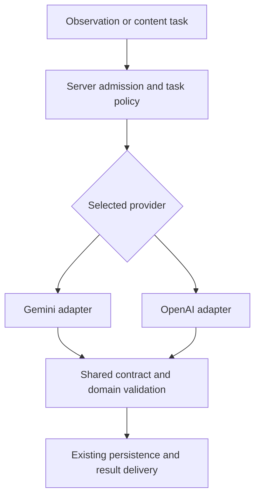

# Naturebook AI Provider Flexibility — SRD

Document ID: NB-SRD-IDENTIFICATION-001\
Version: 0.2\
Date: 2 September 2026\
Status: Active planning draft; proposed system requirements\
Suggested owners: Backend, iOS, and Product\
Product authority:
[Provider Flexibility PRD](../product/03-identification-foundation-prd.md)

## 1. Scope and current implementation

Implement replaceable hosted AI providers for identification and its supporting
content tasks. Gemini is the parity baseline; OpenAI is the first additional
provider to qualify. Keep one primary identification call per observation.
BioCLIP, model training, multi-model cascades, and family plans are deferred.

This revision supersedes the earlier specialist-led foundation design and the
active AI scope of the [combined SRD](./family-plans-and-ai-platform-srd.md).
Names for new modules and records below are proposed. Repository contracts were
reviewed on 2 September 2026, including the current working tree; this is not
production-state or benchmark evidence.

| Existing boundary                                                                                                                                                                                              | Consequence for this plan                                                                                           |
| -------------------------------------------------------------------------------------------------------------------------------------------------------------------------------------------------------------- | ------------------------------------------------------------------------------------------------------------------- |
| [`identify-multimodal`](../../services/supabase/functions/identify-multimodal/README.md) owns the primary flow; `identify`, `identify-describe`, and `audio-spec` are compatibility paths.                     | Include all four routes and their differing input contracts. Description-only identification must remain text-only. |
| [`gemini.ts`](../../services/supabase/functions/_shared/gemini.ts) owns shared Google client setup, while callers still use Google transport and response types.                                               | Isolate provider transport and schema translation; preserve the existing paid-service configuration for Gemini.     |
| [`identify/contract.ts`](../../services/supabase/functions/_shared/identify/contract.ts) already defines provider-neutral model and final response contracts.                                                  | Extend this existing seam; do not introduce another handwritten Identify schema.                                    |
| [`aiQuota.ts`](../../services/supabase/functions/_shared/aiQuota.ts) and database admission allow only specific Gemini models today.                                                                           | Update authoritative admission and its Edge checks together; changing a TypeScript model name is insufficient.      |
| [`biology.ts`](../../services/supabase/functions/_shared/biology.ts), [`groupTagQuota.ts`](../../services/supabase/functions/_shared/groupTagQuota.ts), enrichment, and content workers make additional calls. | Route scoped dependent generation explicitly, with its existing independent admission.                              |
| [AI engineering](../system-architecture/04-ai-engineering.md) and [API contracts](../backend-and-data/05-api-contracts.md) couple current confidence, consent, and some consumers to Gemini.                   | Qualify confidence interpretation and coordinate permissions and consumers before admitting a second provider.      |

Current executable contracts and canonical runbooks remain authoritative until
implementation deliberately changes them. This document activates no route.

## 2. Shared provider boundary

**SRD-PF-01 — Coverage.** Maintain a caller inventory covering the four
identification endpoints, species overview/lookalike generation, group tags, and
related content workers. Record task, evidence, quota operation, permission,
cache, and result consumer for every dispatch. Preserve existing quota-operation
names and their distinction from usage-ledger names.

Deferred Field/Insight, Explore-post, and Dictionary chat and public-audio
moderation retain their current behavior. Shared helper changes must be tested
against these callers. The scoped routing claim excludes their Gemini calls.

**SRD-PF-02 — Adapter ownership.** Add a small shared `_shared/ai/` boundary for
task types, approved variants, execution, and provider adapters. Keep HTTP
admission, taxonomy, domain validation, storage, and finalization with their
existing owners.

Exactly one provider branch executes for each admitted task. Separate enrichment
operations retain their own admission and do not become a second primary
identification.

| Adapter boundary  | Required content                                                                                                                                                                                   |
| ----------------- | -------------------------------------------------------------------------------------------------------------------------------------------------------------------------------------------------- |
| Request           | Task-tagged canonical input, complete owned evidence and lineage, shared output-contract version, and approved instruction profile.                                                                |
| Execution context | Exact admitted variant, policy version, reservation/attempt identity, permission reference, absolute deadline, cancellation, and resource budget.                                                  |
| Outcome           | Task-specific draft plus normalized usage, actual model identity when supplied, and a bounded finish state; or a typed refusal, invalid output, operational failure, or unknown execution outcome. |

Use `identify`, `species_overview`, `lookalikes`, and `group_tags` as conceptual
task contracts. An `identify` draft includes required observed traits, quality,
uncertainty, and explanation. Content tasks return their existing bounded
schemas. Successful generation is not yet a saved observation.

SDK imports, endpoint credentials, media encoding, provider schema dialects,
finish/refusal decoding, and usage parsing belong inside adapters. Google types
and file URIs must not become common interfaces. Reuse existing transport,
timeout, and media guards. Keep the dependency-free Identify contract as the
source; the current `googleSchema.ts` seam remains owned by Gemini integration.

Add syntax-aware import/dispatch checks and intercepted-dispatch tests for the
scope, with an explicit list of deferred callers. A search for the literal
`.generateContent({` alone cannot detect new-provider bypasses.

## 3. Task routing and admission

**SRD-PF-03 — Approved variants.** Register support at the exact task, model,
API endpoint, and evidence-representation level. Each variant declares its
prompt, schema, media and confidence profiles; input/output limits; processing
policy; usage/pricing dimensions; compatible clients; and qualification record.
Pin a concrete model identifier or snapshot where available. A mutable alias
requires recorded returned identity where available and requalification when its
behavior changes; an unreviewed `latest` alias is not a rollout strategy.

Two initial configurations illustrate the required flexibility:

| Task/evidence                              | `gemini_baseline_v1` | `hosted_split_v1` after qualification |
| ------------------------------------------ | -------------------- | ------------------------------------- |
| Still images, with optional description    | Gemini               | OpenAI                                |
| Description only                           | Gemini               | OpenAI                                |
| Species overview, lookalikes, group tags   | Gemini               | OpenAI                                |
| Audio                                      | Gemini               | Gemini                                |
| Video or combined visual/acoustic evidence | Gemini               | Gemini                                |

These are versioned sets of independently configurable bindings. A later version
can change only image identification while retaining the other bindings.
Multiple still images remain one visual observation; text alongside images is
visual context. Video-origin frames remain video evidence even when transported
as images. Mixed evidence uses the full qualified Gemini path initially.

OpenAI documents image inputs and structured outputs; Gemini documents audio and
video understanding. Those API capabilities support evaluating this split, but
do not establish Naturebook quality or make every model eligible.
[OpenAI image inputs](https://developers.openai.com/api/docs/guides/images-vision),
[structured outputs](https://developers.openai.com/api/docs/guides/structured-outputs),
[Gemini audio](https://ai.google.dev/gemini-api/docs/audio),
[Gemini video](https://ai.google.dev/gemini-api/docs/video-understanding).

**SRD-PF-04 — Authoritative selection.** Use a reviewed, versioned route
manifest and synchronize the approved variants with database admission. The
reservation returns the exact admitted variant and policy version; the Edge
registry verifies agreement before dispatch. Missing or mismatched configuration
fails closed. Keep entitlement, provider/model, media preparation, and
confidence interpretation separate.

Select using task, complete evidence, server entitlement, active permission,
client compatibility, configured availability, and budget. Client tier/model
hints do not authorize a route. Preserve the existing subscription, trial,
complimentary-credit, and daily-allowance rules.

Resolve one complete policy snapshot, including dependent content bindings, and
persist its identity with admitted work. New requests may use a newer snapshot;
retries and resumed work cannot silently switch providers. Revocation or a stop
control can still prevent a pending dispatch. New configurations must not
combine partially updated model, prompt, confidence, and permission settings.

Initially, task routing is explicit configuration. There is no automatic
cross-provider retry, speculative duplicate identification, or confidence-based
escalation. Moving future traffic to another qualified variant is separate from
recovering an attempt that may already have executed.

## 4. Permissions and evidence transport

**SRD-PF-05 — Actual processor permission.** Preserve the meaning of existing
`google_gemini` receipts and deny-wins revocation. Introduce the
processor/purpose mapping needed for OpenAI, with corresponding disclosure,
account synchronization, and client behavior. Revalidate before provider upload
and dispatch, including queued work. Keep existing adult/Terms requirements and
account-generation fences.

An older client or account with only Gemini permission uses an eligible Gemini
profile or the compatible consent/unavailability outcome. Inference permission
does not automatically cover offline or live-shadow evaluation. This plan starts
comparisons with eligible evaluation assets; it does not duplicate live user
submissions to another provider by default.

Before any live upload or invocation, require an onboarding record approved by
the responsible privacy/operating owners for the actual provider account,
region, and purpose. Record the applicable processing terms,
regional/subprocessor arrangements, retention/deletion and abuse-log treatment,
and verified production data-handling and billing settings. Missing readiness
blocks the new route even when a user has granted permission. This
provider-specific record is additional to the existing Gemini readiness
evidence.

Credentials stay on the server, and uploaded-file cleanup is an explicit
operating requirement. Retain the canonical
[consent readiness requirements](../legal/production-consent-readiness-2026-08-03.md).

**SRD-PF-06 — Complete, bounded media.** Adapters consume canonical owned media
references. Reuse existing ownership checks, content-type validation, byte
limits, bounded reads, preparation profiles, and timeline metadata. Prepare
provider-specific transport only after admission; never forward a Gemini file
URI to OpenAI or drop unsupported evidence to make a route fit.

Multiple images retain their roles and ordering. Audio/video keep the currently
accepted representation, including video frame and associated-audio lineage.
Transcripts, sampled frames, or spectrograms are not interchangeable with the
original evidence without separate qualification.

Any provider upload uses an allowlisted destination and appropriately scoped,
short-lived access, with durable cleanup/expiry after timeout or worker loss.
Keep large media out of unbounded Edge memory. Recheck deletion and ownership
fences during existing finalization so late responses cannot resurrect deleted
work.

## 5. Results and confidence compatibility

**SRD-PF-07 — Shared result validation.** Translate the canonical task schema
into each provider's supported dialect. Normalize only declared representation
differences, then run shared structural and domain validation. Preserve required
fields, finite numeric bounds, taxonomic resolution, processed-material
handling, and the distinction between biological, unresolved, Human-only, and
non-biological outcomes where applicable.

Handle refusal, truncation, absent output, malformed JSON, and unsupported
schema options explicitly. Schema-constrained generation does not prove an
answer is correct or complete. Missing traits or confidence must not be invented
to fill a response. Provider refusal never triggers another provider to evade
the refusal. Public-audio moderation retains its independent fail-closed
behavior.

The primary model produces the existing identification and explanation together;
this plan adds no mandatory explanation call. Validate the complete final
response after shared enrichment and preserve moderation, media durability, scan
insertion, and owner read-back as the success boundary.

**SRD-PF-08 — Versioned confidence interpretation.** Preserve the current Gemini
scores and Flash/Pro thresholds during P1. OpenAI scores cannot inherit those
thresholds automatically or be presented as calibrated probabilities merely
because they fall between zero and one.

P2 defines a server-owned, versioned confidence interpretation for each admitted
model/task. Evaluate its visible-evidence meaning, confidence bands, ambiguity,
and candidate suppression against independent examples. Preserve the current
rule that location or season cannot raise visual diagnostic confidence. This
work does not introduce a new identification-rank or subject taxonomy.

Store the interpretation with each new result. Define any necessary public or
persisted fields in `_shared/identify/contract.ts`, generate the Swift DTOs, and
update domain, persistence, and presentation mappings together. Product tier
must not stand in for the model or confidence profile.

Cover every read path: live results, queues, replay, historical detail, another
device running an older app, public/community projections, and server/SQL
features that use confidence. Restricting new inference to a newer client alone
does not make later reads by older clients safe. Define and test a legitimate
legacy projection, or block the new route until those consumers are compatible.
Never reinterpret an old observation using today's provider or subscription.

Exact wire fields and any SwiftData migration are P2 design outputs.
New-provider activation is blocked until the complete compatibility decision is
implemented; a permissive optional field is not sufficient evidence.

## 6. Execution, accounting, and dependent content

**SRD-PF-09 — One existing attempt lifecycle.** Extend the current lease and
recovery machinery rather than adding retries inside adapters:

1. Resolve completed/replayable work under its existing owner and logical key.
2. Validate input, consent, entitlement, and route; obtain the authoritative
   lease.
3. Prepare bounded authorized evidence and recheck dispatch eligibility.
4. Record the provider attempt durably and preserve the existing quota
   commitment before provider invocation.
5. Dispatch once, normalize outcome/usage, validate, and perform existing
   durable finalization.
6. Settle the allowance and attempt under the current operation-specific
   failure/refund rules.

Only one attempt may hold the logical reservation lease. Disable hidden SDK
retries in the initial release. A timeout or lost response can mean the provider
executed and billed; record an unknown outcome and follow the existing recovery
protocol rather than calling another vendor. Saved results replay without
inference, and persistence failures are not repaired with a new model call.
Preserve account/deletion fences and existing complimentary-credit behavior.

Use an absolute budget across preparation, provider work, validation, and
finalization. The current live request envelope is 90 seconds and the duplicate
completion wait is bounded at 70 seconds; neither becomes a fresh budget for
each outbound operation. Reserve time for finalization. A new asynchronous job
protocol is outside this migration.

**SRD-PF-10 — Provider-attempt evidence.** Retain `public.ai_usage_events` as
the logical ledger. Add private durable attempt evidence linked to the existing
reservation/operation for provider, exact model, route/prompt/schema versions,
timing, outcome, usage completeness, and effective price version. This is
single-attempt accounting, not a new multi-stage execution engine. Recover
incomplete accounting after worker loss and apply reviewed retention and account
deletion rules.

Normalize provider usage without equating different token or media units.
Cached-input and reasoning counts may be components of other totals; price each
provider's dimensions without double counting. Missing usage or prices remain
unknown. Include failed and uncertain attempts and separately admitted content
work. Join logical events and attempt records by stable linkage rather than
adding both cost estimates. Label historical partial coverage and reconcile
estimates against provider billing.

Operational telemetry contains bounded task/provider/version/outcome fields and
counters, not prompts, response bodies, media URLs or keys, credentials, user
identifiers, or raw coordinates. Private linkage records and public analytics
retain their separate access boundaries.

**SRD-PF-11 — Content and cache policy.** Pass the admitted content policy into
overview, lookalike, and group-tag helpers; do not leave an implicit Gemini
default on an OpenAI-configured operation. Cover both `enrich-scan` and relevant
species-content refresh workers. Preserve each operation's quota and complete
cost attribution.

Cache compatibility includes task, taxonomy identity/version, content contract,
prompt/model compatibility, locale, and permission/owner scope. Existing
verified content may be reused under an explicit compatibility policy; changing
providers does not require bulk regeneration. Invalid or evaluation-only output
cannot populate canonical caches or species records.

Public species-fact jobs use an explicit admitted service policy. Jobs carrying
private observation context retain that account's processor permission and
lifecycle fences. Preserve deferred consumers of shared helpers and keep private
content from entering a cross-user cache.

## 7. Qualification and measurement

**SRD-PF-12 — A reproducible comparison.** P0 creates a bounded evaluation
manifest and report, using assets eligible for the intended provider and
purpose. Labels must be independently verified; existing Gemini answers or user
confirmation alone are not ground truth. Keep related views of one observation
in the same dataset partition. Separate prompt/threshold development from the
held-out comparison and report uncertainty and sample counts.

Cover the intended deployment population, including common and confusable taxa,
blurred/partial/multiple-subject images, unknown and non-biological input,
description-only requests, and multi-view observations. Preserve regression
coverage for audio, Human/wildlife overlap, video, and mixed evidence even while
those routes remain on Gemini. Scope any supported cohort honestly when evidence
is insufficient for broader use.

| Measure                 | Qualification requirement                                                                                                                                                                                                                     |
| ----------------------- | --------------------------------------------------------------------------------------------------------------------------------------------------------------------------------------------------------------------------------------------- |
| Identification quality  | Compare taxonomic correctness at the same accepted/uncertain coverage. Predeclare the allowed degradation margin, confidence bound, minimum sample counts, and important-case thresholds; an inconclusive or underpowered result cannot pass. |
| Confidence and content  | Measure confidently wrong answers and confidence reliability; separately assess required observed traits, explanation grounding, overview facts, lookalikes, and tags. Identification accuracy alone cannot qualify these tasks.              |
| Contract and safety     | Pass required result fields, subject states, all permission/ownership denials, media completeness, and safety/refusal handling.                                                                                                               |
| Latency and reliability | Report end-to-end p50/p95, provider duration, time to first rendered result, timeouts, invalid responses, and recovery outcomes by comparable task/evidence cohort.                                                                           |
| Cost and capacity       | Report complete cost per successful eligible identification, failure spend, dependent generation, usage-coverage gaps, and the selected provider account's rate/capacity limits.                                                              |

Retain the documented non-provider p50 ≤300 ms and p95 ≤1 second, and
response-to-first-render p95 ≤300 ms, while measuring full user-visible latency
separately. These are existing
[timing constraints](../system-architecture/04-ai-engineering.md#benchmark-timing),
not new measurements. Adapter or transfer overhead must not be hidden inside a
renamed provider timer.

Freeze task-specific quality/confidence bounds, a full latency limit,
failure-rate ceiling, cost ceiling, and important-case sample sizes before
confirmatory comparison. A task that fails stays on its qualified Gemini
binding; another passing task can advance independently. There is no assumed
savings target.

## 8. Configuration changes and rollout

**SRD-PF-13 — Controlled activation.** Begin with `gemini_baseline_v1`. Enable
only qualified task bindings with the approved provider-onboarding record and
current permission required by SRD-PF-05. Start with an eligible cohort and
follow the existing
[release and rollout requirements](../backend-and-data/06-supabase-deployment-runbook.md),
using small-cohort, 10%, 50%, and full eligible-traffic stages only while the
predeclared operating limits hold. Record the policy version, model variants,
cohort, comparison evidence, limits, and operating owner for each activation.

Provide per-variant/task stop controls and a tested return path for future
admissions. Verify both provider-to-provider directions. Normal changes leave
already admitted work on its recorded route; revocation/stop controls can
prevent further dispatch, and recovery cannot turn an unknown attempt into a new
vendor call. A return to Gemini still requires current Gemini permission and
compatible contracts. If no route is eligible, return the compatible unavailable
outcome.

Changing a supported, qualified binding can be a reviewed server configuration
change without changing callers. Adding an adapter, new evidence representation,
processor, or public contract still needs the corresponding implementation and
qualification. Model, prompt, schema, media, or confidence-policy changes create
a new configuration to evaluate. This rollout does not reanalyze old scans.

## 9. Work packages and acceptance

| Phase | Main implementation boundary                                                                                        | Reviewable output                                                                                                                  |
| ----- | ------------------------------------------------------------------------------------------------------------------- | ---------------------------------------------------------------------------------------------------------------------------------- |
| P0    | Identification callers and evaluation setup                                                                         | Caller/task inventory, eligible comparison manifest, baseline report, and frozen qualification criteria.                           |
| P1    | `_shared/ai/`, Gemini transport, scoped endpoint/helper calls                                                       | Gemini adapter and shared task contracts with behavior-parity evidence.                                                            |
| P2    | Database admission/attempt records, consent, canonical response contract, affected clients and confidence consumers | Forward migrations, manifest/admission agreement, permission support, old/new result compatibility, and usage/route observability. |
| P3    | OpenAI adapter, provider schema projection, qualified task bindings                                                 | Complete contract tests and a per-task Gemini/OpenAI comparison report with selected exact variants.                               |
| P4    | Server configuration, monitoring, and existing runbooks                                                             | Staged activation record and tested disable/return procedure for eligible traffic.                                                 |

Primary backend ownership stays in existing endpoint orchestrators and shared
modules; avoid a parallel quota, media, or persistence stack. P2 must inventory
all confidence-sensitive SQL, iOS, web/admin, and public consumers before schema
work. Shared helper changes preserve callers outside this migration.

The following acceptance groups trace the PRD to system requirements. Numbers in
the middle columns refer to the `PRD-PF-` and `SRD-PF-` prefixes respectively.

| Group        | PRD        | SRD            | Required evidence                                                                                                                                                           |
| ------------ | ---------- | -------------- | --------------------------------------------------------------------------------------------------------------------------------------------------------------------------- |
| T-ADAPTER    | 01, 02, 03 | 01, 02, 07, 11 | Both adapters implement scoped task contracts; Gemini parity; all endpoint/helper callers; no direct-dispatch bypass; deferred callers remain valid.                        |
| T-ROUTING    | 01, 04, 10 | 03, 04, 13     | Independent task changes, exact variants, admission/manifest agreement, denied client overrides, mismatched/disabled configurations, and both switch directions.            |
| T-MEDIA      | 02, 04, 05 | 05, 06         | Single/multiple photos, text-only, audio, video frames with lineage, mixed evidence, unsupported combinations, bounded uploads, and cleanup.                                |
| T-CONSENT    | 05         | 05, 11         | Provider onboarding and processor/purpose permission, revocation, account switch, queued work, legacy clients, evaluation eligibility, and private/public cache boundaries. |
| T-CONFIDENCE | 02, 06     | 07, 08         | Model-specific interpretation, complete canonical output, generated DTOs, older-device reads, replay/history, candidate behavior, and server/SQL confidence consumers.      |
| T-RECOVERY   | 02, 07     | 09, 13         | Single primary call, quota lifecycle, SDK retry rejection, timeout/unknown outcome, durable completion/replay, deletion races, and stop controls.                           |
| T-USAGE      | 08         | 09, 10         | Successful/failed/unknown attempt coverage, accounting recovery, correct unit pricing, no double counting, and content-free telemetry.                                      |
| T-EVAL       | 08, 09     | 12             | Independently verified held-out comparisons, all per-task quality/confidence criteria, latency, failure and cost budgets, and capacity readiness.                           |

During implementation, use the
[testing strategy](../development-guides/08-testing-strategy.md) and repository
skills for exact commands:

- Edge/database work requires recursive Deno checks, formatting/lint, relevant
  complete tests, tooling and contract gates, forward migration validation, and
  fresh disposable database/catalog/concurrency evidence through Supabase
  Candidate Validation.
- Identify contract changes start in the executable schema, run
  `make generate-edge-dto-contract`, and pass `make validate-edge-dto-contract`;
  generated Swift must not be edited manually. Run the complete compiled iOS
  gate and any affected web/admin gates. Persisted iOS changes require the
  SwiftData migration workflow.
- Markdown changes require `deno fmt` and `make validate-markdown-format`. Edge
  Function/script changes additionally require
  `deno fmt --check services/supabase/functions services/supabase/scripts`.

These are implementation acceptance requirements, not checks claimed to have run
for this planning draft. Production activation remains subject to the existing
consent readiness and explicitly authorized release process.
