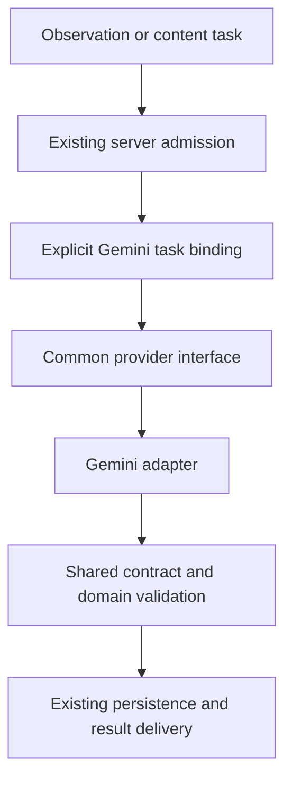

# Naturebook AI Provider Flexibility — SRD

Document ID: NB-SRD-IDENTIFICATION-001\
Version: 0.4\
Date: 10 September 2026\
Status: Active infrastructure plan; Gemini remains the only enabled provider\
Suggested owners: Backend and Product, with iOS contract review\
Product authority:
[Provider Flexibility PRD](../product/03-identification-foundation-prd.md)

## 1. Scope and current implementation

Create the shared interfaces, explicit Gemini task bindings, execution metadata,
and verification needed for a later provider change. **All identification and
scoped content-generation requests remain on their current approved Gemini
models.** An OpenAI or other live-provider integration is future work.

The current milestone preserves prompts, sampling, media encoding, confidence,
permissions, subscription policy, response contracts, and recovery behavior. It
does not require another SDK, vendor credentials, new processor disclosures,
confidence recalibration, or live multi-provider evaluation. BioCLIP, training,
model cascades, and family plans remain deferred.

This revision supersedes the earlier plan to add OpenAI during the initial
milestone. Repository contracts were reviewed on 2 September 2026, with timeout,
service-job admission, and retry semantics rechecked on 10 September 2026. New
module/metadata names below are proposed; this document is not production-state,
benchmark, implementation, or deployment evidence.

| Current boundary                                                                                                                                                                         | Planning consequence                                                                                            |
| ---------------------------------------------------------------------------------------------------------------------------------------------------------------------------------------- | --------------------------------------------------------------------------------------------------------------- |
| [`identify-multimodal`](../../services/supabase/functions/identify-multimodal/README.md), with `identify`, `identify-describe`, and `audio-spec` compatibility routes.                   | Route all scoped calls through the shared boundary while preserving their differing input and result contracts. |
| [`gemini.ts`](../../services/supabase/functions/_shared/gemini.ts) and Google-specific caller transport/types.                                                                           | Move SDK construction, transport, schema conversion, and response decoding behind the Gemini adapter.           |
| [`identify/contract.ts`](../../services/supabase/functions/_shared/identify/contract.ts) and `googleSchema.ts`.                                                                          | Reuse the executable common contract and its existing Google schema seam.                                       |
| [`aiQuota.ts`](../../services/supabase/functions/_shared/aiQuota.ts) and database admission authorize specific Gemini models.                                                            | Keep admission authoritative and the production registry limited to those Gemini models.                        |
| [`biology.ts`](../../services/supabase/functions/_shared/biology.ts), [`groupTagQuota.ts`](../../services/supabase/functions/_shared/groupTagQuota.ts), enrichment, and content workers. | Make dependent task bindings explicit; keep Gemini and existing independent quota/cache behavior.               |
| [AI engineering](../system-architecture/04-ai-engineering.md) and [API contracts](../backend-and-data/05-api-contracts.md).                                                              | Preserve current Gemini confidence, consent, public payload, and durable-result semantics.                      |

### Actual video-capture inference path

The capture limit is five seconds. The preparer requests five image samples; for
a five-second clip, the sampling policy chooses nominal offsets of 0.5, 1.5,
2.5, 3.5, and 4.5 seconds. Existing failed-sample handling can yield fewer
usable frames; the provider refactor must preserve accepted-input behavior.

The pipeline separately prepares a playback video and optionally extracts
companion WAV audio. The identification endpoint builds model input from text,
image parts, and any included audio parts. It does **not** pass the raw playback
video to the model. Its video storage keys serve ownership, persistence, and
playback, not native video inference.

Sources:
[capture limit](../../apps/ios/Merian/Features/Capture/Scan/ViewModels/CaptureWorkspaceViewModel+VideoCapture.swift),
[sampling policy](../../apps/ios/Merian/Features/Capture/Scan/Models/CaptureScanMediaModels.swift),
[media preparation](../../apps/ios/Merian/Features/Capture/Scan/Services/CaptureScanVideoMediaPreparer.swift),
and
[provider input assembly](../../services/supabase/functions/identify-multimodal/index.ts).

## 2. Shared provider boundary

**SRD-PF-01 — Coverage.** Inventory the four identification endpoints, overview
and lookalike generation, group tags, and related content workers. Record each
caller's task, actual inference inputs, quota operation, permission, cache, and
result consumer. Preserve existing quota-operation and usage-ledger names.

Field/Insight, Explore-post, and Dictionary chat migrations and replacement of
public-audio moderation are outside scope. Preserve these consumers when
changing shared helpers. Keep an explicit list of deferred Gemini dispatch
sites.

**SRD-PF-02 — Adapter ownership.** Introduce a small `_shared/ai/` boundary for
canonical task types, the approved registry, execution, and Gemini integration.
Existing orchestrators retain HTTP admission and sequencing. Domain validation,
taxonomy, storage, and finalization remain with their existing owners.

| Interface         | Required content                                                                                                                                                           |
| ----------------- | -------------------------------------------------------------------------------------------------------------------------------------------------------------------------- |
| Request           | Task-tagged canonical input; actual image/audio/text evidence; source lineage and order; output-contract and instruction references.                                       |
| Execution context | Typed user-request or service-job authority; admitted Gemini model and attempt configuration snapshot; applicable timing, cancellation, and budget limits. See section 6.  |
| Outcome           | A task-specific draft and normalized usage/model/timing facts, or a bounded refusal, invalid output, operational failure, unsupported-input, or unknown-execution outcome. |

Use `identify`, `species_overview`, `lookalikes`, and `group_tags` as conceptual
task contracts. An Identify draft already includes required observed details,
confidence, and explanation. Content tasks retain their existing bounded output
schemas. Provider success is not yet a durable user result.

SDK imports, credentials, request/response types, schema dialect conversion,
media encoding, refusal handling, and usage parsing belong inside the Gemini
adapter. The common contract must not require Google SDK types or Google file
URIs. Preserve the current paid-service client setup and generation options.
Reuse existing transport, timeout, media, and validation helpers.

Check scoped imports and actual dispatch, with a bounded allowlist for deferred
callers. Exercise the interface using a deterministic, network-free test adapter
in the test suite. Do not bundle or register that adapter as a production route,
add a live alternative-provider SDK, or accept arbitrary endpoint/provider names
from clients or environment overrides.

## 3. Gemini-only routing and authoritative admission

**SRD-PF-03 — Registry and capabilities.** Declare task support, actual input
representations, limits, prompt/schema references, media preparation, existing
confidence interpretation, permission policy, and usage mapping for each enabled
Gemini variant. Model identity remains distinct from product entitlement.

The sole enabled configuration is `gemini_baseline_v1`. It represents the
current model choices; it does not change Free/Pro behavior or introduce a model
upgrade.

| Task or input representation                        | Enabled provider | Capability to check                                                                                |
| --------------------------------------------------- | ---------------- | -------------------------------------------------------------------------------------------------- |
| Still images with optional text                     | Gemini           | The accepted single/multiple-image and context contract.                                           |
| Ordered snapshots from a short video, without audio | Gemini           | Multiple images with clip/frame order and source context. Native video-file input is not required. |
| Description only                                    | Gemini           | Text identification and its existing schema variant.                                               |
| Audio only                                          | Gemini           | Accepted audio input and its subject policy.                                                       |
| Images/snapshots with included audio                | Gemini           | The complete combined image/audio/text representation.                                             |
| Overview, lookalikes, group tags                    | Gemini           | Existing task-specific content schemas and inputs.                                                 |

Distinguish **capture origin** from **model input capability**. A `video_frame`
source label preserves provenance and the current video-aware wording; it does
not imply that an adapter must accept a video file. Conversely, a provider that
accepts images alone cannot handle included companion audio by silently dropping
it. This distinction is part of the interface now and future qualification
later.

**SRD-PF-04 — Preserve admission authority.** For user-quota operations, the
database continues to admit the operation and exact allowed Gemini model. Public
service jobs use their authenticated service purpose, claimed task, and fixed
server-approved Gemini model. Resolve each task binding against its existing
admission authority; the registry must not override it. Verify model, operation,
evidence, and policy agreement before sending data. Unknown providers,
unsupported inputs, or configuration mismatches produce the existing compatible
error path before provider dispatch and commitment to unavailable work.

Do not widen the database model allowlist for a hypothetical second provider. A
future integration must extend database admission and Edge validation together.
Current client model/tier hints remain non-authoritative.

Resolve the exact model and prompt/schema/binding references once for each
admitted attempt. Keep that snapshot fixed while the attempt runs; a
configuration refresh does not change an active call. Continue to enforce
current permission and stop controls before disclosure. Each separately admitted
dependent task resolves its own binding.

A logical observation or job ID does not permanently pin later attempts. After
existing failure/expiry and ownership checks authorize a new attempt, admit it
under the current approved policy and take a new snapshot. This preserves the
quota retry path's current model/policy selection. An unknown outcome or changed
configuration alone cannot authorize another provider call; first reconcile
durable status under the existing recovery rules. Replay completed work from its
saved result without inference.

Use the current reservation/attempt or claimed-job identity to distinguish
attempts. This phase does not add provider-call resumption across process
restarts or require a database migration solely to pin configuration across
retries. Recovery retains the existing completion lookup and re-admission rules.

This is an explicit, Gemini-only dispatch policy. It adds no automatic failover,
confidence-based escalation, parallel identification, or authority for a test
adapter to process a production request.

## 4. Permissions and evidence transport

**SRD-PF-05 — Preserve current permission.** For owner-scoped work, keep the
`google_gemini` receipt meaning, deny-wins revocation, adult/Terms
prerequisites, account synchronization, and generation fences. Check the active
account's permission before provider upload/invocation, including queued work
and resumed attempts.

Represent the required processor/purpose as an explicit execution dependency,
currently bound only to the existing Gemini policy. Do not rename old receipts,
add an OpenAI permission, or introduce a new consent screen in this milestone. A
later recipient requires its own onboarding and permission work in section 8.
Credentials remain server-side and the canonical
[consent readiness requirements](../legal/production-consent-readiness-2026-08-03.md)
remain applicable to the Gemini-backed infrastructure release.

**SRD-PF-06 — Preserve actual media.** Pass owned, validated image/audio/text
inputs and their existing descriptors to the adapter. Keep byte/count bounds,
content types, staged ownership, ordered frames, clip membership, and
`video_audio` relationships. Preserve Gemini's currently prepared input bytes,
image resolution, and prompts; this refactor does not change capture sampling.

For the normal five-second capture, the five snapshots are one observation and
one primary inference request. Preserve the actual accepted frame count and
existing failure handling; do not reject a previously accepted partial sample or
fabricate a missing image. Do not add raw-video inference uploads or forward
playback/storage keys as model evidence.

Retain any included companion audio and the existing combined-input policy. When
audio is absent, the input is a sequence of images, not a native video payload.
Preserve optional extraction failure behavior and existing distinctions between
inference-only companion media and durable display media.

Keep bounded reads, allowlisted transport destinations, temporary-file cleanup,
and finalization ownership/deletion fences. The stored playback video still
needs its existing durability checks even though it is not sent to Gemini.

## 5. Results and confidence

**SRD-PF-07 — Preserve result validation.** Generate Gemini's schema from the
existing executable task contract, normalize through the existing rules, and
retain structural and domain validation before persistence and response.
Preserve required fields, numeric bounds, taxonomy, processed-material handling,
and the existing biological/unresolved/Human/non-biological distinctions.

Keep refusal, invalid or truncated output, and unknown execution distinct. Never
invent missing fields or retry through another provider to overcome a refusal.
Public-audio moderation stays independent and fail-closed. The primary Identify
call continues to include explanation and observed details; no new mandatory
model call is added.

The existing moderation, media durability, primary-species resolution, scan
insertion, and owner read-back remain the success boundary.

**SRD-PF-08 — Preserve confidence and client compatibility.** Give the existing
Gemini interpretation an explicit internal reference without changing scores,
Flash/Pro bands, candidate suppression, visual-confidence meaning, or the rule
that location and season cannot increase visual diagnostic confidence.

Keep public payloads, generated DTOs, persisted client models, historical reads,
review behavior, and confidence-sensitive SQL/server consumers compatible. This
phase does not recalibrate scores, add public decision fields, redesign ranks,
or require a SwiftData migration. Record affected consumers in the inventory so
a later model change has a known compatibility boundary.

A future provider's numeric scores must not automatically inherit Gemini bands.
Any needed new confidence interpretation, persisted provenance, legacy
projection, or client migration is a prerequisite for that later provider's
activation, not a current implementation package.

## 6. Execution, accounting, and dependent content

**SRD-PF-09 — Existing attempt lifecycle.** Use two explicit execution-context
variants. The owning orchestrator validates authority and retains admission,
claim, and settlement responsibilities; both variants use the same adapter.

| Context        | Admission and authority                                                                                                                                                   | Limits and settlement                                                                                                                                             |
| -------------- | ------------------------------------------------------------------------------------------------------------------------------------------------------------------------- | ----------------------------------------------------------------------------------------------------------------------------------------------------------------- |
| `user_request` | Validated owner, current Gemini permission, and operation-specific entitlement/model decision; existing reservation and attempt ownership where that operation uses them. | Preserve that operation's allowance, commitment, failure/refund, and usage rules.                                                                                 |
| `service_job`  | Authenticated service caller, valid durable job claim and attempt ownership, approved public species-content task, and fixed server-approved Gemini binding.              | Preserve existing batch, concurrency, timeout, retry, and processing limits; settle the claimed job and record service usage without consuming user scan credits. |

The variants describe admission authority, not whether work runs in the
foreground or background. The service variant requires no user quota reservation
or user consent receipt and is restricted to eligible public species-fact
inputs. A worker processing private observation data uses the owner-scoped
context, retaining the owner's permission and lifecycle checks plus applicable
job-claim controls. Service authentication does not grant permission to disclose
that data. Reuse existing worker controls and accounting rather than adding a
separate service quota system.

For quota-backed user requests, preserve the established order:

1. Resolve existing completed/replayable work under its owner and logical key.
2. Validate input, current consent, entitlement, and the admitted Gemini
   binding.
3. Prepare bounded evidence and recheck dispatch eligibility.
4. Preserve current quota commitment and attempt ownership before invoking
   Gemini.
5. Invoke once, validate the draft, and execute existing durable finalization.
6. Settle the allowance under current operation-specific failure/refund rules.

Only one attempt may own the logical reservation lease. Service jobs retain
their current claim ownership and completion/failure rules. The adapter must not
introduce SDK retries or another primary call. Lost responses may still have
executed and incurred cost; preserve unknown-outcome recovery rather than
redispatching blindly. Replay saved results without inference and preserve
account/deletion and complimentary-credit fences.

Preserve the separate timing boundaries and the point where each timer starts:

| Boundary                               | Existing limit                               | Required behavior                                                                                                |
| -------------------------------------- | -------------------------------------------- | ---------------------------------------------------------------------------------------------------------------- |
| Queue-backed client foreground request | 15 seconds, on the foreground request        | Preserve handoff to durable queue recovery and suppression of competing identification.                          |
| Direct, queue-less client request      | 90 seconds, on the direct request            | Preserve its current transport and recovery behavior.                                                            |
| Gemini HTTP call                       | 90 seconds, at provider invocation           | Keep the existing provider-call timeout and retry policy.                                                        |
| Duplicate-result polling               | 70-second polling window, from polling start | Read existing completion; retain bounded database reads and polling intervals without issuing another inference. |

These are independent limits, not a shared 90-second server deadline. Preserve
the existing bounded preparation, database, and finalization operations. A
client timeout alone must not cancel required backend finalization or authorize
a new provider attempt; durable recovery and existing ownership, cancellation,
and deletion fences continue to apply.

Sources:
[client request limits](../../apps/ios/Merian/Core/Network/Endpoints/MerianNetworkClient+Inference.swift),
[Gemini HTTP timeout](../../services/supabase/functions/_shared/gemini.ts), and
[completion polling](../../services/supabase/functions/_shared/identify/completedResponse.ts).

**SRD-PF-10 — Common execution facts.** Normalize Gemini's returned model,
usage, timing, and bounded outcome into the shared result. Associate them with
the admitted task, model, binding/policy version captured for that attempt, and
execution-context kind. Keep existing reservation/attempt linkage for user-quota
work and claimed-job linkage for service work within their private boundaries.
Retain `public.ai_usage_events` and its known historical/best-effort coverage.
Missing usage or prices remain unknown, not zero.

Reuse existing durable reservation, finalization, and accounting paths. Add only
internal metadata that those paths actually lack; any necessary persistence
change must be additive, scoped, and tested with the prior Gemini-backed code. A
new multi-provider billing database or execution engine is not required for this
milestone. Document accounting gaps for failed/uncertain attempts instead of
claiming complete cost coverage.

Expose prompt/schema/binding references from the active snapshot through the
existing bounded execution/accounting interfaces. Do not require durable
cross-retry configuration pinning or infer missing versions for historical
events. Service usage retains existing ledger operation names and owner-null
semantics; it must not create a user allowance charge.

Preserve Gemini's unit/pricing interpretation and avoid double counting cached
input, reasoning components, or linked logical events. Account for sampled-image
and any audio work actually sent; the existence of a saved playback clip does
not mean the provider processed a native video file. New providers' usage and
pricing dimensions are added with their later adapters.

Telemetry stays content-free: bounded task/model/version/outcome fields and
counts, without prompts, response bodies, media URLs/keys, user identifiers,
credentials, or raw coordinates. Private linkage keeps its existing access and
retention boundaries.

**SRD-PF-11 — Explicit Gemini content bindings.** Move scoped overview,
lookalike, and group-tag model construction behind task execution, including
`enrich-scan` and related content refresh workers. Every binding remains Gemini.
Preserve current operation admission, prompts, model choices, caches, and usage
attribution; introducing the shared helper cannot merge separate quota
lifecycles.

Public species-fact work retains its admitted service purpose. Private-context
work retains the owner's Gemini permission and lifecycle fences. Keep cache
ownership and canonical species identities unchanged; test-only output cannot
populate shared caches or records. Document cache compatibility as a future
provider-change dependency, without regenerating existing content now.

## 7. Verification and future qualification

**SRD-PF-12 — Prove the current boundary.** Use existing sanitized fixtures and
focused contract tests to compare requests, settings, outputs, and side effects
before and after Gemini extraction. Include still images, descriptions, audio,
five ordered clip snapshots, accepted partial sampling, frames with and without
companion audio, multiple sources, and queued/replayed submissions.

Verify permission denial, model/policy mismatch, unsupported-provider rejection,
refusal/invalid output, quota settlement, unknown outcomes, deletion races,
durable completion, and dependent content dispatch. Show that caller logic can
use a deterministic test adapter with no network access, while production
admission rejects it. This proves interface substitution only; a real second
provider's API compatibility and quality remain unproven.

Include focused acceptance cases for the clarified execution boundaries:

- The foreground window expires while admitted backend work finalizes; queue
  recovery and duplicate polling return the saved result without a competing
  primary call. Direct-request, Gemini-call, and polling timers retain their
  independent start points and limits.
- Public content jobs require service authorization and valid claim ownership,
  record service usage, and leave user scan allowances unchanged. Invalid claims
  fail before dispatch. The service-only context rejects private observation
  inputs; owner-scoped jobs must pass the owner's permission and lifecycle
  checks.
- A configuration change leaves an active attempt's snapshot unchanged. A new
  attempt authorized by existing recovery/admission rules uses the current
  approved policy, including a changed allowed Gemini model where applicable.
  Neither an active/unknown result nor a configuration change alone allows
  redispatch; completed-result replay performs no inference.

Baseline existing timing/call-count/cost coverage and measure introduced
overhead. Retain the documented non-provider p50 ≤300 ms and p95 ≤1 second and
response-to-first-render p95 ≤300 ms, plus existing full-flow reliability gates.
The
[timing contract](../system-architecture/04-ai-engineering.md#benchmark-timing)
remains authoritative; these are documented limits, not new measurements.

Do not make a new biological benchmark, alternate-model calibration study, or
live cross-provider trial a gate for this Gemini-preserving infrastructure.
Those become necessary before a real candidate is enabled: use eligible,
independently verified examples, held-out evaluation, comparable
accepted/unknown coverage, and predeclared quality, confidence, safety, latency,
failure, and cost limits. Qualify sampled-frame identification as such;
native-video benchmarks cannot substitute for the actual input path.

## 8. Infrastructure release and later provider changes

**SRD-PF-13 — Separate current release from future activation.** Current
production configuration contains only approved Gemini variants. Release the
refactor through the existing
[deployment runbook](../backend-and-data/06-supabase-deployment-runbook.md) and
consent readiness controls. Verify parity and the return to the prior
Gemini-backed implementation/configuration; any internal metadata additions must
remain compatible with that return path. Production release still requires its
existing explicit authorization.

Keep the following procedure as a future implementation checklist, not an active
OpenAI work package:

1. Implement the chosen provider adapter for exact task/model/API variants and
   the real accepted evidence. An images-only adapter may qualify for snapshots
   without audio; it cannot silently drop audio from a combined observation.
2. Extend authoritative database admission and the Edge registry together. Add
   provider credentials, transport/cleanup, usage/pricing normalization, and
   supported input limits. Do not rely on a configuration string alone.
3. Before live disclosure, record approved processing terms, region/subprocessor
   arrangements, retention/deletion and abuse-log treatment, production account
   settings, and actual processor/purpose permission. Existing Gemini consent
   and readiness evidence do not authorize the new recipient.
4. Complete model-specific confidence interpretation and every affected
   consumer: live/queued results, history, older-device reads, public/community
   projections, confidence-sensitive SQL, caches, and replay. If needed, change
   the canonical schema, regenerate DTOs, and perform explicit
   client/persistence migration.
5. Qualify complete task results on eligible independent data, including actual
   snapshot and audio combinations. Freeze acceptance limits before comparison;
   incomplete evidence does not count as a pass.
6. Activate selected qualified bindings gradually for eligible traffic and
   verify a return to an eligible Gemini route. Other tasks may remain on
   Gemini. Pin each admitted attempt and saved-result interpretation; no
   automatic cross-provider retry follows an unknown attempt or refusal.

Compatible switches between providers that have completed these steps can be
reviewed server configuration changes. This phase delivers the boundary and the
procedure; it does not claim that a second provider can already be activated.

## 9. Work packages and acceptance

| Phase | Main boundary                                                  | Reviewable output                                                                                                                            |
| ----- | -------------------------------------------------------------- | -------------------------------------------------------------------------------------------------------------------------------------------- |
| P0    | Current callers, media, admission, results, and measurement    | Scoped inventory and Gemini behavior/input baseline, including playback versus sampled inference media.                                      |
| P1    | Shared task types, Gemini adapter, scoped call sites           | Provider-neutral caller interfaces and preserved Gemini requests/results.                                                                    |
| P2    | Gemini registry, admission checks, internal execution metadata | Gemini-only bindings with explicit user/service admission, fixed attempt snapshots, preserved retry policy, and scoped execution facts.      |
| P3    | Tests and future-provider procedure                            | Gemini parity, production rejection of test/unknown providers, deterministic interface substitution, and documented later integration gates. |
| P4    | Existing infrastructure release process                        | Controlled Gemini-backed rollout and verified return to the previous implementation/configuration.                                           |

The acceptance groups below cover current requirements. Numbers refer to the
`PRD-PF-` and `SRD-PF-` prefixes. Future-provider qualification is a documented
condition, not a live integration that must run to close this milestone.

| Group        | PRD        | SRD            | Current acceptance evidence                                                                                                                                                               |
| ------------ | ---------- | -------------- | ----------------------------------------------------------------------------------------------------------------------------------------------------------------------------------------- |
| T-ADAPTER    | 01, 02, 03 | 01, 02, 07, 11 | Gemini parity; scoped endpoint/helper coverage; common task contracts; no new bypasses; deferred callers preserved.                                                                       |
| T-ROUTING    | 01, 04, 10 | 03, 04, 13     | Every production binding remains Gemini; exact user/service admission agreement; active snapshot stability; current policy on authorized new attempts; invalid-provider rejection.        |
| T-MEDIA      | 02, 04, 05 | 03, 05, 06     | Ordered five-snapshot and accepted partial inputs; included/absent companion audio; origin versus capability; no raw-video model input; playback durability preserved.                    |
| T-CONSENT    | 05         | 05, 09, 11     | Current Gemini consent, revocation, account switch, queue/replay, authenticated service claims, and rejection of private-data permission bypasses.                                        |
| T-CONFIDENCE | 02, 06     | 07, 08         | Existing Gemini scores/bands/candidates, payloads, history, and server/SQL interpretations remain compatible.                                                                             |
| T-RECOVERY   | 02, 07     | 04, 09, 13     | Independent timeout boundaries; foreground handoff with backend completion; no competing primary call; current quota/retry rules; durable replay, deletion fences, and compatible return. |
| T-USAGE      | 08         | 09, 10         | Correct user/service usage mapping and linkage; no user scan charge for public service work; explicit coverage gaps, bounded timing facts, and content-free telemetry.                    |
| T-EXTENSION  | 09, 10     | 02, 12, 13     | Network-free test adapter exercises callers but cannot reach production; the future integration, permission, qualification, and switching procedure is complete.                          |

Follow the [testing strategy](../development-guides/08-testing-strategy.md) and
repository skills for implementation gates:

- Edge work requires recursive Deno checks, formatting/lint, the complete
  affected tests, tooling, and contract checks. Any database metadata change
  uses a forward migration and fresh disposable database/catalog/concurrency
  validation through Supabase Candidate Validation.
- Public/SwiftData changes are not planned. If a concrete current need changes
  that scope, first update the canonical schema and compatibility plan,
  regenerate DTOs, and run the complete affected client gates; do not hand-edit
  generated Swift. Review existing consumers even when the wire shape stays the
  same.
- Markdown requires `deno fmt` and `make validate-markdown-format`. Changes
  under Edge Functions/scripts additionally require
  `deno fmt --check services/supabase/functions services/supabase/scripts`.

These are future implementation requirements, not runtime checks claimed for
this planning-only revision. The
[earlier combined SRD](./family-plans-and-ai-platform-srd.md) remains deferred
background.
