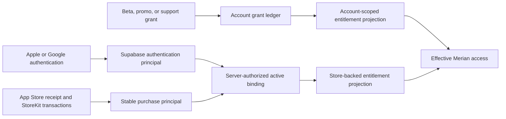

# Purchase Principal and Authentication Identity Separation

Status: Accepted target architecture; compatibility hardening implemented,
provider cutover not implemented  
Decision date: 2026-08-12

## Decision

Naturebook will separate the identity that authenticates an app session from
the identity that owns App Store purchase history.

- A Supabase user is an **authentication principal**. Explicit **Sign out** may
  replace it with one fresh anonymous Supabase user.
- A RevenueCat customer used for StoreKit purchases becomes a **purchase
  principal**. It is stable across ordinary authentication sign-in and sign-out
  on the same installation and is never selected from a caller-supplied user ID.
- Promotional, beta, and support-issued access is **account-scoped**. Its
  authority moves to a Supabase-owned grant ledger and does not follow a
  purchase principal to a signed-out or different account session.

The current custom-ID sign-out handoff remains a compatibility protocol until
that separation is deployed. It is fail-closed and release-gated; it is not the
long-term identity model.

Naturebook will not replace the compatibility protocol with a direct RevenueCat
V2 transfer during sign-out. The V2 transfer action can filter by app, but not by
product or purchase provenance, while RevenueCat represents promotional grants
in subscription history. It also documents no request idempotency key. A mixed
StoreKit-plus-promotion customer therefore cannot be transferred while
preserving the product rule that the promotion stays with the linked account,
and an ambiguous network result cannot be retried blindly.

## User-facing contract

The product uses **Sign out**, **Continue with Apple**, and **Continue with
Google**. Anonymous app use is presented as signed out; the internal legacy term
“Ghost” is never user-facing.

Signing out must not:

- delete or merge the linked account;
- silently lose active App Store access;
- clone an account-issued promotion;
- create more than one replacement Supabase identity; or
- report success while purchase continuity is unresolved.

## Target boundaries

The server owns the binding between the current authentication principal and a
purchase principal. A client may present a device-held capability, but it may
not nominate either UUID. Bindings are purpose-bound, short-lived where they
authorize a transition, replay-safe for one exact destination, and revocable.

RevenueCat webhooks and reconciliation resolve the purchase principal through
that private binding before projecting StoreKit access. They do not infer a
Supabase user from a RevenueCat App User ID string. Account-grant projection is
separate, so a promotion can remain attached to the linked account even while
StoreKit access remains usable by the signed-out installation.

## External mutation state machine

Any migration that changes a RevenueCat customer must reserve the operation in
the database before network I/O. The durable operation records a source,
destination, purpose, attempt lease, and one of `prepared`, `in_flight`,
`outcome_unknown`, `succeeded`, or `failed_terminal`. Provider calls occur
outside database transactions.

After a timeout or lost response, a worker reconciles authoritative source and
destination provider state before deciding whether another mutation is safe.
It never assumes a failed HTTP response means the provider made no change and
never blindly replays a non-idempotent transfer. Logs and aggregate monitors
contain operation counts and ages, not customer identities or provider bodies.

## Migration sequence

1. **Compatibility safety (implemented in source).** The sign-out proof is
   persisted before local sign-out. The fresh anonymous destination binds before
   RevenueCat linking or receipt synchronization. Pending proof state blocks
   purchase mutations and auth-session rotation. Once bound, it also blocks
   deletion, anonymous-shell cleanup, and profile merge for the protected
   identities. A deletion that wins before binding prevents the provider
   mutation instead of stranding a device-lost proof. The same bound destination
   remains retryable across relaunch and pre-bind expiry. Completion persists
   immutable provider-attested destination StoreKit state; if a prepared finite
   horizon expires first, current source state distinguishes natural expiry
   from a renewal that has not reached the destination.
2. **Account-grant authority.** Introduce a private, audited Supabase ledger for
   promotions and migrate active grants with dual-read comparison. Stop issuing
   new account promotions through RevenueCat only after projections agree.
3. **Purchase-principal introduction.** Create server-issued stable purchase
   principals and private active bindings. New installations adopt them without
   changing authentication UUIDs. Existing customers remain on the compatibility
   path until their provider state can be migrated without mixing grants.
4. **Provider migration.** Use a durable reservation/reconciliation worker for
   any required provider mutation. A controlled RevenueCat sandbox fixture must
   prove active subscription, lifetime/non-renewing purchase, pass, promo-only,
   mixed promo-plus-StoreKit, timeout, duplicate request, refund, and renewal
   cases before rollout.
5. **Cutover and removal.** Webhooks, reconciliation, purchase admission, and
   cross-device restore read the purchase-principal binding. Remove sign-out
   customer transfer and the compatibility handoff only after old-client and
   rollback windows close.

## Cross-device and account switching policy

A signed-in account receives its account grants on every device. Store-backed
access follows a verified purchase principal or an explicit App Store restore;
authentication alone does not claim an unrelated device's purchase history.
Signing into a different account does not move account grants. Shared-device
sign-out retains only store-backed access authorized for that installation and
must revoke the previous active binding when product policy requires a single
destination.

## Release gates

The target architecture is not considered implemented by this RFC. Release
requires executable schema/API contracts, disposable-database concurrency and
ACL tests, iOS kill/relaunch tests, webhook/reconciliation race tests, and a
controlled provider fixture. Production Supabase, RevenueCat, TestFlight, or App
Store changes remain separately approved operations.
