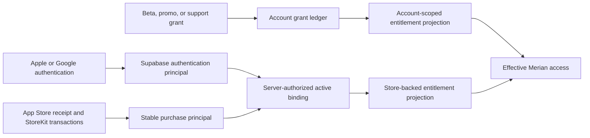

# Purchase Principal and Authentication Identity Separation

Status: Accepted; additive implementation prepared in source, rollout defaults
to legacy/dual-read, production cutover not authorized or performed

Decision date: 2026-08-12

## Decision

Naturebook will separate the identity that authenticates an app session from the
identity that owns App Store purchase history.

- A Supabase user is an **authentication principal**. Explicit **Sign out** may
  replace it with one fresh anonymous Supabase user.
- A RevenueCat customer used for StoreKit purchases becomes a **purchase
  principal**. It is stable across ordinary authentication sign-in and sign-out
  on the same installation and is never selected from a caller-supplied user ID.
- Promotional, beta, and support-issued access is **account-scoped**. Its
  authority moves to a Supabase-owned grant ledger and does not follow a
  purchase principal to a signed-out or different account session.

The current custom-ID sign-out handoff remains a compatibility protocol until
that separation is deployed. It is fail-closed and release-gated; it is not the
long-term identity model.

Naturebook will not replace the compatibility protocol with a direct RevenueCat
V2 transfer during sign-out. The V2 transfer action can filter by app, but not
by product or purchase provenance, while RevenueCat represents promotional
grants in subscription history. It also documents no request idempotency key. A
mixed StoreKit-plus-promotion customer therefore cannot be transferred while
preserving the product rule that the promotion stays with the linked account,
and an ambiguous network result cannot be retried blindly.

## User-facing contract

The product uses **Sign out**, **Continue with Apple**, and **Continue with
Google**. Anonymous app use is presented as signed out; the internal legacy term
“Ghost” and implementation language such as “guest session” are never
user-facing.

Signing out must not:

- delete or merge the linked account;
- silently lose active App Store access;
- clone an account-issued promotion;
- create more than one replacement Supabase identity; or
- report success while purchase continuity is unresolved.

## Target boundaries

The server owns the binding between the current authentication principal and a
purchase principal. A client may present a device-held capability, but it may
not nominate either UUID. Bindings are purpose-bound, short-lived where they
authorize a transition, replay-safe for one exact destination, and revocable.

Every database path that can move, detach, or project a stable principal locks
all related principals in UUID order before Auth/public user rows. This includes
Apple/Google profile merge and account deletion as well as resolver completion,
webhooks, and reconciliation; no transition may introduce the inverse lock
order.

The additive implementation introduces a JWT-authenticated
`/resolve-purchase-principal` route. The client submits only a device-held
256-bit installation capability; Edge stores only its SHA-256 digest and returns
a server-owned principal ID, immutable RevenueCat App User ID, and binding
generation. Existing customers are adopted in place when their canonical custom
ID is unclaimed. A collision receives an opaque `MERIAN_PP_…` identity and
requires explicit App Store restore rather than an unsafe customer claim.

Private binding and webhook evidence retains no provider body or capability.
Account deletion nulls its Auth UUID references while keeping non-identifying
transition and delivery evidence for operations.

Every ordinary resolver request also carries a positive device-persisted
binding- intent generation that iOS advances and verifies before network I/O.
The server accepts only a newer intent and requires completion to match it. This
is the ordering authority across delayed HTTP execution: an old Auth request
cannot become the final binding merely because it completes last. Stable
sign-out uses its separate rotation UUID, one-use secret, expected binding
generation, and a server-captured fence over every resolver intent issued before
preparation.

iOS also has one generation-bound `AuthTransitionCoordinator` for Apple, Google,
Sign out, recovery, credential revocation, and account deletion. The value-state
owner and deterministic `AuthTransitionPolicy` live under `Core/Network/Auth/`;
`SupabaseManager` stores and advances the coordinator, applies the policy, and
retains provider, SDK-session, purchase-identity, recovery, and deletion
effects. The owner token records the source session and expected destination.
Competing controls are disabled, stale provider/controller callbacks are
discarded, and the extracted listener/request fence prevents Auth-listener side
effects from overtaking the operation that owns the SDK. Every account-bound
metadata, RevenueCat, entitlement, and routing write revalidates that token and
the live session after its last suspension point. Ordinary direct Supabase and
HTTP work additionally holds an exact-session lease. Transition admission closes
before the drain begins; the owner cancels and awaits consent synchronization,
waits for all admitted leases and collection work, and changes the SDK session
only after that boundary is empty. 401 recovery runs only after the failed
request releases its lease. Realtime channels stop while a transition is active
and restart only for the verified final account. Inference requests bind their
body, JWT, and expected Auth UUID in one typed value, and background dispatch
holds the exact-session lease through task resume. Offline media signing and
upload dispatch use the same captured UUID, reject a returned object key for any
other canonical owner, and hold the lease through task resume. Anonymous session
restore/creation is a coordinator-owned transition, not a parallel bootstrap
exception.

RevenueCat webhooks and reconciliation first resolve the private stable mapping
and only then use legacy UUID fallback. StoreKit state, legacy provider state,
and account grants are separate inputs to one effective projection. Stable
StoreKit state includes a durable signed-event policy for detached non-renewing
pass history: first adoption requires an exact locked Supabase expiry match,
purchase evidence may enable it directly, and transfer destinations may inherit
it only from a resolved stable source with an enabled durable policy after an
active App Store pass appears in the destination snapshot. Destination history
alone cannot enable it; revocation/source evidence disables it, and unrelated
webhook or scheduled CustomerInfo reads preserve it. This prevents RevenueCat's
retained refunded transaction history from recreating access. Provider
`TRANSFER` observations mutate StoreKit state only; promotional state on either
side is audited but cannot move or revoke an account-owned grant; both stable
sides are durably fenced from later dual-read promotion import. Stable customers
receive no new account PII or Auth UUID attributes, and first adoption clears
legacy account attributes before paid readiness. Apple/Google continuation uses
monotonic ordinary resolution. Same-install stable sign-out uses a protocol-3
server reservation instead: the exact linked permanent source prepares a one-use
secret hash and expected binding generation with `prepare_signout_rotation`
before local Auth sign-out; only a different anonymous identity created no
earlier than that reservation may atomically invoke `claim_signout_rotation`.
While prepared, generic resolver intent and binding writes are rejected. Exact
same-destination replay returns the completed receipt, the restored source may
invoke `cancel_signout_rotation`, and every unrelated permanent session fails
closed. Raw proof material remains device-only, terminal rows scrub Auth
references on deletion, and none of these operations performs receipt
synchronization or customer transfer. Every Auth-user, binding-generation,
account-kind, or provider-ID change closes local subscription state and
account-grant eligibility before the asynchronous rebind starts, even when the
stable provider ID itself is unchanged. Local paid readiness also requires
RevenueCat CustomerInfo whose entitlement verification result is `verified` or
`verifiedOnDevice`. An unverified or failed verification closes local paid
state; neither cached UI nor an Auth transition may promote it. The client also
verifies store provenance for every active product: Release builds accept exact
Apple App Store provenance and reserve Test Store for explicit Debug testing.
Stable mode rejects promotional, Mac App Store, Play Store, Stripe, RevenueCat
Billing, External, Paddle, Amazon, Galaxy, missing, and unknown stores for
`pro_annual`, entitlement rows, and detached pass access even if RevenueCat
lists the identifier as active. Account-owned promotions enter only through the
server grant projection, except for the bounded dual-read compatibility lane
that admits explicit promotional provenance only for the recorded account-grant
owner. The global legacy switch is an adoption brake, not an identity rollback:
already active capabilities keep resolving and rebinding their exact stable
principal. A client below the minimum protocol fails closed when resolving an
already active stable principal instead of being redirected to an Auth-UUID
RevenueCat customer. Before activation, unsupported clients remain on the legacy
compatibility lane and cannot adopt a stable principal. The iOS client records
only a monotonic fingerprint of the capability after first stable activation—not
the provider ID as authority. Thereafter a missing resolver route or explicit
legacy response fails closed, preventing an operational rollback from becoming a
customer-identity downgrade.

The client persists and read-verifies a `preparing` journal containing the
rotation UUID and raw proof before the source-authenticated prepare call, then
persists and read-verifies the returned `prepared` expiry before local sign-out.
It clears that journal only after an exact fresh-anonymous claim, unchanged
RevenueCat identity readiness, a successful current-session entitlement read,
and Auth-generation revalidation, or after the exact restored source receives a
terminal cancellation receipt. Unrelated permanent sessions, old anonymous
sessions, expiry, malformed or unreadable secure storage, and provider or
entitlement failure remain closed and never fall back to ordinary resolution.

## External mutation state machine

Any future migration that changes a RevenueCat customer must reserve the
operation in the database before network I/O. The durable operation records a
source, destination, purpose, attempt lease, and one of `prepared`, `in_flight`,
`outcome_unknown`, `succeeded`, or `failed_terminal`. Provider calls occur
outside database transactions.

After a timeout or lost response, a worker reconciles authoritative source and
destination provider state before deciding whether another mutation is safe. It
never assumes a failed HTTP response means the provider made no change and never
blindly replays a non-idempotent transfer. Logs and aggregate monitors contain
operation counts and ages, not customer identities or provider bodies. This
state machine remains a required future boundary; the current additive
same-install adoption path does not mutate a RevenueCat customer and therefore
does not create a dormant operation ledger.

## Migration sequence

1. **Compatibility safety (implemented in source).** The sign-out proof is
   persisted before local sign-out. The fresh anonymous destination binds before
   RevenueCat linking or receipt synchronization. Pending proof state blocks
   purchase mutations and auth-session rotation. Once bound, it also blocks
   deletion, anonymous-shell cleanup, and profile merge for the protected
   identities. A deletion that wins before binding prevents the provider
   mutation instead of stranding a device-lost proof. The same bound destination
   remains retryable across relaunch and pre-bind expiry. Completion persists
   immutable provider-attested destination StoreKit state; if a prepared finite
   horizon expires first, current source state distinguishes natural expiry from
   a renewal that has not reached the destination.
2. **Account-grant authority (prepared, disabled).** The private, audited
   `account_access_grants` ledger exists in the forward migration. The rollout
   begins in `dual_read`; provider promotions are imported only for comparison.
   New account-owned access uses the dry-run-first, exact-plan
   `grant_account_access_entitlements.ts` path, which commits an immutable
   identity-free operation receipt with the cohort grants and never calls
   RevenueCat. The old provider-promotion utility rejects apply. `authoritative`
   may be selected only after an explicit cohort migration, projection
   comparison, proof that every issuer uses this ledger path, and rollback
   review.
3. **Purchase-principal introduction (prepared, disabled).** Server-issued
   stable principals, device-capability resolution, binding history,
   principal-aware webhooks/reconciliation, aggregate health, and the iOS stable
   branch are additive. `principal_mode` remains `legacy`, so released behavior
   stays on the compatibility handoff until the backend, minimum client version,
   and provider fixture are approved together. Any compatibility proof issued
   before that cutover remains bound to its exact legacy destination UUID
   through receipt sync and server verification; stable adoption begins only
   after the proof is cleared.
4. **Stable sign-out reservation (prepared, disabled).** Migration
   `20260816033107_add_stable_purchase_principal_signout_rotations.sql` adds the
   private prepared/completed/cancelled/expired ledger, prepare/claim/cancel
   RPCs, ordinary-resolver guard, terminal two-phase intent fences,
   deletion/merge interlocks, and aggregate health. A completion begun before
   preparation remains stale after claim, cancellation, or expiry. The migration
   must land with `principal_mode = legacy` unless the live minimum is
   already 3. Deploy protocol-3 Edge and iOS support before a separately
   approved activation at minimum client protocol 3; protocol-2 clients may not
   enter stable mode because they cannot produce the server proof.
5. **Provider migration.** Use a durable reservation/reconciliation worker for
   any required provider mutation. A controlled RevenueCat sandbox fixture must
   prove active subscription, lifetime/non-renewing purchase, pass, promo-only,
   mixed promo-plus-StoreKit, timeout, duplicate request, refund, and renewal
   cases before rollout.
6. **Cutover and removal.** Webhooks, reconciliation, purchase admission, and
   cross-device restore read the purchase-principal binding. Remove sign-out
   customer transfer and the compatibility handoff only after old-client and
   rollback windows close.

## Cross-device and account switching policy

A signed-in account receives its account grants on every device. Store-backed
access follows a verified purchase principal or an explicit App Store restore;
authentication alone does not claim an unrelated device's purchase history. The
RevenueCat project must use **Transfer to new App User ID**, not legacy alias
sharing, so a restore produces distinct source/destination subjects that the
private resolver can reconcile without merging stable principal identities.
Signing into a different account does not move account grants. Shared-device
sign-out retains only store-backed access authorized for that installation and
must revoke the previous active binding when product policy requires a single
destination.

## Release gates

Source readiness is not production readiness. Static migration contracts,
focused Edge tests, an additive pgTAP fixture, iOS DTO/policy tests, route/ACL
smokes, and principal health monitoring are checked in. Release still requires
replaying the disposable database fixture, two-session lock probes, iOS
kill/relaunch/device tests, clean-device Apple and Google cycles,
old-client/new- backend compatibility, attribute-scrub review for adopted
customers, and the controlled RevenueCat sandbox matrix. Stable mode must remain
disabled until those artifacts are attached to the reviewed exact SHA. Rotation
health must run in required mode: each pass terminalizes overdue preparations,
alerts on any newly expired row, and bounds live prepared volume at the reviewed
warning/critical defaults of 100/500 unless an approved workflow dispatch uses
stricter values. Production Supabase, RevenueCat, TestFlight, and App Store
operations remain separately authorized.

The rollout evidence uses exact schema version 2. Separate machine-required
statuses cover rotation concurrency, physical-device recovery, unrelated-session
rejection, entitlement-gate retention, rollback support for live reservations,
required rotation health, and expiry/count-threshold behavior. Generic database,
iOS, or health success cannot stand in for those fields.

Migration `20260813040000_add_purchase_identity_rollout_control.sql` adds the
private `purchase_identity_rollout_operations` ledger and owner-only
`apply_purchase_identity_rollout_operation(...)` routine. Operators run
`control_purchase_identity_rollout.ts` in dry-run mode, review and approve its
exact evidence-bound plan digest, and then provide both `--approved-plan-sha256`
and the unchanged `--approved-plan-json` in a separately invoked apply. The tool
directly verifies the clean checkout SHA, production project reference, database
system identity, and evidence freshness; external artifact URLs/statuses remain
trusted-operator attestations. Stable and account-grant-authoritative
transitions remain separate operations, and each rollback references the one
unused enabling operation it reverses. This mechanism is a safety control, not
authorization: production apply still requires **separate explicit
authorization** naming the target and operation.

Scheduled purchase-principal health is required after the additive RPC has
passed hosted smoke; a missing RPC is then an alert, never compatibility
success. Authentication and RevenueCat diagnostics are zero-identity: they may
record an allowlisted operation/error kind and aggregate counts, but never an
account, Auth, RevenueCat customer, purchase principal, capability, provider
body, or raw error text.
