# iOS Release Publisher Architecture

Status: active  
Effective date: 2026-07-31  
Operator source of truth:
[`14-ios-release-versioning.md`](../development-guides/14-ios-release-versioning.md)

## Decision

Naturebook uses one globally serialized GitHub Actions publisher core as the
sole writer of distributable iOS build numbers and the sole creator of signed
App Store archives, exported IPAs, and upload receipts. Operators reach it
through a zero-input **TestFlight Beta** dispatch for routine archive-and-upload
iterations or the direct **iOS TestFlight Publisher (Advanced)** dispatch for
planning, retained candidates, and immutable recovery. Development,
pull-request CI, unsigned archive validation, TestFlight promotion, and App
Review selection are deliberately not build-number writers.

This replaces the project's former sequence of prep commits, local archive
selection, Organizer/Fastlane export, and independently initiated upload. Those
steps allowed two authorities—repository state and Xcode/App Store Connect
automatic version management—to disagree about the shipped build.

## Goals

- allocate every candidate from one global monotonic sequence;
- bind one version/build to one clean protected source snapshot;
- invoke the distributable archive exactly once for that allocation;
- prove the archive did not change during export;
- prevent Xcode from changing the build after archive;
- identify the final signed IPA by SHA-256 before upload;
- retain a durable source/archive/IPA/upload evidence chain;
- retry only the identical IPA after a definitive failed upload; and
- promote the same processed binary through every beta and review stage.

The publisher does not decide product readiness, replace physical-device QA,
administer tester groups, or make App Store metadata changes.

## Components and Data Flow

```mermaid
flowchart LR
    A["Protected main SHA"] --> B["Exact-SHA iOS Build and Test"]
    B --> C["Routine or advanced manual entry"]
    C --> D["One serialized publisher core"]
    D --> E["ASC latest + repository floor"]
    E --> F["Immutable allocation tag"]
    F --> G["One signed archive"]
    G --> H["Archive validation + identity"]
    H --> I["Export with automatic renumbering off"]
    I --> J["Signed IPA validation + SHA-256"]
    J --> K["Evidence tag + retained artifact"]
    K --> L["Optional Transporter upload"]
    L --> M["Upload receipt tag"]
    M --> N["Same binary: internal → external → App Review"]
```

The publisher queries App Store Connect immediately before allocation. It also
reads the tracked `CURRENT_PROJECT_VERSION` floor and every remote
`ios-build-allocations/*` tag. It reserves the selected global number before
starting the only archive invocation. The allocation therefore remains durable
even if every later step fails.

The checkout remains unchanged. The allocated build is an archive-time build
setting inherited by the main app, Explore widget, Messages extension, and
watch app. Source provenance is embedded into the processed main-app plist.
Archive and IPA validators independently reopen their artifacts and enforce the
expected version/build and provenance.

## Authority and Trust Boundaries

| Boundary | Authority | Required proof |
|---|---|---|
| Source selection | Protected `main` | Checkout SHA, workflow SHA, and `origin/main` are identical |
| Compile/test readiness | `iOS Build and Test` | Successful exact-SHA unit, UI smoke, archive, and final decision jobs |
| Build allocation | Serialized publisher core | App Store Connect maximum plus tracked/tag repository baseline |
| Reservation history | Git tag namespaces | Create-only allocation/evidence/upload refs |
| Signing | Automatic project signing with a temporary CI keychain | Approved Apple Distribution certificate and explicit team |
| Export identity | Repository export helper | Automatic version/build management disabled |
| Binary identity | IPA validator | Stable SHA-256 before and after inspection |
| Upload | Transporter with API key | Attempt log, definitive process result, and receipt hash |
| Promotion | App Store Connect | Selection of the already processed version/build |

GitHub's workflow token has repository write authority only inside the trusted
publisher step. Checkout credentials are not persisted, the token is not
exported to Xcode or build phases, and authenticated Git headers are attached
only to explicit remote tag operations. Apple keys, certificate bytes, and
passwords exist only in runner-temporary storage and are removed on exit.

## State Model

| State | Durable evidence | Allowed next state |
|---|---|---|
| Development baseline | Tracked version/build floor | Read-only plan or exact-SHA CI |
| Planned | JSON plan artifact; no external write | Re-plan or authorized allocation |
| Reserved | `ios-build-allocations/<build>` | One archive attempt; never unreserve |
| Candidate | Evidence JSON, IPA, `ios-builds/<version>-<build>` | Upload exact IPA or retain |
| Upload attempted | Updated evidence and attempt log | Wait, investigate, or retry exact IPA after definitive failure |
| Uploaded | `ios-uploads/<version>-<build>` and receipt hash | Same-binary promotion |
| Promoted | App Store Connect tester/review selection | Wider stage or release of same binary |

The source candidate artifact is immutable. An existing-candidate upload writes
attempt status only into a new receipt artifact. Consequently a retry follows
the newest attempt artifact rather than returning to untouched historical
candidate evidence.

## Non-Negotiable Invariants

1. Only the publisher allocates a distributable build.
2. Live allocation has no operator-supplied build-number override.
3. The global sequence spans every marketing-version train.
4. A reservation is written before archive and is never removed or reused.
5. One allocation permits one distributable archive invocation.
6. The selected source is clean, exact, protected `main` and passed compiled CI.
7. The checkout is not regenerated or modified during publishing.
8. Every first-party shipped component has one version/build.
9. Xcode automatic build-number management is disabled during export.
10. Archive identity is unchanged before and after export.
11. The inspected final IPA hash is the uploaded-byte identity.
12. Unknown upload status is not permission to retry.
13. Rebuilt or changed bytes always receive a higher build.
14. Internal TestFlight, external TestFlight, and App Review use one processed
    binary unless a new candidate is intentionally created.
15. Routine and advanced operator entry points call the same publisher core and
    cannot implement independent allocation, archive, export, or upload paths.

Portable repository contracts guard these invariants and require the routine
entry point to remain zero-input and fixed to a new upload. They reject
automatic publisher triggers, competing writers, extra archive call sites,
mutable export settings, stale operator procedures, and incomplete
evidence/retry controls.

## Failure Model

Allocation gaps are the safety mechanism, not an error to repair. A failure
after reservation consumes that number in repository history. A failed archive
cannot produce candidate evidence, a failed identity check quarantines its
output, and a failed evidence-tag publication blocks upload.

Transporter's exit status and App Store Connect's build state are different
observations. Any attempt marks evidence before network submission. An
operator may retry only when App Store Connect definitively reports `Failed`,
and the retry revalidates the same evidence tag, signed IPA metadata, and
SHA-256. Processing, an absent UI row, a runner interruption, or a missing
receipt tag is an ambiguous state that requires investigation.

Immutable-tag loss, evidence mismatch, credential compromise, or successful
upload followed by receipt-tag failure is an incident. Recovery preserves
existing refs and artifacts; it never lowers a floor, deletes a reservation, or
relabels bytes.

## Evidence and Retention

The architecture deliberately uses two retention classes:

- Git tags retain compact allocation and identity mappings with repository
  history.
- GitHub artifacts retain the exact IPA, structured evidence, and Transporter
  logs for a bounded period.

A successful new-candidate run treats missing IPA/evidence as an artifact
contract failure. A failed publisher step retains any available candidate,
plan, archive log, and upload log with warning-only missing-file behavior; this
prevents artifact cleanup from masking the primary failure. Failures before the
publisher step do not run candidate artifact collection.

The approved long-term release store must receive exact hash-verified copies
when legal, support, or audit needs exceed Actions retention. An evidence tag
alone cannot reconstruct an IPA, and an IPA without matching evidence is not an
authorized retry source.

## Change Control

A change to operator entry points, writer authority, allocation inputs, archive
cardinality, export management, artifact identity, tag namespaces, evidence
schema, retry states, or promotion policy is an architecture change. Update
this document, the operator runbook, testing strategy, workflow contract
fixtures, and incident guidance in the same reviewed pull request.

For exact setup, dispatch, evidence inspection, retry, promotion, and emergency
procedures, use the
[iOS publishing runbook](../development-guides/14-ios-release-versioning.md).
