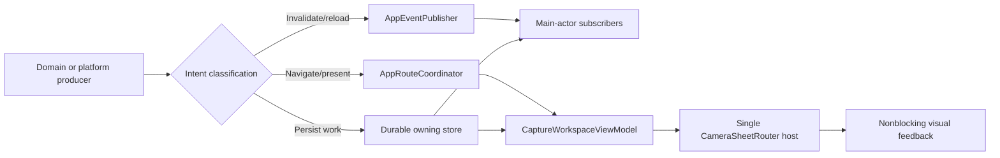

# Event and Presentation Routing

This document is the canonical contract for process-local events, navigation
requests, framework notifications, and user-facing feedback in the iOS app.
The implementation is centered on `AppDIContainer`, `AppEventPublisher`,
`AppRouteCoordinator`, `CaptureWorkspaceViewModel`, and the single root sheet
host in `CameraSheetRouter`.

## Classification

| Mechanism | Purpose | Delivery | Authoritative state |
| --- | --- | --- | --- |
| `AppEvent` | Loss-tolerant invalidation or lifecycle command | Synchronous, process-local, `@MainActor` | Never the event payload; consumers reload from the owning store or service |
| `AppRoute` | Delivery-critical request to change root navigation or presentation | Bounded, prioritized, coalesced state machine on `@MainActor` | Durable work remains in its owning store; the envelope is process-local |
| Durable store | Scan, import, identity, progress, preference, or retry truth | Store-specific | SwiftData, UserDefaults, Supabase, or an owning service |
| `NotificationCenter` | Apple-framework callback boundary only | Framework-defined | The framework that issued the notification |
| Toast/banner/overlay | Ephemeral visual feedback | View-owned or presenter-owned, cancellable | Never authoritative domain state |

Application-defined `Notification.Name` values and
`NotificationCenter.default.post` are forbidden. Navigation must not be added
to `AppEvent`; use `AppRoute`. A missed `AppEvent` must be recoverable by
reloading durable state.

## Dependency Ownership

`AppDIContainer` constructs one `AppEventPublisher` and one
`AppRouteCoordinator` for the application graph. Neither service exposes a
second static singleton. Production process-global producers enter through
`AppDIContainer.shared`; previews receive fresh isolated instances. The route
coordinator is environment-injected for root observation. Producer-only and
consumer-only protocols prevent domain services from reaching the underlying
Combine subject.

Both services are `@MainActor`. `AppEventPublisher.send` is synchronous and
reentrant. This is intentional: event ordering is deterministic, but consumers
must remain small and schedule expensive reload work separately. Framework
publishers that can emit off-main use `sinkOnMainActor`, which performs the
asynchronous main-queue hop before entering `MainActor.assumeIsolated`.

`SupabaseManager` stores its auth-stream task and Apple credential observer, but
neither may retain the manager indefinitely. The auth task captures the manager
weakly while suspended on the stream and binds it only for one delivered event;
teardown cancels retained auth/merge/sign-out/identity tasks and removes the
exact credential observer token.

## AppEvent Matrix

Every event below is loss-tolerant. There is no replay buffer and no event-level
coalescing. Reference-type subscribers own and cancel their `AnyCancellable`
and capture themselves weakly. SwiftUI `.onReceive` subscriptions are instead
owned by the mounted view lifecycle; they must not be copied into an additional
untracked `sink`.

| `AppEvent` | Class | Production producers → consumers | Logical identity / duplicates | Durable recovery and missed event | Scope |
| --- | --- | --- | --- | --- | --- |
| `appDidResumeAfterTimeout` | Lifecycle command | `AppLifecycleManager` → `CaptureWorkspaceViewModel` | Current lifecycle transition; duplicate reset is idempotent | UserDefaults background timestamp; the next lifecycle pass reconciles a miss | Process session, account-neutral |
| `foregroundBiologicalScanCompleted(scanId:)` | Invalidation/handoff | `InferenceEngine` → `CaptureWorkspaceView` | Normalized scan ID; duplicates only re-evaluate prompt eligibility | Persisted scan/history; a miss is recovered from the next history projection | Current account scan |
| `explorePostNeedsRefresh(postId:)` | Invalidation | inference/review completion → Explore detail/shell and profile preview | Normalized post ID; duplicate refetches are harmless | Supabase/cached post projection; refresh on appearance or the next mutation | Public post |
| `exploreShareStateChanged(scanId:postId:)` | Invalidation | Insight/Explore/Scans share-state mutations → Capture cache writer, Explore/profile previews, Collections, `ScansManager` | Normalized scan ID; latest durable share state wins | Local/cloud publication state; consumers patch or refetch by ID | Current account mutation |
| `fieldTripProgressInvalidated(templateIds:)` | Invalidation | `ScanMilestoneCoordinator` → Capture goals, Field trips catalog/detail/profile modules, Profile | Template-ID set; duplicate set reloads are harmless | Server progress rows and active-goal cache | Current account |
| `fieldTripChallengeProgressInvalidated(challengeIds:)` | Invalidation | `ScanMilestoneCoordinator` → Field trips catalog/challenge detail, Profile | Challenge-ID set; duplicate set reloads are harmless | Server challenge rows | Current account |
| `fieldTripScanContributionsInvalidated(scanId:)` | Invalidation | progress completion → open Insight | Normalized scan ID | Persisted private contribution projection | Current account scan |
| `captureGoalContextInvalidated(source:)` | Invalidation | Field trip join/leave/progress mutations → active Capture goal store plus Field trip/Profile surfaces | Source kind; duplicate refresh requests coalesce in the store | Provider response plus versioned account cache | Current account |
| `publicAuthorIdentityChanged(previousUserId:currentUserId:)` | Invalidation | `SupabaseManager`/`ProfileViewModel` → Explore root/detail/author profile and profile scan preview | Current user ID; later identity is authoritative | Auth session and public-profile service | Explicit account boundary |
| `scanSearchIndexInvalidated(scanId:)` | Invalidation | tag mutation → `ScansManager` | Normalized scan ID | SwiftData scan; manager re-extracts one bounded document | Current account scan |
| `scanLibraryChanged` | Invalidation | `ScanRepository`, offline queue/recovery, image repair, collections, queued completion → Insight, Profile, Scans and collection surfaces | Whole current library; duplicates collapse naturally at refetch | SwiftData library rows; carries no model collection | Current account |
| `communityIdentificationRequestChanged(requestId:)` | Invalidation | Community mutation → identification views | Normalized request ID | Remote request projection | Current account request |
| `exploreAudioBoostPreferenceChanged(postId:isEnabled:)` | Invalidation | preference store → feed/detail audio | Normalized post ID; latest persisted Boolean wins | UserDefaults preference | Current user preference |
| `exploreVideoMutePreferenceReset` | Invalidation | mute preference → feed media | Current reset generation; duplicate reset is idempotent | Preference store is re-read on remount | Current user preference |
| `manualAppleRevocationNoticeRequired` | Lifecycle/security command | `ManualAppleRevocationNoticeStore` → `MerianApp` root | One pending notice flag; duplicate presentation is idempotent | Durable pending-notice flag restored on appearance/foreground | Current auth session |

The bus itself performs no coalescing and stores no replay. “Logical identity”
defines why duplicate delivery is safe and how a future consumer may bound its
own refresh work; it is not permission to treat the event as authoritative.

Do not put arrays of scans, images, SwiftData models, view instances, closures,
or navigation destinations in an event. IDs and small scalar invalidation hints
are the upper bound.

## AppRoute Matrix

`AppRouteCoordinator` is the only cross-module root-navigation queue.
`CaptureWorkspaceViewModel` claims each request and either applies, defers, or
rejects it. A presentation-backed request remains in flight until that exact
presentation ID dismisses.

| `AppRoute` | Typical producers | Root destination or action | Coalescing identity | Durability/fence |
| --- | --- | --- | --- | --- |
| `proAccessRequired` | gated feature actions | Paywall sheet | Singleton paywall intent | Account-sensitive |
| `scan(scanId:)` | deep link, local push | Insight sheet after local lookup | Normalized scan ID | Account-sensitive; unavailable target is terminally rejected |
| `explorePost(postId:targetCommentId:targetReplyParentCommentId:)` | URL, widget, Explore push | Explore sheet and post/comment route | Normalized post, comment, and reply-parent IDs | Public route; payload is validated before apply |
| `speciesDictionary(speciesId:)` | URL/share link | Explore Identify/Index and dictionary detail | Normalized species ID | Public route; canonical UUID validation |
| `communityIdentification(requestId:)` | push/internal action | Explore Identify/Requests detail | Normalized request ID | Account-sensitive |
| `identifyNature` | App Intent | Select visual Capture after the presentation slot clears | Shared scanner intent with `openScanner` | Public route |
| `openScanner` | Field trip action | Select visual Capture after the presentation slot clears | Shared scanner intent with `identifyNature` | Public route |
| `achievement(AwardPayload)` | milestone banner, Profile | Achievement detail through the root sheet host | Award ID | Account-sensitive |
| `captureGoal(CaptureGoalDestination)` | Field trip/profile/milestone actions | Explore Field trips focused destination | Exact typed destination | Account-sensitive |
| `fieldTrips` | Field trip/profile actions | Explore Field trips tab | Singleton Field trips intent | Account-sensitive |
| `recallLastFind` | App Intent | Current/last Insight when hydrated | Singleton recall intent | Account-sensitive; unavailable target is rejected |
| `refinement(scanId:initialDescription:entryPoint:)` | Insight reanalysis actions | Stage bounded refinement media | Normalized scan ID plus entry point; latest pending description wins | Account-sensitive; scan is refetched by ID |
| `nonBiologicalScans` | Insight action | Scans sheet, non-biological collection | Singleton non-biological library intent | Account-sensitive |
| `scansLibrary` | URL, Profile, Explore | Scans sheet | Singleton library intent | Account-sensitive |
| `scansLibraryRecovery(context)` | Explore media incident | Scans sheet with owner-scoped recovery filter | Normalized owner ID | Account-sensitive and explicit owner check |
| `processExternalImageImports` | accepted document URL/lifecycle recovery | Drain `ExternalImageImportStore` | Singleton inbox-drain intent | The inbox is durable; route envelope is only a wake-up hint |
| `externalImageImportFailed` | import validation | Show bounded error feedback after the slot clears | Singleton import-failure intent | Public process-local route |
| `debugPreviewAnalyzing` | DEBUG Settings | Debug Insight preview | Singleton debug intent | Debug-only |

### Source priority and lifetime

| `AppRouteSource` | Priority | Lifetime | Survives session reset |
| --- | ---: | ---: | --- |
| `durableExternalImport` | 400 | No envelope expiry | Yes; the durable inbox is still authoritative |
| `deepLink`, `pushNotification` | 300 | 5 minutes | Yes |
| `appIntent` | 300 | 2 minutes | Yes |
| `internalUserAction` | 200 | 30 seconds | No |
| `genericLaunch` | 100 | 15 seconds | No |
| `debug` | 50 | 30 seconds | No |

Expiry is a delivery deadline, not a viewing deadline. Pending and deferred
envelopes expire; once a presentation has been applied with an exact
presentation ID, its envelope remains in flight until that presentation
dismisses or an account/session fence explicitly rejects it.

The pending queue is capped at 16 envelopes. Outcomes are capped at 64 records.
Requests sort by descending priority, then creation time, then an explicit
monotonic insertion sequence so equal timestamps remain FIFO. Semantic
duplicates coalesce against both pending and in-flight requests. A pending
duplicate keeps the existing stable ID and FIFO age but adopts the latest
lightweight typed route payload; this prevents a newer refinement draft or
award snapshot from being silently discarded. When it arrives from a
higher-priority or longer-lived source, the envelope also promotes its source,
priority, expiry, and current generation fences. An already-applied in-flight
presentation keeps its original payload and identity; only its delivery source
may promote. The duplicate records a coalesced outcome. A generic launch
therefore cannot weaken a later push or deep link.
When full, a new request may evict the oldest eligible request of equal or lower
priority; otherwise the new request is rejected.

### State machine and outcomes

1. `request` discards expired work, coalesces duplicates, applies bounds, and
   inserts by priority/FIFO order.
2. `claimNext` rejects stale account/session generations before assigning the
   sole in-flight envelope.
3. Every route requires an available UIKit presentation slot. The root records
   `deferred(.presentationOccupied)` while a routed sheet is active, during its
   interactive teardown window, or while a feature-local editor/survey cover is
   active. Routed sheets are dismissed; feature-local workflows finish normally.
   The same envelope resumes only from the corresponding exact `onDismiss`.
4. A non-presenting action resolves as `applied(presentationID: nil)` and is
   terminal. A sheet resolves as `applied(presentationID:)` and remains in
   flight.
5. Only dismissal of that exact presentation completes it with
   `dismissed(presentationID:)`. Repeated or stale resolutions are ignored.
6. Invalid payloads, missing targets, expiry, overflow, coalescing, account
   changes, and session changes record explicit rejection outcomes rather than
   stalling the queue.

Only Supabase's explicit `initialSession` restoration may establish the first
account identity without rejecting a route that arrived from the same cold
launch. A runtime nil-to-account transition is treated as interactive sign-in,
increments the generation, and fences private routes; it is not inferred to be
restoration. Every other account boundary likewise rejects account-sensitive
pending/in-flight routes and clears account-scoped root payloads. Session generation changes reject
ordinary internal and launch routes but preserve explicit external intent.
External routes pending or applied within the last five seconds suppress the
foreground timeout reset that would otherwise immediately close their sheet.

## Single Root Presentation Host

`CameraSheetRouter` owns one `.sheet(item:)` keyed by
`CaptureWorkspaceViewModel.PresentedRoute`. Paywall, Insight, Scans, Profile,
Explore, achievement detail, and the post-identification notification prompt
all share that host. Do not add a sibling root `.sheet` for a new alert or route.

Local follow-up sheets use `pendingLocalSheet` and mount only after the current
root sheet's `onDismiss`, provided no queued `AppRoute` has precedence.
Delivery-critical routes defer through the coordinator rather than sleeping for
an assumed animation duration. Rapid local A→B→C changes are latest-wins: B and
C remain unmounted until A's exact dismissal callback, then only C mounts. This
removes overlapping-sheet races and makes interactive dismissal and
programmatic dismissal use the same completion path.

Capture's staged-description editor, describe-question sheet, staged-video
cover, crop cover, and feedback survey remain feature-local presentation
owners. They explicitly report occupancy to route consumption and call
`handleFeaturePresentationDismissed` from their real `onDismiss`. A route that
arrives while one is active stays deferred; it is never marked applied behind a
cover or mounted during UIKit teardown. The feedback survey follows the same
callback and no longer guesses sheet teardown with a fixed sleep.

## Visual Feedback Contract

- `MerianSystemFeedbackModifier` uses alignment-scoped overlays, not a
  full-screen layout container. Only the visible banner and its controls receive
  hit testing; the underlying interface remains interactive elsewhere.
- A system toast pauses while the milestone stack is visible, preventing two
  bottom banners from occupying the same Z-plane. It resumes from its bound
  state after the milestone stack clears.
- Toast and milestone teardown uses cancellable `Task.sleep`, returns on
  `CancellationError`, and verifies the message/item identity before clearing
  state. Replacing a toast cannot let an older timer remove the new one.
- Achievement taps request `AppRoute.achievement`; achievement detail never
  mounts as a second root sheet.
- Scans batch save uses a compact pass-through progress capsule. Mutation and
  selection controls are disabled while the batch operation owns its snapshot,
  avoiding an invisible blocking overlay and conflicting operations.
- Non-biological bulk deletion likewise disables only its mutation grid and
  destructive toolbar action while the background actor owns the deletion
  snapshot. The compact progress badge does not intercept navigation.
- Feedback payloads remain lightweight. Heavy images, model objects, and scan
  arrays stay in durable stores or bounded loaders, never in global visual
  presenters.

The existing `MilestoneToastPresenter` remains the ordered per-scan milestone
queue. It retains at most 32 lightweight visual items, and the scan coordinator
owns cancellation, deduplication, and bounded retry tasks. It does not own Field
trip or achievement persistence; overflow can drop ephemeral feedback without
losing durable progress.

## Media Notification Lifetime

`MediaPlaybackObservation` is the owner-scoped bridge for `AVPlayer` KVO,
playback notifications, and periodic time observation. Replacing a player first
removes observers from the exact old player/item. Callbacks capture the
observation, player, and item weakly and carry a generation fence so callbacks
already queued for a detached player cannot mutate current UI state. `detach`
and `deinit` cancel KVO and remove every notification/time token.

Explore public media, video carousel pages, and fullscreen video use this object
instead of ad hoc observer arrays. A view must not register player observers
without an equally explicit owner and teardown path.

## Allowed NotificationCenter Boundaries

The reviewed allowlist is
`scripts/config/ios-event-routing-singleton-allowlist.txt`. It contains exact
files, not directories:

| Boundary file | Framework signal | Lifetime/actor owner |
| --- | --- | --- |
| `Core/Hardware/CameraManager.swift` | `AVCaptureDevice.subjectAreaDidChangeNotification` | Stored cancellable, weak manager capture, asynchronous `sinkOnMainActor` bridge |
| `Core/Hardware/HardwareOrchestrator.swift` | ProcessInfo thermal and power-state notifications | Stored cancellables, weak orchestrator capture, asynchronous `sinkOnMainActor` bridge |
| `Core/Media/MediaPlaybackObservation.swift` | AVPlayerItem end/stall/failure notifications plus KVO/time observation | Exact token/player teardown, weak captures, and player/item generation validation |
| `Core/Network/SupabaseManager.swift` | AuthenticationServices Apple credential revocation | Stored observer token, weak capture, explicit `Task { @MainActor }`, removal in `deinit` |
| `Core/Utilities/UserDefaultsKeys.swift` | `UserDefaults.didChangeNotification` | Stored observer token, weak capture, explicit main-actor hop, removal in `deinit` |
| `Features/Capture/Shell/Views/CaptureWorkspaceView.swift` | UIKit keyboard show/hide notifications | SwiftUI `.onReceive` owns subscription for the mounted workspace |
| `Features/Explore/Feed/Components/ExplorePostCard.swift` | AVAudioSession interruption notification | SwiftUI `.onReceive` owns subscription for the mounted media surface |

The allowlist does not permit application-defined names or posts. The checker
also rejects multiline spelling, `NotificationCenter.default` aliases outside
the boundary, `AppEventPublisher.shared`, duplicate AppEvent subjects, and any
unreviewed case added to the exact loss-tolerant `AppEvent` contract.

## Verification

- `AppRouteCoordinatorTests` covers priority/FIFO ordering, semantic
  coalescing, overflow, expiry, account/session fences, deferral/resume,
  presentation dismissal, duplicate callback identity, timeout suppression,
  and missing-target rejection. Capture tests cover routed-sheet teardown and
  feature-local cover deferral.
- `EventDeliveryTests` covers synchronous/reentrant event delivery, cancellable
  main-actor framework delivery, and detached-player callback suppression.
- `make validate-ios-event-routing` runs the production source guard.
- `make test-ios-event-routing` runs adversarial fixtures. The same fixtures are
  included in `make test-ios-ci-tooling`. Both `ios-project-guardrails.yml` and
  the primary iOS workflow execute the production guard; their path filters
  include the checker, its exact allowlist, and its adversarial test script.
- A local source-only verification can parse all production and test Swift files
  with `swiftc -frontend -parse`, but it does not replace the hosted
  `build-for-testing` plus complete `merianTests` execution. Simulator service
  availability is an environment prerequisite, not permission to skip the
  exact-SHA CI gate.

Before release, record a physical-device baseline with Instruments Allocations
and Leaks plus the Core Animation/FPS instrument. Exercise rapid root-sheet
A→B→C handoffs, a 32-item milestone backlog, toast replacement/cancellation,
AVPlayer replacement and fullscreen dismissal, Scans batch save, and
non-biological bulk deletion. Compare retained-object counts, peak resident
memory, main-thread frame time, and dropped-frame runs with the stored baseline;
simulator observation or a subjective “looks smooth” check is not acceptance.

## Follow-on Consolidation

The high-risk cross-module routes, root sheets, notification observers, media
lifetime, and blocking batch overlay are hardened now. Three bounded follow-ons
remain intentionally separate:

1. Replace feature-local `String?` toast bindings with a typed, lightweight
   toast payload so title/body/severity/action identity are compiler checked.
2. Move `MilestoneToastPresenter.shared` behind a DI protocol and formal host
   stack so only the foremost live host renders, while a disappearing host
   restores the prior one. That migration must also inject a deterministic
   clock/sleeper, claim haptic and accessibility effects once per item, and
   session-fence queued account-scoped milestones while preserving current
   per-scan ordering and deduplication.
3. Replace remaining feature-local elapsed-delay handoffs as their owners are
   migrated. Candidate review/community actions, Insight chat-to-candidate or
   refinement actions, and Explore notification reply focus still use stable
   scan/generation guards plus short delays around nested modal changes. Move
   them to identified pending actions resumed by the owning presentation's real
   `onDismiss`; do not copy those compatibility delays into new presentation
   code or mechanically centralize unrelated local sheets.

None of these follow-ons may reintroduce string notifications, a second root
sheet, unbounded payload retention, or global heavy redraws.
