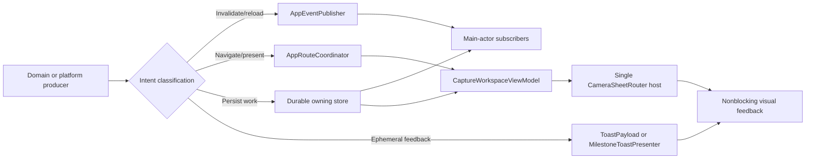

# Event and Presentation Routing

This document is the canonical contract for process-local events, navigation
requests, framework notifications, and user-facing feedback in the iOS app. The
implementation is centered on `AppDIContainer`, `AppEventPublisher`,
`AppRouteCoordinator`, `ToastPayload`, `MilestoneToastPresenter`,
`CaptureWorkspaceViewModel`, and the single root sheet host in
`CameraSheetRouter`.

## Classification

| Mechanism            | Purpose                                                             | Delivery                                                      | Authoritative state                                                        |
| -------------------- | ------------------------------------------------------------------- | ------------------------------------------------------------- | -------------------------------------------------------------------------- |
| `AppEvent`           | Loss-tolerant invalidation or lifecycle command                     | Synchronous, process-local, `@MainActor`                      | Never the event payload; consumers reload from the owning store or service |
| `AppRoute`           | Delivery-critical request to change root navigation or presentation | Bounded, prioritized, coalesced state machine on `@MainActor` | Durable work remains in its owning store; the envelope is process-local    |
| Durable store        | Scan, import, identity, progress, preference, or retry truth        | Store-specific                                                | SwiftData, UserDefaults, Supabase, or an owning service                    |
| `NotificationCenter` | Apple-framework callback boundary only                              | Framework-defined                                             | The framework that issued the notification                                 |
| Toast/banner/overlay | Ephemeral visual feedback                                           | View-owned or presenter-owned, cancellable                    | Never authoritative domain state                                           |

Application-defined `Notification.Name` values and
`NotificationCenter.default.post` are forbidden. Navigation must not be added to
`AppEvent`; use `AppRoute`. A missed `AppEvent` must be recoverable by reloading
durable state.

## Dependency Ownership

`AppDIContainer` constructs one `AppEventPublisher` and one
`AppRouteCoordinator` for the application graph. Neither service exposes a
second static singleton. Production process-global producers enter through
`AppDIContainer.shared`; previews receive fresh isolated instances. The route
coordinator is environment-injected for root observation and milestone-banner
tap routing. The shared feedback host must never reach back into
`AppDIContainer.shared`, because doing so would leak preview/test interaction
into the production route queue. Producer-only and consumer-only protocols
prevent domain services from reaching the underlying Combine subject.
`AppEventPublisher` constructs its erased subscriber stream once with its
private subject; reading `publisher` does not allocate a new type-erasure
wrapper.

Both services are `@MainActor`. `AppEventPublisher.send` is synchronous and
reentrant. This is intentional: event ordering is deterministic, but consumers
must remain small and schedule expensive reload work separately. Framework
publishers that can emit off-main use `sinkOnMainActor`, which performs the
asynchronous main-queue hop before entering `MainActor.assumeIsolated`.

`SupabaseManager` stores its auth-stream task and Apple credential observer, but
neither may retain the manager indefinitely. The auth task captures the manager
weakly while suspended on the stream and binds it only for one delivered event;
teardown cancels retained auth/merge/sign-out/identity tasks and removes the
exact credential observer token.

The same container owns one `MilestoneToastPresenter`, one
`MilestoneToastHostRegistry`, one `ScanMilestoneCoordinator`, and one
`MilestoneToastClock` for the production graph. None exposes an independent
production singleton. The presenter and host registry are environment-injected;
process-global scan producers use the container-owned coordinator. Preview and
test containers receive isolated instances. `SupabaseManager` binds the
coordinator as the milestone account-session controller, and the app lifecycle
advances that controller after a foreground timeout. The coordinator forwards
the generation change to the presenter, cancels and releases session-bound retry
tasks, and clears cached preferred-goal plus in-flight state. Account changes
also clear recent-scan history; a same-account session advance retains completed
deduplication so a late callback cannot replay a prior milestone. In-flight
ownership includes the captured account/session generation, so a stale suspended
resolver cannot block the same canonical scan key in the current session.
`ScanMilestoneCoordinator` receives its producer-only `AppEventSending`
capability from that same container. It never reaches through
`AppDIContainer.shared`, so an isolated preview/test coordinator cannot leak
progress invalidations into the production event graph. Results revalidate their
captured token immediately after every suspension, so a late resolver cannot
schedule replacement work or enqueue visual feedback for another session.

## AppEvent Matrix

Every event below is loss-tolerant. There is no replay buffer and no event-level
coalescing. Reference-type subscribers own and cancel their `AnyCancellable` and
capture themselves weakly. SwiftUI `.onReceive` subscriptions are instead owned
by the mounted view lifecycle; they must not be copied into an additional
untracked `sink`.

| `AppEvent`                                                   | Class                           | Production producers → consumers                                                                                                                                                        | Logical identity / duplicates                                                    | Durable recovery and missed event                                                                                                | Scope                            |
| ------------------------------------------------------------ | ------------------------------- | --------------------------------------------------------------------------------------------------------------------------------------------------------------------------------------- | -------------------------------------------------------------------------------- | -------------------------------------------------------------------------------------------------------------------------------- | -------------------------------- |
| `appDidResumeAfterTimeout`                                   | Lifecycle command               | `AppLifecycleManager` → `CaptureWorkspaceViewModel`                                                                                                                                     | Current lifecycle transition; duplicate reset is idempotent                      | UserDefaults background timestamp; the next lifecycle pass reconciles a miss                                                     | Process session, account-neutral |
| `foregroundBiologicalScanCompleted(scanId:)`                 | Invalidation/handoff            | `InferenceEngine` → `CaptureWorkspaceView`                                                                                                                                              | Normalized scan ID; duplicates only re-evaluate prompt eligibility               | Persisted scan/history; a miss is recovered from the next history projection                                                     | Current account scan             |
| `explorePostNeedsRefresh(postId:)`                           | Invalidation                    | inference/review completion → Explore detail/shell and profile preview                                                                                                                  | Normalized post ID; duplicate refetches are harmless                             | Supabase/cached post projection; refresh on appearance or the next mutation                                                      | Public post                      |
| `exploreShareStateChanged(scanId:postId:)`                   | Invalidation                    | Insight/Explore/Scans share-state mutations → Capture cache writer, Explore/profile previews, Collections catalog/smart-detail view models, `ScansManager` → Library search coordinator | Normalized scan ID; latest durable share state wins                              | Local/cloud publication state; consumers patch or rederive by ID                                                                 | Current account mutation         |
| `fieldTripProgressInvalidated(templateIds:)`                 | Invalidation                    | `ScanMilestoneCoordinator` → Capture goals, Field trips catalog/detail/profile modules, Profile                                                                                         | Template-ID set; duplicate set reloads are harmless                              | Server progress rows and active-goal cache                                                                                       | Current account                  |
| `fieldTripChallengeProgressInvalidated(challengeIds:)`       | Invalidation                    | `ScanMilestoneCoordinator` → Field trips catalog/challenge detail, Profile                                                                                                              | Challenge-ID set; duplicate set reloads are harmless                             | Server challenge rows                                                                                                            | Current account                  |
| `fieldTripScanContributionsInvalidated(scanId:)`             | Invalidation                    | progress completion → open Insight                                                                                                                                                      | Normalized scan ID                                                               | Persisted private contribution projection                                                                                        | Current account scan             |
| `captureGoalContextInvalidated(source:)`                     | Invalidation                    | Field trip join/leave/progress mutations → active Capture goal store plus Field trip/Profile surfaces                                                                                   | Source kind; duplicate refresh requests coalesce in the store                    | Provider response plus versioned account cache                                                                                   | Current account                  |
| `publicAuthorIdentityChanged(previousUserId:currentUserId:)` | Invalidation                    | `SupabaseManager`/`ProfileViewModel` → Explore root/detail/author profile and profile scan preview                                                                                      | Current user ID; later identity is authoritative                                 | Auth session and public-profile service                                                                                          | Explicit account boundary        |
| `scanSearchIndexInvalidated(scanId:)`                        | Invalidation                    | committed `UserTagsViewModel` mutation → `UserTagsDependencies` → `ScansManager` → Library search coordinator                                                                           | Normalized scan ID; later duplicate invalidations re-extract current local state | SwiftData scan; coordinator re-extracts one bounded document                                                                     | Current account scan             |
| `scanLibraryChanged`                                         | Invalidation                    | `ScanRepository`, offline queue/recovery, image repair, `CollectionMutationService`, queued completion → Insight, Profile, Scans Shell and Collections view models                      | Whole current library; duplicates collapse naturally at refetch                  | SwiftData library rows; carries no model collection                                                                              | Current account                  |
| `communityIdentificationRequestChanged(requestId:)`          | Invalidation                    | Community mutation → identification views                                                                                                                                               | Normalized request ID                                                            | Remote request projection                                                                                                        | Current account request          |
| `exploreAudioBoostPreferenceChanged(postId:isEnabled:)`      | Invalidation                    | preference store → feed/detail audio                                                                                                                                                    | Normalized post ID; latest persisted Boolean wins                                | UserDefaults preference                                                                                                          | Current user preference          |
| `exploreVideoMutePreferenceReset`                            | Invalidation                    | mute preference → feed media                                                                                                                                                            | Current reset generation; duplicate reset is idempotent                          | Preference store is re-read on remount                                                                                           | Current user preference          |
| `manualAppleRevocationNoticeRequired`                        | Lifecycle/security command      | `ManualAppleRevocationNoticeStore` → `MerianApp` root                                                                                                                                   | One pending notice flag; duplicate presentation is idempotent                    | Durable pending-notice flag restored on appearance/foreground                                                                    | Current auth session             |
| `accountDeletionRecoveryStateChanged`                        | Lifecycle/security invalidation | `AccountDeletionLocalCleanupStore` → `MerianApp` root                                                                                                                                   | Identity-free phase; duplicate re-read/retry is idempotent                       | Durable capability intake, cleanup, or retirement phase is authoritative on appearance/foreground; legacy phases remain readable | Device-local deletion barrier    |

The bus itself performs no coalescing and stores no replay. “Logical identity”
defines why duplicate delivery is safe and how a future consumer may bound its
own refresh work; it is not permission to treat the event as authoritative.

For Insight-originated `exploreShareStateChanged`, the mutation decision and
scan/generation fence belong to `Features/Insights/Sharing/ViewModels`; the live
event-publisher adapter belongs to `Features/Insights/Sharing/Services`. Neither
the Share component nor the Community request sheet resolves the app container
or emits the event directly. The event remains a loss-tolerant cache
invalidation hint; the local cache and authoritative cloud share-state response
remain recovery sources.

Do not put arrays of scans, images, SwiftData models, view instances, closures,
or navigation destinations in an event. IDs and small scalar invalidation hints
are the upper bound.

## AppRoute Matrix

`AppRouteCoordinator` is the only cross-module root-navigation queue.
`CaptureWorkspaceViewModel` claims each request and either applies, defers, or
rejects it. A presentation-backed request remains in flight until that exact
presentation ID dismisses.

| `AppRoute`                                                        | Typical producers                        | Root destination or action                               | Coalescing identity                                                  | Durability/fence                                             |
| ----------------------------------------------------------------- | ---------------------------------------- | -------------------------------------------------------- | -------------------------------------------------------------------- | ------------------------------------------------------------ |
| `proAccessRequired`                                               | gated feature actions                    | Paywall sheet                                            | Singleton paywall intent                                             | Account-sensitive                                            |
| `scan(scanId:)`                                                   | deep link, local push                    | Insight sheet after local lookup                         | Normalized scan ID                                                   | Account-sensitive; unavailable target is terminally rejected |
| `explorePost(postId:targetCommentId:targetReplyParentCommentId:)` | URL, widget, Explore push                | Explore sheet and post/comment route                     | Normalized post, comment, and reply-parent IDs                       | Public route; payload is validated before apply              |
| `speciesDictionary(speciesId:)`                                   | URL/share link                           | Explore Identify/Index and dictionary detail             | Normalized species ID                                                | Public route; canonical UUID validation                      |
| `communityIdentification(requestId:)`                             | push/internal action                     | Explore Identify/Requests detail                         | Normalized request ID                                                | Account-sensitive                                            |
| `identifyNature`                                                  | App Intent                               | Select visual Capture after the presentation slot clears | Shared scanner intent with `openScanner`                             | Public route                                                 |
| `openScanner`                                                     | Field trip action                        | Select visual Capture after the presentation slot clears | Shared scanner intent with `identifyNature`                          | Public route                                                 |
| `achievement(AwardPayload)`                                       | milestone banner, Profile                | Achievement detail through the root sheet host           | Award ID                                                             | Account-sensitive                                            |
| `captureGoal(CaptureGoalDestination)`                             | Field trip/profile/milestone actions     | Explore Field trips focused destination                  | Exact typed destination                                              | Account-sensitive                                            |
| `fieldTrips`                                                      | Field trip/profile actions               | Explore Field trips tab                                  | Singleton Field trips intent                                         | Account-sensitive                                            |
| `recallLastFind`                                                  | App Intent                               | Current/last Insight when hydrated                       | Singleton recall intent                                              | Account-sensitive; unavailable target is rejected            |
| `refinement(scanId:initialDescription:entryPoint:)`               | Insight reanalysis actions               | Stage bounded refinement media                           | Normalized scan ID plus entry point; latest pending description wins | Account-sensitive; scan is refetched by ID                   |
| `nonBiologicalScans`                                              | Insight action                           | Scans sheet, non-biological collection                   | Singleton non-biological library intent                              | Account-sensitive                                            |
| `scansLibrary`                                                    | URL, Profile, Explore                    | Scans sheet                                              | Singleton library intent                                             | Account-sensitive                                            |
| `scansLibraryRecovery(context)`                                   | Explore media incident                   | Scans sheet with owner-scoped recovery filter            | Normalized owner ID                                                  | Account-sensitive and explicit owner check                   |
| `processExternalImageImports`                                     | accepted document URL/lifecycle recovery | Drain `ExternalImageImportStore`                         | Singleton inbox-drain intent                                         | The inbox is durable; route envelope is only a wake-up hint  |
| `externalImageImportFailed`                                       | import validation                        | Show bounded error feedback after the slot clears        | Singleton import-failure intent                                      | Public process-local route                                   |
| `debugPreviewAnalyzing`                                           | DEBUG Settings                           | Debug Insight preview                                    | Singleton debug intent                                               | Debug-only                                                   |

### Source priority and lifetime

| `AppRouteSource`               | Priority |           Lifetime | Survives session reset                        |
| ------------------------------ | -------: | -----------------: | --------------------------------------------- |
| `durableExternalImport`        |      400 | No envelope expiry | Yes; the durable inbox is still authoritative |
| `deepLink`, `pushNotification` |      300 |          5 minutes | Yes                                           |
| `appIntent`                    |      300 |          2 minutes | Yes                                           |
| `internalUserAction`           |      200 |         30 seconds | No                                            |
| `genericLaunch`                |      100 |         15 seconds | No                                            |
| `debug`                        |       50 |         30 seconds | No                                            |

Expiry is a delivery deadline, not a viewing deadline. Pending and deferred
envelopes expire; once a presentation has been applied with an exact
presentation ID, its envelope remains in flight until that presentation
dismisses or an account/session fence explicitly rejects it.

The pending queue is capped at 16 envelopes. Outcomes are capped at 64 records.
Requests sort by descending priority, then creation time, then an explicit
monotonic insertion sequence so equal timestamps remain FIFO. Semantic
duplicates coalesce against both pending and in-flight requests. A pending
duplicate keeps the existing stable ID and FIFO age but adopts the latest
lightweight typed route payload; this prevents a newer refinement draft or award
snapshot from being silently discarded. When it arrives from a higher-priority
or longer-lived source, the envelope also promotes its source, priority, expiry,
and current generation fences. An already-applied in-flight presentation keeps
its original payload and identity; only its delivery source may promote. The
duplicate records a coalesced outcome. A generic launch therefore cannot weaken
a later push or deep link. When full, a new request may evict the
lowest-priority eligible request of equal or lower priority, choosing the oldest
within that priority; otherwise the new request is rejected. The same capacity
gate runs when a deferred in-flight envelope resumes, because other producers
may have refilled the queue while UIKit was occupied. Resume rejects an
already-expired envelope before considering eviction, and the queue therefore
never exceeds 16 or sacrifices valid work for an expired request.

### State machine and outcomes

1. `request` discards expired work, coalesces duplicates, applies bounds, and
   inserts by priority/FIFO order.
2. `claimNext` rejects stale account/session generations before assigning the
   sole in-flight envelope.
3. Every route requires an available UIKit presentation slot. The root records
   `deferred(.presentationOccupied)` while a routed sheet is active, during its
   interactive teardown window, or while a feature-local editor/survey cover is
   active. Routed sheets are dismissed; feature-local workflows finish normally.
   The same envelope resumes only from the corresponding exact `onDismiss`.
4. A non-presenting action resolves as `applied(presentationID: nil)` and is
   terminal. A sheet resolves as `applied(presentationID:)` and remains in
   flight.
5. Only dismissal of that exact presentation completes it with
   `dismissed(presentationID:)`. Repeated or stale resolutions are ignored.
6. Invalid payloads, missing targets, expiry, overflow, coalescing, account
   changes, and session changes record explicit rejection outcomes rather than
   stalling the queue.

Only Supabase's explicit `initialSession` restoration may establish the first
account identity without rejecting a route that arrived from the same cold
launch. A runtime nil-to-account transition is treated as interactive sign-in,
increments the generation, and fences private routes; it is not inferred to be
restoration. Every other account boundary likewise rejects account-sensitive
pending/in-flight routes and clears account-scoped root payloads. Session
generation changes reject ordinary internal and launch routes but preserve
explicit external intent. External routes pending or applied within the last
five seconds suppress the foreground timeout reset that would otherwise
immediately close their sheet.

## Single Root Presentation Host

`CameraSheetRouter` owns one `.sheet(item:)` keyed by
`CaptureWorkspaceViewModel.PresentedRoute`. Paywall, Insight, Scans, Profile,
Explore, achievement detail, and the post-identification notification prompt all
share that host. Do not add a sibling root `.sheet` for a new alert or route.

The `nonBiologicalScans` route presents the Scans root with a typed, pre-seeded
`NavigationPath` whose first destination is the non-biological collection. Do
not initialize a Boolean `navigationDestination(isPresented:)` as true while
constructing the Scans sheet: the navigation host must own the initial route,
and Back must return to the Collections tab.

The in-sheet Collections card appends that same
`ScansNavigationRoute.nonBiologicalScans` value instead of constructing a
destination view. `ScansSheetView` is therefore the only destination builder in
both entry paths. It passes the Shell-owned timestamp-sorted `rawRecords` into
the destination, and `NonBiologicalScansViewModel` derives the isolated
projection without installing another query or navigation owner.

Scans-local tab and route values live in
`Features/Scans/Shell/Models/ScansShellNavigation.swift`. `ScansShellViewModel`
exposes its injected app-event publisher, and the mounted `ScansSheetView`
consumes `scanLibraryChanged` with SwiftUI `.onReceive` before asking the view
model to refresh store, queue, thumbnail, and incident state. The view does not
resolve `AppDIContainer` or a network client directly, and no raw Combine sink
was added.

Collections receives that same event publisher through
`CollectionsDependencies`. `CollectionsView`, `CollectionDetailView`, and
`SelectMultipleScansView` synchronously rederive their observable presentation
from the Shell-owned record set; `SmartCollectionDetailView` also rederives on
Explore share-state invalidation. Successful membership persistence publishes
`scanLibraryChanged` before the durable collection-sync job is enqueued. No
event carries SwiftData models or replaces the persisted rows as recovery
authority. Collection detail and selection task identities include the target's
ordered persisted membership, so a later render still recovers a missed
invalidation.

Non-biological bulk deletion follows the same recovery boundary. The feature
view model copies record IDs and media paths into `Sendable` values, its
injected service completes actor-isolated database and file work, and only then
the view model sends `scanLibraryChanged`, success feedback, a typed toast, and
the deletion-sync request. Failure publishes no library event or sync request.
The event remains a loss-tolerant refresh hint; persisted tombstones and rows
remain the durable authority.

Local follow-up sheets use `pendingLocalSheet` and mount only after the current
root sheet's `onDismiss`, provided no queued `AppRoute` has precedence.
Delivery-critical routes defer through the coordinator rather than sleeping for
an assumed animation duration. Rapid local A→B→C changes are latest-wins: B and
C remain unmounted until A's exact dismissal callback, then only C mounts. This
removes overlapping-sheet races and makes interactive dismissal and programmatic
dismissal use the same completion path.

Capture's staged-description editor, describe-question sheet, staged-video
cover, crop cover, and feedback survey remain feature-local presentation owners.
They explicitly report occupancy to route consumption and call
`handleFeaturePresentationDismissed` from their real `onDismiss`. A route that
arrives while one is active stays deferred; it is never marked applied behind a
cover or mounted during UIKit teardown. The feedback survey follows the same
callback and no longer guesses sheet teardown with a fixed sleep.

Nested feature handoffs follow the same rule even when they do not use the root
route queue. Candidate review records a typed `CandidateSwipeDismissalRequest`;
`CandidateReviewViewModel` stages it, and confidence review or the owning
Insight surface consumes it only from the candidate sheet's real `onDismiss`
after revalidating both scan ID and presentation generation. The state owner
refuses consumption while the sheet is still presented and clears queued work
when the current scan disappears. Actions leaving the confidence explanation are
staged separately by `ConfidencePresentationViewModel`, governed by the same
pre-dismissal and missing-subject guards, and routed only after that outer
sheet's real `onDismiss`. The Insight Field Chat host records a typed follow-up
action for alternatives, refinement, or paywall and resumes it from chat
dismissal. Explore activity records the selected
post/thread/community/Field-trip target and pushes it only after
`ExploreNotificationsSheet` dismisses. Post handoffs retain only the post ID and
re-resolve the bounded feed-store value after dismissal. Async notification
opens carry a latest-wins token; a newer tap, manual dismissal, or sheet
replacement invalidates late fetch completion. A prepared destination or failure
must commit with that same token before the Shell dismisses the sheet or reports
an error; dismissal discards uncommitted state. No path uses a fixed animation
delay to guess that UIKit has released its presentation slot. The Shell's
`ExploreNotificationNavigationCoordinator` owns the lightweight
`ExploreNotificationDismissalDestination`, latest-open token, asynchronous post
preparation fence, token-checked success/failure commits, separated staged and
pending destination state, and one-time pending-destination consumption.
`ExploreView` retains the shared `NavigationPath`. Notifications owns the
decoded row and `ExploreNotificationReplyThreadRoute`/fallback models plus the
generation-fenced reply-thread state; it does not own the shared navigation
path. The Insight-to-Community-request handoff inside Explore follows the same
rule: the root or post-detail owner stores the request ID, clears its Insight
route, and changes the Explore navigation path only from that sheet's real
`onDismiss`. Opening the current user's Insight from an Insight-hosted Explore
sheet is also single-owner: the leaf post detail reports the scan ID, the
Explore shell owns its own dismissal, and the parent Insight applies the staged
scan only from the Explore sheet's `onDismiss`. The leaf must never dismiss a
parent-owned sheet. The Profile patch gallery likewise stages its Field-trip
template ID and waits for the full-screen artwork cover's `onDismiss` before
pushing detail.

Feature-local hosts that expose several UIKit-backed destinations still own one
typed presentation slot:

`Features/FieldChat` owns the shared sheet implementation and subject-fenced
operation state, but it owns no host presentation slot. Each host captures an
immutable subject identity and commits the prepared sheet only while that
identity is current, the request is not canceled, and its typed slot is empty.
The shared operation state prevents late preparation, prompt, load, or send work
from crossing into a replacement host subject. Retained `InsightChat...` type
names are source-compatibility labels, not evidence that Insights owns the
cross-feature implementation.

Explore Feed navigation values live in
`Features/Explore/Feed/Models/ExploreFeedRoutes.swift`. The Shell registers and
appends `ExplorePostRoute` and `ExploreHashtagRoute` on the shared navigation
stack. An `ExploreNotificationReplyThreadTarget` travels inside
`ExplorePostRoute`; post detail converts that typed target into its reply-thread
sheet presentation using the route/fallback model under
`Features/Explore/Notifications/Models/`. The Shell does not own these Feed or
notification reply models or render the Feed tab/hashtag screens. Other
post-detail modal values remain separately owned by
`ExplorePostDetailPresentation` so stack routing and sheet occupancy cannot
compete through one untyped state channel.

| Owner                              | Typed slot                      | Serialized destinations                                                                        | Admission and teardown contract                                                                                                          |
| ---------------------------------- | ------------------------------- | ---------------------------------------------------------------------------------------------- | ---------------------------------------------------------------------------------------------------------------------------------------- |
| `ExplorePostDetailView`            | `ExplorePostDetailPresentation` | Insight, author/reply, Field Notes, post composer, Field Chat, paywall                         | Composer work is one stored replaceable task; composer/chat commits require the current request/post, no cancellation, and an empty slot |
| `InsightContentView`               | `InsightContentPresentation`    | Gallery, Safari, Community, Explore composer, candidates, Field Notes, description             | One item-based sheet plus a gallery cover filtered from the same value; every case retains its scan/generation fence                     |
| `InsightSheetView`                 | `InsightShellPresentation`      | Paywall, Field-trip author, Field Chat, Explore onboarding, Explore                            | At most one validated follow-up waits for the active sheet's real `onDismiss`; scan and presentation generation must still match         |
| `ProfileTabView`                   | `ProfileTabPresentation`        | Paywall, Insight, Field-trip author                                                            | A request is rejected while another local sheet owns the slot                                                                            |
| `AchievementDetailSheet`           | `AchievementDetailPresentation` | Insight, Field-trip author                                                                     | Background detail reload begins only after the exact Insight case clears                                                                 |
| `SwipeableCandidateCard`           | `CandidateCardPresentation`     | Original capture, candidate gallery, distinguishing feature                                    | All three lightweight destinations share one item-based sheet                                                                            |
| `UserProfile`                      | `UserProfilePresentation`       | Username editor, display-name editor, avatar crop; the system Photos picker counts as occupied | `UserProfileAvatarCoordinator` stores and request/account-fences selection/upload tasks and checks the view's live slot before commit    |
| `SpeciesDictionaryPageContentView` | `SpeciesDictionaryPresentation` | Gallery, author, Field Chat, paywall                                                           | Chat commit requires the current canonical species UUID, no cancellation, and an empty slot                                              |

The two Insight presentation values live in `Features/Insights/Shell/Models`.
Their item hosts and binding adapters live in focused Shell view extensions;
destination side effects enter through `InsightShellDependencies` or the owning
product-area view model. Moving a presenter into an extension does not create a
second owner: `InsightContentView` and `InsightSheetView` remain the only modal
roots for their respective slots.

`UserProfileAvatarCoordinator` may retain one bounded prepared crop preview if
image preparation completes before the Photos picker binding dismisses. The view
commits it only after that binding is false and the typed slot is empty;
replacement, editor launch, account change, and view teardown cancel or clear
the staged request. Preparation completion also queries the view's current slot,
so it cannot publish a preview or error behind an intervening editor. These
owners may retain destination-specific state, but they must not attach sibling
`.sheet` modifiers to the same host.

Explore video interruption uses view-lifetime ownership for presented overlays.
Each sheet content acquires a scoped `ExploreVideoPlaybackCoordinator` token at
mount and releases it only on disappearance. Source bindings are not teardown
authority because they become false before UIKit finishes dismissing; nested
tokens keep playback paused until the final covering view is actually gone.

## Visual Feedback Contract

- `MerianSystemFeedbackModifier` uses alignment-scoped overlays, not a
  full-screen layout container. Only the visible banner and its controls receive
  hit testing; the underlying interface remains interactive elsewhere.
- Ordinary feedback is a lightweight `ToastPayload` with a unique presentation
  ID plus compiler-checked title, body, `ToastSeverity`, and optional
  `ToastActionDescriptor`. Feature view models do not infer severity or actions
  from message strings. Executable closures remain view-owned and are cleared
  when their payload dismisses so global feedback state cannot retain a feature
  model.
- A system toast pauses only while a visible milestone stack targets the same
  alignment, preventing two banners from occupying one Z-plane. Top and bottom
  feedback may coexist because their intrinsic hit regions do not overlap. A
  suppressed toast resumes from its bound state after the milestone stack
  clears. The overlay's local animation identity includes both toast UUID and
  milestone suppression state, so suppressing or restoring the same payload
  still performs its transition without animating unrelated host content.
- Toast and milestone teardown uses identity-keyed SwiftUI `.task` work, returns
  on cancellation, and verifies the payload/item identity before clearing state.
  Replacing a toast or unmounting a nested host cannot let an older timer remove
  new feedback or dismiss another presentation. Manual close and action
  callbacks apply the same UUID check, so an interaction from an outgoing card
  cannot clear a replacement payload.
- Passive toasts render no controls and explicitly disable hit testing; backing
  layers are pass-through as well. A toast receives input only when both its
  typed action descriptor and matching view-owned handler exist, and only inside
  its intrinsic banner bounds; incomplete action wiring remains pass-through.
  Entry/exit animation transactions live inside the feedback overlays instead of
  wrapping the host screen. Producers assign `ToastPayload` and any view-owned
  action directly—never inside `withAnimation`—so queue changes cannot animate
  unrelated feature content. The milestone stack renders at most three layers
  even when its bounded queue is full. Only the active payload subtree mounts;
  queued entries contribute at most two decorative backplates, and only the
  active front item receives taps or drag gestures. Animation ownership is
  non-overlapping: the outer feedback overlay responds only when milestone
  visibility changes, the stack responds only when the active item UUID changes,
  and the toast surface responds only when its clamped backing-layer count
  changes. Queue mutation never builds an animation key from the full queued-ID
  array or applies a second transition to the active card.
- Achievement taps request `AppRoute.achievement` through the same
  environment-injected coordinator as their host; achievement detail never
  mounts as a second root sheet and isolated preview containers never mutate the
  production queue.
- Scans batch save uses a compact pass-through progress capsule. Mutation and
  selection controls are disabled while the batch operation owns its snapshot,
  avoiding an invisible blocking overlay and conflicting operations.
- Non-biological bulk deletion likewise disables only its mutation grid and
  destructive toolbar action while the background actor owns the deletion
  snapshot. The compact progress badge does not intercept navigation.
- Capture hints, ambient-noise guidance, focus indicators, startup recovery
  notices without diagnostics, and passive loading badges explicitly opt out of
  hit testing. Their delays are view-lifecycle-owned tasks that cancel on
  unmount; they do not leave timers retaining an obsolete SwiftUI state box.
- Feedback payloads remain lightweight. Heavy images, model objects, and scan
  arrays stay in durable stores or bounded loaders, never in global visual
  presenters.

`MilestoneToastPresenter` is the container-owned ordered per-scan milestone
queue. It retains at most 32 lightweight visual items, coalesces a duplicate
typed payload onto the first stable item identity, and reports explicit
enqueue/coalescing/overflow/stale-session outcomes. The host registry retains at
most eight lightweight UUIDs, gives the most recently mounted live feedback host
exclusive rendering ownership, and restores the previous host when that nested
surface disappears. Presentation start time, haptic, and VoiceOver claims live
in the presenter, so remounting a banner neither restarts its 3.5-second
lifetime nor repeats side effects. The scan coordinator derives a trimmed,
lowercase coordination key at ingress while preserving the caller's trimmed ID
for network and durable-store operations. It uses that key for cancellation,
per-scan deduplication, and retry tasks bounded to 16 across the process. Oldest
overflow is cancelled and released; the durable SwiftData goal hint remains
recovery authority. Queue generated UUIDs apply the same lowercase contract, so
foreground and background completion paths cannot bypass deduplication through
UUID casing. Account/session transitions cancel those retry tasks so they cannot
keep a model container or prior-account goal context alive; in-flight resolver
results are token-fenced after each suspension, and per-session scan keys are
released without letting an old task's deferred cleanup erase current ownership.
Same-account session advancement retains the bounded completed/released history;
an account replacement clears it. Neither service owns Field-trip or achievement
persistence; overflow can drop ephemeral feedback without losing durable
progress.

`GamificationManager` persists achievement eligibility and may request a native
local notification, but it only returns typed presentation-eligible awards. It
never reaches into the in-app presenter. `ScanMilestoneCoordinator` is the sole
production domain-to-milestone handoff (DEBUG Settings previews are deliberate
visual fixtures), preserving the boundary between durable domain state and
ephemeral SwiftUI feedback.

## Insight Presentation Session Lifetime

`InsightSheetViewModel` begins one explicit presentation session after each
appearance reset. The Shell-provided dismissal boundary ends it before modal
close, programmatic deletion dismissal, or refinement handoff. A transition of
the external `isPresented` binding to false provides the idempotent fallback.
Embedded navigation also reports a completed interactive pop through
`EmbeddedNavigationSwipeBackEnabler`; a canceled swipe does not invalidate the
still-mounted Insight.

Ending the session cancels retained media save/share tasks, clears their
operation IDs, advances `scanBoundActionGeneration`, and invalidates delayed
onboarding, sharing, and Field-trip contribution work. Each async commit must
still own its operation UUID, exact scan ID, and captured generation. This is
stronger than task cancellation alone: a dependency that returns after ignoring
cancellation cannot present feedback or a share sheet over the replacement
Insight. Do not replace this boundary with broad `onDisappear` invalidation,
which would also fire for nested sheets and navigation destinations that do not
end the root presentation.

## Media Notification Lifetime

`MediaPlaybackObservation` is the owner-scoped bridge for `AVPlayer` KVO,
playback notifications, and periodic time observation. Replacing a player first
removes observers from the exact old player/item. Callbacks capture the
observation, player, and item weakly and carry a generation fence so callbacks
already queued for a detached player cannot mutate current UI state. `detach`
and `deinit` cancel KVO and remove every notification/time token.

Explore public media, video carousel pages, and fullscreen video use this object
instead of ad hoc observer arrays. A view must not register player observers
without an equally explicit owner and teardown path.

## Reviewed Raw Combine Sink Owners

Raw `.sink` is a retention and executor boundary. Production source is
fail-closed to these five reviewed owners:

| Owner file                                                          | Purpose                                           | Required lifetime and actor contract                                                                                        |
| ------------------------------------------------------------------- | ------------------------------------------------- | --------------------------------------------------------------------------------------------------------------------------- |
| `Core/Media/MediaPlaybackObservation.swift`                         | AVPlayer KVO publisher state                      | Stored optional cancellables; weak observation/player/item captures; main-queue delivery plus player/item generation checks |
| `Core/Utilities/Publisher+MainActor.swift`                          | The framework-to-main-actor bridge implementation | Returns the cancellable to its caller; main-queue delivery occurs before `MainActor.assumeIsolated`                         |
| `Features/Capture/Shell/ViewModels/CaptureWorkspaceViewModel.swift` | App lifecycle invalidation                        | Stored set, weak owner capture, synchronous main-actor app-event delivery                                                   |
| `Features/Scans/Library/ViewModels/ScansManager.swift`              | Targeted scan-index invalidation                  | Stored set, weak owner capture, synchronous main-actor app-event delivery                                                   |
| `Features/Scans/Map/Services/PrivateScanMapStore.swift`             | Private-map invalidation                          | Stored set, weak owner capture, synchronous main-actor app-event delivery                                                   |

SwiftUI `.onReceive` remains mounted-view-owned and framework producers use
`sinkOnMainActor`. A new raw sink requires an explicit review of capture
strength, cancellable ownership, cancellation/teardown, delivery ordering, and
actor isolation before its exact file can join the source guard.

## Allowed NotificationCenter Boundaries

The reviewed allowlist is
`scripts/config/ios-event-routing-singleton-allowlist.txt`. It contains exact
files, not directories:

| Boundary file                                                           | Framework signal                                                       | Lifetime/actor owner                                                                                                                                                                       |
| ----------------------------------------------------------------------- | ---------------------------------------------------------------------- | ------------------------------------------------------------------------------------------------------------------------------------------------------------------------------------------ |
| `Core/Hardware/CameraManager.swift`                                     | `AVCaptureDevice.subjectAreaDidChangeNotification`                     | Stored cancellable, weak manager capture, asynchronous `sinkOnMainActor` bridge                                                                                                            |
| `Core/Hardware/HardwareOrchestrator.swift`                              | ProcessInfo thermal and power-state notifications                      | Stored cancellables, weak orchestrator capture, asynchronous `sinkOnMainActor` bridge                                                                                                      |
| `Core/Media/MediaPlaybackObservation.swift`                             | AVPlayerItem end/stall/failure notifications plus KVO/time observation | Exact token/player teardown, weak captures, and player/item generation validation                                                                                                          |
| `Core/Network/SupabaseManager.swift`                                    | AuthenticationServices Apple credential revocation                     | Stored observer token, weak capture, explicit `Task { @MainActor }`, removal in `deinit`                                                                                                   |
| `Core/Utilities/UserDefaultsKeys.swift`                                 | `UserDefaults.didChangeNotification`                                   | Stored observer token, weak capture, explicit main-actor hop, removal in `deinit`                                                                                                          |
| `Features/Capture/Shell/Services/CaptureWorkspaceKeyboardService.swift` | UIKit keyboard show/hide notifications                                 | The main-actor platform adapter constructs the publishers; the mounted orchestration modifier owns SwiftUI `.onReceive` and explicitly delivers on `DispatchQueue.main` before UI mutation |
| `Features/Explore/Shared/Media/Components/ExplorePublicMediaView.swift` | AVAudioSession interruption notification                               | SwiftUI `.onReceive` owns the mounted subscription and the publisher explicitly delivers on `DispatchQueue.main` before playback UI mutation                                               |

The allowlist does not permit application-defined names or posts. The checker
also rejects multiline spelling, `NotificationCenter.default` aliases outside
the boundary, `AppEventPublisher.shared`, duplicate AppEvent subjects, and any
unreviewed case added to the exact loss-tolerant `AppEvent` contract. The raw
sink owner set above is enforced by the same fail-closed scan.

## Verification

- `AppRouteCoordinatorTests` covers priority/FIFO ordering, semantic coalescing,
  overflow, expiry, account/session fences, deferral/resume, presentation
  dismissal, duplicate callback identity, timeout suppression, and
  missing-target rejection. Capture tests cover routed-sheet teardown and
  feature-local cover deferral.
- Push routing tests inject a private `AppRouteCoordinator` through
  `PushNotificationManager`'s route-request closure. The app-host coordinator
  may consume a live route while tests are observing it, so tests must not drain
  that process singleton.
- `EventDeliveryTests` covers synchronous/reentrant event delivery, cancellable
  main-actor framework delivery, and detached-player callback suppression.
- `AchievementToastPresenterTests` proves a milestone coordinator publishes
  progress and scan-contribution invalidations only through its injected bus.
  Explore, Profile, and Species Dictionary policy tests reject cancelled,
  stale-identity, or occupied-slot async presentation commits.
- `ToastPayloadTests` locks typed title/body/severity/action parsing, unique
  replacement identity, same-alignment-only milestone suppression, and
  pass-through behavior for passive or incompletely wired action feedback.
  `AchievementToastPresenterTests` is serialized because its legacy gamification
  assertions touch process-global user defaults; it additionally locks queue
  bounds, duplicate coalescing, account/session stale rejection, single
  presentation-effect claims, remaining lifetime across host remounts,
  nested-host restoration, and the one-payload stack projection that forwards
  queued depth into the two-backplate visual clamp.
- `make validate-ios-event-routing` runs the production source guard.
- `make test-ios-event-routing` runs adversarial fixtures. The same fixtures are
  included in `make test-ios-ci-tooling`. Both `ios-project-guardrails.yml` and
  the primary iOS workflow execute the production guard; their path filters
  include the checker, its exact allowlist, and its adversarial test script. The
  guard also rejects a shared feedback host that reaches through
  `AppDIContainer.shared` instead of its injected route coordinator.
- A local source-only verification can parse all production and test Swift files
  with `swiftc -frontend -parse`, but it does not replace the hosted
  `build-for-testing` plus complete `merianTests` execution. Simulator service
  availability is an environment prerequisite, not permission to skip the
  exact-SHA CI gate.

Before release, record a physical-device baseline with Instruments Allocations
and Leaks plus the Core Animation/FPS instrument. Exercise rapid root-sheet
A→B→C handoffs, a 32-item milestone backlog, toast replacement/cancellation,
AVPlayer replacement and fullscreen dismissal, Scans batch save, and
non-biological bulk deletion. Compare retained-object counts, peak resident
memory, main-thread frame time, and dropped-frame runs with the stored baseline;
simulator observation or a subjective “looks smooth” check is not acceptance.

## Consolidation Status and Maintenance Rules

The typed-toast migration, DI-owned milestone presenter and host stack,
deterministic milestone clock seam, account/session fencing, single-effect
claims, and lifecycle-backed Candidate/Confidence/Insight Chat/Explore activity
handoffs, DI-injected milestone invalidations, and single-slot local modal hosts
are complete. Their former delay-, sibling-sheet-, singleton-, and
recomposition-time publisher-allocation patterns are deprecated and must not
appear in new code.

Future feedback or routing changes must preserve all of these invariants:

1. Add application invalidations to `AppEvent` and delivery-critical navigation
   to `AppRoute`; never add an application `Notification.Name` or a second
   subject/singleton.
2. Represent transient visual feedback with `ToastPayload` or a bounded typed
   presenter. Never store images, SwiftData models, scan arrays, or feature
   closures in global feedback payloads.
3. Stage modal follow-up work as a typed value and resume it from the owning
   presentation's exact `onDismiss`. A fixed sleep is not presentation state.
4. Keep passive overlays pass-through, cap visual queues and rendered layers,
   and revalidate account/session/scan generations after every asynchronous
   boundary.
5. Construct subjects and their erased publishers once in the owning service;
   retain view-scoped coordinators in stable state and cache any inactive
   fallback. A computed publisher in a recomposing view is a memory regression.
6. Prefer view-owned `.onReceive` or the reviewed `sinkOnMainActor` bridge. A
   new raw `.sink` must satisfy the lifetime/actor review and update the
   executable guard plus this document in the same change.
